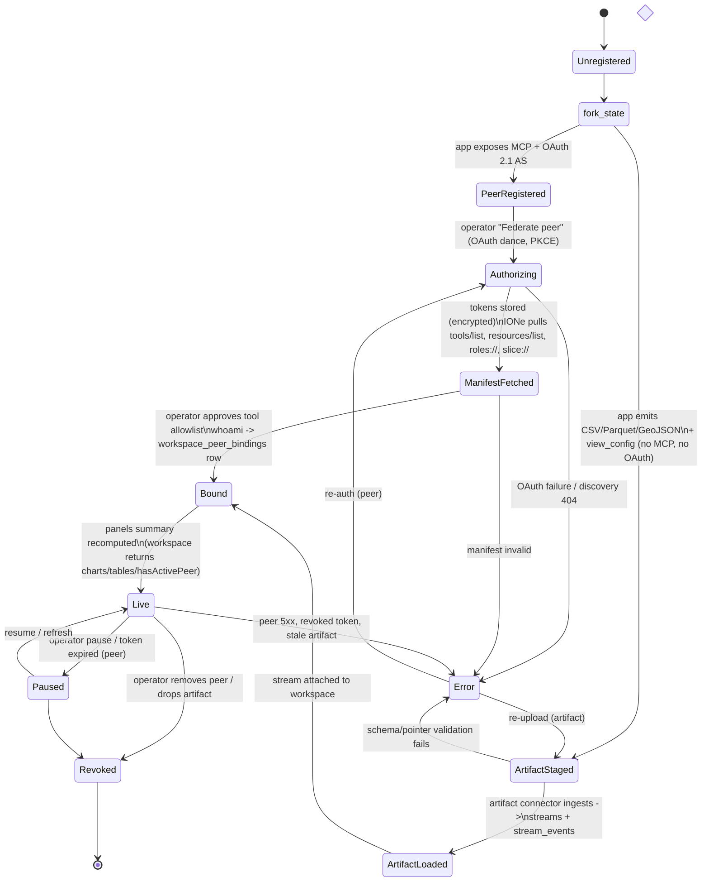
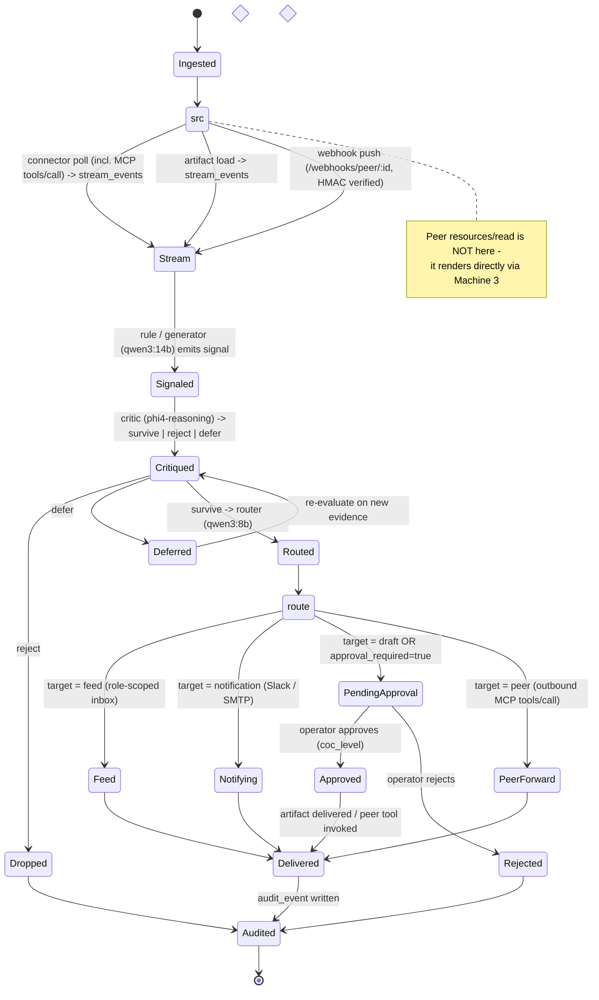
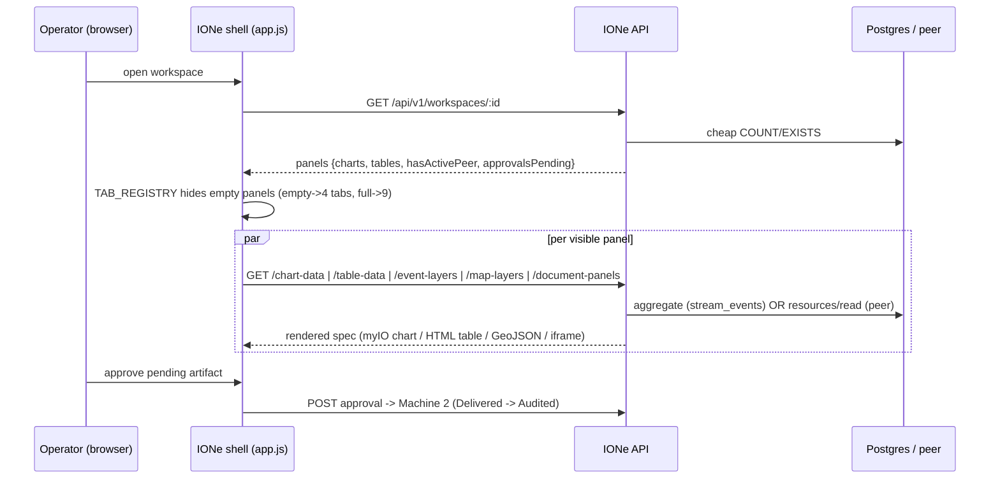

# IONe ↔ App Layer — Integration State Machine

**Date:** 2026-05-31
**Status:** Design reference. Companion to [app-integration-playbook.md](app-integration-playbook.md) and [building-on-ione.md](../playbooks/building-on-ione.md).
**Parent:** [ione-substrate.md](ione-substrate.md)

## Purpose

Describe, as explicit state machines, how an app layer and IONe interact across the full lifecycle — onboarding, data ingest, IONe's processing pipeline, human approval, and rendering. Derived from the real portfolio:

| App | Shape | Backend | Entry path |
|-----|-------|---------|-----------|
| GroundPulse (`../eo`) | **Federation peer** | Rust/Axum + PostGIS/TimescaleDB | Peer (MCP) |
| TerraYield (`../eo_ag`) | **Federation peer** | Rust/Axum + PostGIS/TimescaleDB | Peer (MCP) |
| bearingLineDash | **External-token app** (OAuth *client* only) | Python/Shiny + QuickBooks | Needs a service wrapper before it can be a peer |
| doi-reclamation-das-capture | **Artifact dashboard** | Axum reading Parquet (stateless) | Artifact (or thin MCP) |
| doi-ss-ping | **Artifact dashboard** | None (static site) | Artifact |

The two archetypes take **two different entry paths** into the same IONe processing and rendering core. The artifact path (`A*` states below) is the on-ramp this design adds; see [ione-app-onramp-plan.md](../plans/ione-app-onramp-plan.md).

---

## Machine 1 — App integration lifecycle

How an app moves from "exists somewhere" to "live inside an IONe workspace." Two entry paths converge on `Live`.



**Notes**
- **Peer path** is the current v0.1 contract (six surfaces). `Authorizing` and token refresh (migration 0032) are implemented; the broker that authenticates the *operator* is largely designed, not built.
- **Artifact path** is the proposed on-ramp. It skips `Authorizing` and `ManifestFetched` entirely — there is no remote server to negotiate with. A static site like doi-ss-ping never leaves `ArtifactStaged → ArtifactLoaded`.
- **doi-reclamation is the bridge case**: it already runs an Axum JSON server, so it can take *either* path — artifact load (fast) or a thin MCP wrapper (live-peer-ready).

---

## Machine 2 — IONe event-processing pipeline

Per inbound datum. **Only two sources feed this pipeline: signed webhook push, and connector polling** (the MCP connector polls readable peer *tools* via `tools/call` and writes `stream_events`; `geojson_poll`/`openapi`/artifact load likewise write `stream_events`). **Peer `resources/list`/`resources/read` do NOT feed Machine 2** — they are fetched at render time by Machine 3 and are not persisted, signaled, routed, or audited. Keep that distinction: *resources render directly; webhooks and polling drive the pipeline.* Implemented today except where noted.



**Security floor (as the code enforces it today — narrower than "flagged/command always gate"):**
- Delivery bypasses auto-exec **only when `approval_required = true`** (`src/services/delivery.rs`).
- Auto-exec **independently hard-blocks `command`** severity (`src/services/auto_exec.rs`) — so a `command` is always gated even without the flag.
- **Webhook ingest** sets `approval_required` for `flagged`/`command` (`src/services/webhook_ingress.rs`) — so webhook-sourced `flagged` events *are* gated.
- **Gap:** a `flagged` signal created by a *rule or the generator* (not a webhook) may not have `approval_required` set, so auto-exec is not guaranteed to skip it. The desired invariant — "`flagged` or `command` always bypasses auto-exec" — is **not yet enforced at signal-creation time.** Closing this gap is task ONR-008 in the on-ramp plan; until then, do not rely on `flagged` alone to gate a rule/generator signal. The app may *escalate* but never *de-escalate*.

---

## Machine 3 — Read / render request (workspace view)

The shell is data-presence-adaptive. One round to learn which panels exist, then per-panel fetches. Identical for both archetypes — the panel APIs do not care whether data came from a peer or an artifact.



**Key fact for app builders:** to land in a panel you must produce one of two things —
1. **`stream_events` + `view_config`** (connector or artifact path), or
2. **an MCP resource carrying `ione_view` metadata** (peer path).
There is no third "post me a JSON, draw it" path today. The artifact connector (on-ramp plan, ONR-001) makes path 1 reachable from a file.

**Map-tab caveat (current bug for artifact maps):** the workspace `panels` summary today is `{charts, tables, hasActivePeer, approvalsPending}` — it has **no native map/event-layer count**, and `TAB_REGISTRY` (`static/app.js`) only shows the map tab when `hasActivePeer` is true. So a **no-peer artifact workspace with ingested event-layer streams would not show a map tab** even though the data exists. Fixing this requires a `panels.maps`/`panels.eventLayers` count in `src/routes/workspaces.rs` + a tab-gating change — tracked as ONR-001a/ONR-004.

---

## How the three machines compose

```
Machine 1 (App lifecycle)  --reaches Live-->  feeds  -->  Machine 2 (Processing)
                                                  \
                                                   --persists stream_events / artifacts-->
                                                                                          \
                                                                          Machine 3 (Render) reads them
```

- **Federation peer**: full Machine 1 peer path + Machine 2 (live signals, approvals, peer forwarding) + Machine 3.
- **Artifact dashboard**: Machine 1 artifact path + Machine 3 only. Machine 2 is optional — a read-only demo may emit zero signals and live entirely in the render path. This is why a demo does not need OAuth, approvals, or federation to be useful, and why forcing it through the peer contract is over-tax.
