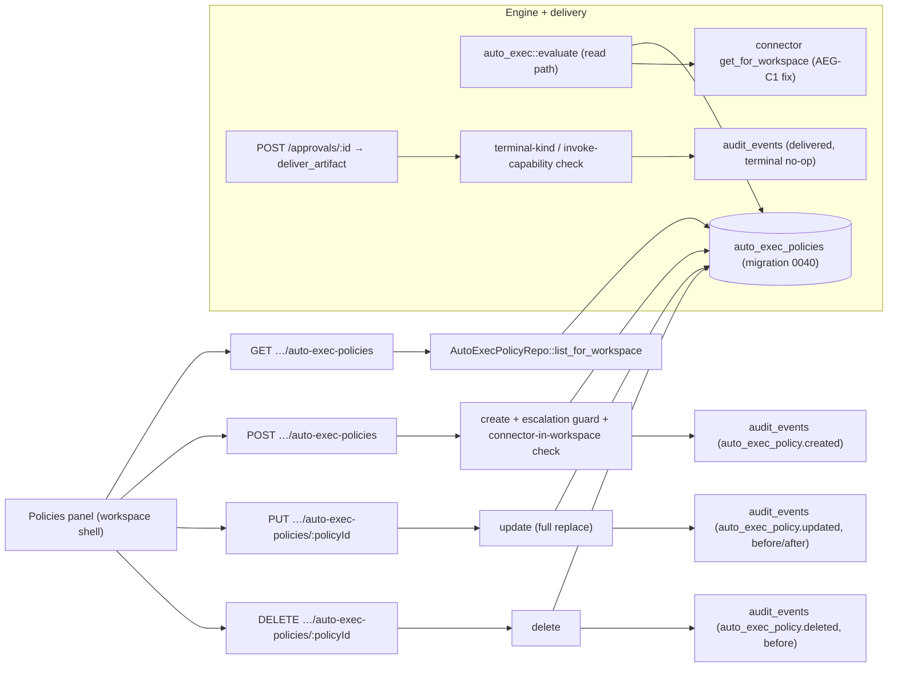

# Auto-Execution Governance

**Status:** Reviewed (PM + security + sql-architect + devil's advocate + technical-writer passes complete) — ready for `/implement`
**Layers:** `db`, `api`, `ui`
**Demand signals:** DICE §2.4 (human-approval-only cannot scale to 500–100K-agent collectives — auto-exec is the scaling lever) · enterprise approval-fatigue (Path 2, `.claude/rules/path-2-stream-p.md`) · Epicenter demo-blocking (the approval 500) · infrastructure backlog P4
**Builds on:** RBAC (`md/design/rbac-scaffolding.md`, merged) — permission vocabulary, escalation-guard pattern, `audit_events` verb convention.

---

## Problem statement

IONe already has a working auto-execution engine ([auto_exec.rs](src/services/auto_exec.rs)): policies trigger on signal title/severity, a token bucket rate-limits, command-severity signals never auto-execute, and `auto_authorized`/`delivered` audit rows are written. The engine fires on the survivor path and is gated correctly behind the router's force-to-draft (verified — see Devil's Advocate). What's missing is **governance**, and there is one coupled **delivery-path bug** that blocks the Epicenter demo:

1. **No management surface, no RBAC scoping.** Policies are hand-edited as a JSONB array in `workspaces.metadata` (`auto_exec_policies`). There is no CRUD API, no write-time validation, no enabled/disabled flag, no per-policy audit lineage, and — critically — no permission scoping. A holder of `workspace:write` can author a policy that auto-invokes a connector the authoring role could never invoke interactively. That is privilege escalation through policy authorship, and it operates in an RBAC blind spot.

2. **Two safety defects in the engine** (security review, verified against code): **(a)** auto_exec resolves connectors with the *unscoped* `connector_repo.get` ([connector_repo.rs:50](src/repos/connector_repo.rs#L50)) — a policy naming a connector UUID from another workspace executes that foreign connector with this workspace's signal content (cross-tenant execution); **(b)** policy parsing is fail-open on misconfiguration — `severity_cap` defaults to `flagged` when absent and an unparseable cap silently drops the policy so a *different*, looser policy can match; `rate_limit_per_min` has no upper bound (a `u32::MAX` value is "no limit"); and the in-memory rate bucket resets to full on every process restart.

3. **The Epicenter approval 500.** Approving a draft/notification artifact whose only connector is ingest-only (`geojson_poll`) records the decision, then `deliver_artifact` calls `invoke` on a connector that returns "invoke not implemented", which bubbles up as HTTP 500. The decision persisted but the UI shows "Decision failed" on the demo's climactic action. For an alert/notification, **the decision is the outcome** — there is nothing to execute.

These three are one path (approval → router → delivery → invoke) and one governance story; designing them separately would leave auto-exec with a management surface but an open cross-tenant hole, or a demo fix with no operator trust story.

## Non-goals

- A general policy/rules language (OPA/Cedar/Rego), regex triggers, multi-signal correlation, condition composition, or policy dry-run UI — the two existing predicates (title prefix, severity ceiling) cover every demand signal; this boundary is load-bearing and must not be crossed during implementation.
- Auto-exec on `command`-severity or `approval_required` signals — permanently out of scope; the router floor is correct and is tested, not relaxed.
- A connector "invoke-safe" capability registry — the per-workspace + RBAC `tool_invoke`/permission scope is sufficient for v1; deferred.
- Durable (cross-restart) rate-limit state — named known gap (see Open questions), not built in v1.
- A 9th RBAC permission string — management reuses the existing closed vocabulary (`approvals:decide` + the per-policy escalation guard); see Slice 2.

---

## Feature slices

### Slice 1 — Terminal-on-approval delivery (fixes the Epicenter 500; ship first, demo-unblock)

Approving an artifact that has no invokable action records the decision and returns 200 instead of 500.

- **DB:** none. The "is this terminal?" decision is derivable at delivery time from `artifacts.kind` (`notification_draft`/`briefing`/`report`/`message` are informational — the decision is the outcome; `resource_order` is the only invoking kind) and the resolved connector's capability (`geojson_poll` and other ingest-only connectors have no `invoke`).
- **API:** `POST /api/v1/approvals/:id` behavior change only (no contract shape change). **Rule (connector-capability is primary):** the delivery step invokes only when the resolved connector implements `invoke`; otherwise it records the decision, writes a `delivered` audit row with `terminal: true` (no-op, not `delivery_failed`), and returns 200. The `artifacts.kind` enum is the secondary signal and its full value set is the source of truth (`notification_draft`/`briefing`/`report`/`message` are informational; `resource_order` is the invoking kind) — any future kind defaults to terminal-unless-its-connector-can-invoke. A genuine delivery failure on an invoke-capable connector still returns its error.
- **UI:** none (the existing approve button stops surfacing "Decision failed: …" on success).
- **Cross-reference:** `decide_approval` → delivery's `deliver_artifact` → connector-capability check → 200 + audit, instead of `invoke` → bail → 500.

### Slice 2 — Promote policies to a table + RBAC-scoped management API + UI (the governance core)

Move policies out of workspace-metadata JSONB into a first-class, audited, permission-scoped resource with a CRUD surface.

- **DB:** new `auto_exec_policies` table (migration `0040`): `id`, `org_id` (populated by a Postgres `BEFORE INSERT` trigger defined in 0040 that looks up the workspace's `org_id`), `workspace_id`, `name` (unique per workspace), trigger fields (`signal_title_prefix`, `severity_at_most` CHECK in `{routine,flagged}`), `connector_id` (FK → connectors, `ON DELETE RESTRICT`), `op`, `args_template` JSONB, `rate_limit_per_min` (CHECK `BETWEEN 1 AND 1000`), `severity_cap` (CHECK in `{routine,flagged}`, **default `routine`** — the safe floor; `command` is not a valid cap, see contract rules), `authorized_by_permission` (the RBAC permission string the policy executes under), `enabled` (default true), `created_by`, `created_at`, `updated_at`. Org-isolation RLS mirrors the existing pattern. No backfill — confirmed zero `auto_exec_policies` rows in any migration; the only writer today is a test helper. The engine's read path cuts over from metadata-JSONB parsing to a `WHERE workspace_id = $1 AND enabled = true` table read; no behavioral change for an equivalent policy.
- **API:** `GET / POST / PUT / DELETE` under `/api/v1/workspaces/:id/auto-exec-policies`. **Management permission:** `approvals:decide` — authoring an auto-exec policy *is* pre-authorizing approvals, so it requires the permission to decide approvals (reuses the closed RBAC vocabulary, no 9th string). Two independent authorship guards:
  - **Guard A — permission escalation:** the creator must hold `authorized_by_permission` in this workspace; else **409 `permission_escalation`**. `admin` holders are **exempt**. (Same pattern as RBAC Slice 4, minus the `coc_level` ceiling.)
  - **Guard B — connector workspace scope:** the policy's `connector_id` must belong to this workspace; else **422**. `admin` is **not exempt** (this is a data-tenancy constraint, not a privilege gate).
  Every write emits an `audit_events` row (`auto_exec_policy.created/updated/disabled/enabled/deleted`, before/after payload — DELETE writes `auto_exec_policy.deleted` with the deleted row in `before`). Write-time schema validation: unknown `severity_cap`/`severity_at_most` strings (including `command`), out-of-bounds `rate_limit_per_min`, malformed UUIDs → 422 (fail-closed at the boundary, not silently dropped at eval).
- **UI:** a "Policies" section in the workspace shell (mirrors the audit/roles panels): list policies with trigger + connector + cap + enabled state + rate limit, a create/edit form, and an enable/disable toggle. Visible only to holders of `approvals:decide` (probe-and-hide on 403, the established pattern).
- **Cross-reference:** `PoliciesPanel` → the four CRUD endpoints → `AutoExecPolicyRepo` → `auto_exec_policies` table + `audit_events`; the engine's `evaluate` reads the same table.

### Slice 3 — Bypass-guard hardening + fail-closed engine (security)

Close the verified AEG-C1 cross-tenant hole and the fail-open parsing, and lock the bypass guard against regression. (Finding labels in this doc are prefixed `AEG-` to disambiguate from the RBAC doc's own C-1/C-2.)

- **DB:** none (uses Slice 2's table + CHECK constraints).
- **API:** none (engine-internal behavior).
- **Engine changes:** (a) resolve connectors with the **workspace-scoped** `get_for_workspace(connector_id, workspace_id)`; a foreign or missing connector is `ConnectorMissing`, never an infra error (closes AEG-C1). (b) `rate_limit_per_min` is bounded by the table CHECK `rate_limit_per_min BETWEEN 1 AND 1000` (the ceiling is the named constant `MAX_RATE_LIMIT_PER_MIN = 1000` in the engine); the write path (Slice 2) rejects out-of-range values at 422, so post-migration no row can hold an out-of-range value (no read-time clamping needed). (c) The router's force-to-draft guard is verified non-bypassable (Devil's Advocate) — harden it against future regression by removing or `unreachable!`-asserting the dead `severity_fallback("flagged"|"command")` arms, so a reordering can't silently open the path; add a regression test that an `approval_required`+`flagged` signal routes to Draft even when the classifier is unreachable.
- **UI:** none.
- **Cross-reference:** engine read path (`get_for_workspace`) + router guard test; no user-facing surface.

---

## API contracts

| Endpoint | Method | Request schema | Response schema | Error codes | Auth |
|---|---|---|---|---|---|
| `/api/v1/workspaces/:id/auto-exec-policies` | GET | — | `{ items: AutoExecPolicy[] }` | 401, 403, 404 | Session + workspace-in-org + `approvals:decide` |
| `/api/v1/workspaces/:id/auto-exec-policies` | POST | `{ name, trigger:{signal_title_prefix?, severity_at_most?:enum(routine,flagged)}, connector_id:UUID, op, args_template:object, rate_limit_per_min:int(1..1000), severity_cap:enum(routine,flagged), authorized_by_permission:string }` | `{ id:UUID, …AutoExecPolicy }` | 401, 403, 404, 409, 422 | Session + `approvals:decide` + Guards A/B |
| `/api/v1/workspaces/:id/auto-exec-policies/:policyId` | PUT | same as POST (full replace) | `{ …AutoExecPolicy }` | 401, 403, 404, 409, 422 | Session + `approvals:decide` + Guards A/B |
| `/api/v1/workspaces/:id/auto-exec-policies/:policyId` | DELETE | — | `204 No Content` | 401, 403, 404 | Session + `approvals:decide` |
| `/api/v1/approvals/:id` | POST | `{ decision:enum(approved,rejected), comment?:string }` | `{ id:UUID, status, decided_at }` | 400, 401, 403, 404 | Session + workspace-in-org + `approvals:decide` (RBAC, existing) |

`AutoExecPolicy` (response shape): id, workspace id, name, trigger (signal_title_prefix?, severity_at_most?), connector_id, op, args_template, rate_limit_per_min, severity_cap, authorized_by_permission, enabled, created_by, created_at, updated_at. (`org_id` is an internal column, not returned.)

**Contract rules:** `severity_cap`/`severity_at_most` are allow-listed to `{routine,flagged}` — **`command` is rejected at write (422)**; the router floor independently prevents command-severity auto-execution, but cap validation fails closed at write rather than relying on the floor. `rate_limit_per_min` ∈ [1, 1000] (422 otherwise). **Guard A:** `authorized_by_permission` must be a member of the closed RBAC vocabulary and held by the actor in this workspace (409 `permission_escalation`; `admin` exempt). **Guard B:** `connector_id` must resolve within `:id`'s workspace (422; `admin` not exempt). All validation failures are 422 except the escalation guard (409); there is no 400 path on these endpoints (malformed JSON is the framework's concern). The `POST /approvals/:id` row is unchanged in shape — only its terminal-on-approval delivery behavior changes (Slice 1).

## Wiring dependency graph

## Tradeoffs

| Decision | Alternative | Why this wins |
|---|---|---|
| Promote policies to a dedicated table | Keep JSONB-in-metadata, add CRUD around it | Per-policy audit lineage, FK integrity to connectors, an `enabled` flag, and RBAC-scope columns are impossible to enforce inside a metadata blob; no production rows to migrate. |
| Management gated by `approvals:decide` (reuse vocabulary) | New `auto_exec:manage` permission | Authoring an auto-exec policy is exactly pre-authorizing an approval; reusing the existing string keeps the RBAC vocabulary closed (the RBAC design fought to keep it at 8). A dedicated permission is a clean deferred refinement if finer separation is wanted. |
| Authorship escalation guard on `authorized_by_permission` + connector-in-workspace | Trust `workspace:write` / `approvals:decide` alone | Without it, a policy author escalates past their own permissions and can target foreign connectors (AEG-C1). Applies the same privilege-escalation-safe pattern as RBAC Slice 4 (`PUT /roles/:roleId/permissions`), minus the `coc_level` ceiling clause (policies carry no CoC concept). |
| Terminal-on-approval derived from artifact kind + connector capability | New `non_invokable` column on artifacts | The signal is fully derivable at delivery time; a column is premature until an operator-override requirement exists. |
| `severity_cap` default `routine` (safe floor) | Keep current default `flagged` | The safe default for an omitted cap is the most restrictive; the current `flagged` default silently broadens auto-exec on misconfigured policies. |
| In-memory rate bucket (document restart reset) | Durable Postgres counter now | Durable counter is the right long-term fix but adds a write per evaluation; v1 bounds `rate_limit_per_min` and documents the restart-reset gap rather than blocking on it. |

## Acceptance criteria

Each maps to an integration test (extends `tests/phase10_auto_exec.rs` or a new `auto_exec_governance_integration.rs`).

1. **Epicenter 500 fix:** Given an approved `notification_draft` artifact in a workspace whose only connector is `geojson_poll` (no `invoke`), when `POST /api/v1/approvals/:id {decision:"approved"}` is called, then status is 200, the approval row is `approved`, and an `audit_events` row with verb `delivered` (terminal no-op, not `delivery_failed`) exists.
2. **Invoking path still works:** Given an approved `resource_order` artifact whose connector implements `invoke`, when approved, then status is 200 and the connector's `invoke` is called exactly once.
3a. **Policy create round-trip:** Given an `approvals:decide` holder, when they POST a valid policy and GET the list, then the policy appears with every submitted field echoed.
3b. **Policy update:** Given an existing policy, when the holder PUTs a changed `rate_limit_per_min`, then GET reflects the new value.
3c. **Policy delete:** Given an existing policy, when the holder DELETEs it, then status is 204 and it is absent from a subsequent GET.
4. **Management gate:** Given a member without `approvals:decide`, when they call any auto-exec-policy endpoint, then 403; cross-org caller → 404.
5. **Guard A — authorship escalation:** Given actor A who holds `approvals:decide` but not `tool_invoke:slack:*`, when A POSTs a policy with `authorized_by_permission:"tool_invoke:slack:*"`, then 409 `permission_escalation`; when A is `admin`, then 200.
6. **Guard B — connector-in-workspace (AEG-C1):** Given a policy POST whose `connector_id` belongs to a *different* workspace, then 422; and given an enabled policy whose stored `connector_id` is foreign (inserted via fixture), when the engine evaluates a matching survivor, then no foreign connector is invoked (outcome `ConnectorMissing`).
7. **Write-time validation (fail-closed):** Given a policy POST with `severity_cap:"command"`, `severity_cap:"bananas"`, `rate_limit_per_min:0`, or `rate_limit_per_min:1001`, then 422 and no row is created.
8. **Severity-cap default:** Given a policy POST omitting `severity_cap`, when stored, then `severity_cap == "routine"`.
9. **Bypass guard holds under classifier outage (Slice 3 regression test):** Given an `approval_required=true`, `severity="flagged"` signal and an unreachable classifier, when the survivor is routed, then the routing decision is `Draft` (never `Notification`/auto-delivered).
10. **Policy audit trail:** Given an `approvals:decide` holder who updates a policy, when the call returns 200, then an `audit_events` row `auto_exec_policy.updated` exists with `before` and `after` payloads and the actor's user id.
11. **UI probe-and-hide:** Given a member without `approvals:decide`, when they open the workspace shell, then the Policies section is absent and (verified via the Playwright spec's fetch-route call count) no policy endpoint is called after the first 403 probe.

## Open questions

1. **Durable rate-limit state.** The in-memory token bucket resets to full on every process restart (ECS task replacement, deploy). v1 bounds `rate_limit_per_min` and documents the reset; a Postgres-backed `(workspace_id, policy_id, window_start, count)` counter with an atomic `UPDATE … WHERE count < limit` is the follow-up. **Decision needed only if a high-signal workspace ships before the follow-up** — otherwise carry as known gap.
2. **`args_template` value sanitization.** Templates substitute signal body verbatim into connector args; connectors must treat rendered args as untrusted. Document the contract now; a `sanitize_for_connector_kind` step is a deferred defense-in-depth item (no connector currently builds a shell/SQL/URL from args — confirm during implementation).
3. **MFA gate workspace-scoping.** The `mfa_gate` ([routes/mod.rs](src/routes/mod.rs)) still reads session-global `active_role_id` — the same defect class RBAC's own C-1 (session-global role) fixed for `require_permission` but did not extend to the MFA gate. Out of scope for this bundle but named: it should take a `workspace_id` and use `effective_permissions`. Track as a fast-follow.

## Commercial linkage

Auto-exec is the scaling lever the DICE abstract's §2.4 needs: human-approval-only cannot gate 500–100K-agent collectives, and a governed, audited, RBAC-scoped policy surface is the demonstrable answer to "how does an operator decide what fires automatically." For Path 2, operator-managed policies are squarely integration-fabric: every domain-app deployment configures automated signal handling without IONe internals or DB access. The Epicenter fix unblocks the live demo. Framed as the substrate's governance layer, never as a standalone workflow/rules product.

## Requirements impact

A new requirements doc `md/requirements/active/auto-exec-governance.md` MUST be created as part of the Slice 2 implementation (before that slice's PR merges; it is the contract source-of-truth, not an optional artifact). It carries: the `auto_exec_policies` table shape, the four CRUD contracts + the terminal-on-approval delivery behavior, the management permission (`approvals:decide`), Guards A/B, and the fail-closed validation rules. It references the RBAC requirements doc for the permission vocabulary. The audit-export requirements doc gains the `auto_exec_policy.*` verbs — note them there.

---

## Devil's Advocate

**1. What assumption, if wrong, invalidates the design?**
That the router's force-to-draft floor is actually unbypassable today, so the engine only ever sees signals that are *allowed* to auto-execute. The entire governance story (and the DICE safety claim) rests on "auto-exec can never fire on an `approval_required`/`flagged`/`command` signal." If the floor leaked, governance UI would be lipstick on an open hole.

**2. Verified against live state?**
The security agent claimed a leak (AEG-C2: Ollama-outage routes a flagged signal to Notification). I read the code. `classify_survivor` checks `forced_target(approval_required, severity)` at [router.rs:272](src/services/router.rs#L272) and **returns Draft before the Ollama call** at line 351; the `severity_fallback` path (363) is reachable only when `forced_target` returned None — i.e. routine + not-approval-required → Feed. A flagged/command/approval-required signal can never reach the fallback. `classify_with_response` guards identically at line 200. **Result: REFUTED ✗ for the leak — the floor HOLDS (VERIFIED ✓).** The `severity_fallback("flagged"|"command")` arms are dead code today; Slice 3 removes/asserts them so a future reorder can't resurrect the hole, and AC-9 is the regression test. Separately, AEG-C1 (cross-workspace connector via unscoped `get`) **VERIFIED ✓** as real ([connector_repo.rs:50](src/repos/connector_repo.rs#L50) is unscoped; `get_for_workspace` exists at line 62) — Slice 3 closes it.

**3. Simplest alternative that avoids the biggest risk?**
Ship only Slice 1 (the 500 fix, ~0.5 d) and leave auto-exec hand-edited. That unblocks the demo with near-zero risk. Why the fuller bundle is still worth it: the cross-tenant execution hole (AEG-C1) and the authorship-escalation hole are live today regardless of whether a management UI exists — they ride the hand-edited JSONB path. Shipping the 500 fix while leaving a `workspace:write` holder able to auto-invoke foreign-workspace connectors is a worse posture than it looks, and the DICE §2.4 claim needs the governed surface. The slices are independently shippable, so the build order *is* the minimal alternative first (Slice 1 → 3 → 2): demo-unblock, then close the holes, then add the management surface.

**4. Structural completeness checklist**
- [x] Every UI call (Policies panel: list/create/update/delete) is in the API contract table.
- [x] Every contract endpoint maps to a repo method (`AutoExecPolicyRepo` list/create/update/delete); the approvals endpoint's change is delivery-path behavior, no new query.
- [x] New fields (`authorized_by_permission`, `enabled`, etc.) appear in DB (0040), API (contract + `AutoExecPolicy`), and UI (policy list/form). The terminal-on-approval signal is derived, not stored (stated).
- [x] Each acceptance criterion names an endpoint + expected status/payload (1–11).
- [x] Wiring graph is unbroken UI → endpoint → repo → table, plus the engine/delivery subgraph.
- [x] Integration scenarios cover one full path per slice: AC-1/2 (Slice 1), AC-3a/3b/3c/4/5/7/8/10/11 (Slice 2), AC-6/9 (Slice 3).
