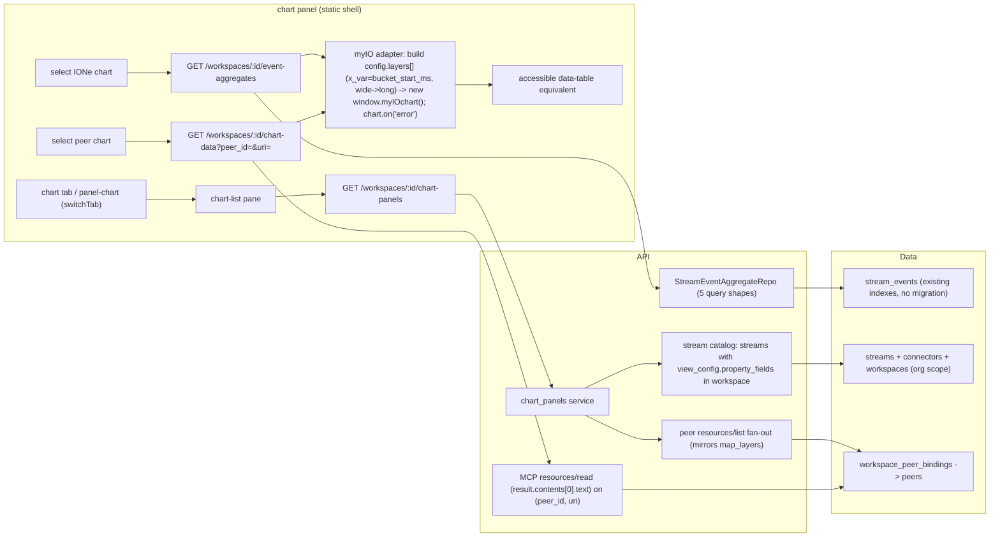

# Design: Chart Panel (`ione_view:"chart"`)

**Status:** Ready for `/implement`
**Date:** 2026-05-28
**Layers:** `api`, `ui`, `db` (db = **query-time only**, no migration — existing `stream_events` indexes suffice)
**Backlog item:** P0 [Epicenter], `md/plans/infrastructure-backlog.md` ("the load-bearing item")
**Stream P:** P7-supporting (substrate visualization for the GroundPulse/Epicenter demo path).

---

## Problem statement

IONe renders MapLibre tiles and nothing else. Any domain app with time-series data — GroundPulse displacement, TerraYield NDVI, Epicenter earthquake frequency, bearingLineDash financials — cannot surface a trend in the IONe workspace shell without the operator building a separate frontend. That defeats the one-pane-of-glass substrate premise.

The backlog states it plainly: the P0 visualization items are "the difference between *IONe federates apps* and *IONe hosts apps*." The just-shipped event-layers map gives us point rendering; the chart panel gives us the second view type and the pattern for the rest (table, document). The Epicenter demo — IONe's clearest end-to-end OSS proof — needs a frequency timeline and a 30-day baseline that no peer app can publish for a public USGS feed; IONe must compute and render them itself.

## Audience

The Morton operator-developer standing up IONe beside a domain app (first: whoever builds the Epicenter seismic console), plus external OSS developers who federate a time-series app and expect the chart view "for free," the way they already get the map view.

---

## Scope decisions (resolved before this design)

1. **Dual data source.** The panel renders a chart from **either** a peer-published `application/vnd.ione.chart+json` MCP resource (federation render, parallel to the map view) **or** an IONe-computed aggregate over its own `stream_events` (the Epicenter path). Both deliver a normalized **chart payload** = a *spec* (`chart_type`, `x_axis`, `y_axis`, `series[]`) + *data rows*. The panel maps that to a myIO spec and renders.
2. **myIO render engine — verified against `../myIO` + `../pymyIO` browser code.** The browser engine is the bundled `myIOapi.js` (at `myIO/inst/htmlwidgets/myIO/myIOapi.js`); loading it + the d3 libs exposes a **`window.myIOchart` constructor**, instantiated as `new window.myIOchart({ element, config, width, height })` where `config` is `{ layers: [ { type, mapping, transform, data } ], … }` (confirmed in `pymyIO/src/pymyio/static/widget.js`). Instances expose `chart.destroy()` and `chart.on('error', …)`. **Only the bundle + d3 libs are loaded as plain scripts** — the `src/*.js` files are ES modules and are NOT vendored. The R package, pymyIO, and JS engine share one canonical layer spec `{type, mapping, transform}` (pymyIO: "byte for byte").
   - **Validation is NOT available in the browser.** `validate_spec` lives only in the Node/MCP module `myIO/mcp/lib/validate.mjs` (the bundle exposes no validator). Therefore IONe does **not** validate at render time — the adapter's spec correctness is enforced at **test time** by a Node test that imports `validate.mjs` directly (see Slice 3 / AC-12). At runtime the panel constructs `myIOchart` and surfaces `chart.on('error')` failures. The myIO MCP server (`myIO/mcp/server.mjs`, six tools) is a **development-agent convenience** for introspecting chart types, **not** an IONe runtime dependency.
   - The single-mapping `validate_spec` bug the backlog flagged (2026-05-27) is absent in current source (`required_mappings` is an array for all 36 types); no bypass needed.
3. **No new DB schema.** Aggregates are computed query-time over `stream_events`; existing indexes cover the access pattern.

## Posture note (chart was marked "deferred to v0.2")

The app-integration-playbook (§4) and `ione-substrate.md` list `chart` as deferred/not-in-v0.1. Those markings predate the Epicenter demand signal. The chart panel is **promoted into v0.1 scope** on the same basis the generic map view was — it passes the substrate-thesis test (it federates time-series across all four reference apps). No v0.2 is being named or proposed; the stale annotations are corrected (see Requirements impact).

---

## Feature slices

### Slice 1 — IONe aggregate charts (the Epicenter path)

IONe computes a data series over its own `stream_events` and renders it via myIO. This is the load-bearing slice and the demo gate.

- **DB:** none new. Query-time aggregation over `stream_events`, org-scoped via `stream_id → streams.connector_id → connectors.workspace_id → workspaces.org_id`. Existing `UNIQUE(stream_id, observed_at)` index covers the range scan; numeric values extracted from JSONB with a `jsonb_typeof = 'number'` guard.
- **API:**
  - `GET /workspaces/:id/chart-panels` — lists available charts (the `ione_charts` section here; `peer_charts` in Slice 2). **IONe chart discovery reuses the existing geo `view_config`** — no new per-stream config contract: for each stream with a `view_config`, every numeric entry in its `property_fields` yields aggregate charts (avg/max/percentile-over-time on that pointer), and every stream yields a count-over-time (frequency) chart that needs no value field. Each emitted `ChartPanelItem` carries the aggregate descriptor (`stream_id`, `op`, `bucket`, `value_pointer` = the property field's JSON Pointer). This sidesteps the fact that `view_config` is geo-only (it requires `lon_pointer`/`lat_pointer`, enforced by the event-layers config parser) — charts ride on the same numeric `property_fields` the map legend already uses, rather than introducing a separate chart-config surface in v1.
  - `GET /workspaces/:id/event-aggregates` — returns the computed series (count-per-bucket, avg/min/max/sum, percentile, group-by, rolling baseline).
- **UI:** new `chart` tab + `panel-chart`, slotting into the existing `switchTab(name)` convention (toggles `panel-<name>` + `tab-<name>`). Left chart-list pane + right render pane, mirroring the map panel's list + partial-failure + retry + polite live-region + legend patterns. Selecting an IONe chart calls `event-aggregates`, maps the payload to a myIO config, and renders into the myIO container; render errors surface in-panel. An accessible data-table equivalent sits below the chart.
- **Cross-reference:** the `chart-panels` item names a stream + aggregate op; the panel calls `event-aggregates?stream_id=…&op=…` which aggregates `stream_events` and returns rows the myIO adapter renders.

### Slice 2 — Peer-published chart resources (the federation path)

Render a chart a peer app publishes over MCP, with no IONe-side data computation — parallel to how the map view renders peer `ione_view:"map"` resources.

- **DB:** none.
- **API:**
  - `GET /workspaces/:id/chart-panels` — the `peer_charts` section: fan out to workspace-bound peers, call MCP `resources/list`, keep resources whose `metadata.ione_view == "chart"`, surface their spec metadata. (Same fan-out mechanism as the shipped `map-layers` endpoint.)
  - `GET /workspaces/:id/chart-data?peer_id=<peer-id>&uri=<peer-resource-uri>` — on selection, call MCP `resources/read` on the chart resource URI for that bound peer and return its data rows + spec. The data lives in the peer; IONe reads it on demand (it does not store or proxy beyond the read).
- **UI:** the same chart panel; peer charts appear in the list alongside IONe charts, distinguished by a source label. Selecting one calls `chart-data` instead of `event-aggregates`; the render path is identical thereafter.
- **Cross-reference:** `chart-panels` peer items carry both `peer_id` and resource `uri`; selecting calls `chart-data?peer_id=…&uri=…` → MCP `resources/read` → `{ spec, rows }` → same myIO adapter as Slice 1.

### Slice 3 — myIO render core + ione→myIO adapter (shared substrate, built in Phase 0.5, reused by Slices 1–2)

Not a separate vertical slice — the render engine both slices depend on. Its contract is verified against `../myIO` + `../pymyIO` source.

- **Adapter output.** The adapter builds a myIO **`config`** = `{ layers: [ { type, mapping, transform, data } ] }` and renders via `new window.myIOchart({ element, config, width, height })`. One layer per series in the simple case; the layer's `data` is the long-form row set.
- **Spec mapping (ione → myIO).** myIO uses **column-mapping (tidy/long) form**, not the ione contract's wide `series[]` form. The adapter maps:
  - ione `chart_type` → layer `type`, via a fixed table to myIO's real type names: `line→line`, `bar→bar`, `scatter→point` (no "scatter"), `histogram→histogram`, `gauge→gauge`, `qq→qq`. myIO `area` is a **range band** (`["x_var","low_y","high_y"]`) — ione `area` renders as a filled `line` unless bounds are supplied.
  - ione `x_axis` → mapping `x_var`; ione `y_axis` → `y_var`. **For time-series, `x_var` must be numeric** (myIO `line`/`point` require numeric `x_var`), so the adapter maps `x_var` to the row's **`bucket_start_ms`** (epoch ms), not the ISO string. The ISO `bucket_start` is used only for the accessible table and axis labels.
  - ione `series[]` (wide) → myIO has **no `series` key**; the adapter **pivots wide→long**, melting series columns into one `y_var` + a `group` column naming the series. Single-series charts skip the pivot. (Open Question 1.)
- **Validation is test-time, not runtime.** A Node test imports `../../../myIO/mcp/lib/validate.mjs` and asserts the adapter's layer spec passes `validateSpec({type, mapping, transform, columns})` for the chart types IONe emits (the `columns` map carries declared types so myIO's numeric-field checks apply). At runtime there is **no** validate call — the panel constructs `myIOchart` and listens on `chart.on('error')`. So the panel has **one** failure UX state at runtime (render-error, from `chart.on('error')` or a thrown constructor); spec-shape correctness is guaranteed before merge by the Node test.

---

## API Contracts

| Endpoint | Method | Request Schema | Response Schema | Error Codes | Auth |
|----------|--------|----------------|-----------------|-------------|------|
| `/api/v1/workspaces/:id/chart-panels` | GET | path `:id`=workspace UUID | `{ ione_charts: ChartPanelItem[], peer_charts: ChartPanelItem[], peer_errors: {peer_id,peer_name,error}[] }` | 401, 404 (workspace not in caller org) | Session/Bearer + org-scoped |
| `/api/v1/workspaces/:id/event-aggregates` | GET | `?stream_id=UUID&op=enum(count,avg,min,max,sum,percentile,group_by,baseline)&bucket=enum(hour,day,week)&value_pointer=string(JSON Pointer)&percentile=float(0,1]&group_by_pointer=string&since=ISO8601&until=ISO8601` | `{ op, bucket, rows: AggregateRow[], truncated: bool }` | 400 (window>90d, buckets>1000, bad bucket/op/percentile, missing value_pointer for numeric ops), 401, 404 (stream not in caller org) | Session/Bearer + org-scoped |
| `/api/v1/workspaces/:id/chart-data` | GET | `?peer_id=UUID&uri=string(peer resource URI)` — **both required** (a URI is only unique within a peer; two bound peers may publish the same URI) | `{ spec: ChartSpec, rows: ChartRow[] }` | 400 (missing/invalid peer_id or uri), 401, 404 (workspace not in org / peer not bound / resource not found), 502 (peer unreachable or `resources/read` failed) | Session/Bearer + org-scoped |

**Data shapes (prose):**
- **ChartSpec** — `chart_type` (line\|bar\|area\|scatter\|histogram\|gauge\|qq), `x_axis` (field name shown on X), `y_axis` (field name / label), `series` (list of field names plotted).
- **ChartPanelItem** — `id`, `name`, `source` (ione\|peer), `spec` (ChartSpec — `spec.chart_type` is the authoritative type field; there is no separate top-level `chart_type`), plus a source-specific selector: IONe items carry the aggregate descriptor (`stream_id`, `op`, `bucket`, `value_pointer`, `group_by_pointer`); **peer items carry both `peer_id` and the resource `uri`** (the UI passes both to `chart-data`).
- **AggregateRow** — shape varies by `op`. Every time-bucketed op carries **both** `bucket_start` (ISO8601, for the accessible table + axis labels) **and** `bucket_start_ms` (int epoch milliseconds, the numeric `x_var` the myIO adapter plots — myIO `line`/`point` require numeric x):
  - `count`: `{ bucket_start, bucket_start_ms, value: int, event_count: int }`  (`value` == `event_count`; `value_pointer` not required)
  - `avg` / `min` / `max` / `sum`: `{ bucket_start, bucket_start_ms, avg, min, max, sum: float|null, event_count, valid_count: int }` — all four numeric aggregate fields always present (computed together); null only when `valid_count == 0`
  - `percentile`: `{ bucket_start, bucket_start_ms, percentile_value: float|null, event_count, valid_count: int }`
  - `group_by`: `{ group_key: string, event_count: int }` — no `bucket_start`/`bucket_start_ms` (a flat breakdown, not time-bucketed); rendered as a categorical `bar` (`x_var` = `group_key`, allowed to be non-numeric)
  - `baseline`: `{ bucket_start, bucket_start_ms, value: int, trailing_30d_avg: float|null, event_count: int }` — `value` is the bucket count; `trailing_30d_avg` null for the first bucket if <2 days of look-back history

  `valid_count` (numeric ops) counts events where `value_pointer` resolved to a JSON number; `event_count` counts all events in the bucket.
- **Peer resource body / `resources/read` shape** — `chart-data` issues JSON-RPC `resources/read` `{params:{uri}}` to the peer; the body is read from `result.contents[0].text` (a JSON string per the MCP resource contract), parsed as `{ spec: ChartSpec, rows: ChartRow[] }`, and returned verbatim. (The map path's `resources/list` reads `result.resources`; `resources/read` returning `result.contents[]` is the new shape this feature handles.)
- **ChartRow** — for peer charts, an object keyed by the spec's `x_axis` + each `series` name (numbers).

**Guardrails (route layer):** window ≤ 90 days (400 else); bucket count `ceil(window/bucket) ≤ 1000` (400 else); `baseline` only accepts `bucket=day` because its repo path returns daily rolling windows; `group_by` capped at 200 groups with `truncated:true`; `bucket` validated against an allow-list before interpolation (never raw-interpolated — injection guard); `value_pointer`/`group_by_pointer` normalized to a Postgres `text[]` path; non-numeric/missing values excluded from numeric aggregates (not an error).

---

## Wiring Dependency Graph



Every UI action terminates at a DB table or a peer. No node is left without an outgoing edge.

---

## Acceptance criteria

- **AC-1 (count-per-bucket).** Given a stream with 5 events across 2 days, when `GET event-aggregates?op=count&bucket=day&stream_id=…&since=…&until=…`, then rows are ordered by `bucket_start` and the per-day `value` sums to 5. *Verify:* integration test asserts the row values.
- **AC-2 (numeric avg/max).** Given USGS events with `properties.mag` ∈ {4.0, 6.0}, when `op=avg&value_pointer=/properties/mag&bucket=day`, then the bucket's `avg`=5.0 and `max`=6.0, and `valid_count`=2. *Verify:* assert avg/max/valid_count.
- **AC-3 (percentile).** Given 100 events with known mag distribution, when `op=percentile&percentile=0.95&value_pointer=/properties/mag`, then `percentile_value` equals the SQL `percentile_cont(0.95)` of those values (±epsilon). *Verify:* assert against a computed expectation.
- **AC-4 (group-by).** Given events with `properties.type` ∈ {earthquake×3, quarry blast×1}, when `op=group_by&group_by_pointer=/properties/type`, then rows are `[{group_key:"earthquake",event_count:3},{group_key:"quarry blast",event_count:1}]` ordered desc. *Verify:* assert rows.
- **AC-5 (rolling baseline).** Given daily counts over 35 days, when `op=baseline&since=T&until=T+35d`, then the server **automatically** extends the DB query range back 30 days before `since` to seed the rolling window (the caller does not need to adjust `since`); each row in the response corresponds to a bucket within `[since, until]`; each row's `trailing_30d_avg` equals the mean of the trailing ≤30 daily counts including the seeded look-back data; and buckets before `since` are not returned in `rows`. *Verify:* assert the trailing average for a known day equals the expected mean of the preceding 30 days; assert no row has `bucket_start < since`.
- **AC-6 (non-numeric skip).** Given an event whose `value_pointer` resolves to a string `"n/a"`, when an `avg` aggregate runs, then that event is excluded from `avg` (counted in `event_count`, not `valid_count`) and no error is raised. *Verify:* assert no 500 + valid_count < event_count.
- **AC-7 (guardrails).** Given `bucket=hour` and a 90-day window (2160 buckets), when `event-aggregates` is called, then the response is 400 with a "reduce window or increase bucket" message and no query runs. *Verify:* assert 400.
- **AC-8 (org scoping).** Given a stream whose connector's workspace is in org A, when org B calls `event-aggregates` for it, then 404 and no rows. *Verify:* cross-org request returns 404.
- **AC-9 (chart-panels lists both sources).** Given a workspace with one geo/numeric IONe stream and one peer publishing a `vnd.ione.chart+json` resource, when `GET chart-panels`, then `ione_charts` has ≥1 item and `peer_charts` has ≥1 item, each carrying a valid `spec`. *Verify:* assert both arrays non-empty + spec fields present.
- **AC-10 (peer chart-data read).** Given a peer P publishing a chart resource at URI U whose `resources/read` returns `result.contents[0].text` = a JSON string `{spec, rows}`, when `GET chart-data?peer_id=P&uri=U`, then the response is that `{spec, rows}` verbatim with non-empty `rows` keyed by the spec's `x_axis` + `series`. *Verify:* wiremock peer returns the `resources/read` `contents[0].text` body; assert the parsed rows. Also assert that omitting `peer_id` → 400.
- **AC-11 (peer partial failure).** Given two bound peers where one errors on `resources/list`, when `GET chart-panels`, then the reachable peer's charts still return and `peer_errors` names the failed peer. *Verify:* assert one chart present + one peer_error.
- **AC-12 (adapter spec validates at test time).** Given the adapter builds a myIO layer spec for a `histogram` (myIO `required_mappings ["value"]`) and for a `line`, when each spec is checked by `validateSpec` imported from `../../../myIO/mcp/lib/validate.mjs`, then both return `{valid:true}`. *Verify:* `node --test` asserts validity. (No runtime validation exists in the browser; this is the build-time correctness gate.)
- **AC-12b (wide→long pivot).** Given an IONe payload with `series:["mean","p95"]`, when the adapter builds the myIO config, then it produces long-form layer(s) with `mapping:{x_var,y_var,group}` whose data has one row per (x, series) with `group ∈ {mean, p95}`, `x_var` bound to `bucket_start_ms` (numeric), and the spec passes `validateSpec`. *Verify:* `node --test` on the adapter output + `validateSpec`.
- **AC-13 (render end-to-end + a11y).** Given an IONe `line` chart over USGS magnitude, when selected in the panel, then `new window.myIOchart(...)` renders into the container (SVG/canvas child nodes appear), a data-table equivalent (`<details>` with a `<table>`) is present with one row per data point, and a `chart.on('error')` would surface the render-error banner. *Verify:* Playwright asserts the container has child nodes, the table row count equals the series length, and an axe scan of the panel is clean.

---

## Tradeoffs

- **myIO behind an adapter vs. direct myIO calls.** Chosen: the normalized chart payload (spec + rows) is engine-agnostic; myIO sits behind a thin adapter. Slightly more indirection, but it contains the myIO dependency — if myIO proves costly or unavailable, swapping in a small vendored lib (uPlot-class) touches only the adapter, not the data path.
- **Fetch data on selection vs. inline in `chart-panels`.** Chosen: list returns spec/metadata only; data is fetched when a chart is selected. Mirrors map-layers (which lists, doesn't fetch tiles), keeps the list fan-out cheap, and avoids reading every peer resource body up front.
- **Query-time aggregation vs. materialized view.** Chosen: query-time. Epicenter feeds are small (≤ a few thousand events/window); a materialized view adds write-path overhead or staleness. Revisit only if a stream exceeds ~500k rows on the hot path.
- **Runtime validation vs. test-time validation.** Chosen: no runtime validation path because the browser bundle does not expose the Node/MCP validator. Adapter correctness is enforced by the Node test against `validate.mjs`; runtime failures surface through `myIOchart` construction or `chart.on('error')`.
- **Promote chart to v0.1 vs. honor the v0.2 deferral.** Chosen: promote, on the Epicenter/substrate-thesis basis — the same basis that promoted the generic map view. The deferral was a scoping choice, not a principled exclusion.

## Diagram — render lifecycle

```
select chart ──▶ fetch data (event-aggregates | chart-data?peer_id&uri)
     │                                  │ 4xx/502 ─▶ data-error banner
     ▼                                  ▼
 build myIO config.layers[] (type, x_var=bucket_start_ms, y_var/group, wide→long pivot)
                    ▼
       new window.myIOchart({element, config, width, height})
            ├─ ok ─▶ chart + accessible table; focus to header
            └─ throws / chart.on('error') ─▶ render-error banner
(spec-shape correctness is enforced before merge by the node validateSpec test, not at runtime)
```

---

## Open questions

Carried forward as implement-time defaults (none block the architecture):

1. **Wide→long pivot is the main adapter subtlety.** myIO is tidy/long-form (one `y_var` + an optional `group` column); the ione contract is wide (`series:["mean","p95"]`). The adapter melts wide series into `{y_var, group}`. Open: where the pivot runs — in the adapter JS over the fetched rows (simplest, chosen default) vs. server-side in `event-aggregates`/`chart-data` (would change those response shapes). Default: pivot in the adapter; keep the endpoint rows in the ione wide shape.
2. **myIO browser entry surface — resolved.** Confirmed from `pymyIO/src/pymyio/static/widget.js`: load d3 libs + `myIOapi.js` as plain scripts → `window.myIOchart` constructor → `new window.myIOchart({element, config:{layers:[…]}, width, height})`; instances expose `chart.destroy()` and `chart.on('error', …)`. The exact `config.layers[]` field names per chart type come from `myio-schema.json` (the same source the node validateSpec test checks against). No runtime validator in the browser bundle.
5. **Workspace-switch staleness.** When the active workspace changes, the chart panel must reset (clear list + rendered chart) and re-fetch, and drop in-flight async results that resolve after the switch — mirror the loaded-workspace guard the map panel uses in `static/app.js` (the `if (loadedWorkspaceId !== …) return` pattern). Default: same guard.
3. **Peer chart resource body shape.** This design defines `resources/read` on a `vnd.ione.chart+json` resource as returning a JSON body with shape `{ spec: ChartSpec, rows: ChartRow[] }` — i.e. the peer embeds both spec and data rows in the resource body. IONe's `chart-data` endpoint reads this body and returns it to the UI **verbatim** (no re-wrapping); the `{ spec, rows }` contract in the API table is therefore also the peer resource body contract. This is a **new playbook contract** (Requirements impact §a). Until a peer ships it, Slice 2 is tested against a wiremock peer.
4. **Auto-refresh for live streams.** Charts compute on demand; periodic auto-refresh is deferred to a follow-up unless the demo requires it.

---

## Commercial linkage

OSS-core, no billing tier (per the Stream P rule). Buyer-visible outcome: the Epicenter demo shows a live USGS frequency timeline + 30-day baseline rendered in IONe with zero peer-side code — the substrate proof that IONe *hosts* an app's operator surface, not just federates its maps. The same panel renders GroundPulse displacement and TerraYield NDVI via the peer path with config only. This is the metric that moves: operator demo conversion ("can IONe host my app's console without me building a frontend?").

## Requirements impact

- **`app-integration-playbook.md`** — (a) §4: change `chart` from "deferred to v0.2" to a v0.1 supported `ione_view`, documenting the `chart_type/x_axis/y_axis/series` metadata; (b) **add a new subsection** defining the `vnd.ione.chart+json` **resource body** contract returned by `resources/read` (data rows keyed by `x_axis` + `series`) — today only the metadata is specified, not the data body.
- **`ione-substrate.md`** — remove `chart` from the "v0.1 explicitly does NOT include" list; note the map/chart view types are now both shipped.
- **`md/plans/infrastructure-backlog.md`** — on ship, move the P0 chart-panel item to done and fold the P2 "windowed/grouped aggregates" item (now realized as `event-aggregates`) into this work, noting any aggregate ops not yet built.

---

## Devil's Advocate

**1. Load-bearing assumption.** That myIO's D3 engine can be embedded in IONe's static no-SPA shell behind a small adapter and will render an ione chart spec — i.e. that `myIOapi.js` exposes a usable browser API and accepts a spec shape we can map to. If myIO can't be loaded as a plain script exposing render/validate, or its spec model doesn't fit `{type, mapping, transform, data}`, the render path collapses.

**2. Verified against live state? Result: VERIFIED ✓ (incl. the browser render path).** The myIO and pymyIO repos were reviewed at `../myIO` and `../pymyIO`, including the live browser loader. Confirmed against source: (a) loading `myIOapi.js` + d3 exposes a **`window.myIOchart` constructor**, used as `new window.myIOchart({element, config:{layers:[…]}, width, height})` with `chart.destroy()`/`chart.on('error')` (`pymyIO/src/pymyio/static/widget.js`) — **not** a `window.myIO.render/validateSpec` object (an earlier draft assumed that; corrected); (b) the canonical layer spec is `{type, mapping, transform}` with column-mapping keys (`x_var`/`y_var`/`group`/`value`/…), shared byte-for-byte across R/pymyIO/JS; (c) **36 chart types** in `myio-schema.json`; (d) **no validator ships in the browser bundle** — `validate_spec` is Node/MCP-only, so validation is a build-time node test, not a runtime call. **The original load-bearing risk (does myIO embed + render?) is retired.** Corrections folded in from the deeper review: browser contract is `myIOchart`/`config.layers[]`; time-series `x_var` must be numeric (`bucket_start_ms`, not ISO); vendoring is bundle-only (the `src/*.js` are ES modules); peer charts are keyed `(peer_id, uri)`; chart discovery rides on the geo `view_config.property_fields` rather than a new config surface. The backend half (event-aggregates + chart-data + chart-panels, AC-1..11) remains verifiable independently of myIO; AC-12/12b/13 verify the adapter against the real `validate.mjs` + a real `myIOchart` render.

**3. Simplest alternative that avoids the biggest risk.** Drop myIO and vendor a single lightweight charting lib (uPlot-class, ~40 KB) that renders the same spec→chart in the static shell — no MCP tool dependency, no wide→long pivot. Why the proposed design wins anyway: the founder chose myIO for **portfolio parity** — the same `myIOapi.js` (now confirmed present and driving R + pymyIO identically) backs Morton's R/Python widgets, so a chart in IONe matches a chart in a GroundPulse notebook, which is a real substrate-consistency benefit, not a vanity one. With the asset confirmed and the spec contract verified, the original availability risk is gone; the residual cost is the wide→long pivot, which is contained in the adapter. And because the engine sits behind the chart-payload adapter, the uPlot fallback remains a one-module swap if myIO integration stalls. The design is worth it because the adapter makes the myIO bet both real (verified contract) and reversible.

**4. Structural completeness checklist**
- [x] Every UI component that calls an API → the chart panel calls `chart-panels`, `event-aggregates`, `chart-data`; all three are in the API Contract Table.
- [x] Every endpoint implies a repo method (or states no DB) → `event-aggregates` → `StreamEventAggregateRepo` (5 query shapes); `chart-panels` → stream-catalog query + peer `resources/list` fan-out; `chart-data` → MCP `resources/read` (no DB).
- [x] Every new data field appears in all relevant layers → aggregate values (DB query → `event-aggregates` AggregateRow → chart render + a11y table); chart spec (peer resource metadata / IONe descriptor → `chart-panels`/`chart-data` → myIO adapter). No new DB column.
- [x] Every AC maps to an endpoint/observable → each AC names a SQL/HTTP assertion or a Playwright DOM/axe assertion.
- [x] Wiring graph has an unbroken UI→DB(or peer) path → chart panel → 3 endpoints → aggregate repo/stream-catalog/peer read → `stream_events`/`streams`/peers.
- [x] Integration scenarios exercise a full request path per slice → Slice 1: AC-1..8 (panel→event-aggregates→stream_events); Slice 2: AC-9..11 (panel→chart-panels/chart-data→peer); Slice 3: AC-12/12b/13 (adapter→validate_spec→render core).
