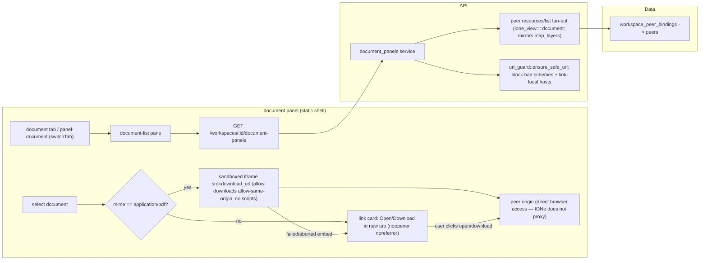

# Design: Document/Report View (`ione_view:"document"`)

**Status:** Ready for `/implement`
**Date:** 2026-05-29
**Layers:** `api`, `ui` (no `db` — peer-resource-only, no `stream_events` side, no migration)
**Backlog item:** P0 [Epicenter] visualization — the **last** unshipped view type, `md/plans/infrastructure-backlog.md`
**Stream P:** P7-supporting (completes the map ✓ / chart ✓ / table ✓ / document view-type set).

---

## Problem statement

IONe renders maps, charts, and tables, but a document/report still resolves only to a hyperlink that sends the operator out of the shell. For apps whose deliverable *is* the document — bearingLineDash financial statements, GroundPulse PHMSA/NBI compliance packages — that's the gap that makes IONe feel like a link aggregator rather than a workspace. Document view is the fourth and final P0 view type; shipping it moves operator demo coverage to 4/4 and closes the bearingLineDash/GroundPulse reference-app surface.

## Audience

The Morton operator-developer demoing IONe beside a reference app whose primary output is a report — bearingLineDash (financial statements) and GroundPulse (compliance PDFs) first; external OSS developers federating any compliance/finance app second. They expect document rendering to "come with" the substrate the way the map view did.

---

## Scope decisions (resolved before this design)

1. **Peer-resource-only.** Unlike map/chart/table there is **no IONe `stream_events` data side** (events aren't documents). Apps publish `application/vnd.ione.document+json` MCP resources carrying `metadata.download_url` + `metadata.mime_type`.
2. **Browser-reachable, not proxied — the map `tile_url` precedent.** `download_url` is fetched **by the browser**, on the peer's origin; IONe never proxies, stores, or streams the bytes. This means the document metadata rides in the `resources/list` fan-out (mirroring the shipped map-layers endpoint) and **there is no `resources/read` data path** — a key simplification over chart/table.
3. **Inline-embed only `application/pdf`; everything else links out.** PDFs render in a sandboxed iframe (the browser's native viewer); all other MIME types (html, csv, docx, …) render a "open/download in new tab" card. This bounds the embed-security surface to one well-understood type.
4. **No render engine, no DB, no migration.**

## Posture note (document marked "deferred to v0.2")

`app-integration-playbook.md` §4 marks `document` "deferred to v0.2 — metadata.download_url, MIME type." Promoted to v0.1 on the same basis chart and table were (substrate-thesis test + only remaining P0 gap + the reference-app need). Stale annotation corrected (Requirements impact). No v0.2 named.

---

## Feature slices

### Slice 1 — Document discovery (federation list)

List the documents a workspace's peers publish.

- **DB:** none.
- **API:** `GET /workspaces/:id/document-panels` — fan out to workspace-bound peers, call MCP `resources/list`, keep resources whose `metadata.ione_view == "document"`, **validate each `download_url` server-side**, and surface `{name, peer_id, uri, download_url, mime_type}`. Drop (and log) any item whose `download_url` fails validation. Same fan-out + `peer_errors` partial-failure shape as map-layers/chart-panels/table-panels.
  - **Validation = https-only, on top of `url_guard`.** `url_guard::ensure_safe_url` alone is too permissive here (it allows `http` to localhost/private and is scheme-agnostic). The document validator MUST additionally **require the `https` scheme** (reject all `http`, `javascript:`, `data:`, `file:`, anything non-https). It then defers to `url_guard` for the link-local block. Private/loopback **https** hosts remain allowed (on-prem peers reachable by the operator's browser). Net: `https://peer/doc.pdf` ✓, `https://10.x/doc.pdf` ✓ (on-prem), `http://…` ✗, `https://169.254.x` ✗ (link-local), `javascript:`/`file:` ✗.
- **UI:** new `document` tab + `panel-document`, slotting into `switchTab(name)`; left document-list pane (peer items, source label + MIME-type badge, per-item error rows + retry, polite live-region, loaded-workspace guard) mirroring the shipped panels.
- **Cross-reference:** the `document-panels` item carries `download_url` + `mime_type`; the UI render pane (Slice 2) consumes them directly — no second fetch.

### Slice 2 — Document render (inline PDF + link fallback)

Render the selected document in-app.

- **DB:** none. **API:** none new — the render pane uses the `download_url`/`mime_type` already in the `document-panels` item.
- **UI:** right render pane with states: idle, loading, **inline PDF** (sandboxed iframe + a toolbar with "Open in new tab"/"Download"), **non-PDF link card** (name + type + prominent "Open in new tab"), **embed-failed** (PDF the peer refused to frame → degrade to the link card + a polite notice), empty, and render-error. A programmatic fallback link is **always present** even when embedded.
- **Cross-reference:** consumes Slice 1's item; the browser fetches `download_url` directly from the peer (never through IONe).

### Slice 3 — Embed-security controls (cross-cutting)

The security envelope the embed depends on.

- **MUST (per-element, ships with the feature):** the iframe carries `sandbox="allow-downloads allow-same-origin"` after the Chromium spike showed the fully opaque rung does not expose a usable native PDF document; `allow-scripts` remains prohibited; `referrerpolicy="no-referrer"`; all link-outs carry `target="_blank" rel="noopener noreferrer"`; `download_url` is scheme/host-validated server-side; IONe never proxies the content; IONe adds `X-Content-Type-Options: nosniff` to its own responses.
- **SHOULD (own verification, may land just after):** a baseline `Content-Security-Policy` HTTP header on the shell with `frame-src` limited to bound-peer origins + `frame-ancestors 'self'`. This is cross-cutting (affects the shipped map/chart/table panels) and **must be verified not to break MapLibre tiles, vendored myIO, or table rendering** before enabling — so it is a SHOULD with its own spike, not a v1 blocker. The per-element MUSTs provide strong protection without it.

---

## API Contracts

| Endpoint | Method | Request Schema | Response Schema | Error Codes | Auth |
|----------|--------|----------------|-----------------|-------------|------|
| `/api/v1/workspaces/:id/document-panels` | GET | path `:id`=workspace UUID | `{ peer_documents: DocumentPanelItem[], peer_errors: {peer_id,peer_name,error}[] }` | 401, 404 (workspace not in caller org) | Session/Bearer + org-scoped |

**Data shapes (prose):**
- **DocumentPanelItem** — `id`, `name`, `source` (always `"peer"` — document-view has no IONe-data path; the field is present for list-pane rendering parity with the chart/table panels), `peer_id`, `uri`, `download_url` (peer-hosted; validated by `url_guard` before return), `mime_type` (string), and optional `file_size_bytes` / `last_modified` (surfaced when the peer provides them, else null).
- There is **no `document-data`/read endpoint** and **no IONe-data section** — `document-panels` returns everything the UI needs; the browser embeds/links `download_url` directly.
- **Peer resource contract:** the document is a `resources/list` entry with `metadata.ione_view == "document"`, `metadata.download_url` (browser-reachable https), `metadata.mime_type`. No `resources/read` body is defined for documents (unlike chart/table).
- **`download_url` auth + lifetime (load-bearing peer contract).** Because the **operator's browser** fetches `download_url` directly and **cannot attach IONe's delegated peer bearer token**, the URL MUST be retrievable by that browser without IONe credentials — i.e. one of: (a) **public**, (b) a **presigned/time-limited** URL the peer minted, or (c) authenticated by a **cookie on the peer's own origin** that the browser already holds. It MUST remain valid for a usable window after `resources/list` (the operator clicks later) — recommend **≥ 5 minutes**. A `download_url` requiring IONe's token will 401/403 in the browser even though IONe could reach it server-side. This is a peer obligation; IONe does not proxy to inject auth (that would re-attribute peer content to IONe's origin and reintroduce SSRF — explicitly out of scope). Failures surface as the embed-failed → link-card fallback.
- **JSON wire casing.** Responses use `camelCase` (matching the shipped panels' `#[serde(rename_all = "camelCase")]`): `peerDocuments`, `peerErrors`, and item fields `peerId`, `downloadUrl`, `mimeType`, `fileSizeBytes`, `lastModified`.

---

## Wiring Dependency Graph



Every UI action terminates at a peer (via `document-panels`) or at the peer's origin directly (the browser fetch). No DB node — peer-resource-only by design.

---

## Acceptance criteria

- **AC-1 (discovery + scheme validation).** Given a bound peer publishing an `ione_view:"document"` resource with an `https` `download_url` + `mime_type:"application/pdf"`, when `GET document-panels`, then `peer_documents` includes it with `peer_id`, `uri`, `download_url`, `mime_type`. *Verify:* wiremock peer; assert the keys.
- **AC-2 (https-only validation).** Given peer resources whose `download_url` is each of `javascript:alert(1)`, `file:///etc/passwd`, `http://example.com/d.pdf`, `http://127.0.0.1/d.pdf`, `http://10.0.0.5/d.pdf`, and `https://169.254.169.254/d.pdf` (link-local), when `GET document-panels`, then **every** one is **omitted** from `peerDocuments` (and logged) — http is rejected even to localhost/private, link-local is blocked. Given `https://example.com/d.pdf` **and** `https://10.0.0.5/d.pdf` (on-prem private https), then **both are present**. *Verify:* wiremock peer with each URL; assert omitted vs present per case.
- **AC-3 (partial peer failure).** Given two bound peers where one errors on `resources/list`, when `GET document-panels`, then the reachable peer's documents return and `peer_errors` names the failure. *Verify:* assert one document + one peer_error.
- **AC-4 (org scoping).** Given a workspace in org A, when org B calls `document-panels`, then 404. *Verify:* cross-org request → 404.
- **AC-5 (PDF inline embed + sandbox).** Given a selected `application/pdf` document, when it renders, then a single `<iframe>` is created with `src == download_url`, the `sandbox` attribute contains **no** `allow-scripts` token and **no** combination of `allow-scripts` with `allow-same-origin` (i.e. `allow-same-origin` alone is permitted if required by the Chromium fallback — see Open Question 1 — but `allow-scripts` must never be present regardless), and **no** network request to any IONe `/proxy`-style path fires (the fetch goes to the peer origin). *Verify:* Playwright asserts: (a) the iframe `sandbox` attribute does not contain `allow-scripts`; (b) the `sandbox` attribute does not contain both `allow-scripts` and `allow-same-origin` together; (c) no IONe-origin document fetch occurs.
- **AC-6 (non-PDF link card, no iframe).** Given a `text/csv` (or `text/html`, `…docx`) document, when selected, then the render pane shows an `<a target="_blank" rel="noopener noreferrer" href=download_url>` and **no `<iframe>` exists**. *Verify:* Playwright asserts the anchor + absence of an iframe.
- **AC-7 (embed-failed fallback).** Given a PDF whose frame request fails or is blocked by the browser, when selected, then within the load timeout the pane degrades to the link card with a polite "could not be displayed inline" notice, and the "Open in new tab" link still targets `download_url`. *Verify:* Playwright with a blocked-request fixture; assert fallback card + working link. Note: under the no-proxy model, pure `X-Frame-Options` denial may be indistinguishable from a browser-rendered blank/error frame, so the visible open/download controls remain mandatory even when fallback detection cannot classify the peer response.
- **AC-8 (render + a11y + per-element MUSTs).** Given any render-pane state, when an axe scan runs, then zero violations; the inline-PDF iframe has a descriptive `title` (document name + "PDF document") **and `referrerpolicy="no-referrer"`**; every open/download link carries **`target="_blank"` and `rel="noopener noreferrer"`**; a programmatic fallback link is present even when embedded; the "open in new tab" control announces it opens a new tab. *Verify:* Playwright asserts `referrerpolicy`, link `rel`/`target`, fallback-link presence, the iframe `title`, + axe. (Note: the cross-origin `download` attribute is advisory — it only forces a save if the peer sends download-friendly headers; the design does not rely on it.)

---

## Tradeoffs

- **`sandbox="allow-downloads allow-same-origin"` vs. `allow-scripts allow-same-origin`.** Chosen after implementation spike: `allow-downloads allow-same-origin`, with **no `allow-scripts`**. Current Chromium did not expose a usable native PDF document at the fully opaque `allow-downloads` rung. Excluding scripts preserves the important security boundary and avoids the prohibited `allow-scripts`+`allow-same-origin` combination.
- **No proxy (browser fetches `download_url`) vs. IONe proxying the bytes.** Chosen: no proxy — matches the shipped map `tile_url` contract. Proxying would re-attribute peer content to IONe's origin and add an SSRF surface + memory pressure. The cost is limited response introspection: IONe cannot reliably pre-check `X-Frame-Options`, so it detects failed/aborted embeds where the browser exposes that state and always keeps direct open/download controls visible.
- **Inline PDF only vs. inline HTML/CSV/image too.** Chosen: PDF only in v1. HTML inline = arbitrary markup/script surface; CSV could route to the table panel later; images are a safe v2 add. Link-card for everything non-PDF keeps the security analysis to one MIME type.
- **No `resources/read` vs. a read endpoint.** Chosen: none — `download_url` in `resources/list` metadata is sufficient (map precedent). A read path would reintroduce proxying.
- **CSP as SHOULD vs. MUST.** Chosen: SHOULD with its own verification — the per-element sandbox + scheme validation protect the embed without it, and a strict app-wide CSP risks breaking the shipped MapLibre/myIO panels until verified.

## Diagram — render lifecycle

```
select doc ──▶ mime == application/pdf ?
   │                 │ no ─▶ link card (Open/Download in new tab, noopener)
   │                 │ yes ─▶ sandboxed iframe (allow-downloads allow-same-origin, no scripts) src=download_url
   │                              ├─ load ok ─▶ inline PDF + toolbar (Open/Download)
   │                              └─ blocked/blank/timeout ─▶ link card + "couldn't embed" notice
   └─ always: a working "Open in new tab" link to download_url is present (never a dead end)
```

---

## Open questions

Carried forward as implement-time defaults (none block the architecture):

1. **Chromium sandboxed-PDF render (the embed spike).** Resolved in implementation: current Chromium needs `sandbox="allow-downloads allow-same-origin"` for this native PDF path; `allow-scripts` is still never used. The feature degrades to link-only if a future browser cannot render this rung safely.
2. **Embed-failure detection.** No reliable pre-detection of `X-Frame-Options` (it's a peer response header IONe doesn't see; HEAD-probing adds latency + may need peer auth). Use a post-load / timeout `contentDocument` check for failed or aborted frame loads; on failure, the link card. Pure frame-denial can still be browser-error shaped under the no-proxy model, so the open/download toolbar remains visible whenever an inline preview is attempted.
3. **file_size / last_modified.** Surfaced when the peer includes them in resource metadata; optional nullable fields in `DocumentPanelItem`. Block on the playbook contract update.
4. **CSP rollout.** The baseline CSP (Slice 3 SHOULD) needs a spike confirming it doesn't break the shipped panels (myIO inline scripts? MapLibre blob workers / `tile_url` origins?). Until verified, ship the per-element controls.

---

## Commercial linkage

OSS-core, no billing tier (Stream P). Buyer-visible outcome: completes the view-type quartet — **bearingLineDash** (the third reference app) can surface financial statements in-panel, and **GroundPulse** compliance PDFs render next to the map and event table. Parity with Foundry/Glean on inline document preview; the differentiation is that the document arrives through the same MCP resource fan-out that already drives map/chart/table — no per-app integration.

## Requirements impact

- **`app-integration-playbook.md`** — §4: change `document` from "deferred to v0.2" to a v0.1 supported `ione_view`; document the metadata contract (`download_url` https browser-reachable + not proxied, `mime_type`, optional `file_size_bytes`/`last_modified`) and that **no `resources/read` body is defined** for documents (the map-style metadata-only path).
- **`ione-substrate.md`** — remove `document` from the "v0.1 explicitly does NOT include" list; note map/chart/table/document are the shipped v0.1 view types.
- **`ux-security-audit-backlog.md`** — record the new app-wide CSP (Slice 3 SHOULD) as a tracked hardening item if it lands after this feature; note the inherited peer-token-refresh residual.
- **`md/plans/infrastructure-backlog.md`** — on ship, mark the P0 document-view item done (completing P0 visualization).

---

## Devil's Advocate

**1. Load-bearing assumption.** That IONe can render a peer's document **without proxying it** — i.e. the browser, loading IONe's page, embeds/links a peer-hosted `download_url` directly, and that this is architecturally sound and safe. Everything (no DB, no read endpoint, the whole security model) rests on "browser-reachable peer URL, IONe never touches the bytes."

**2. Verified against live state? Result: VERIFIED ✓ (architecture); browser rung resolved in implementation.** The "browser-reachable peer URL, not proxied" contract is **already shipped and working** for map `tile_url` — the map panel embeds peer-supplied tile URLs the browser fetches directly, IONe does not proxy (verified in `app-integration-playbook.md` §4 + the shipped `map_layers` path). Document view reuses that exact, proven contract for `download_url`. The peer fan-out (`resources/list` → filter by `ione_view`) is the shipped map-layers/chart-panels/table-panels mechanism. The `url_guard` scheme/host validation is shipped (built for `geojson_poll`). The implementation Playwright spike selected `sandbox="allow-downloads allow-same-origin"` for current Chromium; the security invariant is still no `allow-scripts`.

**3. Simplest alternative that avoids the biggest risk.** Don't embed at all — render every document as a "open in new tab" link (no iframe, ever). This eliminates the entire embed-security surface (the highest risk). Why the proposed design is worth the extra complexity: the backlog item is literally "render linked PDFs/reports **in-app** instead of just linking out" — link-only *is* the status quo the feature exists to improve, and inline PDF preview is the demo-closing capability (an operator sees the report without leaving the shell). The added complexity is contained: it's one MIME type (PDF), one well-understood sandboxed-iframe pattern, and the security MUSTs (sandbox value, scheme validation, no-proxy) are small and testable. Crucially, the design **degrades to exactly this alternative** — if the Chromium spike fails or a peer blocks framing, the user gets the link card. So we get the richer experience where it works and the safe boring alternative everywhere else, with no security compromise either way.

**4. Structural completeness checklist**
- [x] Every UI component that calls an API → the document panel calls `document-panels` (in the API Contract Table). The render pane calls no API (uses the item's `download_url`); the browser's direct peer fetch is not an IONe endpoint and is shown in the wiring graph.
- [x] Every endpoint implies a repo method or states no-DB → `document-panels` → peer `resources/list` fan-out + `url_guard` validation; **no DB access** (explicitly peer-resource-only).
- [x] Every new data field appears in all relevant layers → `download_url` + `mime_type` (peer resource metadata → `document-panels` item → UI embed/link); no DB column (no IONe-data side).
- [x] Every AC maps to an endpoint/observable → each AC names an HTTP assertion (AC-1..4) or a Playwright DOM/axe assertion (AC-5..8).
- [x] Wiring graph has an unbroken path → document panel → `document-panels` → peer fan-out → peers; render → browser → peer origin. (No DB terminus by design — the one panel of the four with no `stream_events` path.)
- [x] Integration scenarios per slice → Slice 1: AC-1..4 (panel→document-panels→peer, incl. url validation); Slice 2: AC-5..8 (render: inline PDF / link card / fallback / a11y); Slice 3 security is asserted within AC-2 (scheme reject) + AC-5 (sandbox value).
