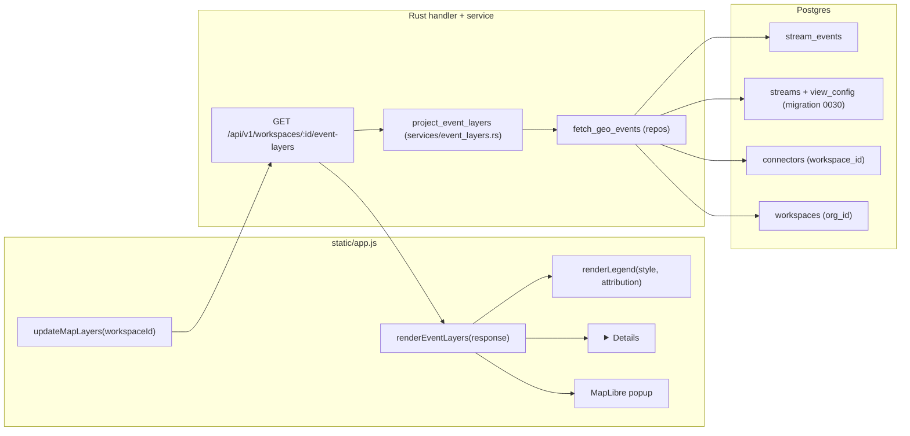

# Live Event Point Layer

**Status:** Design — ready for `/implement`
**Layers:** `db`, `api`, `ui`
**Outcome ID:** P7 (Path 2 — IONe substrate, supporting)
**Forcing function:** Epicenter seismic-monitor demo (USGS earthquakes sized by magnitude)
**Source backlog item:** `md/plans/infrastructure-backlog.md` — P0, "Live point/feature map layer from `stream_events`"

---

## Problem

IONe's map shell today renders only **peer-published raster tile URLs** — the peer app publishes `tile_url` via MCP `resources/list`, IONe passes it through to MapLibre ([`map_layers.rs:155-188`](../../src/services/map_layers.rs#L155-L188)). That works when a domain app owns the data and the tiles.

It fails for IONe-**ingested** events. Connectors ([firms.rs](../../src/connectors/firms.rs), [irwin.rs](../../src/connectors/irwin.rs), [nws.rs](../../src/connectors/nws.rs), and the planned generic `geojson_poll`) pull public feeds into `stream_events` ([`0003_connectors.sql:24-35`](../../migrations/0003_connectors.sql#L24-L35)). The geometry lives inside the JSONB payload. There is **no peer app to publish those as map resources** — the data lives in IONe because IONe ingested it directly. Without this feature the data is unrenderable; a seismic-monitor demo is a list of JSON records.

The integration-fabric constraint: IONe does not own format-aware exporters or app-specific data semantics. The feature must stay **format-agnostic** — geometry/style extraction is declarative per-stream config (JSON Pointers into the payload), never a feed-specific code path.

---

## Why this is in-bounds for the substrate

IONe owns two of the relevant substrate layers (`md/.claude/rules/path-2-stream-p.md`):
- **"Push event ingress"** — connectors writing to `stream_events`.
- **"Thin UX shell with pluggable view types (map first)."**

Wiring the ingress layer's output into the UX shell's map renderer is substrate plumbing, not app logic — *provided* the projection is declarative and feed-agnostic. The hard guardrail: zero feed-specific code in IONe's render or projection path. Any USGS/FIRMS/IRWIN-specific field knowledge belongs in the stream's `view_config`, declared at connector configuration time.

The GroundPulse customer story: a dam operator overlays IONe-ingested FIRMS fire perimeters (point centroids) on the displacement raster GroundPulse publishes via MCP. Two data sources, one map, one shell. That is the federation value proposition made visible.

---

## Feature slices

### Slice 1 — Declare per-stream geometry + style mapping

Operators (or the connector implementation) declare, per stream, how to extract geometry and style from the payload. Streams without a mapping are not rendered as points.

- **DB:** add nullable `view_config JSONB` column to `streams`. Null means "not a geo layer." Migration `0030_streams_view_config.sql`. No backfill — existing streams remain null.
- **API:** none in v1. Authoring happens out-of-band (SQL update via the seeder/connector code). A UI authoring surface is out of scope for v1 (open question).
- **UI:** none in v1. Mapping is invisible to end users; they see only the resulting layer.

**Cross-reference:** [Slice 2] reads `view_config` per row in the projection query.

### Slice 2 — Project events to GeoJSON

A new endpoint returns one named GeoJSON FeatureCollection per geo-mapped stream in the workspace, projected from `stream_events` within a time window.

- **DB:** repository method `fetch_geo_events(workspace_id, org_id, stream_id?, since, until, limit)` joining `stream_events → streams → connectors`, scoped to `connectors.workspace_id = $1 AND EXISTS (workspace ∈ org)`, filtered to `view_config IS NOT NULL`. Returns flat rows of `(stream_id, stream_name, view_config, event_id, payload, observed_at)`, ordered `observed_at DESC`, capped by `limit`.
- **API:** `GET /api/v1/workspaces/:id/event-layers`. Pure projection service — JSON Pointer (RFC 6901) resolves `lon_pointer`, `lat_pointer`, and each declared property field. Per-feature skip on coordinate resolution failure; per-stream failure on malformed `view_config`. See the [API Contracts](#api-contracts) section.
- **UI:** companion to the existing `/map-layers` call — fired in parallel from `updateMapLayers`.

**Cross-reference:** [Slice 1]'s `view_config` is the input. [Slice 3] consumes the response.

### Slice 3 — Render points on the existing map shell

Point markers render on the same MapLibre canvas as peer raster layers, with a size/color legend and an accessible companion list for keyboard/screen-reader users.

- **DB:** none.
- **API:** none new — consumes `/event-layers`.
- **UI:** in `static/app.js` and `static/index.html`:
  - Add GeoJSON sources + `circle` layers per event layer; size and color driven by MapLibre `interpolate` expressions over the style hints in the response (with literal fallbacks for null fields). Point layers render above all raster layers (added after rasters).
  - Extend the existing layer-control `<ul id="map-layer-list">`: event rows get a `layer-row--event` class and a `<span class="layer-type-badge">Events</span>` text badge (never color-only; WCAG 1.4.1).
  - Legend `<section>` at bottom-left of `#map-canvas-container`: size ramp (3 sample circles + labels), color ramp (12px gradient bar + min/mid/max labels), data-source attribution, and a "Last 24 h · Updated *N* min ago" footer. Visible only when ≥1 event layer is visible.
  - Click/tap a marker → MapLibre popup containing a `<dl>` of the configured property fields. Click target widened to 44px via bbox `queryRenderedFeatures` on the click point (WCAG 2.5.5).
  - Keyboard/SR companion: `<details>` disclosure labeled "Event list — *N* events." When open, renders a `<table>` of up to 100 rows (the latest by `observed_at`) with a "Show on map" button per row that calls `flyTo` + opens the popup programmatically. Cap rendered at 100 with overflow note (DOM-size guardrail).

**Cross-reference:** consumes Slice 2's response. Composes with existing raster layers from `/map-layers`.

---

## API Contracts

The single new endpoint. The existing `/map-layers` endpoint is **unchanged** — event layers do not get folded into it (different data source, different failure modes, peer fanout must not block local DB queries).

| Endpoint | Method | Request | Response | Errors | Auth |
|---|---|---|---|---|---|
| `/api/v1/workspaces/:id/event-layers` | GET | Query: `since` ISO8601 (default `now - 24h`), `until` ISO8601 (default `now`), `stream_id` UUID (optional), `limit` int (default 5000, range 1..=5000). Constraints: `since <= until`; `until - since <= 30d`. | `EventLayersResponse` (see below). | 400 (invalid params, window > 30d, limit out of range), 401 (no session), 404 (workspace not in caller's org), 500. | Bearer + `ensure_workspace_in_org` (org-scoped, identical guard to `/map-layers`). |

### Response shape — `EventLayersResponse`

| Field | Type | Notes |
|---|---|---|
| `layers` | `EventLayer[]` | One per stream that has a parseable `view_config`. Empty array when workspace has no geo-mapped streams. |
| `streamsOk` | `UUID[]` | Stream IDs that projected without `view_config` errors. |
| `streamsFailed` | `StreamProjectionError[]` | Streams whose `view_config` is malformed or missing required pointers. |
| `truncated` | `bool` | True when more events existed than the global `limit` allowed (detected via fetching `limit + 1` rows server-side). Caller should narrow window or pass `stream_id`. |
| `queriedAt` | ISO8601 | Server-side timestamp at query time. Surfaced in UI legend footer. |

### `EventLayer`

| Field | Type | Notes |
|---|---|---|
| `streamId` | UUID | |
| `streamName` | string | Human label, mirrored to the UI layer control. |
| `attribution` | string \| null | From `view_config.attribution`. Rendered in legend. |
| `featuresSkipped` | integer | Count of events whose `lon_pointer` / `lat_pointer` resolved null or non-numeric. |
| `collection` | GeoJSON `FeatureCollection` | Always `type: "FeatureCollection"`. Geometry always `Point`. |
| `style` | `LayerStyle` \| null | Null when `view_config.style` is absent. |

Each `Feature.properties` carries **only the fields declared in `view_config.property_fields`**, plus two always-injected keys: `_event_id` (UUID) and `_observed_at` (ISO8601). Raw payload is never forwarded — this is the field-leakage guard.

### `LayerStyle`

| Field | Type | Notes |
|---|---|---|
| `sizeField` | `string` \| null | Property-key name matching a declared `property_fields[].name`. Null when no size encoding. |
| `sizeDomain` | `[number, number]` \| null | Input value range (e.g. `[2.5, 7.5]` for magnitude). |
| `sizeRange` | `[number, number]` \| null | Output radius in px (e.g. `[4, 22]`). |
| `colorField` | `string` \| null | Property-key name matching a declared `property_fields[].name`. Null when no color encoding. |
| `colorDomain` | `number[]` \| `string[]` \| null | Numeric stops or categorical string values; length must equal `colorRange.length`. |
| `colorRange` | `string[]` \| null | Hex or CSS color strings; length must equal `colorDomain.length`. |
| `labelField` | `string` \| null | Property-key name to display as a point label. |

All fields are independently nullable. `sizeDomain`, `sizeRange`, and `sizeField` are all-or-nothing: if any one is non-null, all three must be non-null (whole-stream failure otherwise). Same constraint applies to `colorField`, `colorDomain`, `colorRange`.

### `StreamProjectionError`

| Field | Type | Notes |
|---|---|---|
| `streamId` | UUID | Stream that failed. |
| `streamName` | string | Human label. |
| `error` | string | Human-readable reason, e.g. `"view_config.lon_pointer missing"` or `"invalid JSON Pointer syntax"`. |

### `view_config` (stored per stream)

Note: `view_config` keys use `snake_case` (stored in Postgres JSONB). The API response serializes style hints as `camelCase` in `LayerStyle` (wire format). The projection service is responsible for the translation.

| Key | Type | Required | Notes |
|---|---|---|---|
| `lon_pointer` | string | yes | RFC 6901 JSON Pointer resolving to a numeric value in the event payload. Array-capable (e.g. `/geometry/coordinates/0`). |
| `lat_pointer` | string | yes | RFC 6901 JSON Pointer resolving to a numeric value in the event payload. Array-capable (e.g. `/geometry/coordinates/1`). |
| `property_fields` | array | no | May be empty or absent. Each entry: `pointer` (RFC 6901 string), `name` (string matching `^[a-zA-Z_][a-zA-Z0-9_]*$`, ≤64 chars). |
| `attribution` | string | no | Free text displayed in the legend footer. |
| `style.size_field` | string | no | Property name used for size encoding. Must be present if `size_domain` or `size_range` is present. |
| `style.size_domain` | `[number, number]` | no | Input value range for size interpolation. Must be present if `size_field` or `size_range` is present. |
| `style.size_range` | `[number, number]` | no | Output radius range in pixels. Must be present if `size_field` or `size_domain` is present. |
| `style.color_field` | string | no | Property name used for color encoding. Must be present if `color_domain` or `color_range` is present. |
| `style.color_domain` | `number[]` or `string[]` | no | Value stops or categories. Length must equal `color_range.length`. Must be present if `color_field` or `color_range` is present. |
| `style.color_range` | `string[]` | no | Hex or CSS color values. Length must equal `color_domain.length`. Must be present if `color_field` or `color_domain` is present. |
| `style.label_field` | string | no | Property name to display as a point label. Independently optional. |

Failure model:
- **Whole-stream failure** (→ `streamsFailed`): JSON parse error; missing `lon_pointer` or `lat_pointer`; syntactically invalid Pointer; non-conforming `name`; partial style triple — any of `size_field`/`size_domain`/`size_range` set without the other two, or same for the color triple; `color_domain.length != color_range.length`.
- **Per-feature skip** (→ `featuresSkipped++`, no error): coordinate Pointer resolves null/missing/non-numeric for a specific event.
- **Per-field silent omission**: a property Pointer resolves null/missing → that key is absent from `properties` for that feature. Never an error.
- **Pass-through, no validation**: `color_domain` element types and `color_range` color-string syntax are not validated by the projection service. Malformed values pass through to MapLibre, which rejects them at render time (the UI logs the MapLibre error and renders the layer without color encoding).

This mirrors `/map-layers`'s `peers_ok` / `peers_failed` envelope ([`map_layers.rs:40-46`](../../src/services/map_layers.rs#L40-L46)).

### JSON Pointer vs the rules engine — deliberately different resolvers

The rules engine ([`rules.rs:158-182`](../../src/services/rules.rs#L158-L182)) uses **dotted paths** flattened into `evalexpr` bindings and **cannot index arrays** (arrays are silently skipped; see the comment at line 179). The projection layer uses **RFC 6901 JSON Pointer**, which can. They operate on different config locations (`workspace.metadata.rules[].when` vs `streams.view_config`) and different runtime paths. There is no conflict; the difference is required because USGS-style payloads put coordinates in an array (`/geometry/coordinates/0`).

---

## Wiring Dependency Graph



Every UI node has a path to a DB table. No dangling edges.

---

## Acceptance criteria

Each criterion is mechanically verifiable. Test paths in parens.

1. **Geometry projection (happy path).** *Given* a workspace with a stream whose `view_config = {"lon_pointer":"/geometry/coordinates/0","lat_pointer":"/geometry/coordinates/1","property_fields":[{"pointer":"/properties/mag","name":"mag"}]}` and three `stream_events` whose payloads are valid USGS-style GeoJSON features, *when* `GET /api/v1/workspaces/:id/event-layers` is called with defaults, *then* the response is 200, `layers.length == 1`, `layers[0].collection.features.length == 3`, each feature has `geometry.type == "Point"`, `geometry.coordinates` is `[number, number]`, and `properties` contains exactly the keys `mag`, `_event_id`, `_observed_at`. (Integration test against a seeded workspace.)

2. **Per-feature skip on missing coordinates.** *Given* the same workspace with one event whose payload has `coordinates: null` and two valid events, *when* the endpoint is called, *then* `featuresSkipped == 1`, `collection.features.length == 2`, no error is returned, and `streamsOk` contains the stream ID.

3. **Whole-stream failure on missing pointer.** *Given* a stream with `view_config = {"lat_pointer":"/y"}` (missing `lon_pointer`), *when* the endpoint is called, *then* the stream appears in `streamsFailed` with an `error` field containing `"lon_pointer"`, not in `layers`, and the response status is still 200.

4. **No raw payload leakage.** *Given* a stream whose `view_config.property_fields` declares only `mag`, and an event whose payload contains `mag`, `place`, and a secret field `internal_id`, *when* the endpoint is called, *then* `features[0].properties` keys are exactly `{mag, _event_id, _observed_at}` — `place` and `internal_id` are absent. (Contract test.)

5. **Workspace/org isolation.** *Given* workspace A (org X) and workspace B (org Y) each with geo-mapped streams, *when* a caller authenticated as org X requests `/workspaces/{B_id}/event-layers`, *then* the response is 404 and no row from B's events is returned. (Integration test exercising `ensure_workspace_in_org`.)

6. **Truncation flag.** *Given* a workspace with 6000 events in window and `limit=5000`, *when* the endpoint is called, *then* total features across all layers is ≤5000, `truncated == true`, and the kept features are the 5000 newest by `observed_at`.

7. **Time window validation.** *Given* `?since=2026-01-01T00:00:00Z&until=2026-03-01T00:00:00Z` (>30d), *when* the endpoint is called, *then* the response is 400 with a body mentioning the 30-day cap.

8. **Coexistence with raster layers (UI).** *Given* a workspace whose `/map-layers` returns 1 raster item and `/event-layers` returns 1 layer with 5 features, *when* the user opens the map tab, *then* the MapLibre canvas shows both, the layer control lists both with the raster row unchanged and the event row carrying a text "Events" badge, the legend card is visible at bottom-left, and the event circles render above the raster (z-order check). (Playwright e2e.)

9. **Partial-failure UI.** *Given* `/map-layers` returns successfully but `/event-layers` returns 500, *when* the user opens the map tab, *then* raster layers render normally, an `<div id="event-layer-status" aria-live="polite">` wrapper (inserted above `#map-layer-list`) carries the text "Event data unavailable — Retry" with a Retry button, and the canvas is not destroyed. The error row itself carries no ARIA role; announcement comes from the polite live-region wrapper. (Playwright e2e + axe-core scan asserting no `role="status"` or `role="alert"` on the row.)

10. **Keyboard reachability.** *Given* a workspace with one event layer (3 events), *when* a user tabs through the map panel, *then* focus reaches the event-list `<summary>`, then each "Show on map" button when the disclosure is open; activating one opens a MapLibre popup whose close button receives focus. (Playwright + axe-core scan.)

11. **Empty state differentiation.** *Given* a workspace with a geo-mapped stream but zero events in window, *when* the user opens the map, *then* the legend renders with the text "No events in last 24 h." and the event row is present in the control. *Given* a workspace with no geo-mapped streams at all, *when* the user opens the map, *then* no event row appears and no legend renders (silent). (Playwright.)

12. **Partial-style validation.** *Given* a stream with `view_config.style = {"size_field":"mag","size_domain":[2.5,7.5]}` (missing `size_range`), *when* the endpoint is called, *then* the stream appears in `streamsFailed` with an `error` field mentioning `size_range`, and is absent from `layers`. (Contract test; same fixture pattern as AC-3.)

---

## Tradeoffs

| Choice | Picked | Rejected | Why |
|---|---|---|---|
| Endpoint shape | Separate `/event-layers` | Fold into `/map-layers` | Different failure modes (DB vs peer-fanout); a 5s peer timeout must not block a local DB query. Cleaner partial-failure envelopes per source. |
| `view_config` placement | New `streams.view_config JSONB` column | Reuse `streams.schema` JSONB | `schema` is the field-type manifest read by the rules engine; embedding projection config creates two readers with incompatible semantics on one blob. Null-vs-non-null on a dedicated column is a clean "is geo-renderable" flag. |
| Pointer dialect | RFC 6901 JSON Pointer | Rules engine's dotted paths | Dotted paths can't index arrays (`rules.rs:179-180`); USGS coordinates require array indexing. |
| Property exposure | Whitelist (`property_fields` only) + `_event_id`/`_observed_at` | Forward whole payload | Prevents field leakage (FIRMS/IRWIN payloads contain provider-internal IDs); keeps the wire response bounded; surfaces a deliberate authoring step. |
| Failure model | Per-feature skip + per-stream fail + per-field silent omission | 4xx on any partial failure | Geo feeds are noisy; one event with a null coordinate must not blank a layer. Mirrors `/map-layers`'s `peers_failed` pattern. |
| Keyboard access | Companion `<details>` event list + bbox-widened click target | Make MapLibre canvas markers focusable | Canvas pixels are not DOM; faking focus rings is maintenance debt and brittle. The disclosure pattern is ~30 lines and standard. |
| Time-window control | Hardcoded 24h default, label-only in v1 | Date-range picker UI | Picker adds a date input, validation, refetch state machine, and loading UX for a demo that doesn't need it. Defer to v2 when a customer asks. |
| Mobile | Out of scope for v1 (banner under 768px) | Responsive layout | The existing shell is desktop-only; this feature is not the right place to introduce the first responsive breakpoints. |
| Polygon/line geometry | Out of scope — points only | Generic feature geometry | Polygons need a different style model (fill/stroke), legend semantics, and likely a different ingestion path. Separate design when a use case arises. |

---

## Devil's Advocate

### 1. Most load-bearing assumption

**IONe already ingests geo-bearing events into `stream_events` whose payload a JSON Pointer can reach, and those events have no peer app to render them.** If false in either half, the feature is either renderable-nothing (no data) or redundant with peer-published vector layers.

### 2. Verification against live state

Code-deterministic check across the connector implementations and DB shape (the local Postgres at :5433 was not running; runtime check skipped because the answer is determined by the connector source, not by runtime data):

| Connector | Insert site | Payload shape | JSON Pointer reachable? |
|---|---|---|---|
| FIRMS | [firms.rs:128-131](../../src/connectors/firms.rs#L128-L131) | flat CSV-row JSON; columns include `latitude`, `longitude` | Yes (`/latitude`, `/longitude`) |
| IRWIN | [irwin.rs:135](../../src/connectors/irwin.rs#L135) | whole IRWIN incident object; `Latitude`/`Longitude` fields present in incident JSON (verified via `infra/fixtures/irwin_incidents.json`) | Yes (`/Latitude`, `/Longitude`) |
| NWS | [nws.rs:165](../../src/connectors/nws.rs#L165) | `obs_body["properties"]` only; lat/lon is on the connector config, not in the stored payload | **No** — geometry is not in the payload |
| Planned `geojson_poll` (Epicenter / USGS) | n/a (P1 backlog) | USGS GeoJSON features | Yes (`/geometry/coordinates/0`, `/1`) |

`stream_events` writer ([stream_event_repo.rs:26](../../src/repos/stream_event_repo.rs#L26)) is generic — it stores whatever the connector hands it.

**Result: VERIFIED ✓ with caveat.** FIRMS and IRWIN — and the soon-to-exist geojson_poll — write geo-bearing payloads JSON Pointer can reach. NWS as a point source requires a connector-side change (inject `geometry: {coordinates: [lon, lat]}` into the payload alongside `properties`); this is not a feature blocker but should be tracked. None of those public feeds have a peer MCP app — the "no peer to publish" half of the premise holds outright.

### 3. Simplest alternative

**Peer apps publish their own GeoJSON/PMTiles vector resources via `resources/list`.** The playbook already reserves `vector_url` as pass-through metadata ([app-integration-playbook.md §4 "Resource metadata conventions for the UX shell"](app-integration-playbook.md#4-resource-metadata-conventions-for-the-ux-shell)). IONe could simply start rendering `vector_url`; no DB column, no projection, no JSON Pointer.

**Why the design is worth the additional complexity over this:** the alternative covers **only the peer-published case**. The forcing function (Epicenter and every other public-feed scenario) has no peer app — USGS, FIRMS, and NWS are ingested by IONe directly. Routing this back through a peer is wraparound complexity ("IONe runs a stub MCP server that re-publishes its own data") for no architectural win. The integration-fabric rule does not forbid IONe from rendering data it owns; it forbids IONe from owning data that belongs to apps. Public-feed events ingested by the substrate's push-ingress layer are exactly the data IONe owns.

The two alternatives are complementary, not competing — `vector_url` rendering remains a fine v2 item for peer-published vectors (already a documented playbook field). This design does not preclude it.

### 4. Structural completeness checklist

- [x] **Every UI API call appears in the API Contract Table.** `updateMapLayers` calls `/event-layers` (in the table). `renderEventLayers`/`renderLegend`/`<details>` consume that response. The existing `/map-layers` call is unchanged.
- [x] **Every endpoint has an implied repository method.** `/event-layers` → `fetch_geo_events` (single SQL query joining `stream_events`, `streams`, `connectors`, with workspace+org fence and `view_config IS NOT NULL` filter).
- [x] **Every data field appears in all three layers.** `view_config` exists at DB (column on `streams`), API (read into `ViewConfig` in the projection service), and UI (consumed implicitly via the `LayerStyle` and Feature shapes the projection emits). `featuresSkipped`/`streamsFailed` exist in API and surface in the UI; exact copy and placement of the "Skipped N" indicator is deferred to implementation (see Open Question 5).
- [x] **Every acceptance criterion maps to an endpoint+response or a UI assertion.** Criteria 1–7 and 12 map to the `GET /event-layers` response shape (contract / integration tests). 8–11 map to Playwright e2e assertions on the static UI.
- [x] **Wiring graph has an unbroken path from every UI component to a DB table.** Verified above.
- [x] **Integration scenarios are described.** Acceptance criteria 1, 2, 3, 5, 6, 7 cover the API path; 8, 9, 10, 11 cover the full UI request path via e2e.

All items pass.

---

## Diagrams

### Request flow

```
User opens Map tab
   │
   ├──> updateMapLayers(wsId)
   │       │
   │       ├──> GET /map-layers     ──> peer MCP fanout (unchanged)
   │       └──> GET /event-layers   ──> fetch_geo_events ──> DB
   │                                      │
   │                                      └──> project_event_layers (JSON Pointer)
   │
   └──> render: MapLibre style { rasters then circles (z-above) },
                layer control mixed list (event rows badged),
                legend (bottom-left, while ≥1 event layer visible),
                <details> event list (closed by default)
```

### `view_config` example (Epicenter / USGS)

```json
{
  "lon_pointer": "/geometry/coordinates/0",
  "lat_pointer": "/geometry/coordinates/1",
  "property_fields": [
    { "pointer": "/properties/mag",   "name": "mag" },
    { "pointer": "/properties/place", "name": "place" },
    { "pointer": "/properties/depth", "name": "depth" }
  ],
  "attribution": "USGS Earthquake Hazards Program",
  "style": {
    "size_field":   "mag",
    "size_domain":  [2.5, 7.5],
    "size_range":   [4, 22],
    "color_field":  "depth",
    "color_domain": [0, 70, 300],
    "color_range":  ["#f5d76e", "#d9534f", "#3a0ca3"],
    "label_field":  null
  }
}
```

---

## Open questions

1. **Authoring surface for `view_config`.** v1 expects DB-direct authoring (seeder / connector code). When the generic `geojson_poll` connector lands, does the connector config carry the `view_config` and write it on stream creation, or is there a separate `PUT /streams/:id/view-config` admin endpoint? Recommend: the connector writes it on stream creation; an admin endpoint waits for a customer ask. Resolve before `geojson_poll` design. Note for whoever authors per-connector `view_config`: JSON Pointer is **case-sensitive**, and the case differs per source — FIRMS uses lowercase `/latitude`, IRWIN uses Pascal-case `/Latitude`, USGS uses array indices into `/geometry/coordinates`. A wrong-case pointer silently produces zero features; the seeder should be tested against a real fixture per connector.
2. **`stream_events` retention.** This feature renders the table on a map; if customers come to expect long history they will lean on `stream_events` as an analytics store. The substrate rule says apps own their data. Recommend a documented rolling retention (e.g. 30 days) and an `INDEX stream_events_observed_at` to make the query and any janitor job cheap. Decide before any production deployment.
3. **NWS connector.** Today NWS writes only `obs_body["properties"]` — geometry sits on the connector config, not the event. To render NWS points, the connector must inject `geometry: {coordinates: [lon, lat]}` into the payload at ingest. Trivial fix, but it is a follow-up, not in this design's scope. File as a separate backlog item.
4. **Color scale choice.** The `style.color_range` is declared per stream, but no project-wide token vocabulary exists. The legend gradient's lightest end must achieve ≥3:1 contrast against `#ffffff`. Recommend documenting a "safe palette" (e.g. viridis 3-stop variants) in the playbook before connector authors choose colors freely.
5. **Display-cap signal in the UI.** When `truncated: true` or the event list hits 100 rows, the UX agent recommends an inline "Showing 100 of N — narrow your search" message. Confirm copy and placement in implementation.
6. **Per-stream fairness (chatty-stream cap).** The global `limit` is a single budget; one busy stream can consume it and shrink other layers. v1 mitigates this only via `stream_id` filtering. A `per_stream_limit` query param (default ~2500) implemented via a window function or LATERAL join is the cheap follow-up — defer until a workspace with two or more high-volume geo streams surfaces.

None of these block implementation of slices 1–3; they are follow-ups or in-implementation choices.

---

## Commercial linkage

This feature lives under **outcome P7** (IONe v0.1 OSS release) and is supporting, not customer-billable in isolation. The buyer-visible payoff is:

- **Demo conversion** — every $35K–$75K OSS deployment engagement opens with a demo. The seismic-monitor instance (Epicenter) goes from "list of JSON" to "live map of points" with this feature. The delta is straightforwardly visible to a buyer in the first 30 seconds.
- **Substrate reuse across the portfolio** — once shipped, GroundPulse, TerraYield, and any future geo-adjacent app on IONe inherit point-feature rendering for any IONe-ingested feed. Marginal cost per future app: zero.
- **Catalyst for the `geojson_poll` connector (P1)** — the connector's value is bounded by the renderability of the data it ingests. Shipping this feature unblocks the P1 connector item too.

Pricing tier fit: ships in OSS core (no tier discrimination).

---

## Requirements impact

The project does not maintain an `md/requirements/active/` directory (verified: directory does not exist). The closest contract document is **`md/design/app-integration-playbook.md`**, which is the source-of-truth for the IONe ↔ peer-app integration surface.

**Required playbook update before implementation lands:**
- Section 4 ("Resource metadata conventions for the UX shell") today documents only the **peer-published** map surface (`tile_url`, `bounds`, etc.). It does not describe the **IONe-side ingested-events** surface. Add a new subsection — "Section 4b: IONe-ingested event layers" — defining the `view_config` schema and stating that no peer-side contract change is required (this is purely an IONe substrate capability). Cross-reference this design doc.

The chart contract reconciliation (chart still labeled "deferred to v0.2" in §4) is **out of scope for this design** — track it under the separate chart-panel design when the P0 chart item is picked up.

No changes to `md/design/ione-substrate.md`, `md/design/ione-v1.md`, `md/design/ione-complete.md`, `md/design/identity-broker.md`, or `md/design/map-view.md` are required by this design.
