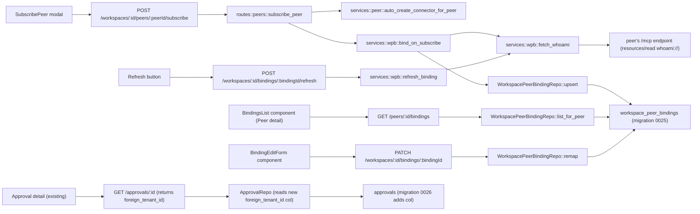

# Foreign-Tenant Mapping

**Date:** 2026-05-15
**Status:** Design — accepted for v0.1 substrate work. Implementation plan to follow via `/implement`.
**Parent:** [md/design/ione-substrate.md](ione-substrate.md) layer 6 ("Cross-app workspace context")
**Adjacent:** [md/design/identity-broker.md](identity-broker.md), [md/design/app-integration-playbook.md](app-integration-playbook.md)
**Layers:** `db`, `api`, `ui`

## Problem

When an IONe operator working in workspace `W` invokes a tool on peer `P`, IONe has no schema that records "which foreign workspace/tenant inside `P` does `W` correspond to." Today the foreign tenant is implicit in whatever the brokered OAuth token's subject resolves to inside the peer — invisible to IONe, unaudited, and unverifiable.

Without this mapping, three things break:

1. **Cross-app correlation collapses.** The "one pane of glass" demo (GroundPulse + TerraYield rendered as one operator workspace) cannot assert that data from both apps is scoped to the same customer tenant. The failure mode is silent data mixing, not a hard error.
2. **The audit trail is meaningless for compliance.** Approval rows record "operator X invoked `acknowledge_alert` on peer `groundpulse-prod`" with no tenant context — useless for any real compliance regime.
3. **Multi-customer deployments are unsafe.** A Morton-managed IONe instance serving Acme and Globex pipelines has no way to assert that Acme's workspace cannot reach Globex's GroundPulse tenant through a misconfigured token.

## Scope

**In scope for v0.1:**
- A `workspace_peer_bindings` table that records the `(workspace, peer) → (foreign_tenant, foreign_workspace)` mapping.
- Best-effort `whoami` lookup at subscribe time; manual binding via PATCH when `whoami` is unavailable or returns inconsistent data.
- Binding metadata surfaced in the operator UI (peer detail and subscribe-peer flow).
- Binding-aware audit: every approval and audit row referencing a peer carries the resolved `foreign_tenant_id` from the binding.

**Explicitly out of scope (v0.2 or later):**
- **Multi-tenant per workspace** (one IONe workspace binding to two foreign workspaces in the same peer). v0.1 enforces 1:1 on `(workspace_id, peer_id)`. The regional-ops use case is real but not v0.1.
- **Routing-level injection** of `foreign_workspace_id` into tool-call arguments. v0.1 records the mapping for display/audit; the foreign workspace is still authoritatively scoped by the OAuth token's subject inside the peer app. The MCP protocol does not change.
- **Background `whoami` refresh sweep.** v0.1 supports manual refresh via an endpoint; an automated sweep waits until peer count justifies it.
- **Cross-org bindings** (one IONe org's workspace binding to a peer registered in another IONe org).

## Feature slices

### Slice 1 — Persist the binding

**Capability:** Record one row per `(workspace, peer)` pair capturing the foreign-tenant identity that IONe believes the brokered user maps to inside the peer.

**DB**
- New migration `0025_workspace_peer_bindings.sql` introducing:
  - Enum `binding_status` with values `active`, `pending`, `conflict`, `inactive`.
  - Table `workspace_peer_bindings` with columns described in the Data Model section.
  - Cross-org guard trigger ensuring `workspaces.org_id = peers.org_id` for every insert/update.
  - RLS enabled with policy `org_id = current_setting('app.current_org_id', true)::uuid` (inert today; matches the pattern in migrations 0019, 0022).

**API**
- No new endpoint *just* for slice 1 — the row is materialized by Slice 3's auto-bind path or Slice 4's manual create.

**UI**
- None directly; the data shape is consumed by slices 4 and 5.

### Slice 2 — `whoami` peer lookup

**Capability:** Given a peer with a brokered access token, fetch its `whoami` resource and return the foreign tenant/user metadata. Tolerate failure.

**DB:** None.

**API**
- Internal service function `fetch_whoami(peer) → Result<WhoamiResponse>`, used by slices 3 and 4. Not exposed over HTTP directly.
- Calls peer's MCP endpoint via JSON-RPC `resources/read { uri: "whoami://" }`. Bearer-authed with the peer's stored access token.
- 8-second timeout. Failure modes: HTTP error, JSON parse error, `whoami://` resource not found (the v0.1-realistic case for stubs).

**UI:** None.

### Slice 3 — Auto-bind on subscribe (best-effort)

**Capability:** When an operator subscribes a workspace to a peer, attempt `whoami`. If it succeeds, materialize a fully-populated binding. If it fails or times out, materialize a `pending` binding the operator can complete manually.

**DB:** Writes to `workspace_peer_bindings` via repository upsert. Does not block the subscribe flow.

**API**
- Modified handler `POST /api/v1/workspaces/:id/peers/:peerId/subscribe`:
  - Existing behavior unchanged: creates `mcp_client` connector, triggers first poll.
  - Added: invoke `bind_on_subscribe(workspace, peer)`. Inserts a binding row with `status = 'active'` if `whoami` succeeds and responds within 3 s; otherwise `status = 'pending'`. The subscribe response gains a `binding` field (null only if the `workspace_peer_bindings` insert itself fails for a reason unrelated to `whoami`).
  - Does not fail subscribe if `whoami` fails — the substrate must work against peers that have not yet implemented `whoami`.
  - **Re-subscribe semantics.** On a repeat subscribe to an existing `(workspace, peer)` pair, the row is upserted, not inserted. If `whoami` succeeds and matches the stored `foreign_tenant_id`, `status` resets to `'active'` (even from `'conflict'`). If `whoami` succeeds and the tenant differs, `status` becomes `'conflict'` and the stored `foreign_tenant_id` is NOT overwritten — same semantics as `/refresh`. `scope` is never overwritten by subscribe (operator-configured). Re-subscribe never returns 409; conflict is surfaced via the binding's `status` field.

**UI:** Subscribe-success toast shows the captured foreign tenant name if present; otherwise prompts "Binding created in pending state — fill in foreign tenant manually from the Peer detail page."

### Slice 4 — Manual binding management

**Capability:** Operator can list, create, update (remap), and delete bindings without going through subscribe. Required because v0.1 peers may not implement `whoami`.

**DB:** Reads/writes to `workspace_peer_bindings`.

**API** (all org-scoped via existing `auth_middleware`):
- `GET /api/v1/workspaces/:id/bindings` — list bindings for workspace
- `GET /api/v1/peers/:id/bindings` — list bindings for peer
- `GET /api/v1/workspaces/:id/bindings/:bindingId` — read a single binding (used by Edit form to populate fields and by Refresh button to display latest state)
- `POST /api/v1/workspaces/:id/bindings` — create binding explicitly (used when subscribe predates `whoami` support and operator wants to fill in manually)
- `PATCH /api/v1/workspaces/:id/bindings/:bindingId` — remap `foreign_tenant_id`, `foreign_workspace_id`, or `scope`. Rejects `foreign_tenant_id == ""` with 422.
- `POST /api/v1/workspaces/:id/bindings/:bindingId/refresh` — re-call `whoami`; returns 409 if tenant_id drifted from stored value (status flips to `conflict`)
- `DELETE /api/v1/workspaces/:id/bindings/:bindingId` — explicit unbind

**UI**
- New section in Peer detail page: "Workspace bindings." Lists rows showing IONe workspace name, foreign tenant name (or "unknown — set manually"), foreign workspace id, status badge, last whoami refresh time.
- Per-row actions: Refresh, Edit (opens form with `foreign_tenant_id`, `foreign_workspace_id`, `scope`), Unbind.
- New mini-flow in Subscribe-peer modal: if `whoami` returned data, surface a confirmation step ("This will bind workspace X to tenant Y in peer Z — Confirm?"). If `whoami` returned nothing, surface a Skip / Fill-in-manually choice.

### Slice 5 — Audit and approval enrichment

**Capability:** Every approval row and audit event referencing a peer carries the resolved `foreign_tenant_id` from the binding, so downstream compliance reporting can attribute actions to a tenant.

**DB**
- Migration `0026_audit_events_foreign_tenant.sql` adds nullable column `foreign_tenant_id TEXT` to `audit_events` and `approvals` tables. Backfill is no-op (no production rows depend on this).

**API**
- `src/services/approval.rs` and the audit emission paths in `src/services/peer.rs` look up the active binding for `(workspace_id, peer_id)` and write the resolved `foreign_tenant_id` into the new column. Null is acceptable when no binding exists yet.

**UI**
- Approval detail view shows foreign tenant alongside peer name.
- Audit log filter accepts foreign tenant as a search facet.

## Data model

### `workspace_peer_bindings`

| Column | Type | Notes |
|---|---|---|
| `id` | UUID PK | gen_random_uuid() |
| `org_id` | UUID NOT NULL | Set by trigger from `workspaces.org_id`; enforces cross-org integrity. ON DELETE RESTRICT against `organizations`. |
| `workspace_id` | UUID NOT NULL | FK → `workspaces(id)` ON DELETE CASCADE. |
| `peer_id` | UUID NOT NULL | FK → `peers(id)` ON DELETE RESTRICT. Operator must unbind before deleting peer. |
| `foreign_tenant_id` | TEXT NOT NULL DEFAULT '' | Opaque foreign-app tenant identifier. Empty string (`''`) for `pending` rows where the operator has not yet filled it in. Application code must not treat an empty string as a valid resolved tenant; the `status` column is authoritative for completeness. |
| `foreign_tenant_name` | TEXT NULL | Cached from `whoami` for display. |
| `foreign_workspace_id` | TEXT NULL | Nullable: peers like bearingLineDash/QuickBooks have no sub-workspace concept. |
| `foreign_user_id` | TEXT NULL | Cached from `whoami`. |
| `foreign_user_email` | TEXT NULL | Cached from `whoami`. |
| `foreign_roles` | TEXT[] NOT NULL DEFAULT `{}` | Cached from `whoami`. |
| `scope` | JSONB NOT NULL DEFAULT `{}` | Forward-compat envelope for per-binding overrides (tool allowlist, severity caps). No fields are recognized in v0.1; treated as opaque. `CHECK jsonb_typeof(scope) = 'object'`. |
| `status` | `binding_status` NOT NULL DEFAULT `pending` | `active` / `pending` / `conflict` / `inactive`. |
| `whoami_refreshed_at` | TIMESTAMPTZ NOT NULL DEFAULT now() | Updated on every successful `whoami` fetch. |
| `created_at` | TIMESTAMPTZ NOT NULL DEFAULT now() | |
| `updated_at` | TIMESTAMPTZ NOT NULL DEFAULT now() | Maintained by trigger. |

**Unique constraint:** `UNIQUE (workspace_id, peer_id)` — strict 1:1 in v0.1. Upgrade to 1:N by extending the constraint to include `foreign_workspace_id` is a cheap future migration (no data shape change required).

**Indexes:**
- `(workspace_id, peer_id)` — implicit from unique constraint; covers binding lookup on the hot path
- `(peer_id, status)` — cascade status updates when a peer is paused/revoked
- `(org_id)` — RLS-scoped listing for the operator UI

## API contracts

| Endpoint | Method | Request | Response | Errors | Auth |
|---|---|---|---|---|---|
| `/api/v1/workspaces/:id/peers/:peerId/subscribe` | POST | (existing — no body) | `{ connector: Connector, binding: Binding \| null }` | 400, 401, 403, 404 | session, org-scoped |
| `/api/v1/workspaces/:id/bindings` | GET | — | `{ items: Binding[] }` | 401, 403, 404 | session, org-scoped |
| `/api/v1/workspaces/:id/bindings` | POST | `{ peerId: UUID, foreignTenantId?: string, foreignWorkspaceId?: string, scope?: object }` | `Binding` | 400, 401, 403, 404, 409, 422 | session, org-scoped |
| `/api/v1/workspaces/:id/bindings/:bindingId` | GET | — | `Binding` | 401, 403, 404 | session, org-scoped |
| `/api/v1/workspaces/:id/bindings/:bindingId` | PATCH | `{ foreignTenantId?: string, foreignWorkspaceId?: string, scope?: object }` | `Binding` | 400, 401, 403, 404, 422 | session, org-scoped |
| `/api/v1/workspaces/:id/bindings/:bindingId` | DELETE | — | `{ ok: true }` | 401, 403, 404 | session, org-scoped |
| `/api/v1/workspaces/:id/bindings/:bindingId/refresh` | POST | — | `Binding` | 401, 403, 404, 409, 502 | session, org-scoped |
| `/api/v1/peers/:id/bindings` | GET | — | `{ items: Binding[] }` | 401, 403, 404 | session, org-scoped |

`Binding` is the row shape from the data model with camelCase field names.

**New `AppError` variants:**
- `WorkspaceBindingConflict { old: string, new: string }` → 409 — `whoami` returned a different `foreign_tenant_id` than stored
- `WhoamiUnreachable { peer_id: UUID, message: string }` → 502 — peer down or `whoami` resource missing during refresh

## Wiring dependency graph

## Acceptance criteria

Each criterion is mechanically verifiable.

1. **Schema integrity.** Given a fresh DB, when migration `0025` is applied, then `workspace_peer_bindings` exists with all columns from the data model, enum `binding_status` has exactly four values (`active`, `pending`, `conflict`, `inactive`), and the cross-org trigger raises `EXCEPTION` when given a `workspace_id` and `peer_id` whose `org_id` differ.

2. **Auto-bind on subscribe — happy path.** Given a peer whose `whoami` returns `{foreign_tenant_id: "t-acme", foreign_tenant_name: "Acme", foreign_user_email: "ops@acme"}` within 3 s, when an operator POSTs to `/api/v1/workspaces/W/peers/P/subscribe`, then the response body contains `binding.status == "active"`, `binding.foreignTenantId == "t-acme"`, and a row exists in `workspace_peer_bindings WHERE workspace_id = W AND peer_id = P AND status = 'active'`.

3. **Auto-bind on subscribe — `whoami` missing.** Given a peer that returns HTTP 404 for `whoami://`, when an operator POSTs to `/api/v1/workspaces/W/peers/P/subscribe`, then the response is 200, the connector is created, and `binding.status == "pending"` with `binding.foreignTenantId == ""`.

4. **Manual binding fill-in.** Given a binding with `status == "pending"`, when an operator PATCHes the binding with `{foreignTenantId: "t-acme"}`, then the row's `foreign_tenant_id` updates to `"t-acme"` and `status` flips to `"active"`.

4a. **Manual binding clear is rejected.** Given a binding with `status == "active"` and `foreign_tenant_id == "t-acme"`, when an operator PATCHes the binding with `{foreignTenantId: ""}`, then the response is HTTP 422 with error message containing `"foreignTenantId cannot be empty"`, and the row is unchanged. Operators clear a binding by DELETE, not by PATCH to empty.

5. **Refresh detects drift.** Given a binding with stored `foreign_tenant_id == "t-acme"` and a peer whose `whoami` now returns `foreign_tenant_id == "t-globex"`, when an operator POSTs to `/refresh`, then the response is HTTP 409, the row's `status` flips to `"conflict"`, and the stored `foreign_tenant_id` remains `"t-acme"` (not overwritten).

6. **Cross-org guard.** Given an attempt to insert a binding with `workspace_id` from org A and `peer_id` from org B, when the insert runs, then PostgreSQL raises an exception containing the string `"cross-org bindings are not allowed"`, and no row is written.

7. **Cascade on workspace delete.** Given a workspace with N bindings, when the workspace is deleted, then all N binding rows are deleted.

8. **Peer delete restricted.** Given a peer with at least one binding, when an operator attempts `DELETE /api/v1/peers/P`, then the request fails (FK RESTRICT) and the bindings remain.

9. **Audit enrichment.** Given a binding `{workspace: W, peer: P, foreign_tenant_id: "t-acme"}` and an approval-gated tool call from W to P, when the approval is recorded, then the resulting `approvals` row's `foreign_tenant_id` column equals `"t-acme"`.

10. **Backward compatibility.** Given the existing `phase12_peer::two_node_federation_end_to_end` test, when migrations 0025/0026 are applied and the test runs unchanged, then it still passes (the test does not exercise `whoami` and does not assert on `workspace_peer_bindings`).

## Tradeoffs

**1:1 vs 1:N on `(workspace, peer)`.** SQL agent argued for 1:N to support a regional-ops workspace bound to multiple foreign tenants. PM and orchestrator: 1:1 in v0.1. Reason: routing semantics under 1:N require a tool-call-time disambiguation rule ("which foreign workspace wins?") that v0.1 routing doesn't supply. Schema is forward-compatible — adding `foreign_workspace_id` to the unique constraint is a one-line migration when the dispatch story exists.

**Synchronous vs async `whoami` at subscribe.** Synchronous with 3-second timeout. Async would cleanly handle slow peers, but the operator's subscribe flow is the only natural moment to surface "couldn't reach `whoami` — fill in manually" — that conversation belongs in-band, not in a background task.

**Routing dispatch — inject `foreign_workspace_id` into call args (rejected for v0.1).** API agent recommended this. Rejected: it leaks substrate semantics into every tool's input schema, requires a per-tool opt-in heuristic that nobody has specified, and is unnecessary for v0.1 because the OAuth token's subject already scopes data access inside the peer app. v0.1 records the binding for display/audit; v0.2 may add a routing-level convention once peers actually need it.

**`scope` as JSONB vs enum.** JSONB with no v0.1-recognized fields. Enum (`full | read_only`) is simpler but locks in a vocabulary before any peer has expressed a real scope requirement. JSONB preserves shape-compat; documented as opaque in v0.1.

**Hard binding-required vs best-effort.** Best-effort. The substrate must work against peers that have not yet implemented `whoami` (which is the realistic v0.1 state — none of GroundPulse, TerraYield, bearingLineDash has shipped one). Hard-required would block the OSS release on peers that have not yet implemented the contract.

## Devil's Advocate

1. **Most load-bearing assumption.** Every peer can/will implement a `whoami` resource that returns a stable, accurate `foreign_tenant_id` for the brokered user. If wrong, the auto-bind path produces nothing useful and the binding row becomes operator data-entry busywork.

2. **Verified?** **REFUTED ✗.** Verification command: `grep -rln "whoami" ../eo/src ../eo_ag ../bearingLineDash/src` returned zero matches on 2026-05-15. (`../eo_ag` has no `src/` directory; searched repo root.) The peers the substrate targets have not implemented `whoami`. Their per-app MCP-server design docs are listed as stubs in the playbook ("create on first MCP-server slice"). Bindings auto-populated from `whoami` are aspirational, not operational, in v0.1.

   **Design response:** the binding feature is reshaped to be best-effort. `whoami` failure does NOT block subscribe; bindings can be created and populated entirely manually via the PATCH endpoint. When peers eventually ship `whoami`, the auto-path lights up without code changes. This shifts the v0.1 success criterion from "auto-bind works against real peers" to "the binding schema exists, the manual flow works, and the auto-path is exercised by the synthetic two-node test."

3. **Simplest alternative that avoids the biggest risk.** Ship only the table and the manual CRUD endpoints; skip `whoami` entirely in v0.1. Operator fills in `foreign_tenant_id` by hand at subscribe time via the UI.

   **Why the current design is worth the extra complexity.** `bind_on_subscribe` is ~30 lines of glue (one HTTP call, one timeout, one insert). The cost of including it now is small; the cost of *not* shipping the auto-path means re-touching subscribe semantics in v0.2 when peers catch up. The decisive constraint: we already plan to ship the playbook contract for `whoami`. Shipping the consumer side simultaneously keeps the contract pair honest.

### Structural completeness checklist

- [x] For every UI component that calls an API, does that API appear in the API Contract Table? (`BindingsList`, `BindingEditForm`, `RefreshBtn`, `SubscribePeer modal` — all mapped.)
- [x] For every endpoint in the API Contract Table, is a repository method implied? (`upsert`, `list_for_workspace`, `list_for_peer`, `get_by_id`, `remap`, `delete_by_id` cover all routes.)
- [x] For every new data field that appears in one layer, does it appear in all three? `foreign_tenant_id` appears in DB (column), API (request/response field on Binding), and UI (renders in Bindings list and Approval detail). Same for `foreign_workspace_id`, `scope`, `status`.
- [x] For every acceptance criterion, can you name the specific API endpoint + expected response that would verify it? (Criteria 1, 6, 7, 8 are DB-level; 2, 3, 4, 5, 9 reference exact endpoints + response shapes; 10 references the existing federation test.)
- [x] Does the Wiring Dependency Graph have an unbroken path from every UI component to the DB table? Yes — every UI node terminates at `wpb_table` or `approvals_table`.
- [x] Are there integration test scenarios described that exercise at least one full request path per feature slice? Slice 1 (criterion 1, 6, 7, 8); Slice 2 (covered by Slice 3's happy path); Slice 3 (criteria 2, 3); Slice 4 (criteria 4, 5); Slice 5 (criterion 9); plus backward-compat (criterion 10).

## Open questions

1. ~~Should `bind_on_subscribe` write a `pending` row when `whoami` fails?~~ **Resolved: write the row.** The pending row is the operator's UI handle to complete the binding manually; without it the subscribe-success UI has nowhere to surface "fill in manually." AC3 commits to this behavior. The empty `foreign_tenant_id` is disambiguated by `status = 'pending'`, which is authoritative for completeness per the data model note.

2. **Does `scope` need any v0.1 semantics, or truly ship as opaque?** Three peer-specific behaviors might want to live in `scope` later: tool allowlist override, severity cap, per-binding role mapping. None of those have a clear v0.1 use case. Defer.

3. **Postgres version.** SQL agent flagged that the upsert path benefits from PG 15's `NULLS NOT DISTINCT`. Confirm deployment is on PG 16 (the docker-compose uses `pgvector/pgvector:pg16`) — appears yes, but a deployment-time check is appropriate.

## Commercial linkage

This feature is the prerequisite for the "one pane of glass" demo that anchors three parts of the Path 2 narrative: the GP+TerraYield co-deployment story, the IONe OSS release talking point ("integration fabric, not a hosted ontology"), and any prospective federal engagement where IONe federates to a tenant-aware app like USDA eAuth-backed TerraYield. Without `workspace_peer_bindings`, none of these demos is honest — they cannot assert that data shown side-by-side belongs to the same customer tenant.

## Requirements impact

If the project maintains a requirements source-of-truth at `md/requirements/active/` (currently absent — no such directory exists as of 2026-05-15), this design would update or create:
- `requirements/active/substrate/cross-app-workspace-context.md` (new) — codifies the binding schema as a substrate contract
- `requirements/active/audit/approval-row-shape.md` (update) — adds nullable `foreign_tenant_id`

Until a requirements directory exists, this design IS the source of truth for the binding contract; the substrate doc and integration playbook should reference back to it.

## Cross-references

- [md/design/ione-substrate.md](ione-substrate.md) — layer 6, table-stakes list item 2
- [md/design/app-integration-playbook.md](app-integration-playbook.md) — `whoami` contract (lines 152–165), onboarding flow step 5
- [md/design/identity-broker.md](identity-broker.md) — the brokered-credential layer this binding sits on top of
- [.claude/rules/path-2-stream-p.md](../../.claude/rules/path-2-stream-p.md) — Path 2 positioning; this feature is P7 substrate work
- [src/routes/peers.rs](../../src/routes/peers.rs) — the `subscribe_peer` handler is the integration point
- [src/connectors/mcp_client.rs](../../src/connectors/mcp_client.rs) — future v0.2 routing changes will live here
