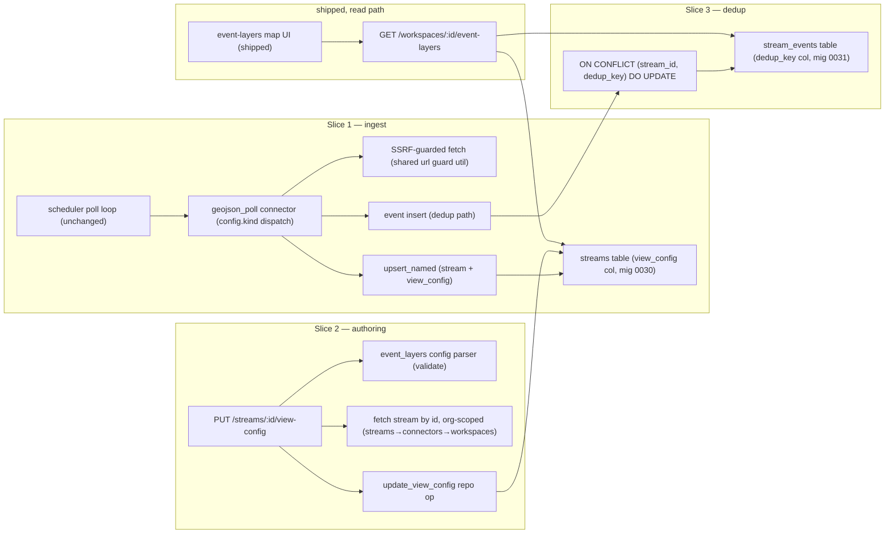

# Design: Generic `geojson_poll` / JSON-URL Connector

**Status:** Ready for `/implement`
**Date:** 2026-05-28
**Layers:** `db`, `api` (no new UI — the shipped event-layers UI renders any stream that carries a `view_config`)
**Backlog item:** P1 [Epicenter], `md/plans/infrastructure-backlog.md`

---

## Problem statement

Every external data source IONe ingests today is a hand-coded Rust connector (NWS, FIRMS, IRWIN are each a separate file). The work they repeat — HTTP poll, dedup, type-filter, field remap, write to `stream_events` — is identical. Adding a new feed (USGS earthquakes for the Epicenter demo) means writing, testing, and maintaining yet another module for a pattern already implemented three times.

This is the difference between a substrate that *hosts* data apps and one that requires a code change per feed. The just-shipped event-point-layer (map circles from `stream_events`) has **no live data to render** until a feed is ingested, and the only path to that today is bespoke Rust. The Epicenter demo — IONe's clearest end-to-end proof (ingest → rules → signals → map) — is blocked on it.

A config-driven connector converts a 1–2 day Rust task into a 30-minute config entry and generalizes directly to the other reference apps (TerraYield USDA/NASS GeoJSON, GroundPulse OPERA JSON metadata).

## Audience

The Morton developer standing up a domain app on IONe who needs to ingest a third-party JSON/GeoJSON feed without writing a connector. Concretely: whoever builds the Epicenter seismic demo this cycle, and the next client whose state sensor feed is a static GeoJSON URL.

---

## Verified premises (live-tested 2026-05-28)

| Premise | How verified | Result |
|---|---|---|
| Connectors dispatch on `config["kind"]` under `rust_native`, no enum value needed | Read `src/connectors/mod.rs:89-92` | VERIFIED ✓ — `geojson_poll` is a `config.kind` string, **no `ALTER TYPE` migration** |
| `stream_events` dedup is `UNIQUE(stream_id, observed_at)` only | Read `migrations/0003_connectors.sql:33` | VERIFIED ✓ |
| `streams.view_config` already exists | Migration 0030 | VERIFIED ✓ — PUT endpoint needs no storage migration |
| `upsert_named` RETURNING omits `view_config` | Read `src/repos/stream_repo.rs:28` | VERIFIED ✓ — latent bug, fixed in this design |
| USGS feed is a FeatureCollection with a stable natural key | `curl` of `4.5_day.geojson` | VERIFIED ✓ — top-level `id` (`us7000sp4x`), unique per event |
| USGS timestamp format | same curl | VERIFIED ✓ — `properties.time` is **epoch milliseconds**, not RFC3339 |

The epoch-ms finding is decisive: the existing OpenAPI connector assumes RFC3339 timestamps and would silently fail on USGS. The connector must support epoch-ms natively.

---

## Resolved design decisions

These were open questions from scoping; resolved here so `/implement` does not re-litigate them.

1. **SSRF URL guard → shared utility, hardened.** The guard logic (currently private to the OpenAPI connector) is extracted to a shared util and used by both connectors. Duplicating it is an immediate DRY violation on security-critical code. The extraction is **not** verbatim — the current guard has two gaps that matter for an operator-supplied persistent polling URL, fixed during extraction:
   - **`https` skips the host check entirely**, so `https://<any-private-or-link-local-host>` is allowed; and the `http` path *allows* link-local. Cloud metadata (`169.254.169.254`, and the IPv6 `fd00:ec2::254`) is always link-local. Fix: block **all** IPv4 link-local (`169.254.0.0/16`) and IPv6 link-local (`fe80::/10`) for **every** scheme, in addition to the existing exact-metadata-IP block. On-prem private-IP peers over http/https remain allowed (no legitimate feed is link-local), so OpenAPI behavior is unchanged except for the link-local tightening — which is desirable for it too.
   - **The validate path follows redirects and has no size cap** (it uses the shared `short_client`). A benign URL can 302 to the metadata endpoint. Fix: validate and poll both use redirects-disabled + the 2 MiB response cap.
2. **Auth → auth-less v1.** USGS, NOAA, and OpenAQ feeds are public HTTPS. The connector ships with no auth support in v1; the `AuthConfig` lift is deferred until the first connector targeting a keyed feed lands. Keeps scope at "small."
3. **`view_config` round-trip → extend the `Stream` shape and fix the RETURNING bug.** The connector-created path and the PUT endpoint both return the persisted `view_config`. This fixes the confirmed latent bug rather than working around it.
4. **Dedup → natural-key upsert.** A new nullable `dedup_key` enables `ON CONFLICT … DO UPDATE` on the feed's `id`. Because USGS re-serves the same events every poll and revises magnitude in place, `DO UPDATE` (not `DO NOTHING`) is correct: re-ingesting is idempotent and captures revisions. The existing timestamp path is untouched for connectors that set no dedup key.

---

## Feature slices

### Slice 1 — Config-driven GeoJSON/JSON ingest

One config entry ingests a feed; no Rust per source.

- **DB:** No schema change for the connector itself — config lives in `connectors.config` (JSONB). Writes events through the new dedup path (Slice 3).
- **API:** No new HTTP endpoint. Uses the existing connector create / validate / poll routes. The connector implements the existing `ConnectorImpl` contract and is driven by the existing scheduler with **zero scheduler changes**. Dispatched by `config.kind = "geojson_poll"`.
- **UI:** None new. A `geojson_poll` stream that carries a `view_config` renders on the already-shipped event-layers map.
- **Cross-reference:** The connector writes `view_config` **once, at connector creation** via `default_streams()` → `upsert_named` (the same path the OpenAPI connector uses); the event-layers endpoint (`GET /workspaces/:id/event-layers`, shipped) reads it to render circles. The scheduler's poll loop only inserts events — it does **not** re-call `upsert_named` — so `view_config` is not re-asserted on each poll. (Earlier drafts claimed per-poll re-assertion; that was never wired and is dropped. To change a stream's render config after creation, use the Slice 2 PUT endpoint or re-create the connector.)

The connector config (all fields inside `connectors.config`):

| Field | Type | Required | Purpose | Validation |
|---|---|---|---|---|
| `kind` | string | yes | Dispatch key — `"geojson_poll"` | exact match |
| `feed_url` | string | yes | GeoJSON/JSON endpoint to poll | Hardened SSRF guard (see below); ≤2048 chars |
| `stream_name` | string | yes | Name of the stream to upsert | non-empty, ≤255 chars |
| `items_pointer` | string | no | JSON Pointer to the feature array; default `/features` | valid JSON Pointer; must resolve to an array at poll time |
| `observed_at_pointer` | string | conditional | Pointer to each feature's timestamp | valid JSON Pointer; **must be present at config-create time** unless `observed_at_format=none`; absence with any other format is a 422 validation error |
| `observed_at_format` | enum | yes | `rfc3339` \| `epoch_ms` \| `epoch_s` \| `none` (use ingestion time) | one of the four |
| `dedup_pointer` | string | no | Pointer to a stable natural key (USGS: `/id`); enables `DO UPDATE` dedup | valid JSON Pointer if present. At poll time the resolved value must be a **non-empty string ≤512 chars** (no scalar coercion in v1); a feature whose value is missing/empty/non-string/oversized is **skipped with a warning** — never silently downgraded to the `observed_at` path |
| `type_filter` | object | no | `{ pointer, allow[] }` — emit only features whose value at `pointer` is in `allow` | all-or-nothing: both sub-fields or neither; `pointer` valid; `allow` non-empty strings |
| `max_items` | integer | no | Cap features per poll (applied before type-filter) | 1–10000 |
| `view_config` | object | no | Authoritative map-render config, re-asserted each poll | validated by the same `event_layers` config parser; 422 on bad shape |
| `timeout_ms` | integer | no | Fetch timeout; default 15000 | 1–30000 |

Reference USGS config:

```
kind=geojson_poll, feed_url=.../summary/all_hour.geojson, items_pointer=/features,
observed_at_pointer=/properties/time, observed_at_format=epoch_ms, dedup_pointer=/id,
type_filter={pointer:/properties/type, allow:[earthquake]},
view_config={lon_pointer:/geometry/coordinates/0, lat_pointer:/geometry/coordinates/1,
             property_fields:[{pointer:/properties/mag, name:magnitude}]}
```

### Slice 2 — Runtime `view_config` authoring

Set a stream's map-render config without re-creating its connector.

- **DB:** No migration (column exists). New repo operations: org-scoped fetch-by-stream-id and `view_config` update; corrected RETURNING on the upsert path.
- **API:** `PUT /api/v1/streams/:id/view-config` — validate body with the event-layers config parser, then persist.
- **UI:** None. The written config feeds the existing event-layers map.
- **Cross-reference:** This endpoint is the authoring path for any stream — those with no connector-side config (NWS, Slack) and `geojson_poll` streams alike. Because the poll loop does not re-assert `view_config` (see Slice 1), a manual PUT **persists** and is not overwritten by subsequent polls. The connector's inline `view_config` is only the creation-time default.

### Slice 3 — Natural-key deduplication

Idempotent re-ingestion of rolling-window feeds.

- **DB:** Migration `0031_stream_events_dedup_key.sql` — add nullable `dedup_key TEXT` + partial unique index `(stream_id, dedup_key) WHERE dedup_key IS NOT NULL`. Additive, no backfill (existing rows NULL).
- **API:** New event-insert path: `ON CONFLICT (stream_id, dedup_key) WHERE dedup_key IS NOT NULL DO UPDATE` (updates `payload`, `observed_at`). Connectors that set no dedup key keep the existing `ON CONFLICT (stream_id, observed_at) DO NOTHING` path.
- **UI:** None.
- **Cross-reference:** Slice 1's connector extracts `dedup_pointer` → `dedup_key` and routes to this path; all existing connectors are unaffected.

---

## API Contracts

| Endpoint | Method | Request Schema | Response Schema | Error Codes | Auth |
|----------|--------|----------------|-----------------|-------------|------|
| `/api/v1/streams/:id/view-config` | PUT | body = the `view_config` object directly (min: `lon_pointer: string`, `lat_pointer: string`; optional `property_fields[]`, `style`, `attribution`) | `{ id: UUID, view_config: object }` | 400 (malformed JSON), 401 (no session), 404 (stream not found OR its connector's workspace not in caller's org), 422 (view_config fails the event-layers parser) | Session/Bearer + org-scoped via stream→connector→workspace→org_id |

The connector adds **no** new HTTP endpoints — it is created, validated, and polled through the existing connector routes.

Semantics: full replace (not merge); idempotent for a fixed body. 404 is returned identically for "not found" and "wrong org" to avoid an existence oracle. On success the handler emits a workspace-scoped audit event (`verb=stream.view_config.updated`, `object_kind=stream`, `object_id=:id`, actor from the auth context, payload carrying the old/new config hashes) via the existing `AuditEventRepo`.

**Pre-existing cross-org gap fixed alongside this feature.** `GET /api/v1/connectors/:id/streams` (`list_streams`) and `POST /api/v1/streams/:id/poll` (`poll_stream`) currently take only an id with no `AuthContext` or org check. Adding `view_config` to the serialized stream (this design) would widen the `list_streams` leak, and the connector makes `poll_stream` trigger arbitrary outbound fetches. Both are made org-scoped as part of this work (see AC-14); they are not new endpoints but they are touched/worsened by this feature, so the fix is in scope.

---

## Wiring Dependency Graph



Every UI-reachable node terminates at a DB table. The only UI is the already-shipped event-layers map, which reads via the shipped `event-layers` endpoint.

---

## Poll-cycle flow

1. Re-validate `feed_url` through the shared SSRF guard (config may have been edited directly in DB).
2. HTTP GET with redirects disabled, `timeout_ms` cap, 2 MiB response ceiling, polite `User-Agent`.
3. Parse JSON; bail on non-2xx, oversize, or parse error (scheduler marks the poll failed).
4. Resolve `items_pointer` (default `/features`) to the feature array; truncate to `max_items`.
5. Per feature:
   a. **Type filter** — if configured and the value at `type_filter.pointer` is absent or not in `allow`, skip the feature (not an error).
   b. **Timestamp** — resolve `observed_at_pointer` per `observed_at_format`: `rfc3339` parse; `epoch_ms`/`epoch_s` integer→`DateTime`; `none`→ingestion time. On parse failure (for the non-`none` formats), skip the feature with a warning — never fail the whole poll.
   c. **Dedup key** — if `dedup_pointer` is **not configured**: use the legacy `observed_at` `DO NOTHING` path. If configured: resolve it; a non-empty string ≤512 chars routes to the `DO UPDATE` path; anything else (missing/empty/non-string/oversized) **skips the feature with a warning** (does not fall back).
   d. **Write** the event (full feature retained in `payload`, plus the connector/stream/observed_at envelope). The insert reports `Inserted | Updated | Duplicate`; only `Inserted` increments the poll's "new events" count so a recurring feed does not report fresh ingestion every cycle.

---

## Acceptance criteria

- **AC-1 (ingest happy path).** Given a `geojson_poll` connector configured for the USGS `all_hour` feed, when the scheduler polls, then `stream_events` for that stream contains ≥1 row whose `payload` carries `mag` and coordinates and whose `dedup_key` equals the feature's USGS `id`. *Verify:* poll, then `SELECT count(*) FROM stream_events WHERE stream_id=$s` > 0 and `dedup_key` non-null.
- **AC-2 (epoch-ms timestamp).** Given `observed_at_format=epoch_ms` and a feature with `properties.time=1779991039445`, when ingested, then the row's `observed_at` equals `2026-05-28T17:57:19Z` (the epoch-ms converted to UTC), not NULL and not the ingestion time. *Verify:* assert the stored `observed_at` matches the converted value within 1s.
- **AC-3 (natural-key dedup is idempotent).** Given a fixture feed served twice with the same feature `id` but a changed `mag`, when polled twice, then `stream_events` has exactly one row for that `id` and its `payload.mag` reflects the second value. *Verify:* `SELECT count(*)=1` for the dedup_key and `payload->>'mag'` equals the updated value.
- **AC-4 (type filter).** Given `type_filter={pointer:/properties/type, allow:[earthquake]}` and a fixture containing one `earthquake` and one `quarry blast`, when polled, then exactly one event is written. *Verify:* `count(*)=1`.
- **AC-5 (config-not-code generality).** Given a second, structurally distinct GeoJSON fixture wired only by a new config entry, when polled, then it ingests with mapped fields populated and the git diff contains no new connector Rust file. *Verify:* integration test + diff inspection.
- **AC-6 (SSRF guard, hardened matrix).** The guard rejects each of the following at the connector create route with 422 and inserts no `connectors` row: (a) `http://169.254.169.254/latest/meta-data`; (b) `https://169.254.169.254/` (https must not bypass the host check); (c) a non-metadata IPv4 link-local `http://169.254.10.10/`; (d) an IPv6 link-local `http://[fe80::1]/`; (e) a `feed_url` that returns a 302 redirect to `http://169.254.169.254/` is rejected at validate/poll time (redirects disabled). *Verify:* one parametrized test per case asserts 422 + `SELECT count(*) FROM connectors WHERE config->>'feed_url'=...` = 0; the redirect case asserts the poll/validate errors rather than fetching the target.
- **AC-11 (end-to-end map render).** Given a `geojson_poll` connector with the USGS fixture and a `view_config` mapping `lon/lat`, when it is polled and then `GET /api/v1/workspaces/:id/event-layers` is called, then the response contains a point feature whose coordinates equal the fixture's `geometry.coordinates` and whose properties include the mapped `magnitude`. *Verify:* integration test polls, then asserts the event-layers GeoJSON feature's coordinates and `magnitude`.
- **AC-12 (manual PUT survives poll).** Given a `geojson_poll` stream, when `PUT /streams/:id/view-config` sets a custom config and the connector is then polled, then a subsequent read of `streams.view_config` still equals the PUT body (the poll does not overwrite it). *Verify:* PUT, poll, assert DB `view_config` unchanged.
- **AC-13 (dedup_key edge cases).** Given `dedup_pointer=/id` and a fixture with three features — one valid `id`, one with `id` absent, one with `id: ""` — when polled, then only the valid feature is written and the two invalid ones are skipped (count = 1; a warning is logged). *Verify:* `count(*)=1` for that stream after poll.
- **AC-14 (cross-org stream routes).** Given a stream whose connector's workspace belongs to org A: when org B calls `GET /api/v1/connectors/:id/streams` it does not receive that stream, and when org B calls `POST /api/v1/streams/:id/poll` the response is 404 and no external fetch or event write occurs. *Verify:* cross-org list omits the stream; cross-org manual poll returns 404 and `stream_events` count is unchanged.
- **AC-7 (view-config validation).** Given `PUT /api/v1/streams/:id/view-config` with a body missing `lat_pointer`, when called, then the response is 422 and the stream's stored `view_config` is unchanged. *Verify:* assert 422 + DB unchanged.
- **AC-8 (view-config round-trip).** Given a stream with no view_config, when a valid config is PUT, then the PUT response body contains `view_config` equal to the request body verbatim, and a subsequent `SELECT view_config FROM streams WHERE id=$id` returns the same JSON. *Verify:* assert PUT response `view_config` equals request body; assert DB row equals request body.
- **AC-9 (org scoping).** Given a stream whose connector's workspace belongs to org A, when org B calls PUT on it, then the response is 404 and the config is unchanged. *Verify:* cross-org request returns 404.
- **AC-10 (RETURNING fix).** Given the upsert path writes a `view_config`, when the returned stream is inspected, then its `view_config` is the written value, not null. *Verify:* assert the returned struct carries the config.

---

## Tradeoffs

- **`config.kind` dispatch vs. a new `connector_kind` enum value.** Chosen: `config.kind` under `rust_native`, matching every existing native connector. Avoids a non-transactional `ALTER TYPE` migration and is consistent with the codebase. The enum value buys nothing here.
- **`dedup_key` column vs. `observed_at`-only dedup.** Chosen: the column. `observed_at`-only would *appear* to work for USGS (timestamps are unique per event in the snapshot) but silently drops in-place magnitude revisions and is fragile for any feed with coarse or colliding timestamps. The migration is two additive DDL lines.
- **Auth-less v1 vs. lifting `AuthConfig` now.** Chosen: auth-less. The demand (USGS) is public; lifting `AuthConfig` is a refactor with no v1 payoff. Deferred behind the first keyed-feed connector.
- **Connector-owned `view_config` vs. PUT-owned.** Chosen: connector-owned for `geojson_poll`; PUT is the authoring path for connector-less streams. A single ownership rule per stream avoids the "poll overwrites my edit" surprise — documented explicitly.

## Diagrams — connector lifecycle

```
create connector (config.kind=geojson_poll) ──▶ validate (SSRF + pointers + view_config parse)
        │                                                      │ 422 on bad config
        ▼                                                      ▼
   scheduler tick ──▶ poll ──▶ fetch ──▶ filter ──▶ map ──▶ upsert events (dedup_key DO UPDATE)
        ▲                                                      │
        └──────────────── re-assert view_config each poll ◀────┘
```

---

## Open questions

None block implementation. One forward-looking note:

- **Incremental cursor.** v1 polls full-replace each cycle; the `dedup_key` upsert makes that idempotent and cheap at feed sizes seen (USGS ≤ a few thousand features). A cursor (only fetch events newer than the last seen) is a v1.1 optimization if a high-volume feed appears. Recorded, not scoped.

---

## Commercial linkage

IONe is OSS-core, self-hosted, no billing tier — this ships unconditionally in core. Buyer-visible outcome: the Epicenter demo shows **live** USGS seismic points filtered by the rules engine, the end-to-end substrate proof (ingest → rules → signals → map). The same connector serves TerraYield (USDA/NASS GeoJSON) and GroundPulse (OPERA JSON) with config only — the "generalizes across the reference apps" test from the substrate thesis.

## Requirements impact

- **`md/design/app-integration-playbook.md`** — add `geojson_poll` to the connector catalog (currently lists MCP / OpenAPI / hand-wired). Document the config schema and the `observed_at_format` options.
- **`md/design/openapi-connectors.md`** — if it documents the SSRF guard or `AuthConfig` as OpenAPI-internal, note their extraction to a shared util.
- **`md/plans/infrastructure-backlog.md`** — on ship, move the P1 `geojson_poll` item and the carried-forward "runtime view_config authoring surface" to done; the rules-engine nested-field verification remains a separate open item.

---

## Devil's Advocate

**1. Load-bearing assumption.** That a *config-driven, JSON-pointer field-mapping* connector is expressive enough to ingest the feeds IONe actually needs — i.e. that real feeds reduce to "fetch a URL, point at an array, map fields by pointer, filter by a value." If feeds routinely need per-record transforms (WKT geometry, unit conversion, multi-array joins, pagination), the config surface either can't express them or grows into a DSL, and we're back to writing code — just in YAML instead of Rust.

**2. Verified against live state?** Partially, and the part that matters is verified. I `curl`ed the real USGS `4.5_day.geojson` feed: it is a flat FeatureCollection where every field Epicenter needs (`id`, `properties.time`, `properties.mag`, `properties.type`, `geometry.coordinates`) is reachable by a single JSON Pointer — no transform required. **Result: VERIFIED ✓** for the v1 demand signal. The *generalization* claim (TerraYield/GroundPulse feeds fit the same shape) is NOT yet tested against those live feeds — but it is not load-bearing for shipping v1, and the design explicitly scopes anything outside simple pointer-mapping to "write a custom connector" rather than expanding the config surface. That boundary is the mitigation: the connector handles the verified-simple case fully and declines the rest, so it cannot silently degrade into a DSL.

**3. Simplest alternative that avoids the biggest risk.** Hand-write a `usgs.rs` connector exactly like `firms.rs` — ~1 day, zero new abstraction, guaranteed to fit the feed. It avoids the expressiveness risk entirely. Why the generic connector wins anyway: the per-source cost is incurred *every* engagement (1–3 feeds each), the three existing hand-coded connectors already prove the pattern is stable and worth factoring, and the marginal cost of the generic version over a bespoke `usgs.rs` is small (~1 extra day) because it is a strict subset of the existing OpenAPI connector. The bespoke route would be correct only if we expected exactly one more feed ever; we expect many. The generic connector is the right call *and* the design keeps it from over-reaching by hard-bounding it to pointer-mapping.

**4. Structural completeness checklist**

- [x] Every UI component that calls an API → the only UI (event-layers map) calls `GET /workspaces/:id/event-layers`, which is shipped and out of this scope; the one new endpoint (`PUT view-config`) is in the API Contract Table.
- [x] Every endpoint implies a repo method → PUT implies org-scoped fetch + `update_view_config`; both stated in Slice 2.
- [x] Every new data field appears in all relevant layers → `dedup_key` (DB column mig 0031 → insert path → connector extraction); `view_config` (DB col 0030 → PUT/upsert API → event-layers UI render). `geojson_poll` config fields are connector-internal (DB `connectors.config`), not cross-layer UI fields.
- [x] Every AC maps to an endpoint/observable → each AC names a SQL assertion, a connector poll outcome, or an HTTP status.
- [x] Wiring graph has an unbroken UI→DB path → event-layers map → event-layers endpoint → `stream_events`/`streams`; ingest path scheduler→connector→tables.
- [x] Integration scenarios exercise a full request path → AC-1/AC-3/AC-4 exercise poll→insert→DB; AC-7/AC-8/AC-9 exercise PUT→validate→DB.
