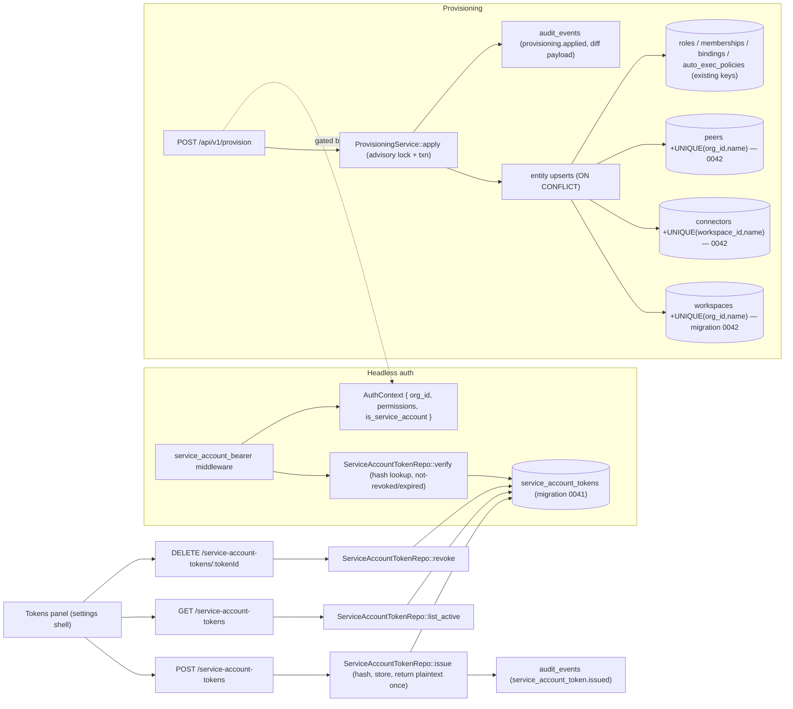

# Headless Provisioning

**Status:** Reviewed (PM + security + sql-architect + devil's advocate + technical-writer passes complete) — ready for `/implement`
**Layers:** `db`, `api`, `ui`
**Demand signals:** DICE §2.4 (`rfp/darpa-dice/abstract-final.md` — "one workspace per mission" at 500–100K agents, provisioned headless by a mission launcher; full proposal due 2026-08-25) · enterprise API-first onboarding / IaC (Path 2, `.claude/rules/path-2-stream-p.md`) · infrastructure backlog P6
**Builds on:** RBAC (`md/design/rbac-scaffolding.md`, merged — permissions, escalation-guard pattern, audit verbs); the existing create endpoints + repos; `bootstrap.rs`'s advisory-lock + transaction pattern.

---

## Problem statement

The individual create endpoints exist and are RBAC-gated (`POST /api/v1/workspaces`, `/connectors`, `/workspaces/:id/bindings`, `/peers`, plus `subscribe_peer`/`authorize_allowlist`). But two structural gaps make headless, at-scale provisioning impossible today:

1. **No machine-client auth.** Every protected route is gated by `auth_middleware`, which builds an `AuthContext` (carrying `org_id`) **only** from an interactive OIDC session cookie ([auth.rs:224-241](src/auth.rs#L224)) or, in local mode, the default user. The MCP bearer path produces a different struct (`OauthContext`, no `org_id`, [mcp_bearer.rs:17](src/middleware/mcp_bearer.rs#L17)) that cannot drive `require_permission`. The only token a machine client can present today is `IONE_OAUTH_STATIC_BEARER` — unscoped, non-expiring, unaudited, and production-reachable. A DICE mission launcher in CI or a Terraform pipeline has no production-safe way to authenticate. **Verified** ([auth.rs:31](src/auth.rs#L31) vs [mcp_bearer.rs:17](src/middleware/mcp_bearer.rs#L17)).

2. **No atomic, idempotent provisioning.** A usable mission workspace is workspace + roles + memberships + connectors + peers + bindings (+ optional auto-exec policies) — six-plus sequential calls with no transaction boundary, no rollback on partial failure, and no idempotency. Re-running (scenario restart, `terraform apply`) duplicates or errors. And idempotency is structurally impossible right now: `workspaces`, `connectors`, and `peers` have **no `(scope, name)` unique constraint** to upsert against (`peers` has only `UNIQUE(mcp_url)`). **Verified** by migration scan.

Both are on the DICE critical path (the mission launcher is the first production consumer) and are the gate to Path 2 ops leverage (stamp out a client workspace per site without manual setup).

## Non-goals

- A Terraform provider — v1 builds the API a provider would call; the provider is a later thin wrapper.
- Destroy/reconcile semantics — provisioning is **merge** (create-if-missing, update-if-present); resources not in the spec are left untouched, never deleted. v2 may add destructive reconcile with per-entity removal audit.
- Cross-org provisioning — a token is single-org; the spec provisions one org's workspace graph.
- Org-resource creation via the spec (creating orgs, trust issuers) — out of scope; tokens are pre-org-scoped.
- Workspace cloning / template inheritance; token-rotation UI (a rotate = issue-new + revoke-old via the API is sufficient).
- Short-lived/refresh-grant tokens — v1 is long-lived tokens + explicit rotation/revocation (DICE operational simplicity); TTL is optional per-token.

---

## Feature slices

### Slice 1 — Service-account tokens + headless auth (the prerequisite)

A machine client authenticates with an org-scoped, permission-carrying, hashed-at-rest token that resolves to a full `AuthContext`.

- **DB:** new `service_account_tokens` table (migration **`0041`**): id, org_id, name (unique per org), `token_hash` (SHA-256 hex of the plaintext — plaintext never stored, shown once), `permissions` JSONB (the org-scoped permission set the token carries — its own grant, not inherited-all), `provisionable_max_coc` (int, caps the coc_level of any role the token may create — the escalation ceiling), created_by, expires_at (nullable), revoked_at (nullable), last_used_at, created_at, updated_at. Org-isolation RLS + GIN on permissions, mirroring existing patterns. Migration 0041 also `ALTER TYPE actor_kind ADD VALUE 'service_account'` (the enum is `user/system/peer` today, migration 0009; the new audit rows need the variant — note `ADD VALUE` cannot run inside a transaction with later use of the value, so it is its own migration step or precedes the inserts). **Seeding:** migration 0041 backfills `["service_accounts:manage","provisioning:apply"]` into `org_memberships.permissions` for any user holding a role with `permissions @> '["admin"]'` in any workspace of the org (mirrors RBAC 0039's `trust_issuers:manage` backfill), and `RoleRepo::upsert` carries these grants forward when it creates an admin role — otherwise no one can call the token endpoints on day 1 (HP blocker).
- **API:** `POST /api/v1/service-account-tokens` (issue — returns plaintext **once** + id), `GET` (list, never returns the hash or plaintext), `DELETE /:tokenId` (revoke = soft-delete). All gated by a new org-scoped permission `service_accounts:manage`. **Issuance escalation guard:** the issued token's `permissions` must be ⊆ the issuer's own permissions and `provisionable_max_coc` ≤ the issuer's effective `MAX(coc_level)` (else 409 `permission_escalation`); a session actor holding `admin` is exempt, a service-account issuer is **never** exempt. A new auth path (`service_account_bearer`) verifies `Authorization: Bearer ione_sat_…`: SHA-256 the value, look up by `token_hash` where not-revoked and not-expired, build the synthetic `AuthContext` (see below); fail-closed (unknown/expired/revoked → 401). **RBAC-helper change (load-bearing, in this slice):** `require_permission` and `require_org_permission` ([auth.rs](src/auth.rs)) must check `ctx.is_service_account` first — if true, check `permission ∈ ctx.permissions` directly and skip the membership-join query (whose synthetic `user_id` would otherwise return empty → 403 on every endpoint). **MFA gate:** `mfa_gate` ([routes/mod.rs](src/routes/mod.rs)) must pass through without TOTP when `ctx.is_service_account` is true. The `IONE_OAUTH_STATIC_BEARER` path is compile-guarded out of production builds and logs a warning when used (closes HP-C2). State-changing requests are audited by **the endpoint's own** audit event (e.g. `provisioning.applied`) written with `actor_kind = service_account`, `actor_ref = token id` — the bearer middleware emits no extra per-call row; issuance and revocation each write their own row (`service_account_token.issued` / `.revoked`).
- **Synthetic `AuthContext` for a service account:** `user_id = Uuid::nil()`, `org_id` = token's org, `is_oidc = false`, `is_mcp_peer = false`, `active_role_id = None`, `session_id = None`, `mfa_verified = true`; two new fields are added to `AuthContext` — `is_service_account: bool` and `service_account_token_id: Option<Uuid>` (the latter is the `actor_ref` for audit rows when `is_service_account`).
- **UI:** a "Tokens" section in the workspace/org settings shell (mirrors the roles/policies panels): list active tokens (name, permissions, last-used, expiry), a create form that surfaces the plaintext **once** in a copy-once modal, and a revoke control. Visible only to `service_accounts:manage` holders (probe-and-hide).
- **Cross-reference:** `TokensPanel` → the three token endpoints → `ServiceAccountTokenRepo` → `service_account_tokens` table; `service_account_bearer` middleware → `ServiceAccountTokenRepo::verify` → same table.

### Slice 2 — Idempotency constraints + connector-gate fix (prerequisite for Slice 3)

Add the unique constraints upsert requires, and close the one composing-endpoint authz gap.

- **DB:** migration **`0042`** adds `UNIQUE(org_id, name)` on `workspaces`, `UNIQUE(workspace_id, name)` on `connectors`, `UNIQUE(org_id, name)` on `peers` (coexists with the existing `UNIQUE(mcp_url)`). **Preflight:** each `ADD CONSTRAINT` fails if duplicates exist; the migration is preceded by a documented dedup check (dev/test DBs from bootstrap have none). Reversible via `DROP CONSTRAINT`.
- **API:** `create_connector` ([connectors.rs](src/routes/connectors.rs)) gains the missing `require_permission(…, workspace_id, "workspace:write")` after its `ensure_workspace_in_org` (HP-H1; `patch_workspace` already does this — `create_connector` is the inconsistent one). No shape change.
- **UI:** none.
- **Cross-reference:** the new constraints are the `ON CONFLICT` targets Slice 3's upserts bind to; the connector gate is inherited by Slice 3's connector upsert.

### Slice 3 — Declarative provisioning endpoint

One call applies a workspace spec, transactionally and idempotently.

- **DB:** no new tables. Upserts use Slice 2's constraints (`ON CONFLICT (org_id,name)` / `(workspace_id,name)` / existing keys for roles, bindings, streams, auto-exec policies). The whole apply runs in one transaction under `pg_advisory_xact_lock(hashtext('ione_provision'), hashtext(org_id))` — serializes concurrent re-applies of the same org's spec, parallel across orgs. Each upsert is `ON CONFLICT … DO UPDATE … WHERE (existing.* IS DISTINCT FROM EXCLUDED.*)` so a no-change re-apply does not advance the row; `created` (conflict didn't fire), `updated` (conflict fired and the DISTINCT-FROM update ran), and `unchanged` (conflict fired, update skipped) are the three diff buckets — `unchanged_count` is the third.
- **API:** `POST /api/v1/provision` (org-scoped, **not** under a workspace path) takes a spec: `{ version:"v1", workspace:{name,domain?,lifecycle?,metadata?}, roles:[{name,coc_level,permissions}], connectors:[{name,kind,config}], peers?:[{name,mcp_url,issuer?,sharing_policy?}], bindings?:[{peer_name,scope?}], auto_exec_policies?:[…] }`. Gated by a new org-scoped permission `provisioning:apply`, which is the **consolidated grant** for headless workspace-graph construction: a holder may provision all spec entity types (workspaces, connectors, peers, roles, bindings) without separately holding the per-resource permissions (`peers:manage`, `workspace:write`). **Merge semantics** (never deletes unlisted resources). **Escalation guard (token-as-actor):** every role the spec creates must have `permissions ⊆ the actor's permissions` and `coc_level ≤ provisionable_max_coc` (else 409 `permission_escalation`) — closes HP-H2; a service-account actor is never exempt. **Creator-membership (unconditional):** the provisioning principal is always granted a membership in the (created or existing) workspace on a synthesized role capped at the actor's own permissions, so the actor can manage what it provisioned without a separate manual grant (no opt-in flag). Connector configs in the spec are **never** written to the audit payload. One summary `audit_events` row per run: verb `provisioning.applied`, `actor_ref` = token id, payload `{ spec_name, created:[…], updated:[…], unchanged_count, duration_ms }` (no secrets). Partial failure → full transaction rollback, 422/409 with the failing entity named, nothing persisted.
- **UI:** none (API-first; the spec is authored in CI/IaC, not the shell).
- **Cross-reference:** `POST /api/v1/provision` → `ProvisioningService::apply` → entity upserts across `WorkspaceRepo`/`RoleRepo`/`ConnectorRepo`/`PeerRepo`/binding/policy repos → the constrained tables + one `audit_events` row.

---

## API contracts

| Endpoint | Method | Request schema | Response schema | Error codes | Auth |
|---|---|---|---|---|---|
| `/api/v1/service-account-tokens` | POST | `{ name:string, permissions:string[], provisionable_max_coc:int, expires_at?:ISO8601 }` | `{ id:UUID, token:string (plaintext, shown once), name, permissions, provisionable_max_coc, expires_at }` | 400, 401, 403, 409, 422 | Session/SA + `service_accounts:manage` + escalation guard |
| `/api/v1/service-account-tokens` | GET | — | `{ items:[{ id, name, permissions, provisionable_max_coc, last_used_at, expires_at, revoked_at, created_at, created_by }] }` (no hash/plaintext) | 401, 403 | Session/SA + `service_accounts:manage` |
| `/api/v1/service-account-tokens/:tokenId` | DELETE | — | `204 No Content` | 401, 403, 404 | Session/SA + `service_accounts:manage` |
| `/api/v1/provision` | POST | `{ version:"v1", workspace:{name,domain?,lifecycle?,metadata?}, roles:[{name,coc_level,permissions:string[]}], connectors:[{name,kind,config:object}], peers?:[{name,mcp_url,issuer?,sharing_policy?}], bindings?:[{peer_name,scope?}], auto_exec_policies?:[…] }` | `{ workspace_id:UUID, created:[{kind,id,name}], updated:[{kind,id,name,changed_fields:string[]}], unchanged_count:int }` | 400, 401, 403, 409, 422 | Session/SA + `provisioning:apply` + escalation guard |

**Permission-vocabulary extension:** two new **org-scoped** permissions (held in `org_memberships` for users, or in a token's `permissions`): `service_accounts:manage`, `provisioning:apply`. Both validated against the closed vocabulary at write time. `admin` short-circuits workspace checks but is **not** an org grant (an org-scoped permission must be explicitly held), consistent with RBAC.

**Contract rules:** token `permissions` and any provisioned role's `permissions` must be members of the closed RBAC vocabulary **and** ⊆ the actor's own permissions (409 `permission_escalation`; for a session actor, `admin` is exempt; a token is never exempt — it can only confer what it holds). `provisionable_max_coc` caps every provisioned role's `coc_level`. **Idempotency keys:** workspace and peer match on `(org_id, name)`; connector and auto-exec policy match on `(workspace_id, name)`; **roles match on `(workspace_id, name)`** and their `coc_level` and `permissions` are updated to the spec's values on every apply (same name → one row, mutated; the `roles` table's `(workspace_id,name,coc_level)` key is not used for spec matching). The provision response is identical for create vs already-exists-in-your-org and never reveals another org's name collision (closes HP-M5). A holder of `provisioning:apply` provisions all entity types without the per-resource permissions. The plaintext token is returned **only** by POST, **once**.

## Wiring dependency graph

## Tradeoffs

| Decision | Alternative | Why this wins |
|---|---|---|
| Token carries its own `permissions` JSONB + resolves to a synthetic `AuthContext` | Back the token with a real `users` row + `org_memberships` | A fake user pollutes membership/role tables and the audit `actor_kind`; a self-describing token with a dedicated `is_service_account` principal is cleaner and the RBAC helpers short-circuit on `ctx.permissions` with one line each. |
| `provisionable_max_coc` + permission-subset escalation guard on the token | Trust the token's `provisioning:apply` and let it grant any role | A token that can provision could otherwise bootstrap an admin island in a freshly-created workspace (no memberships → escalation guard measures empty → unconstrained). The cap binds the blast radius at issuance (HP-H2). |
| Merge semantics (never delete unlisted) | Reconcile-to-spec (destroy unlisted) | Destroy on a live workspace is dangerous and has no v1 consumer; merge is the safe, well-understood idempotent apply. Destroy is a named v2 concern with per-entity audit. |
| One summary `provisioning.applied` audit row + diff payload | One audit row per upserted entity | A declarative apply is one operator intent; N rows is noise. The diff payload carries per-entity detail; per-entity rows return for v2 destroy. |
| Add the three unique constraints (0041) | Application-level "does it exist?" check then insert | A check-then-insert races under concurrent re-apply; a DB unique constraint + `ON CONFLICT` is the only correct idempotency primitive. The constraints are also generally-correct hardening (duplicate workspace names per org are a latent bug today). |
| Two new org-scoped permissions | Reuse `admin` / `trust_issuers:manage` | Provisioning and token-minting are distinct high-blast-radius capabilities that deserve their own grantable, auditable permissions; overloading `admin` removes the ability to issue a least-privilege provisioning token. |

## Acceptance criteria

Each maps to an integration test (new `provisioning_integration.rs`; `spawn_app` per `tests/audit_export_integration.rs`).

1. **Token issuance + headless auth:** Given a `service_accounts:manage` holder, when they POST a token with `permissions:["provisioning:apply","workspace:write","roles:manage"]`, then the response has a one-time `token` starting `ione_sat_`; when that token is presented as `Authorization: Bearer` to `POST /api/v1/provision` with a minimal valid spec, then status is 200 and the response body contains a `workspace_id`.
2. **Token never re-exposed:** Given an issued token, when GET `/service-account-tokens` is called, then no item contains the plaintext or `token_hash`.
3. **Revocation:** Given an issued token, when it is DELETEd and then presented as a bearer, then 401.
4. **Expiry:** Given a token with `expires_at` in the past (fixture), when presented, then 401.
5. **Idempotent apply:** Given a spec, when POST `/api/v1/provision` is called twice, then the first response lists the workspace under `created` and the second lists it under nothing new (`unchanged_count` covers it, zero new rows in `workspaces`/`connectors`/`peers`).
6. **Atomic rollback:** Given a spec whose third connector has an invalid `kind`, when applied, then status is 422 naming that connector and **zero** rows from the spec persist (workspace included).
7. **Escalation guard:** Given a token holding `permissions:["provisioning:apply","workspace:write"]` (not `peers:manage`), when its spec creates a role granting `peers:manage`, then 409 `permission_escalation`; and given a spec role with `coc_level` above the token's `provisionable_max_coc`, then 409.
8. **Creator-membership (unconditional, capped):** Given a token holding `["provisioning:apply","roles:manage"]` (not `admin`) applies a spec creating workspace W, when a subsequent `roles:manage`-gated call on W is made with the same token, then it authorizes (the token received a membership in W capped at its own permissions — no `grant_self_admin` flag needed).
9. **Constraint upsert (Slice 2):** Given two provision applies that change a connector's `config`, then exactly one `connectors` row exists for `(workspace_id,name)` and its config is the second value.
10. **Audit:** Given a successful apply, when the audit trail is queried, then one `provisioning.applied` row exists with `actor_ref` = the token id and a payload listing created/updated entities and **no connector secret values**.
11. **Cross-org idempotency isolation (HP-M5):** Given org A has a workspace named `mission-1`, when an org-B token provisions `mission-1`, then it succeeds in org B and the response never reveals org A's collision; the two workspaces are distinct rows.
12. **UI probe-and-hide:** Given a member without `service_accounts:manage`, when they open settings, then the Tokens section is absent and (verified via the Playwright spec's fetch-route count) no token endpoint is called after the first 403 probe.

## Open questions

1. **Spec schema versioning.** For IaC reuse (a future Terraform wrapper, CI templates), the provision spec should be a versioned JSON schema (`apiVersion`/`version` field) so the contract can evolve without breaking callers. v1 can ship without it, but adding a top-level `version:"v1"` field now is cheap insurance — **recommend including it**; confirm before the contract freezes.
2. **`app.current_org_id` RLS activation (HP-M4, deferred).** The org-isolation RLS policies (broker_credentials, mfa, auto_exec_policies, and the new tokens table) are inert because the app never issues `SET LOCAL app.current_org_id`. Application-layer `WHERE org_id = $1` is the real enforcement. Out of scope here, but the new token table's RLS inherits the same dormancy — named so it isn't mistaken for active defense. Fast-follow.
3. **`audit_events` has no `org_id` column.** Org-level events (token issuance, `provisioning.applied`) carry `workspace_id = NULL` and stash `org_id` in the payload, so they don't appear in workspace-scoped audit queries. A migration adding `org_id` to `audit_events` would fix org-level audit filtering — named follow-up, doesn't block.

## Commercial linkage

The mission launcher is the first production consumer of headless auth + atomic provisioning, on the DICE critical path (§2.4 "one workspace per mission" at scale, Month-3 first-sim milestone). For Path 2, scripted provisioning is the ops-leverage lever: stand up a client workspace per site via `terraform apply`/CI in minutes instead of a 30-minute manual sequence, raising the number of deployments Morton Analytics can operate without proportional headcount. Framed as the integration fabric's provisioning layer — the API a provider calls — never a standalone IaC product.

## Requirements impact

Create `md/requirements/active/headless-provisioning.md` with: the `service_account_tokens` table shape + lifecycle (hashed, shown-once, revoke/expire), the two new org-scoped permissions, the token and provision endpoint contracts, the escalation guard (token-subset + `provisionable_max_coc`), and the merge-semantics + idempotency-key rules. The RBAC requirements doc's permission vocabulary grows by `service_accounts:manage` + `provisioning:apply` (org-scoped) — update it. The audit-export requirements doc gains the `service_account_token.issued/revoked` and `provisioning.applied` verbs.

---

## Devil's Advocate

**1. What assumption, if wrong, invalidates the design?**
Two, both structural: (a) that a service-account token can be made to drive the *same* `AuthContext`/`require_permission` path the RBAC system already enforces — if machine auth can't reuse RBAC, every composed create endpoint is unprotected for tokens; and (b) that the workspace-graph entities have natural keys we can upsert against — without `(scope,name)` uniqueness, idempotent re-apply is impossible and the whole "declarative" premise collapses into check-then-insert races.

**2. Verified against live state?**
(a) `AuthContext` ([auth.rs:31](src/auth.rs#L31)) carries `org_id` and is the type every RBAC helper takes; it's currently built only from a session or default user ([auth.rs:224-241](src/auth.rs#L224)), and the bearer path yields a different `OauthContext` with no `org_id` ([mcp_bearer.rs:17](src/middleware/mcp_bearer.rs#L17)). So a new middleware that constructs a full `AuthContext` from a token is both necessary and sufficient — the helpers need no change beyond a one-line `is_service_account`/permissions short-circuit. **VERIFIED ✓** (the gap is real and the fix is well-scoped). (b) Migration scan: `peers` has only `UNIQUE(mcp_url)`; the `UNIQUE(workspace_id,name)`/`UNIQUE(connector_id,name)` in 0002/0003 are on the *roles* and *streams* tables, not workspaces/connectors. So all three constraints are genuinely absent. **VERIFIED ✓** — migration 0041 is required, and it's the load-bearing prerequisite for Slice 3.

**3. Simplest alternative that avoids the biggest risk?**
Skip the declarative endpoint; ship only Slice 1 (service-account tokens) and let the mission launcher call the existing six create endpoints in sequence with its own retry/idempotency logic. This is genuinely smaller and unblocks DICE's auth need. Why the full design wins: the launcher would have to reimplement transactional rollback and idempotency client-side for every consumer (DICE launcher, Terraform, CI), and without the unique constraints (Slice 2) even client-side idempotency races under concurrent restart. The constraints are needed regardless, and a server-side atomic apply is written once instead of per-consumer. The slices are independently shippable, so the order *is* the minimal path: Slice 1 (auth, unblocks DICE) → Slice 2 (constraints, cheap + generally-correct) → Slice 3 (the apply). Slice 1 can PR alone if the abstract deadline forces a partial ship.

**4. Structural completeness checklist**
- [x] Every UI call (Tokens panel: issue/list/revoke) is in the API contract table.
- [x] Every contract endpoint maps to a repo method (`ServiceAccountTokenRepo` issue/list/revoke/verify; `ProvisioningService::apply` over existing repos); the provision endpoint composes repos, no single new query.
- [x] New fields (`token_hash`, `permissions`, `provisionable_max_coc`, the unique constraints) appear across DB (0041 service_account_tokens, 0042 unique constraints), API (contracts + token/spec shapes), and UI (token list/form). The plaintext token is shown-once, explicitly not persisted. `AuthContext` gains `is_service_account` + `service_account_token_id`.
- [x] Each acceptance criterion names an endpoint + expected status/payload (1–12).
- [x] Wiring graph is unbroken UI → endpoint → repo → table, plus the headless-auth and provisioning subgraphs gated by the synthesized `AuthContext`.
- [x] Integration scenarios cover one full path per slice: AC-1/2/3/4/12 (Slice 1), AC-9 (Slice 2 constraint), AC-5/6/7/8/10/11 (Slice 3).
