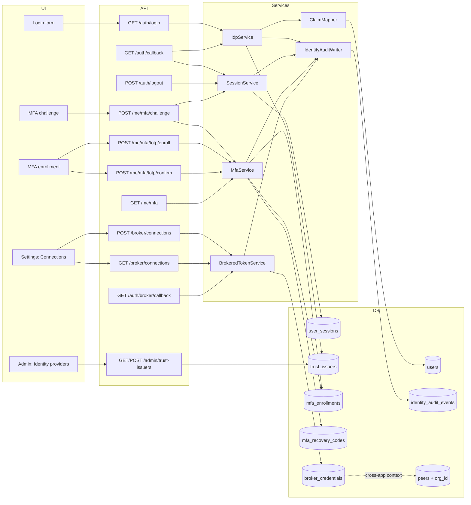

# Identity Broker — Design Doc

**Date:** 2026-05-12
**Status:** Design ready for `/decide` (one open question) then `/implement`.
**Parent:** [md/design/ione-substrate.md](ione-substrate.md) (substrate layer 2)
**Contract reference:** [md/design/app-integration-playbook.md](app-integration-playbook.md) (the surfaces apps expose to the broker)

**Layers:** `db`, `api`, `ui`

## Terminology

- **Operator** — the human actor using IONe (e.g., an analyst at a USDA agency, a field engineer at a pipeline operator).
- **User** — the `users` table row that represents an operator. Throughout this doc, `user_id` in all schemas refers to `users.id`.
- **Session row** — a row in `user_sessions` (DB-backed; revocable).
- **Session cookie** — the HMAC-signed cookie carrying the session row's id over the wire.
- **Trust issuer** — a registered IdP for an org, persisted in the `trust_issuers` table.
- **Broker connection** — a row in `broker_credentials` representing one operator's delegated OAuth credential for one third-party SaaS provider.

## Problem statement

IONe's substrate thesis requires that a single operator authenticate once and have IONe present delegated credentials to every connected client app on the operator's behalf. Without an identity broker layer, every Morton client app remains its own auth island: GroundPulse holds API keys, TerraYield needs SAML to USDA eAuth, bearingLineDash needs QuickBooks OAuth. An operator using all three maintains three credentials, gets no single sign-on, and has no audit trail at the fabric level. There is no "one pane of glass" — there is one shell rendering three login pages.

The broker is not a polish feature; it is the condition under which MCP federation is something other than a demo. The TerraYield engagement (USDA, $400–600K task order) cannot land without it; the federal-AI procurement tailwind (OMB M-25-21 / M-25-22) makes it required for any federal deployment.

Current state ([src/auth.rs](../../src/auth.rs), [src/routes/oauth.rs](../../src/routes/oauth.rs), [src/routes/peers.rs](../../src/routes/peers.rs), [src/services/peer_oauth.rs](../../src/services/peer_oauth.rs)) has: OAuth 2.1 AS for inbound MCP clients (working), outbound OAuth client to peer MCP servers (working, tokens encrypted with `IONE_TOKEN_KEY` via `src/util/token_crypto.rs`), HMAC-signed session cookies (working), and a stub OIDC callback that accepts no real codes. There is no SAML SP, no MFA, no brokered SaaS OAuth, no session revocation surface, and no audit trail for authentication events. A security review during this design pass also surfaced three pre-existing blockers in OAuth/peer code that must be resolved before broker work ships (see Prerequisites).

## Scope decisions settled in this design

| Decision | Choice | Why |
|---|---|---|
| OIDC vs token forwarding | IONe issues its own OAuth 2.1 bearers to peers; never forwards upstream IdP tokens | Consistent with existing peer + MCP-AS patterns; survives upstream IdP outage |
| SAML SP in IONe v0.1 | **No, and no bridge is needed in the default case.** Default IdP target is **Microsoft Entra ID** (OIDC). Federal agencies have standardized on Microsoft SSO; Azure Government + Entra ID hold FedRAMP High P-ATO. For non-Microsoft USDA-adjacent paths, use Login.gov OIDC directly (eAuth was retired 2024-10-01). Keycloak as SAML→OIDC bridge is documented as a fallback for the rare on-prem environment with a SAML-only legacy IdP, not as the default topology. | No federal standard mandates SAML SP placement inside the app binary: NIST SP 800-63C §5.1.4 explicitly recognizes proxied federation; FedRAMP Authorization Boundary Guidance (2021) and Rev 5 baselines (refreshed 2025-12-08) are outcome-not-topology controls; CMMC L2 / 800-171 3.5.x is similarly silent. Rust SAML libraries (`samael` 0.0.x) are unmaintained and would not survive a 3PAO review. OIDC-only matches the API-first, cloud-first posture of the substrate. |
| MFA in v0.1 | TOTP only (`totp-lite`). WebAuthn deferred to v0.2 | TOTP is sufficient for FedRAMP-Moderate trajectory; WebAuthn's `rp_id` binding locks the domain prematurely |
| Brokered SaaS OAuth in v0.1 | Schema + generic OAuth dance ship in v0.1. Provider-specific adapters (QuickBooks, Google Workspace) land per-deployment in v0.2 | Tractable for solo founder velocity; the contract is in v0.1 so apps don't retrofit |
| Multi-tenant identity | Single-tenant default (one org per IONe deployment). `org_id` scoping in code so v0.2 multi-tenant doesn't require rearchitect | Existing codebase has hard-coded `default_user_id` / single-org pattern; full multi-tenant is v0.2+ |
| Session token shape | HMAC-signed opaque cookie (existing) + new `user_sessions` DB row for revocation | Adds revocation propagation without changing the wire format; PASETO/JWT signing-key-rotation is not needed at this scale |
| Brokered token storage | New `broker_credentials` table; AES-256-GCM keyed from `IONE_TOKEN_KEY` (same as existing `src/util/token_crypto.rs`), with byte layout `[1-byte key-version][12-byte nonce][ciphertext+tag]` | Distinct lifecycle from `peers.access_token_ciphertext` (peer-to-peer vs IONe-as-client to SaaS); the key-version prefix enables future zero-downtime rotation. Same byte layout used for `mfa_enrollments.totp_secret_ciphertext` and `trust_issuers.client_secret_ciphertext`. |
| Ciphertext implementation | Extend `src/util/token_crypto.rs` with a versioned variant (`encrypt_versioned`/`decrypt_versioned`) that writes/reads the 1-byte version prefix. Existing un-versioned function remains for legacy `peers.access_token_ciphertext` rows. | Single canonical encrypt/decrypt function across the three new ciphertext columns; legacy rows continue to work. |
| RLS scope | RLS policies on new identity-broker tables only (`broker_credentials`, `mfa_enrollments`, `mfa_recovery_codes`, `user_sessions`, `identity_audit_events`). Retrofit of older tables deferred | Greenfield tables have zero retrofit cost; older tables stay app-layer-scoped until the v0.2 RLS sweep |

## Prerequisites (must land before broker code)

Security review of current HEAD surfaced three blockers in pre-existing code. These are not part of the broker design but must be resolved first — a broker holding federated credentials cannot sit on top of unauthenticated callbacks or fall-through auth.

| ID | Finding | Required fix |
|---|---|---|
| P-1 | Peer OAuth callback `state` parameter is the peer UUID (guessable); callback endpoint is unauthenticated (`src/routes/peers.rs`, `PENDING_FEDERATIONS` in-memory) | Add migration creating `peer_oauth_pending(id UUID PK, peer_id UUID FK, nonce TEXT NOT NULL UNIQUE, code_verifier TEXT NOT NULL, expires_at TIMESTAMPTZ NOT NULL, created_at TIMESTAMPTZ NOT NULL DEFAULT now())`. Generate `nonce` via 32-byte CSPRNG, base64url-encoded. Set `expires_at = now() + 10 minutes`. On `/api/v1/peers/callback`: load row by nonce (constant-time compare via `subtle` crate); reject if `expires_at < now`; delete row on success or failure. |
| P-2 | `auth_middleware` never returns 401 — unauthenticated callers silently become `default_user` (`src/auth.rs:213`, `None` arm of the session lookup match) | Add `enforce_auth` gate that returns 401 when `IONE_AUTH_MODE=oidc` and session is absent; apply to all protected routes |
| P-3 | Wildcard CORS (`allow_origin: Any`) on the entire API surface (`src/routes/mod.rs:160`) | Replace with configured origin allowlist via env var `IONE_CORS_ALLOWED_ORIGINS` (comma-separated); deny by default |

These ship as a separate prerequisite slice (S0) in the implementation plan before any S1–S7 work begins.

## Feature slices

### S1. DB-backed sessions and auth middleware hardening

One-line: replace HMAC-cookie-only sessions with HMAC cookie + revocable DB row, and enforce real 401 on unauthenticated protected requests.

- **DB:** new `user_sessions` table: `id UUID PK`, `user_id UUID FK`, `org_id UUID NOT NULL` (denormalized for RLS; populated by `SessionService::create` by copying `users.org_id` of the session's user at creation), `idp_type TEXT NOT NULL` (`'local' | 'oidc' | 'saml'`), `mfa_verified BOOLEAN NOT NULL DEFAULT false`, `expires_at TIMESTAMPTZ NOT NULL`, `revoked_at TIMESTAMPTZ`, `created_at TIMESTAMPTZ NOT NULL DEFAULT now()`. RLS policy `USING (org_id = current_setting('app.current_org_id')::uuid)`.
- **API:** no new public endpoints. `auth_middleware` gains one DB read per protected request to look up the session row, populate `AuthContext.session_id` and `AuthContext.mfa_verified`, and return 401 if `revoked_at IS NOT NULL` or no row exists.
- **UI:** no new views. Existing login form unchanged. Logout button now triggers server-side revocation.
- **Cross-reference:** `auth_middleware` is the integration point. New `SessionService` owns row lifecycle.

### S2. OIDC consumer (real)

One-line: replace the stub OIDC callback with real `openidconnect` exchange, JWKS validation, and multi-IdP support per org.

- **DB:** `trust_issuers` table already exists ([migration 0008](../../migrations/0008_trust_issuers.sql)) with columns `id, org_id, issuer_url, audience, jwks_uri NOT NULL, claim_mapping`. Migration adds three new columns: `idp_type TEXT NOT NULL DEFAULT 'oidc'`, `max_coc_level INTEGER NOT NULL DEFAULT 100`, `client_secret_ciphertext BYTEA` (versioned-AES-256-GCM via the encryption format defined in the Scope Decisions table; nullable for public clients). `jwks_uri` already exists — do not re-add it.
- **API:** existing `GET /auth/login`, `GET /auth/callback`, `POST /auth/logout` — extend to use `openidconnect` crate, accept `?issuer=` query param to select among registered IdPs, validate ID token (`iss`, `aud`, `nonce`, `exp`, `iat`), enforce `max_coc_level` cap during claim mapping.
- **UI:** login screen gets an IdP picker (or single-IdP redirect if exactly one is registered). No other changes — existing chat shell renders on successful callback.
- **Cross-reference:** `IdpService::exchange_code` is called from `auth_routes::callback`. `ClaimMapper::map_to_user` is extracted from existing inline logic in `src/auth.rs`. Claim mapping output: `(email)` upserts the `users` row; `(role_name, coc_level)` upserts a `roles` row (see [migration 0007](../../migrations/0007_roles_unique_by_name_coclevel.sql)) via `RoleRepo`; the user is bound to the role through the existing `memberships` table.

### S3. TOTP MFA

One-line: enroll TOTP secrets, challenge users post-login when org policy requires it, support one-time recovery codes.

- **DB:** new `mfa_enrollments` table: `id UUID PK`, `user_id UUID FK UNIQUE`, `org_id UUID NOT NULL` (denormalized for RLS), `totp_secret_ciphertext BYTEA NOT NULL` (versioned-AES-256-GCM keyed from `IONE_TOKEN_KEY`; same byte layout as Scope Decisions), `activated_at TIMESTAMPTZ`, `recovery_codes_viewed_at TIMESTAMPTZ`, `created_at TIMESTAMPTZ NOT NULL DEFAULT now()`. New `mfa_recovery_codes` table: `id UUID PK`, `user_id UUID FK`, `org_id UUID NOT NULL`, `code_hash TEXT NOT NULL` (argon2id), `used_at TIMESTAMPTZ` (rows are never deleted; `used_at` is set on consumption), `created_at TIMESTAMPTZ NOT NULL DEFAULT now()`. Both tables RLS-scoped on `org_id`.
- **API:** `GET /api/v1/me/mfa` (status), `POST /api/v1/me/mfa/totp/enroll` (returns TOTP URI + base32 secret), `POST /api/v1/me/mfa/totp/confirm` (first code verification; side effect: sets `user_sessions.mfa_verified = true` for the current session so the operator can immediately view recovery codes), `DELETE /api/v1/me/mfa/totp` (step-up: request body carries current TOTP code, which is verified before deletion; deletes the `mfa_enrollments` row and all `mfa_recovery_codes` rows for the user), `POST /api/v1/me/mfa/challenge` (verify TOTP or recovery code post-login), `GET /api/v1/me/mfa/recovery-codes` (one-time view; 409 if `mfa_enrollments.recovery_codes_viewed_at IS NOT NULL`; otherwise sets that timestamp and returns codes), `POST /api/v1/me/mfa/recovery-codes/consume`.
- **MFA policy (v0.1):** if the user has no `mfa_enrollments` row (TOTP not enrolled), treat `mfa_verified` as `true` for authorization purposes — MFA-gated endpoints succeed. If TOTP is enrolled, the current session's `mfa_verified` must be `true`. An operator-set org flag (`organizations.mfa_required_for_admins BOOLEAN`) can force enrollment for admin role users; non-admin users may opt in but are never forced in v0.1. (Resolves Q2.)
- **UI:** MFA section in profile/settings panel (enroll, view recovery codes once, disable). MFA challenge interstitial after login when `mfa_required` is returned. QR code rendered client-side from `totp_uri`.
- **Cross-reference:** `MfaService` owns secret generation, verification, recovery codes. `AuthContext.mfa_verified` populated from session row by S1. New `AppError::MfaRequired → 403 with body {"error": "mfa_required"}` triggers UI redirect to challenge.

### S4. Trust issuer admin

One-line: operator-level CRUD for the org's registered IdPs.

- **DB:** uses existing `trust_issuers` table (extended in S2). No new tables.
- **API:** `GET /api/v1/admin/trust-issuers`, `POST /api/v1/admin/trust-issuers`, `DELETE /api/v1/admin/trust-issuers/:id`. Requires `is_oidc = true` and admin role.
- **UI:** Admin → Identity providers settings page. Form with: name, idp_type (locked to `oidc` in v0.1), issuer_url, audience (client_id), claim mapping (JSONB blob with email/name/role/coc_level claim names), max_coc_level cap. List view with delete.
- **Cross-reference:** `TrustIssuerRepo` exists ([src/repos/](../../src/repos/)) — add `find_by_id`, `delete`. List endpoint hides `client_secret_ciphertext` from response.

### S5. Brokered SaaS OAuth (generic flow + schema)

One-line: IONe holds delegated OAuth tokens per `(user, provider)` and presents them when invoking apps that need third-party SaaS access.

- **DB:** new `broker_credentials` table: `id UUID PK`, `user_id UUID FK`, `org_id UUID NOT NULL` (RLS), `provider TEXT NOT NULL`, `label TEXT`, `scopes TEXT[] NOT NULL DEFAULT '{}'`, `access_token_ciphertext BYTEA` (versioned-AES-256-GCM per Scope Decisions), `refresh_token_ciphertext BYTEA` (same), `token_expires_at TIMESTAMPTZ`, `state_token TEXT` (random 32-byte base64url; cleared after callback), `code_verifier TEXT` (PKCE verifier; cleared after callback), `state_expires_at TIMESTAMPTZ` (state_token TTL; 10 minutes), `created_at TIMESTAMPTZ NOT NULL DEFAULT now()`, `UNIQUE (user_id, provider)`. RLS scoped on `org_id`. Closes H-4 (versioned key prefix).
- **API:** `POST /api/v1/broker/connections` (begin OAuth dance, returns `authorize_url`), `GET /api/v1/broker/connections` (list user's connections), `DELETE /api/v1/broker/connections/:id` (revoke; attempts upstream revocation via the provider's token revocation endpoint if registered in the provider registry — failure to revoke upstream is logged as an audit event but does not block deletion of the local row), `GET /auth/broker/callback?code=&state=` (public callback; `state` is the `broker_credentials.state_token` random nonce — NOT the row id — looked up by `state_token` and validated against `state_expires_at`), `POST /api/v1/broker/connections/:id/refresh` (manual refresh).
- **UI:** Connections section in profile/settings panel. List of connected providers with "Connect" button per provider type (rendered from a v0.1 hardcoded provider registry — generic, no QuickBooks/Google specifics yet). Disconnect button per connection.
- **Cross-reference:** `BrokeredTokenService` owns the dance and the encryption envelope. v0.1 ships **generic** flow only — operator supplies authorize_url, token_url, scopes in the provider registry config. QuickBooks/Google provider-specific adapters (scope mappings, vendor-specific token semantics, refresh quirks) defer to v0.2 per-deployment.

### S6. Identity audit events

One-line: append-only audit row for every authentication event; FedRAMP-trajectory AU-2/AU-3/AU-12 baseline.

- **DB:** new `identity_audit_events` table: `id UUID PK`, `occurred_at TIMESTAMPTZ NOT NULL DEFAULT now()`, `event_type TEXT NOT NULL` (e.g. `'oidc_login' | 'oidc_login_failure' | 'logout' | 'mfa_enroll' | 'mfa_verify' | 'mfa_fail' | 'mfa_disable' | 'token_broker_grant' | 'token_broker_refresh' | 'token_broker_revoke' | 'session_revoke'`), `org_id UUID NOT NULL REFERENCES organizations(id)`, `user_id UUID REFERENCES users(id) ON DELETE SET NULL`, `actor_ip INET`, `session_id UUID REFERENCES user_sessions(id) ON DELETE SET NULL` (UUID to match `user_sessions.id`; ON DELETE SET NULL preserves the audit row past session row cleanup), `peer_id UUID REFERENCES peers(id) ON DELETE SET NULL`, `outcome TEXT NOT NULL` (`'success' | 'failure' | 'denied'`), `detail JSONB` (never contains raw token material — only `client_id`, scope list, failure reason, IdP issuer name). Index `(org_id, occurred_at DESC)`. RLS scoped on `org_id`.
- **API:** no public endpoints in v0.1 (read-only DB access via SQL for operator queries; admin UI in v0.2). Write side is invoked from `IdpService`, `MfaService`, `SessionService`, `BrokeredTokenService` at every event.
- **UI:** none in v0.1.
- **Cross-reference:** All four broker services emit audit rows. `detail` JSONB never contains raw tokens; stores claim summary, client_id, scope, failure_reason.

### S7. Org-scoping for peers (prereq for cross-app context)

One-line: `peers` table currently has no `org_id`. Cross-app workspace context cannot ship until peers are org-scoped.

- **DB:** migration adds `org_id` UUID NOT NULL REFERENCES organizations(id) to `peers`. Backfill from default org. Index on `(org_id)`.
- **API:** all peer endpoints filter by `ctx.org_id`; add `org_id` predicate to every existing query in [src/routes/peers.rs](../../src/routes/peers.rs).
- **UI:** no visible change in v0.1 (single-tenant); peers listing already shows only this deployment's peers.
- **Cross-reference:** `workspace_peer_bindings` schema (defined in [ione-substrate.md](ione-substrate.md) layer 6) references `peers(id)` — this slice unblocks the workspace_peer_bindings work in a separate v0.1 slice not covered by this design.

## API Contracts

| Endpoint | Method | Request Schema | Response Schema | Error Codes | Auth |
|---|---|---|---|---|---|
| /auth/login | GET | `?issuer=URL` (optional; defaults to sole registered IdP) | 302 redirect to IdP authorize endpoint + state/nonce cookies | 400, 503 | none (pre-auth) |
| /auth/callback | GET | `?code=string&state=string` | 302 redirect to `/` + session cookie | 400, 401, 502 | none (callback) |
| /auth/logout | POST | empty | 204 + cleared session cookie | 401 | session cookie |
| /api/v1/me/mfa | GET | none | `{ totp_enrolled: bool, recovery_codes_remaining: int }` | 401 | session + auth |
| /api/v1/me/mfa/totp/enroll | POST | empty | `{ totp_uri: string, secret_b32: string }` | 401, 409 (already enrolled) | session + auth |
| /api/v1/me/mfa/totp/confirm | POST | `{ code: string<6> }` | 204 | 400 (bad code), 401, 404 (no pending enrollment) | session + auth |
| /api/v1/me/mfa/totp | DELETE | `{ code: string<6> }` (current TOTP code; verified before deletion) | 204 | 400 (bad code), 401, 404 (no enrollment) | session + auth |
| /api/v1/me/mfa/challenge | POST | `{ code: string<=64> }` | 204 (sets mfa_verified=true on session) | 400, 403 (wrong code), 401 | partial session (auth_mid pass, mfa pending) |
| /api/v1/me/mfa/recovery-codes | GET | empty | `{ codes: string[8] }` — one-time view | 401, 409 (already viewed) | session + authenticated (no `mfa_verified` requirement because `POST /me/mfa/totp/confirm` sets `mfa_verified = true` as a side effect, enabling this call immediately after enrollment) |
| /api/v1/me/mfa/recovery-codes/consume | POST | `{ code: string<=64> }` | 204 | 400 (invalid/already used), 401 | partial session (mfa pending; this is the recovery path) |
| /api/v1/admin/trust-issuers | GET | none | `[{ id, idp_type, issuer_url, audience, jwks_uri, max_coc_level, claim_mapping }]` — `client_secret_ciphertext` omitted | 401, 403 | authenticated session + `AuthContext.active_role_id` resolves to a role with `coc_level >= 80` (admin) |
| /api/v1/admin/trust-issuers | POST | `{ idp_type: "oidc", issuer_url, audience, jwks_uri, claim_mapping, max_coc_level, client_secret? }` — server rejects `idp_type` values other than `"oidc"` with 400; `client_secret` (if provided) is versioned-encrypted into `client_secret_ciphertext` | `{ id, idp_type, issuer_url, audience, jwks_uri, max_coc_level }` (full created row minus secret) | 400, 401, 403, 409 (duplicate `(org_id, issuer_url, audience)`) | authenticated session + admin role |
| /api/v1/admin/trust-issuers/:id | DELETE | none | 204 | 401, 403, 404 | authenticated session + admin role |
| /api/v1/broker/connections | POST | `{ provider, scopes: string[<=20>], label?: string<=128> }` | `{ connection_id, authorize_url }` | 400, 401 | session + auth + mfa_verified |
| /api/v1/broker/connections | GET | none | `[{ id, provider, label, scopes, expires_at, created_at }]` | 401 | session + auth |
| /api/v1/broker/connections/:id | DELETE | none | 204 (also revokes upstream where supported) | 401, 404 | session + auth |
| /auth/broker/callback | GET | `?code=string&state=string&error=?` (state is the `broker_credentials.state_token` random nonce, NOT the row id) | 302 redirect to `/settings/connections` | 400 (state not found or expired), 502 (upstream token exchange failed) | none (callback) |
| /api/v1/broker/connections/:id/refresh | POST | empty | `{ expires_at }` | 401, 404, 502 | session + auth |

**Response field conventions:**
- All timestamps ISO 8601 UTC
- UUIDs as RFC 4122 strings
- `totp_uri` is the `otpauth://totp/...` format consumed by authenticator apps
- `authorize_url` is the upstream provider's URL with state+PKCE already attached

**Error envelope** (existing IONe convention, [src/error.rs](../../src/error.rs)): `{ "error": "kebab_case_code", "message": "human readable", "hint"?: "string", "field"?: "string" }`.

## Wiring Dependency Graph



Every UI → API → service → table path has an unbroken edge. Audit writes fan out from all four services to `identity_audit_events`.

## Diagrams

### Authentication flow (OIDC)

```
Operator → /auth/login?issuer=okta
       → IONe redirects to Okta authorize with PKCE state+nonce in cookies
Operator ← Okta login + consent
Operator → /auth/callback?code=...&state=...
       → IONe validates state cookie, fetches token from Okta, validates ID token
       → ClaimMapper produces (email, role, coc_level capped at max_coc_level)
       → SessionService creates user_sessions row (mfa_verified=false)
       → Sets HMAC cookie, redirects to /
Operator ← / (if mfa_required policy: redirect interstitial to /mfa/challenge)
       → POST /api/v1/me/mfa/challenge {code}
       → SessionService.mark_mfa_verified(session_id)
Operator ← / (shell loads)
```

### Brokered SaaS OAuth flow (e.g., QuickBooks)

```
Operator → POST /api/v1/broker/connections {provider: "quickbooks", scopes: [...]}
       → BrokerService creates pending broker_credentials row with PKCE state+verifier
       → Returns authorize_url
Operator ← redirect to QuickBooks authorize
Operator → consents on QuickBooks
QuickBooks → GET /auth/broker/callback?code=&state={connection_id}
       → BrokerService loads pending row by id, validates state matches stored state_token
       → POSTs to QuickBooks token endpoint, gets access+refresh
       → Encrypts both with current IONE_TOKEN_KEY version, stores ciphertext
       → Clears state_token + code_verifier, sets token_expires_at
       → Writes audit row {event_type: "token_broker_grant", provider, scope}
Operator ← /settings/connections (connection now active)

Later, when an MCP tool from a peer requires the QuickBooks token:
       → BrokerService.get_for_user(user_id, "quickbooks")
       → If token_expires_at < now: refresh via QuickBooks token endpoint, re-encrypt, update row
       → Returns plaintext access_token to caller (caller never sees ciphertext)
```

## Acceptance criteria

All criteria are mechanically verifiable. Each maps to one or more test assertions.

| # | Slice | Given / When / Then |
|---|---|---|
| AC-1 | S1 | Given a user with a valid session cookie, when GET /api/v1/me/mfa is called, then status is 200 and body contains `totp_enrolled`. |
| AC-2 | S1 | Given a user session whose `user_sessions.revoked_at IS NOT NULL`, when any /api/v1/* protected route is called with that cookie, then status is 401 and body has `error: "unauthorized"`. |
| AC-3 | S1 | Given `IONE_AUTH_MODE=oidc` and no session cookie, when GET /api/v1/workspaces is called, then status is 401. |
| AC-4 | S2 | Given a registered OIDC `trust_issuers` row for Keycloak, when /auth/login?issuer=<keycloak-url> → /auth/callback completes a real round-trip against a test Keycloak instance, then a `user_sessions` row exists with `idp_type='oidc'` and `mfa_verified=false`, and a `identity_audit_events` row exists with `event_type='oidc_login'` and `outcome='success'`. |
| AC-5 | S2 | Given an ID token with `aud` mismatching the trust_issuer.audience, when /auth/callback processes it, then status is 400, no `user_sessions` row is created, and an audit row with `outcome='failure'` and `detail.failure_reason='aud_mismatch'` is written. |
| AC-6 | S2 | Given a claim asserting `coc_level=999` and `trust_issuers.max_coc_level=50`, when claim mapping runs, then the resulting `roles.coc_level` is 50. |
| AC-7 | S3 | Given a session with `mfa_verified=false` and TOTP enrolled, when POST /api/v1/me/mfa/challenge with the correct code is called, then status is 204 and `user_sessions.mfa_verified` flips to true. |
| AC-8 | S3 | Given a session with `mfa_verified=false` and TOTP enrolled, when POST /api/v1/me/mfa/challenge with an invalid code is called, then status is 403 and exactly one `identity_audit_events` row is written with `event_type='mfa_fail'` and `outcome='failure'`. (Rate-limiting is deferred to v0.2.) |
| AC-9 | S3 | Given a freshly-enrolled user, when GET /api/v1/me/mfa/recovery-codes is called once successfully, then a second call returns 409 conflict. |
| AC-10 | S4 | Given an admin user, when POST /api/v1/admin/trust-issuers with a duplicate `(org_id, issuer_url, audience)` is called, then status is 409. |
| AC-11 | S5 | Given a user with no broker connection for "generic-provider", when POST /api/v1/broker/connections is called and /auth/broker/callback completes with a valid code, then `broker_credentials` row exists with `access_token_ciphertext` non-null, `token_expires_at` populated, `state_token` and `code_verifier` cleared. |
| AC-12 | S5 | Given a `broker_credentials` row whose `access_token_ciphertext` has a leading key-version byte of `0x00` but `IONE_TOKEN_KEY` was loaded with a different key, when BrokerService attempts to decrypt that ciphertext, then the call returns `Err(DecryptionError)` (a typed error) and does not panic. |
| AC-13 | S6 | Given any successful or failed authentication event, when the handler completes, then exactly one `identity_audit_events` row is written with `org_id`, `outcome`, `occurred_at`, and `detail` containing no `access_token` or `id_token` substrings. |
| AC-14 | S7 | Given two organizations and one peer per org, when org A's user lists peers, then only org A's peer rows are returned (verified via integration test that inserts a second org's peer and confirms it does not appear). |
| AC-15 | S6 / RLS | Given a Postgres session with `app.current_org_id` set to org A's UUID, when the session attempts to SELECT from `broker_credentials` where `org_id` is org B, then zero rows are returned (RLS policy enforced at DB level). |

## Tradeoffs

**SAML in IONe vs Keycloak as bridge.** Shipping SAML SP in IONe would shorten the deployment topology for SAML-only buyers and keep auth flows entirely within the IONe binary. The Rust SAML library landscape makes this untenable for FedRAMP trajectory; `samael` 0.0.x's known XML-DSIG exposure is the kind of finding that fails an authorization-to-operate review. Keycloak as bridge adds one deployment component but removes the highest-attack-surface code path from IONe. Net: better security posture, marginally more ops complexity, well-documented in the operator deployment guide.

**Opaque DB-backed sessions vs JWT.** JWTs would let the broker validate sessions without a DB read on the hot path. The cost is revocation latency — a compromised JWT is valid until expiry. At IONe's scale (operators measured in tens, not millions) a single indexed DB read per protected request is cheap; revocation immediacy is worth more than the throughput.

**Generic broker flow vs vendor-specific adapters.** Building QuickBooks and Google adapters in v0.1 would unblock bearingLineDash deployments directly. Solo founder velocity does not support both the broker scaffold and two production-grade vendor adapters in one v0.1 slice. The generic flow ships now; the first vendor adapter lands when bearingLineDash is the active engagement, against the v0.1 broker contract.

**RLS on new tables only vs codebase-wide RLS sweep.** Adding RLS everywhere would be the most correct architecture. Retrofitting RLS to `peers`, `users`, `workspaces`, `connectors`, and every other table requires `SET LOCAL app.current_org_id` in every transaction, plus migrating org_id onto tables that don't have it. That's a v0.2 sweep. New broker tables get RLS from day one — defense in depth at zero retrofit cost — and existing tables stay app-layer-scoped until the broader sweep.

**Envelope encryption vs shared `IONE_TOKEN_KEY`.** A single shared key works until rotation. Adding a per-row DEK is the FedRAMP-trajectory-correct pattern but requires a key-wrapping migration. Compromise: ciphertext format gets a 1-byte key-version prefix in v0.1 (so future rotation works), but the actual envelope-encryption-with-DEKs lands in v0.2 when the operational tooling is built.

## Devil's Advocate

### 1. What assumption, if wrong, would invalidate this entire design?

**No federal standard (FedRAMP Moderate, NIST SP 800-53 Rev 5 IA-family, NIST SP 800-63C, CMMC L2 / 800-171) mandates that the SAML Service Provider live inside the audited application binary.** If any of these standards (or USDA-specific integration manuals, or DoD-specific CMMC guidance) does mandate SP placement inside the application, the design must add a Rust SAML SP — which has no maintained library path and is incompatible with the solo-founder v0.1 velocity constraint.

### 2. Has that assumption been verified against live state?

**Yes — VERIFIED ✓.** Cross-checked against authoritative federal sources May 2026:

| Source | Verdict | Citation |
|---|---|---|
| NIST SP 800-63C §5.1.4 (current) / SP 800-63-4 final, July 2025 | Proxied federation (protocol translation between SAML and OIDC) is explicitly named and SHALL-level normative. | [pages.nist.gov/800-63-3/sp800-63c.html](https://pages.nist.gov/800-63-3/sp800-63c.html); [csrc.nist.gov/pubs/sp/800/63/4/final](https://csrc.nist.gov/pubs/sp/800/63/4/final) |
| FedRAMP Rev 5 Documents & Templates (refreshed 2025-12-08) | No template prescribes SAML SP placement. Authorization Boundary Guidance (2021-07-13) and IA-family Moderate controls (SSP Appendix A, 2025-12-08) are outcome-oriented. | [fedramp.gov/rev5/documents-templates](https://www.fedramp.gov/rev5/documents-templates/) |
| FedRAMP RFC-0004 Boundary Policy | Draft as of May 2026 (comment period closed Feb 2025; not finalized). Includes authentication systems as in-boundary but preserves leveraged-service inheritance — so Entra ID inheritance remains valid. | [fedramp.gov/rfcs/0004](https://www.fedramp.gov/rfcs/0004/) |
| NIST SP 800-53 Rev 5 IA-2, IA-8 (FedRAMP Moderate baseline) | Outcome controls; no SP placement requirement. | [csf.tools/reference/nist-sp-800-53/r5/ia/ia-8](https://csf.tools/reference/nist-sp-800-53/r5/ia/ia-8/) |
| CMMC 2.0 Level 2 Assessment Guide v2.13 / NIST SP 800-171 3.5.x | No SP placement requirement; no proxy restriction. | [dodcio.defense.gov/Portals/0/Documents/CMMC/AssessmentGuideL2v2.pdf](https://dodcio.defense.gov/Portals/0/Documents/CMMC/AssessmentGuideL2v2.pdf) |
| Microsoft Entra ID FedRAMP High authorization (docs updated Feb 2026) | Azure Government + Entra ID hold FedRAMP High P-ATO. Federal agencies running on Microsoft inherit identity controls. | [learn.microsoft.com/en-us/entra/standards/configure-for-fedramp-high-impact](https://learn.microsoft.com/en-us/entra/standards/configure-for-fedramp-high-impact) |
| USDA eAuth retirement | Retired 2024-10-01; replaced by Login.gov which is OIDC-native. SAML is no longer required for USDA federation. | [eauth.usda.gov](https://www.eauth.usda.gov/eauth/b/usda/news/login-new-look/customer); [developers.login.gov/oidc](https://developers.login.gov/oidc/getting-started/) |

The assumption is verified across primary sources. The design's central call (OIDC-only in IONe; consume identity from Entra ID by default, Login.gov for citizen-facing or non-Microsoft USDA paths) rests on directly-quoted standards, not industry interpretation.

### 3. What's the simplest alternative that avoids the biggest risk?

**Already adopted: OIDC-only.** The previous draft of this design proposed shipping OIDC + documenting Keycloak as the SAML bridge for SAML-only buyers. After federal-standards research (May 2026), the simpler answer prevailed: ship OIDC-only, default to **Microsoft Entra ID** as the OIDC IdP target, treat **Login.gov OIDC** as the secondary path for USDA-adjacent and citizen-facing deployments, and treat Keycloak only as an on-prem fallback bridge for the rare environment that has a SAML-only legacy IdP and no cloud federation option. There is no version of v0.1 that includes a Rust SAML SP.

**Why this is the right call:** Federal procurement runs on Microsoft. The agency holds an ATO inheritance for Entra; the application consumes OIDC. Adding any SAML code path to IONe — including the deployment-time Keycloak bridge as the *default* topology — is over-engineering for a v0.1 that needs to ship to a Microsoft-shop buyer.

### 4. Structural completeness checklist

- [x] For every UI component that calls an API, does that API appear in the API Contract Table? **Yes** — Login, MFA enroll/challenge, Admin IdP, Broker Connections all map to entries in the table.
- [x] For every endpoint in the API Contract Table, is a repository method implied? **Yes** — every endpoint touches at least one table via a named service; UserSessionRepo / MfaRepo / BrokerCredentialRepo / TrustIssuerRepo are listed.
- [x] For every new data field, does it appear in all three layers? **Yes** — `mfa_verified` exists as DB column (`user_sessions.mfa_verified`), API field (response of `/me/mfa`, gating of broker endpoints), and UI element (MFA challenge interstitial). `max_coc_level` exists in DB column, admin API request/response, admin UI form.
- [x] For every acceptance criterion, can you name the specific API endpoint + expected response? **Yes** — AC-1 through AC-15 each cite an endpoint and the observable outcome (status code, DB row presence, field value).
- [x] Does the Wiring Dependency Graph have an unbroken path from every UI component to the DB table? **Yes** — every UI node reaches at least one DB node. (Initial draft was missing audit fan-out edges from `SessionSvc`/`MfaSvc`/`BrokerSvc` and routed `MfaConfirmEP` through the wrong table; both corrected in the version above.)
- [x] Are integration test scenarios described that exercise full request paths? **Yes** — AC-4 (full OIDC round-trip), AC-11 (full broker OAuth round-trip), AC-14 (cross-org isolation), AC-15 (RLS enforcement at DB level) each describe end-to-end scenarios.

## Open questions

The structural design is complete. No open questions block `/implement`.

**Q1.** ~~Is Keycloak SAML→OIDC bridge acceptable?~~ _Resolved by federal-standards research, 2026-05-12._ See Devil's Advocate §2. **Final answer:** OIDC-only in IONe v0.1. Default IdP target is **Microsoft Entra ID** (FedRAMP High P-ATO, Feb 2026 docs); secondary target is **Login.gov** OIDC (USDA-adjacent, citizen-facing; eAuth retired 2024-10-01). Keycloak is documented as on-prem fallback only for the rare environment with a SAML-only legacy IdP and no cloud federation. No SAML code path in IONe v0.1.

**Q2.** _Resolved in S3 above._ MFA policy in v0.1: TOTP enrollment is optional per user; if not enrolled, `mfa_verified` is treated as `true` for authorization. If enrolled, the current session must pass an MFA challenge. An org-level `organizations.mfa_required_for_admins` flag forces enrollment for users in admin-level roles. No other forcing in v0.1. Note: in production federal deployments, MFA is typically enforced upstream by Entra ID Conditional Access (FedRAMP-High-authorized) — IONe's TOTP serves the standalone / OSS / non-Microsoft deployment case.

**Q3.** _Resolved._ Which generic-provider OAuth dialect does the v0.1 broker handle: PKCE authorization code only. If a provider doesn't support PKCE, it doesn't qualify for the broker in v0.1.

## Commercial linkage

| Slice | Buyer-visible outcome |
|---|---|
| S2 OIDC consumer | "Operators log into IONe with their existing corporate IdP — Microsoft Entra ID (default for federal/enterprise), Login.gov (USDA / citizen-facing), Okta, Auth0, Keycloak." Required for any non-trivial deployment. Federal procurement runs on Microsoft; Entra ID is the canonical target. |
| S3 TOTP MFA | "FedRAMP-trajectory compatible. Operators enroll TOTP via authenticator app." Required for federal procurement conversations. |
| S5 Broker scaffold | "One IONe login authorizes access to QuickBooks / Google / Slack on the operator's behalf." Tangible for bearingLineDash future deployment. The scaffold is invisible to the buyer until provider adapters land. |
| S6 Audit events | "Every authentication event is auditable for compliance review." Required to be checked off in any FedRAMP boundary documentation. |
| S7 Org-scoped peers | Invisible to v0.1 buyer (single-tenant) but unblocks workspace_peer_bindings, which unblocks the "one pane of glass across apps" demo. |

## Requirements impact

No active `md/requirements/` directory exists in this repo today; the substrate doc and this design are the source of truth for the broker contract. If a requirements directory is established later (e.g., during the v0.1 release prep), the following docs would be needed:

- `requirements/identity-broker-contract.md` — captures the API contract table from this doc as the testable interface
- `requirements/security-audit-baseline.md` — captures the FedRAMP-trajectory crypto and audit retention requirements

## Cross-references

- [md/design/ione-substrate.md](ione-substrate.md) — substrate thesis; identity broker is layer 2
- [md/design/app-integration-playbook.md](app-integration-playbook.md) — the surfaces apps expose (OAuth 2.1 AS, foreign-tenant `whoami`, role declarations) that the broker consumes
- [.claude/rules/path-2-stream-p.md](../../.claude/rules/path-2-stream-p.md) — Path 2 positioning, federal-AI procurement context
- Existing code: [src/auth.rs](../../src/auth.rs), [src/routes/oauth.rs](../../src/routes/oauth.rs), [src/routes/peers.rs](../../src/routes/peers.rs), [src/services/peer_oauth.rs](../../src/services/peer_oauth.rs), [src/routes/auth_routes.rs](../../src/routes/auth_routes.rs), [src/util/token_crypto.rs](../../src/util/token_crypto.rs)
- Security review findings: P-1, P-2, P-3 are captured in the Prerequisites table above. Additional findings cited inline (H-4: brokered token ciphertext lacks key-version prefix, blocking zero-downtime rotation → closed by Scope Decisions encryption format. M-3: claim mapping accepts `coc_level` without server-side cap → closed by S2 `max_coc_level` column.) Full security finding list lives in the design-session transcript; the load-bearing ones are inlined here.
- Federal-standards research (2026-05-12, all sources verified May 2026):
  - [NIST SP 800-63-4 final (July 2025)](https://csrc.nist.gov/pubs/sp/800/63/4/final) — supersedes 800-63-3; preserves proxied federation model
  - [NIST SP 800-63C §5.1.4 Proxied Federation](https://pages.nist.gov/800-63-3/sp800-63c.html) — protocol translation SHALL-level normative
  - [FedRAMP Rev 5 Documents & Templates](https://www.fedramp.gov/rev5/documents-templates/) — refreshed 2025-12-08; no SP placement prescription
  - [FedRAMP Authorization Boundary Guidance (2021-07-13)](https://www.fedramp.gov/) — controlling boundary document until RFC-0004 finalizes
  - [FedRAMP RFC-0004 Boundary Policy (draft, Jan 2025)](https://www.fedramp.gov/rfcs/0004/) — still draft as of May 2026; preserves leveraged-service inheritance
  - [Microsoft Entra ID FedRAMP High guidance (Feb 2026)](https://learn.microsoft.com/en-us/entra/standards/configure-for-fedramp-high-impact) — default IdP target
  - [Login.gov OIDC](https://developers.login.gov/oidc/getting-started/) — USDA / citizen-facing secondary IdP path; eAuth retired 2024-10-01
  - [CMMC L2 Assessment Guide v2.13](https://dodcio.defense.gov/Portals/0/Documents/CMMC/AssessmentGuideL2v2.pdf) — no SP placement requirement
