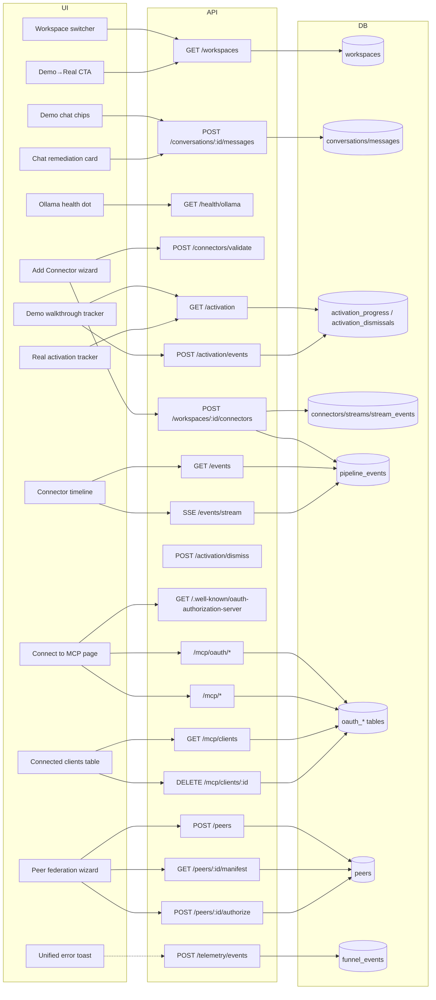

# IONe — Path to a Complete Product

**Date:** 2026-04-23
**Status:** Superseded in framing by [ione-substrate.md](ione-substrate.md) (2026-05-12). The slices captured here (Demo Workspace, Ollama preflight, Guided Connector Setup, Publish-Don't-Poll, Split Activation, Failure UX, Funnel Telemetry, MCP OAuth 2.1, Peer Handshake, A11y) shipped successfully and form the application-layer baseline on `main`. Under the integration-fabric thesis, the application-layer polish documented here is no longer load-bearing for the v0.1 thesis — the substrate-layer table stakes (identity broker, foreign-tenant mapping, webhook ingress, tile passthrough, tool namespacing) take precedence. The body is preserved as historical reference for what shipped.
**Source material:**
- Market research: [md/strategy/market/ione-onboarding-ux.md](../strategy/market/ione-onboarding-ux.md)
- Original v1 design: [md/design/ione-v1.md](ione-v1.md)
- v1 contract: [md/design/ione-v1-contract.md](ione-v1-contract.md)
- Codex review notes: session 2026-04-23

**Layers:** `db`, `api`, `ui`

## Problem statement

IONe v0.1 exists as code but not as a product. The README advertises capabilities the UI does not expose (guided connectors, peer federation UI, MCP client connection); chat fails silently when Ollama models are not pre-pulled; the first-run experience is a blank panel with no hints; failures produce cryptic upstream errors with no remediation path; there is no way to know whether a user ever reaches a useful outcome. This document specifies the work to close the gap.

There is no version label attached to this work. It ships as the contents of v0.1 — incrementally, in dependency order — until v0.1 is honestly complete.

## Design principles

1. **Steal, don't invent.** Every UX pattern is already shipped by one of Hex, Hightouch, Linear, Estuary, Figma, Stripe, Sentry.
2. **Demo ≠ activation.** Safe exploration is one thing; getting the user operational is a different thing. Do not conflate.
3. **Every failure has remediation copy.** A status line is not a remediation.
4. **If the README promises it, the UI delivers it. If the UI doesn't deliver it, the README doesn't promise it.** This applies equally to MCP paste-URL flows and peer federation.
5. **Measure what you ship.** Onboarding without funnel telemetry is guessing.
6. **Accessibility is a gate, not a polish item.** Keyboard flow, screen-reader labels, 375/768/1024/1440 viewport behavior must pass before a slice is done.

## Slice order

Dependency-driven, not calendar-driven:

1. Demo Workspace
2. Ollama preflight + chat remediation
3. Guided Connector Setup
4. Publish-Don't-Poll
5. Split Activation (demo walkthrough + real activation with CTA handoff)
6. Failure UX pass
7. Funnel Telemetry
8. MCP OAuth + Front Door (with README-honest fallback if Claude Desktop round-trip fails)
9. Peer Handshake UI
10. Accessibility / responsive sweep (gate)

Work through in order. Each slice is independently shippable. No slice is complete until its failure-UX and a11y checks pass.

---

## Feature slices

### 1 — Demo Workspace

**One-line:** Ship a pre-populated read-only "IONe Demo Ops" workspace that makes every tab populated and lets chat work without Ollama.

**DB**
- No schema change. Demo workspace identified by Rust const `DEMO_WORKSPACE_ID = uuid!("00000000-0000-0000-0000-000000000d30")`.
- Runtime seeder in Rust gated on `IONE_SEED_DEMO=1`. Default on in `.env.example` and docker-compose; default off in production.
- Re-entrant: no-op if the demo workspace already exists.
- Fixed UUIDs per row, timestamps relative to seeder run time (`now() - interval 'N minutes'`), offsets unique per stream to satisfy `stream_events_stream_observed_unique`.
- Seeds: 4 connectors (NWS, FIRMS, Slack, IRWIN) × 1 stream × 3–5 events; 8 signals across rule/generator origins + severity mix; 5 survivors on 5 distinct signals; 5 routing decisions spanning all 4 targets; 3 artifacts; 3–4 approvals in mixed states; matching audit events; 3 roles (`incident_commander`, `field_lead`, `analyst`); 1 canned conversation showing generator↔critic reasoning.

**API**
- Write-guard middleware: any non-GET/HEAD resolving to demo workspace → 403 `{ error: "demo_read_only", message: "Switch to your workspace to make changes." }`.
- Canned-chat layer: if conversation's workspace is demo, skip Ollama. `HashMap<&str, &str>` of normalized-prompt → canned response. On miss, stock reply.
- Canned conversation text includes at least one example where the critic disagrees with the generator — demonstrates thesis.

**UI**
- Workspace switcher: demo workspace pinned below a `Samples` divider; label `[Demo] IONe Ops`; lock glyph; `read-only` pill.
- On truly first run (no prior `localStorage` active workspace), demo is the default active workspace. An empty real workspace named `My Workspace` is also created and one-click away.
- Chat empty state (demo only): 2×2 grid of clickable prompt chips above the textarea, outcome-framed. Click auto-submits.
- Connectors tab in demo: row names prefixed `Sample — `.
- Write-attempt toast copy: `The demo workspace is read-only. Switch to your workspace to make changes.`
- No top banner — lock glyph + chat placeholder carry the read-only signal.

**Canned prompts (exact strings):**
1. `What wildfires are active near populated areas right now?`
2. `Which NWS alerts in the last 24h need field response?`
3. `Why did the critic reject survivor S-0142?`
4. `What approvals are pending and why?`

**Failure UX**
- If canned-match fails: stock reply lists the 4 supported prompts inline as clickable chips.
- If seeder fails mid-transaction: tx rollback; server starts with no demo workspace; logs a single-line warning; real workspaces unaffected.

**A11y**
- Chips: keyboard arrow-key navigation; visible focus ring; `role="button"`; `aria-label` with full prompt text.
- Lock glyph: `aria-label="Read-only"` + tooltip.
- Workspace switcher: all items reachable by keyboard; `aria-current` on active.

**Acceptance criteria**
- AC-1.1 Given a fresh DB with `IONE_SEED_DEMO=1`, after migrate+boot, the demo workspace UUID row exists and has ≥13 stream_events across 4 connectors.
- AC-1.2 Second boot inserts no duplicate rows.
- AC-1.3 POST to any demo workspace write endpoint returns 403 with `error: "demo_read_only"`.
- AC-1.4 POSTing any of the 4 canned prompts to a demo conversation returns a response with `model: "canned"` and a mock Ollama server set in env is never called.
- AC-1.5 `cargo run -- demo-purge` deletes the workspace and its audit events atomically; count of both tables at DEMO_WORKSPACE_ID returns 0.

---

### 2 — Ollama preflight and chat remediation

**One-line:** Detect Ollama and model availability at boot and per-chat-request; surface a user-actionable diagnostic instead of `upstream returned ...`.

**DB**
- No schema changes. Results are computed, not stored.

**API**
- `GET /api/v1/health/ollama` → `{ ok: bool, baseUrl, models: { required: [...], available: [...], missing: [...] }, error?: string }`. Runs a single `GET /api/tags` against Ollama with a 3s timeout.
- Required models determined from `OLLAMA_MODEL`, `OLLAMA_GENERATOR_MODEL`, `OLLAMA_CRITIC_MODEL`, `OLLAMA_ROUTER_MODEL`. (Chat only strictly needs `OLLAMA_MODEL`.)
- `POST /api/v1/conversations/:id/messages` error path: on Ollama reach failure, return 503 `{ error: "ollama_unreachable", message, baseUrl, pullCommand?: "ollama pull <model>" }`. On model-not-found, return 503 `{ error: "ollama_model_missing", model, pullCommand }`.
- Messages in demo workspace skip Ollama entirely (Slice 1); this slice only applies to real workspaces.

**UI**
- Top bar: a health dot that's green when `/health/ollama` returns `ok: true` and red+clickable otherwise. Clicking opens a small panel listing missing models with copy-to-clipboard pull commands.
- Chat empty state in a real workspace: if health is red, the textarea is disabled and a single sentence appears above it: `Chat needs Ollama running and the '<model>' model. Run 'ollama pull <model>' in a terminal, then click retry.` Retry button re-polls health.
- On a real chat request that fails because Ollama became unreachable mid-session: assistant message slot shows an inline failure card with the exact `pullCommand` and a retry button for the last prompt (does not re-create the conversation).

**Failure UX**
- This slice *is* the failure UX for chat. Every failure mode specifies the exact copy + next action.

**A11y**
- Health dot: `aria-live="polite"` announcement when status changes; button role; descriptive `aria-label`.
- Disabled textarea has `aria-describedby` pointing at the remediation sentence.

**Acceptance criteria**
- AC-2.1 With Ollama unreachable, `GET /health/ollama` returns `ok: false, error: "..."` within 3s.
- AC-2.2 With Ollama reachable but `OLLAMA_MODEL` not pulled, response includes that model in `missing` and suggests `pullCommand`.
- AC-2.3 Chat POST against an unreachable Ollama returns 503 + remediation body, not a generic 500.
- AC-2.4 UI chat empty state swaps to the remediation copy within one poll cycle after health goes red.

---

### 3 — Guided Connector Setup

**One-line:** Replace the free-form JSON textarea with provider-specific forms that validate config before creating the connector.

**DB**
- No schema changes. Config still lives in `connectors.config JSONB`; the form compiles to the same shape per connector.

**API**
- `POST /api/v1/connectors/validate` — body `{ kind: string, name: string, config: object }`. Runs a provider-specific dry-run:
  - NWS: validate `lat` in [-90, 90], `lon` in [-180, 180]; `HEAD` against `api.weather.gov` alerts endpoint with those coords; return `{ ok, sample: {alertCount} }` or `{ ok: false, error, hint }`.
  - FIRMS: validate `mapKey` non-empty; call FIRMS `country/USA/1` with the key; return shape with `detectionCount` or error `{ error: "firms_auth_failed", hint: "Check your MAP_KEY at firms.modaps.eosdis.nasa.gov/api" }`.
  - S3/FS: validate bucket + prefix; list-objects dry-run; return `{ objectCount }` or `{ error: "s3_access_denied", hint }`.
  - Slack: validate webhook URL parses + hits `/` with HEAD; return ok or error.
  - IRWIN: validate endpoint URL reachable.
  - OpenAPI: once implemented, validate that the supplied OpenAPI document URL fetches + parses.
- `POST /api/v1/workspaces/:id/connectors` — unchanged shape, but now calls `validate` internally and returns 422 with the same hint body if validation fails. Also synchronously triggers one poll (Slice 4).

**UI**
- Add Connector modal: replace the raw JSON textarea with a two-step modal.
  1. **Choose provider.** Grid of provider cards: NWS, FIRMS, S3, Slack, IRWIN, OpenAPI, Custom JSON. Each shows a one-line description and typical use case.
  2. **Configure.** Provider-specific form with labeled fields, inline help text, and format hints.
     - NWS: lat (number 5 decimals), lon (number 5 decimals), poll interval (default 300s).
     - FIRMS: MAP_KEY (password field), area of interest (select: country or bbox), country code (if country) or bbox coords.
     - S3: endpoint URL, bucket, prefix, access key, secret (password), region.
     - Slack: webhook URL (url).
     - IRWIN: endpoint URL, optional auth header.
     - OpenAPI: document URL, base URL, optional auth.
     - Custom JSON: the current textarea, for escape-hatch cases.
- **Test connection** button on every form; calls `POST /connectors/validate`. Shows spinner, then green ok with sample data OR red error card with the exact `hint` and a retry button.
- **Create** button disabled until `Test connection` returns ok. (Exception: Custom JSON — create enabled after shape parses.)

**Failure UX**
- Each validate failure has a provider-specific `hint`:
  - `firms_auth_failed`: link to FIRMS key request page, copy-button for the expected env var name.
  - `nws_out_of_range`: inline error next to the offending lat/lon input.
  - `s3_access_denied`: suggests checking credentials and bucket permissions; does not echo the secret.
- Network timeout surfaces as: `Couldn't reach <host>. Check your network or firewall, then click Test again.`
- Unknown upstream shape surfaces as: `Got a response but couldn't understand it. Try Custom JSON if this is an unusual provider.`

**A11y**
- All form inputs have `<label for>` bindings.
- `Test connection` announces success/failure via `aria-live="polite"` region next to the button.
- Modal traps focus; Escape closes; focus returns to the `+ Add connector` button.

**Acceptance criteria**
- AC-3.1 POST `/connectors/validate` with invalid NWS lat returns 422 with `error: "nws_out_of_range"`.
- AC-3.2 POST `/connectors/validate` with valid NWS coords against live api.weather.gov returns `ok: true` and a non-negative `alertCount`.
- AC-3.3 FIRMS validation with an obviously-wrong key returns `firms_auth_failed` + non-empty `hint`.
- AC-3.4 Create button in the UI is disabled until Test connection succeeds for every provider except Custom JSON.
- AC-3.5 Connector creation endpoint rejects unvalidated configs with 422, the same error shape as validate.

---

### 4 — Publish-Don't-Poll

**One-line:** Scheduler emits structured pipeline events; UI streams them live; connector cards show a timeline; no silent 60-second gaps.

**DB**
- New table `pipeline_events`: `id UUID PK`, `workspace_id UUID NOT NULL`, `connector_id UUID NULL`, `stream_id UUID NULL`, `stage TEXT CHECK IN ('publish_started','first_event','first_signal','first_survivor','first_decision','stall','error')`, `detail JSONB NULL`, `occurred_at TIMESTAMPTZ DEFAULT now()`.
- Indexes on `(workspace_id, occurred_at DESC)` and `(connector_id, occurred_at DESC)`.

**API**
- `GET /api/v1/workspaces/:id/events?connector_id&stage&limit&cursor` → `{ items, nextCursor }`.
- `GET /api/v1/workspaces/:id/events/stream` → `text/event-stream`. Subscribes to a process-local `tokio::sync::broadcast` channel that the scheduler publishes to on every stage insert.
- Scheduler: at every stage boundary (poll→first-event→rule/generator→critic→router), append + publish. Errors produce a `stage: error` with structured detail.
- `POST /api/v1/workspaces/:id/connectors`: after DB insert, synchronously invoke one poll + one pipeline run inline; emit events as they fire; return the connector plus the first couple of events in the response body.

**UI**
- Each connector card gains a `
` with the last N events rendered bottom-up (newest at top). Each row: icon for stage, short label, relative time, one-line detail.
- Add Connector modal (Slice 3): after `Create`, the modal transitions to a progress view that opens an `EventSource` on `/events/stream?connector_id=new-id` and shows a checklist of stages filling in live. On stall >10s shows `Waiting for <next stage> — this normally takes N seconds.` On error shows the error detail and a retry button.
- Connectors tab: a single `EventSource` subscription updates all visible cards; switching workspaces re-subscribes.
- Notification toasts limited to 3 per minute per workspace.

**Failure UX**
- `stage: error` events always include `detail.upstream_status` (if HTTP) or `detail.error_kind` (for parse/timeout/other).
- Retry button on a stalled or errored card calls `POST /api/v1/streams/:id/poll` (existing) and re-subscribes.
- SSE disconnect: client shows a small `Reconnecting…` indicator and backs off exponentially up to 30s; no lost history because the timeline also pages from `/events` on reconnect.

**A11y**
- Timeline items are a list (`<ul>` / `<li>`).
- `Reconnecting…` indicator uses `aria-live="polite"`.
- Progress-view stages use `aria-busy` while pending and `aria-checked` when complete.

**Acceptance criteria**
- AC-4.1 After POST `/connectors`, at least one `pipeline_events` row exists with `stage: publish_started` for the new connector.
- AC-4.2 SSE stream delivers a new event within 500ms of its insert.
- AC-4.3 Upstream 500 produces a `stage: error` with `detail.upstream_status: 500`.
- AC-4.4 Demo connectors each have ≥1 of every stage in the seeded timeline.
- AC-4.5 Client reconnects SSE after a forced disconnect without missing events (paged history fills the gap).

---

### 5 — Split Activation

**One-line:** Two separate progress trackers: a demo walkthrough that teaches the product shape, and a real-workspace activation that defines "you are now using IONe."

**DB**
- New table `activation_progress` (replaces the earlier `onboarding_progress` framing):
  - `user_id UUID`, `workspace_id UUID`, `track TEXT CHECK IN ('demo_walkthrough','real_activation')`, `step_key TEXT`, `completed_at TIMESTAMPTZ`
  - PK `(user_id, workspace_id, track, step_key)`
- New table `activation_dismissals`: `(user_id, workspace_id, track)` PK + `dismissed_at`.

**API**
- `GET /api/v1/activation?workspace_id&track` → `{ track, items: [{stepKey, label, completedAt|null}], dismissed }`.
- `POST /api/v1/activation/events` — body `{ track, stepKey, workspaceId }`. Idempotent.
- `POST /api/v1/activation/dismiss` — body `{ workspaceId, track }`.

**UI**
- Demo workspace: sidebar shows the **demo walkthrough** tracker with 4 steps:
  1. `Ask a demo question` → fires on first demo message
  2. `Open a survivor` → fires on first survivor view
  3. `Review an approval` → fires on first approval-detail view (approve/reject disabled in demo)
  4. `View an audit trail` → fires on first audit view
  Completing all 4 swaps the tracker for a single **CTA card**: `You've seen how IONe works. Ready to set up your own?` with primary button `Create your workspace` and a secondary `Keep exploring the demo`.
- Real workspace: sidebar shows the **real activation** tracker with 4 steps:
  1. `Add your first connector` → fires on first successful (validated) connector creation
  2. `See your first signal` → fires on first `pipeline_events.stage='first_signal'` for that workspace
  3. `Approve or reject one artifact` → fires on first approval decision in that workspace
  4. `Review one audit trail` → fires on first audit view in that workspace
  Completion state shows `You're up and running.` and auto-collapses after 24h.

**Copy**
- Demo CTA primary: `Create your workspace`
- Demo CTA secondary: `Keep exploring the demo`
- Completion real: `You're up and running. This workspace will continue to collect signals in the background.`

**Failure UX**
- If "Create your workspace" from demo CTA fails (DB error), show error toast with retry; demo tracker state is not lost.
- Events are idempotent — double-fire from the UI is silently deduplicated server-side.

**A11y**
- Tracker uses `role="list"` with `aria-label`.
- Checkbox state uses `aria-checked`.
- Dismiss button has `aria-label="Dismiss activation checklist"`.

**Acceptance criteria**
- AC-5.1 Completing all 4 demo steps swaps the tracker for the CTA; it does not mark real activation complete.
- AC-5.2 Clicking `Create your workspace` creates a real workspace (workspace_switcher updates) and switches to the real activation tracker.
- AC-5.3 Real activation step `See your first signal` completes only when a `pipeline_events` row with `stage: first_signal` lands for that workspace.
- AC-5.4 Dismissing one track does not dismiss the other.

---

### 6 — Failure UX Pass

**One-line:** Every failure mode in the UI has specific remediation copy and a retry path, not a status line.

This slice is scoped per-surface, not as standalone code. It's a shipping gate: no prior slice is considered complete until its failure states match this spec.

**Catalog**

| Surface | Failure | Current behavior | Required behavior |
|---|---|---|---|
| Chat (real ws) | Ollama unreachable | Cryptic upstream error | Slice 2 remediation card |
| Chat (real ws) | Model missing | Cryptic upstream error | Slice 2 remediation card with `pullCommand` |
| Add connector | Validation failed | Modal closes on submit error | Inline provider-specific hint; modal stays open; user can edit |
| Add connector | Network timeout | Generic error | `Couldn't reach <host>. Check network/firewall.` |
| Connector card | Poll error | Silent in v0.1 | Timeline shows `stage: error` with detail + Retry button |
| SSE events stream | Connection drop | No feedback | `Reconnecting…` indicator with exponential backoff |
| Approval decide | DB error | Button stays loading forever | Error toast with retry; state reverts |
| MCP connect (Slice 8) | OAuth denied | — | Explicit `You denied the connection.` + `Try again` |
| MCP connect (Slice 8) | Deep-link unsupported | — | Fallback to JSON paste instructions |
| MCP connect (Slice 8) | Token expired | — | Silent refresh; if refresh fails, prompt re-auth |
| Peer federation (Slice 9) | Peer unreachable | — | `Couldn't reach <peer>. Try again or check the URL.` |
| Peer federation (Slice 9) | Manifest never arrives | — | Timeout at 15s with `The peer didn't return tools. <Retry>` |

**API**
- All endpoints return JSON error envelopes `{ error: kebab_snake_kind, message: user-facing string, hint?: string }`. No bare string errors.
- 4xx errors include `hint` when a user action would fix it; 5xx includes `hint` when it's a known transient (e.g. `retry_in_30s`).

**UI**
- One shared toast component. `showError(kind, message, hint?, onRetry?)`. Every fetch call routes errors through this.
- Every form shows inline errors beside the offending input when the error envelope includes `field: "..."`.

**A11y**
- Toasts are `role="alert"` with `aria-live="assertive"` for errors, `polite` for info.
- Retry buttons are keyboard-reachable without leaving the context.

**Acceptance criteria**
- AC-6.1 Each row in the Catalog table has a corresponding UI test asserting the required behavior.
- AC-6.2 No fetch call in `static/app.js` throws without routing through `showError`.
- AC-6.3 No API handler in `src/routes/` returns a bare `AppError::Internal` without a `hint` for user-facing 4xx codes (enforced by unit test checking error construction).

---

### 7 — Funnel Telemetry

**One-line:** In-DB funnel events so operators know whether users reach value. No external service.

**DB**
- New table `funnel_events`:
  - `id UUID PK`
  - `user_id UUID NULL` — null for pre-auth events
  - `session_id UUID NOT NULL` — from a cookie set on first request
  - `workspace_id UUID NULL`
  - `event_kind TEXT NOT NULL` — see catalog below
  - `detail JSONB NULL`
  - `occurred_at TIMESTAMPTZ DEFAULT now()`
- Indexed on `(event_kind, occurred_at DESC)` and `(session_id, occurred_at)`.

**Event catalog**
- `session_started` — first request with a new session cookie
- `demo_viewed` — user loaded demo workspace chat panel
- `demo_prompt_clicked` — click on a canned chip
- `demo_cta_shown` — demo walkthrough completed, CTA visible
- `demo_cta_clicked` — `Create your workspace` clicked
- `real_workspace_created`
- `connector_validate_attempted` — `{ kind }`
- `connector_validate_succeeded` — `{ kind }`
- `connector_validate_failed` — `{ kind, errorKind }`
- `connector_created` — `{ kind }`
- `first_real_signal`
- `first_real_approval_decided`
- `activation_completed_real`
- `ollama_unreachable_seen`
- `mcp_install_tile_clicked` — `{ client }` (Slice 8)
- `mcp_oauth_success` — `{ client }` (Slice 8)
- `peer_federation_started` (Slice 9)
- `peer_federation_activated` (Slice 9)

**API**
- `POST /api/v1/telemetry/events` — body `{ eventKind, detail?, workspaceId? }`. Session_id from cookie. Rate-limited (10/s per session).
- `GET /api/v1/admin/funnel?from&to` — operator-only; returns counts per event_kind and a small set of funnel-conversion computed columns (demo→real, connector-attempt→success, etc.). Gated behind a new `IONE_ADMIN_FUNNEL=1` env var (default off) until a real admin UI lands.

**UI**
- Server-side emission for DB-grounded events (connector_created, first_real_signal, etc.).
- Client-side emission only for pure UI events (demo_prompt_clicked, demo_cta_shown, mcp_install_tile_clicked). Single helper `track(kind, detail?)` in app.js.
- No admin UI in this slice. Operators read via `GET /admin/funnel` directly.

**Failure UX**
- Telemetry writes must never block a user action. Emit via `tokio::spawn` for fire-and-forget; log on failure; never surface to the UI.

**A11y**
- N/A — server-side table + fetch helper with no UI.

**Acceptance criteria**
- AC-7.1 Creating a connector in the UI produces a `connector_created` row in `funnel_events` within 500ms.
- AC-7.2 A failed `connector_validate` produces exactly one `connector_validate_failed` event with the same `errorKind` as the API response.
- AC-7.3 `GET /admin/funnel` returns counts that match the underlying table.
- AC-7.4 With `IONE_ADMIN_FUNNEL=0` (default), `/admin/funnel` returns 404.

---

### 8 — MCP OAuth + Front Door (with fallback)

**One-line:** Real OAuth 2.1 + PKCE on `/mcp` with per-client install tiles and a connected-clients panel. Fallback to README-honest static-bearer if Claude Desktop round-trip fails.

**Verification gate** (from the Devil's Advocate work, carried forward): first test passed (Linear + Sentry discovery docs confirmed live spec). The second test — Claude Desktop Pro round-trip against a minimal IONe OAuth stub — must pass before Slice 8 UI work starts. If it fails, switch to the fallback below.

**Primary path (OAuth 2.1)**

**DB**
- New tables: `oauth_clients`, `oauth_auth_codes`, `oauth_access_tokens`, `oauth_refresh_tokens` per contract.
- Tokens stored as sha256 hashes.

**API**
- `GET /.well-known/oauth-authorization-server` — CIMD discovery document, field list verified against Linear/Sentry on 2026-04-23.
- `POST /mcp/oauth/register` — CIMD metadata fetch or body-inline.
- `GET /mcp/oauth/authorize` — consent screen + auth code issue.
- `POST /mcp/oauth/token` — code↔access+refresh; single-use refresh with rotation.
- `POST /mcp/oauth/revoke` — RFC 7009.
- `/mcp/*` requires Bearer; 401 with `WWW-Authenticate: Bearer realm="ione", resource_metadata="..."`.
- `IONE_OAUTH_STATIC_BEARER` env var as CI/headless fallback.
- `GET /api/v1/mcp/clients` — aggregated by client_id for the calling user.
- `DELETE /api/v1/mcp/clients/:id` — revoke all tokens for that client × user.

**UI**
- Replace sidebar MCP Copy button with a `Connect to MCP` page with two sections:
  1. **Connect a client.** Tiles: Cursor (deep link), Claude Desktop (paste URL + 3-step instructions), Claude Code (`claude mcp add` CLI one-liner), VS Code (deep link), Other (raw JSON).
  2. **Connected clients.** Table from `GET /mcp/clients` with revoke buttons.

**Fallback path (README-honest)**

If the round-trip test fails:
- No OAuth implementation. `/mcp/*` continues to accept `IONE_OAUTH_STATIC_BEARER` (only) as a header.
- UI page renames to `MCP access`. Shows the URL, a generated static bearer token (stored as a `oauth_access_tokens` row with `client_id='static'` so revoke works), and explicit copy: `Claude Desktop Pro's "custom connector" flow requires OAuth which IONe doesn't yet support. Use Claude Code for the paved path: claude mcp add ...`.
- README's `MCP` section is updated to reflect the limitation.
- Slice 8 is considered complete when the UI honestly represents what works.

**Failure UX**
- Every OAuth failure mode from the Slice 6 catalog (denied, deep-link unsupported, token expired) is implemented here with its specified copy.

**A11y**
- Tiles: `role="link"` with descriptive `aria-label`.
- Connected-clients table: proper `<th>` headers, `aria-sort` on sortable columns.
- Consent screen: focus starts on `Allow`; keyboard Tab order deliberate.

**Acceptance criteria**
- AC-8.1 (primary path) Round-trip test passes: Claude Desktop Pro successfully completes OAuth against IONe and calls `/mcp/tools/list` with a 200 response.
- AC-8.2 Revoking a client immediately invalidates subsequent `/mcp/*` calls with its old token.
- AC-8.3 (fallback path) Copy on the MCP page accurately describes what works (Claude Code bearer) and what doesn't (Claude Desktop Pro OAuth).

---

### 9 — Peer Handshake UI

**One-line:** Pasting a peer URL runs OAuth discovery against the peer, shows the peer's tool manifest, and stores a subscription with an explicit tool allow-list.

**DB**
- Extend `peers`: add `oauth_client_id`, `access_token_hash`, `refresh_token_hash`, `token_expires_at`, `tool_allowlist JSONB DEFAULT '[]'`, `status` enum (`pending_oauth`, `pending_allowlist`, `active`, `revoked`).

**API**
- `POST /api/v1/peers` — body `{ peerUrl }`. Runs discovery against the peer's `/.well-known/oauth-authorization-server` + registers IONe as a CIMD client, returns `{ id, status: "pending_oauth", authorizeUrl }`.
- `GET /api/v1/peers/:id/callback?code&state` — completes the OAuth dance, fetches `tools/list` from the peer, transitions to `pending_allowlist`.
- `GET /api/v1/peers/:id/manifest` — returns `{ tools }` for the allow-list UI.
- `POST /api/v1/peers/:id/authorize` — body `{ toolAllowlist: string[] }`, transitions to `active`.
- `DELETE /api/v1/peers/:id` — revokes tokens + status=`revoked`, retains row.
- Router/scheduler peer-send path: refuses to call any tool not in `peers.tool_allowlist`, writes an audit event on block.

**UI**
- Federation settings page. Lists peers with status badges.
- `+ Add peer` wizard:
  1. Paste URL → POST `/peers` → opens `authorizeUrl` in new tab with "Waiting for sign-in…"
  2. Poll `/manifest` until non-empty → render checkbox list (all unchecked).
  3. POST `/authorize` with the list → success toast; peer transitions to active.

**Fallback**
- If Slice 8 chose the fallback path (no OAuth server), this slice falls back to a URL + static bearer configuration per peer (IONe-as-client supplies its own bearer header). The wizard becomes 2 steps (URL+token → allow-list). The allow-list remains mandatory.

**Failure UX**
- Peer unreachable / manifest timeout: explicit copy per Slice 6 catalog.
- Revoke confirmation uses `role="alertdialog"`.

**A11y**
- Wizard uses `aria-current="step"` on the active step indicator.
- Allow-list checkboxes grouped with a `<fieldset>` + `<legend>`.

**Acceptance criteria**
- AC-9.1 POSTing a valid peer URL returns 200 with `authorizeUrl` pointing at the peer's authorize endpoint.
- AC-9.2 Manifest endpoint returns the peer's actual tool list after a successful callback.
- AC-9.3 Authorize with `toolAllowlist: ["echo"]` sets status `active`; router blocks calls to other peer tools with 403 + audit event.
- AC-9.4 Delete sets status `revoked` without deleting the row (preserves audit).

---

### 10 — Accessibility / Responsive Sweep (gate, not a feature)

This slice ships no new capability. It's a gate: no prior slice is considered complete until these checks pass for the components it introduced.

**Checks per component**
- Keyboard-only flow: every interactive element reachable; logical tab order; no traps; Escape closes modals; Enter submits forms.
- Screen reader: every interactive element has an accessible name; live regions for status/toast/SSE reconnect; `aria-busy` while loading.
- Viewport sweep: 375px (mobile portrait), 768px (tablet), 1024px (laptop), 1440px (desktop). No horizontal scroll; no elements overlapping; text readable; tap targets ≥44×44.
- Color contrast: 4.5:1 for body text, 3:1 for large text and UI borders at all states.
- Focus visibility: every focusable element has a visible focus ring at 3:1 contrast against its background.
- Reduced motion: `@media (prefers-reduced-motion: reduce)` disables non-essential transitions (toasts fade, timeline updates jump instead of slide).
- Hover gating: any hover-only affordance wrapped in `@media (hover: hover)`.

**Exit criteria (gate)**
- Automated: `axe-core` CLI run against the app, zero violations at serious+ level on every route.
- Manual: one pass through the 10 slices' new components at 375px with keyboard only + screen reader (VoiceOver or NVDA). Bugs filed and fixed before final release of each slice.

---

## API contracts (consolidated)

See [md/design/ione-complete-contract.md](ione-complete-contract.md) for the canonical names, fields, and API operations. Implementation must conform to that file. Downstream agents read the contract, not this prose.

## Wiring dependency graph

## Tradeoffs (unchanged + additions)

Prior-design tradeoffs (seeder vs migration, UUID vs column, canned-static vs table, app-layer vs RLS, OAuth vs bearer, SSE vs WebSocket) all stand. New:

- **Provider-specific forms vs a generic schema-driven form.** Provider-specific wins on targeted help text, validation that understands each upstream, and room for specific failure hints. A generic JSON-schema form is a fallback for Custom JSON only.
- **In-DB telemetry vs external (PostHog, Segment).** In-DB wins for an OSS product shipped without a hosted service assumption. Operator gets analytics; user keeps their data local. External integration is a later slice if demand arises.
- **Split activation trackers vs one unified checklist.** Split wins because demo completion and real activation are different outcomes. Conflating them (prior design) is the false-positive Codex flagged.

## Devil's Advocate (refreshed)

### 1. Load-bearing assumption

That the project can sustain 10 slices without either (a) a calendar-driven premature v0.2 or (b) the release drifting indefinitely. The work below is sequenced by dependency, not deadline — but a solo operator can still lose momentum.

### 2. Verification

- Slice 8 OAuth spec: **VERIFIED ✓** against Linear + Sentry production MCP discovery docs on 2026-04-23. Secondary test (Claude Desktop Pro round-trip) still required before Slice 8 UI work; fallback path defined above if it fails.
- Slice 3 provider validation dry-runs hit real upstreams (NWS, FIRMS, etc.). These calls can flake. Tests mock upstreams; production validate calls set a 5s timeout and surface the timeout as a specific error kind.
- Slice 4 SSE at >50 concurrent users: deferred as a known-unknown; in-process broadcast channel is fine at current scale.

### 3. Simplest alternative

The boring alternative to this entire document: pin v0.1 as "reference implementation, expect breakage" forever and skip the completeness work. Costs: README credibility, any actual user activation, any pilot conversation. Not recommended. The 10 slices as sequenced are the minimum needed to close the gap between what the README promises and what the product delivers.

### 4. Structural completeness checklist

- [x] Every UI component that calls an API appears in the contract table.
- [x] Every API endpoint maps to one or more repository methods or explicitly declares "no DB access."
- [x] Every new field is in DB, API, and UI (onboarding tracker key, funnel event kind, peer tool allowlist, pipeline event stage, oauth client scope).
- [x] Every AC names the specific endpoint or DB state that would verify it.
- [x] Wiring graph has unbroken paths UI → API → DB for every slice.
- [x] Integration-test scenarios exist at the slice level (per AC list).

## Requirements impact

[md/design/ione-v1-contract.md](ione-v1-contract.md) will be superseded by [md/design/ione-complete-contract.md](ione-complete-contract.md) which extends it with:
- `activation_progress`, `activation_dismissals`, `funnel_events`, `pipeline_events`, `oauth_*` tables
- Extended `peers` columns + `status` enum
- `DEMO_WORKSPACE_ID` constant
- New error envelope conventions (`{ error, message, hint? }`)
- New endpoint families: `/health/*`, `/connectors/validate`, `/activation/*`, `/events[/stream]`, `/.well-known/oauth-authorization-server`, `/mcp/oauth/*`, `/mcp/clients*`, `/peers/*/{callback,manifest,authorize}`, `/telemetry/events`, `/admin/funnel`.

## Open questions (kept live)

1. OAuth round-trip against Claude Desktop Pro (Slice 8 gate).
2. Provider list for Slice 3 completeness: does `IRWIN` stay in the initial set or ship later?
3. Admin UI for funnel events (Slice 7 currently has no UI). Land when usage demands.
