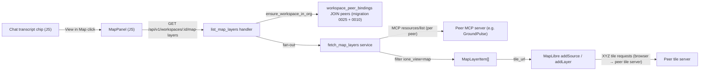

# Map View — UX Shell Feature: Tile-URL Passthrough + Generic Map View

**Date:** 2026-05-21
**Status:** Draft
**Layers:** `api`, `ui`
**Substrate ref:** [ione-substrate.md](ione-substrate.md) §4 "Workspace UX shell with pluggable view types" (substrate layer 4 of 7)
**Playbook ref:** [app-integration-playbook.md](app-integration-playbook.md) "Resource metadata conventions for the UX shell"

---

## Problem Statement

IONe targets geospatial workflow infrastructure. Data processing (COGs, raster pipelines) is the primary focus; map display is secondary. When a connected app finishes a processing job and exposes the result as a tile layer via MCP, operators need a simple way to see it without leaving the IONe workspace shell.

Layer 4 adds a generic Map panel to the workspace shell. IONe reads tile URLs from MCP resource metadata and renders them via MapLibre. Apps own and serve their tile servers; IONe renders references only. No per-app code enters the rendering path.

---

## Feature Slices

### Slice 1 — Resource fan-out endpoint

IONe aggregates `ione_view: "map"` resources across all active peers for a workspace and returns them as a typed REST list. The frontend fetches this list on Map tab activation; it does not speak MCP JSON-RPC directly.

**DB:** No migration. Uses existing `workspace_peer_bindings` (migration 0025) and `peers` (migration 0010) tables.

**API:**
- `GET /api/v1/workspaces/:id/map-layers` — fans out to each active peer's `resources/list` MCP endpoint, filters resources where `metadata.ione_view: "map"`, returns aggregated list with partial-success semantics (unreachable peers appear in `peers_failed`, not as HTTP errors). Each per-peer MCP call must complete within **5 seconds**; peers that exceed this deadline appear in `peers_failed` with `error: "timeout"`.
- Optional query param `peer_id: UUID`: when supplied, the handler fans out only to that peer. If the peer is not an active binding on the workspace, the response is HTTP 200 with `items: []`, `peers_ok: []`, `peers_failed: []`. When omitted, all active peer bindings are fanned out.
- Response deduplication: if `(peer_id, uri)` is not unique in the aggregated results (e.g., two bindings to the same peer), the first occurrence wins and subsequent duplicates are dropped server-side.

**UI:** The Map panel calls this endpoint on first activation and on workspace switch.

**Cross-references:** `MapPanel` → `GET /api/v1/workspaces/:id/map-layers` → `WorkspacePeerBindingRepo::list_active_with_peers` (new method to be added as part of this slice; joins `workspace_peer_bindings` with `peers` filtering `status = 'active'` on both) → `workspace_peer_bindings` JOIN `peers`.

---

### Slice 2 — Map panel + layer control

A new Map tab in the existing `role="tablist"` renders a MapLibre GL JS canvas seeded by the resource list from Slice 1. Each resource becomes one tile layer with a visibility checkbox.

**DB:** None.

**API:** Consumes `GET /api/v1/workspaces/:id/map-layers` (Slice 1). Tile requests go directly from the browser to each peer's tile server — IONe does not proxy tiles in v0.1.

**UI:**
- `tab-map` button inserted after `tab-chat` in the tablist
- `panel-map` panel: MapLibre canvas (fills panel area) + layer control overlay (top-right, MapLibre-style) + empty/loading/error states
- MapLibre loaded via CDN `<script>` tag; no bundler required
- Layer control: one row per resource; each row has a visibility checkbox labeled by `meta.layer_name` if present, otherwise `MapLayerItem.name`; and an optional opacity slider when `meta.opacity` is present

**Cross-references:** `MapPanel` → `GET /api/v1/workspaces/:id/map-layers` → aggregated `MapLayerItem[]` → `maplibregl.Map.addSource` / `addLayer` per item using `meta.tile_url`.

---

### Slice 3 — Chat → Map cross-panel navigation

Resource URI chips in the chat transcript gain a "View in Map" button. Clicking it switches to the Map tab and, if the resource is in the current layer list, highlights its layer row in the layer control.

**Prerequisite:** Resource URI chips do not currently exist in `#transcript`. This slice must first define and implement them. A resource chip is a `<button class="resource-chip" data-uri="{uri}">` element rendered inside a transcript message `<div>` when the assistant response contains a resource URI pattern (e.g., `groundpulse://…`, any `scheme://…` URI that resolves against the current layer list). The chip's visible label is `MapLayerItem.name` if the URI is in the layer list, otherwise the raw URI. The `renderTranscriptMessage` function in `app.js` is responsible for detecting URI patterns and inserting chips.

**DB:** None.

**API:** No new endpoints. Uses the already-fetched resource list from Slice 1 (cached in-memory in the Map panel's JS state).

**UI:**
- Resource chips in `#transcript` gain a secondary action `<button class="chip-view-map" aria-label="View in Map">` (icon button)
- On click: `switchTab('map')` is called; if the resource URI matches a loaded layer (by `data-uri`), that layer row is scrolled into view and the CSS class `layer-row--highlight` is added to it, then removed after 1500 ms via `setTimeout`
- On mobile/touch: the "View in Map" button is always inline (visible without hover)

**Cross-references:** Chat transcript chip `.chip-view-map` → `switchTab('map')` → `MapPanel.highlightLayer(uri)` → layer control row `[data-uri="{uri}"]` → `layer-row--highlight` CSS class.

---

## API Contracts

| Endpoint | Method | Path params | Query params | Response | Errors | Auth |
|---|---|---|---|---|---|---|
| List map layers | `GET` | `workspace_id: UUID` | `peer_id?: UUID` — when present, restricts fan-out to that peer only; HTTP 200 with empty arrays if the peer is not an active binding | `{ items: MapLayerItem[], peers_ok: UUID[], peers_failed: PeerFetchError[] }` | 401, 404 | Bearer + org-scoped |

**`MapLayerItem`**
```
peer_id:    UUID
peer_name:  string
uri:        string          // MCP resource URI, e.g. "groundpulse://aoi/12345/displacement"
name:       string          // human-readable label for the layer control
meta: {
  tile_url:    string       // XYZ template, e.g. "https://tiles.example.com/{z}/{x}/{y}.png"
  bounds?:     [west: f64, south: f64, east: f64, north: f64]  // flat GeoJSON bbox
  attribution?: string
  layer_name?:  string      // display name override (falls back to resource.name)
  opacity?:     f64         // 0.0–1.0
  vector_url?:  string      // PMTiles URL for vector layers (optional, v0.1 pass-through)
}
```

**`PeerFetchError`**
```
peer_id:   UUID
peer_name: string
error:     string
```

**Error codes:**
- `401` — unauthenticated (no valid Bearer token)
- `404` — `workspace_id` not found or not in caller's org (same 404 as all workspace sub-routes; does not leak cross-org existence)
- `200` with `peers_failed` entries — one or more peers unreachable (partial success; UI shows per-layer warning)

---

## Wiring Dependency Graph



---

## Devil's Advocate

### 1. What assumption, if wrong, would invalidate this entire design?

The most load-bearing premise: **at least one connected peer exposes `resources/list` with `ione_view: "map"` metadata**. The entire map panel is a consumer of a contract that may have no producers. If neither GroundPulse nor TerraYield implements this contract, `GET /api/v1/workspaces/:id/map-layers` returns `items: []` on every call and the map panel always shows the empty state — a working implementation that produces no visible output.

### 2. Has that assumption been verified against live state?

Verified against current code on 2026-05-21:

```
grep -r "ione_view\|tile_url" ../eo/src/     → no results
grep -r "ione_view\|tile_url" ../eo_ag/src/  → no results
```

**Result: NOT MET ✗** — neither reference app currently exposes the map resource contract. GroundPulse does have a `displacement_tile_url` field in its report PDF struct, confirming tile URL data exists, but it is not exposed via MCP.

**Consequence and mitigation:** This design is still the correct IONe-side implementation. But end-to-end acceptance criteria cannot be satisfied until GroundPulse (or a synthetic peer) implements the playbook map resource contract. The playbook already defines the contract (§4, `ione_view: "map"`). A GroundPulse task to expose `displacement_tile_url` as an MCP resource with the correct metadata shape is a **prerequisite** for integration testing this feature. That task belongs in the GroundPulse repo, not here — but it must be tracked. See Open Questions.

The IONe implementation can be fully tested in isolation using a stub peer (a minimal MCP server that returns one `ione_view: "map"` resource with a public tile URL, e.g. an OpenStreetMap tile template). Integration tests use this stub; the real GroundPulse peer is exercised in a separate end-to-end walkthrough gate.

### 3. What's the simplest alternative that avoids the biggest risk?

**Alternative:** Don't add a new REST endpoint. Have the frontend call the existing `POST /mcp` (`resources/list`) endpoint directly and filter client-side.

This fails because IONe's `/mcp` endpoint currently returns only IONe's own resources (the `whoami://` resource), not federated resources from connected peers. The MCP server at `mcp_server.rs:750` is IONe's own server, not a proxy over peer servers. The frontend would need to know peer MCP URLs and hold peer auth tokens directly — which violates the identity-broker model and re-exposes per-peer credentials to the browser.

The REST fan-out endpoint is therefore the minimum correct design, not an over-engineering choice.

### 4. Structural completeness checklist

- [x] Every UI component that calls an API has that API in the contract table — `MapPanel` calls `GET /api/v1/workspaces/:id/map-layers`; present in table.
- [x] Every endpoint has a repository method — `list_active_with_peers` on `WorkspacePeerBindingRepo` (new method; must be added as part of Slice 1).
- [x] Every new data field appears in all three layers — `tile_url`, `bounds`, `attribution`, `opacity`, `vector_url` all flow from peer MCP response → `MapLayerMeta` API response type → MapLibre layer config in the UI.
- [x] Every acceptance criterion names a specific endpoint + expected response — verified in Acceptance Criteria below.
- [x] Wiring graph has an unbroken path from every UI component to the DB table — `MapPanel` → handler → `workspace_peer_bindings` JOIN `peers`.
- [x] Integration test scenarios cover at least one full request path per slice — described in Acceptance Criteria.

---

## Acceptance Criteria

All criteria are mechanically verifiable.

**AC-1 — Happy path, single layer**
Given a workspace with one active peer binding where the peer's `resources/list` returns one resource with `metadata.ione_view = "map"`, `metadata.tile_url = "https://tile.openstreetmap.org/{z}/{x}/{y}.png"`, `metadata.bounds = [-180, -85, 180, 85]`, `metadata.attribution = "© OpenStreetMap"`, and `metadata.name = "World tiles"`,
when `GET /api/v1/workspaces/:id/map-layers` is called with a valid Bearer token for the workspace's org,
then the response has HTTP 200, `items` has length 1, `items[0].meta.tile_url` equals the tile URL, `items[0].meta.bounds` equals the bounds array, and `peers_ok` contains the peer's UUID.

**AC-2 — Org isolation**
Given a workspace belonging to org A,
when `GET /api/v1/workspaces/:id/map-layers` is called with a Bearer token for org B,
then the response is HTTP 404 with body `{"error": "workspace not found"}`.

**AC-3 — Partial peer failure**
Given a workspace with two active peer bindings where peer A returns a valid map resource and peer B times out,
when `GET /api/v1/workspaces/:id/map-layers` is called,
then the response has HTTP 200, `items` has length 1 (peer A's resource only), `peers_ok` contains peer A's UUID, and `peers_failed` contains one entry with peer B's UUID and a non-empty `error` string.

**AC-4 — Non-map resources excluded**
Given a peer that returns two resources — one with `ione_view: "map"` and one with `ione_view: "chart"`,
when `GET /api/v1/workspaces/:id/map-layers` is called,
then `items` has length 1 and contains only the map resource.

**AC-5 — No peer bindings**
Given a workspace with no active peer bindings,
when `GET /api/v1/workspaces/:id/map-layers` is called,
then the response has HTTP 200, `items` is an empty array, `peers_ok` is an empty array, `peers_failed` is an empty array.

**AC-6 — Map tab renders (UI, requires stub peer)**
Stub peer definition: a minimal HTTP server at `http://localhost:9999/mcp` responding to `resources/list` with `{ "result": { "resources": [{ "uri": "stub://layer/1", "name": "World tiles", "metadata": { "ione_view": "map", "tile_url": "https://tile.openstreetmap.org/{z}/{x}/{y}.png", "bounds": [-180, -85, 180, 85], "attribution": "© OpenStreetMap" } }] } }`.
Given a workspace connected to this stub peer (active `WorkspacePeerBinding`),
when the operator clicks the Map tab,
then: a MapLibre canvas is visible in `#panel-map`; the layer control shows one row labeled "World tiles" (`MapLayerItem.name`); `map.getBounds()` is contained within `[-180, -85, 180, 85]`; the MapLibre attribution control text contains "© OpenStreetMap".

**AC-6b — layer_name overrides name in layer control label**
Given the stub peer returns a resource with `metadata.layer_name = "Custom Label"` and `name = "World tiles"`,
when the Map tab renders,
then the layer control row displays "Custom Label" (not "World tiles").

**AC-7 — Empty state**
Given a workspace with no `ione_view: "map"` resources across all connected peers,
when the operator activates the Map tab,
then `#panel-map` shows no MapLibre canvas, a visible "No map layers available" text is present, and a "Connect a peer" link whose click handler calls `switchTab('connectors')` is present.

**AC-8 — Layer visibility toggle (UI)**
Given the map panel is loaded with one layer,
when the operator unchecks the visibility checkbox for that layer,
then the tile layer is removed from the MapLibre canvas immediately (no server round-trip) and the layer row in the control remains visible (deselected, not removed).

**AC-9 — No peer-specific code in render path**
Code review gate: the map rendering path (JS responsible for creating MapLibre sources and layers from `MapLayerItem[]`) contains no string literals case-insensitively matching `"groundpulse"`, `"terrayout"`, `"bearinglinedash"`, or `"bearingline"`. Verified by `grep -ri` before merge.

**AC-10 — Keyboard map navigation**
Given focus is on the MapLibre canvas (`role="application"`, `tabindex="0"`),
when the operator presses ArrowRight, then `map.panBy([100, 0])` is called (map pans east 100px);
when pressing `+`, then `map.zoomIn()` is called (zoom level increments by 1.0);
when pressing `-`, then `map.zoomOut()` is called (zoom level decrements by 1.0).
Acceptable alternative: verify `keyboard: true` is set in the MapLibre options, delegating key handling to MapLibre's native keyboard handler.

**AC-11 — fitBounds covers all layers**
Given a workspace with two map resources: resource A with `bounds = [-10, -10, 10, 10]` and resource B with `bounds = [20, 20, 40, 40]`,
when the Map tab renders,
then the MapLibre viewport is fitted to the union `[-10, -10, 40, 40]` (i.e., `LngLatBounds.extend()` applied across all items with `bounds` present). If no item has `bounds`, the viewport is left at MapLibre's default (no fitBounds call).

**AC-12 — Opacity applied**
Given the stub peer returns a resource with `meta.opacity = 0.5`,
when the Map tab renders that layer,
then the MapLibre raster layer's `raster-opacity` paint property equals `0.5` (verifiable via `map.getPaintProperty(layerId, 'raster-opacity')`).

**AC-13 — peer_id filter**
Given a workspace with two active peer bindings (peer X and peer Y, each returning one map resource),
when `GET /api/v1/workspaces/:id/map-layers?peer_id={X}` is called,
then `items` has length 1 (only peer X's resource), `peers_ok` contains only peer X's UUID, and peer Y does not appear in `peers_ok` or `peers_failed`.

**AC-14 — Highlight layer from Chat (Slice 3)**
Given the Map tab is loaded with a layer whose `uri = "stub://layer/1"`,
when `.chip-view-map[data-uri="stub://layer/1"]` is clicked in the transcript,
then `switchTab('map')` is called, the layer row `[data-uri="stub://layer/1"]` in the layer control has class `layer-row--highlight` immediately after the click, and that class is removed after 1500 ms.

---

## Tradeoffs

### Tile proxy vs. direct URL (Slice 1)

Returning `tile_url` directly to the browser means the peer tile server must either be publicly accessible or serve presigned URLs. IONe does not add auth headers to tile requests.

**Why direct in v0.1:** Proxying raster tile traffic through IONe's Axum process would saturate it under normal zoom/pan usage (hundreds of requests per second per viewport). IONe does not know each peer's tile auth protocol. Peers that need tile auth should issue presigned/short-lived URLs in their `resources/list` response — this is consistent with the identity-broker model (IONe holds *session* credentials; the peer uses those credentials to produce time-limited asset URLs). If a peer serves tiles with long-lived bearer tokens that must not reach the browser, that is a peer-side design flaw that the playbook should prohibit, not a reason to build a tile proxy into IONe now.

**v0.2 tile proxy (out of scope for this document; do not implement):** `GET /api/v1/workspaces/:id/tiles/:peer_id/{z}/{x}/{y}` — IONe fetches with the peer's stored access token and streams bytes. Appropriate when IONe runs with a CDN or edge layer in front.

### Bounds format

Two common formats: flat array `[west, south, east, north]` (GeoJSON bbox) and nested `[[west, south], [east, north]]`. This design uses the flat 4-element array — it maps directly to `maplibregl.LngLatBoundsLike` without transformation, and is the GeoJSON standard. The playbook §4 does not currently specify the format; it must be updated to match this decision before implementation. See Open Questions.

### MapLibre load strategy

MapLibre GL JS (~700KB min+gzip) is loaded via CDN `<script>` tag in `index.html`. IONe has no bundler. The Map panel's initialization function guards with `typeof maplibregl === 'undefined'` and shows a specific error if the script failed to load. Lazy initialization (only on first Map tab activation) avoids the GL context cost when the tab is never used.

---

## Open Questions

| # | Question | Blocking |
|---|---|---|
| OQ-1 | **Bounds format in playbook.** The playbook "Resource metadata conventions" section defines `metadata.bounds` but not its structure. This design uses `[west, south, east, north]` (flat GeoJSON bbox). The playbook must be updated (see Requirements Impact) before peers implement the contract. | Yes — blocks GroundPulse implementation |
| OQ-2 | **Peer-side implementation.** Neither GroundPulse nor TerraYield currently exposes `ione_view: "map"` resources. A GroundPulse task to expose `displacement_tile_url` as an MCP resource with correct metadata is a prerequisite for integration testing. Tracked as an open item in the GroundPulse repo. | Yes — blocks AC-6 end-to-end |
| OQ-3 | **PMTiles (`vector_url`).** MapLibre supports PMTiles natively via the `pmtiles` protocol plugin. The playbook lists `vector_url` as optional for v0.1. This design passes `vector_url` through in `MapLayerMeta` but does not implement PMTiles rendering. Confirm whether TerraYield's v0.1 scenario requires PMTiles or whether XYZ raster is sufficient. If PMTiles is required, add `maplibre-pmtiles` plugin to the implementation scope. | Maybe — decision needed before UI implementation |
| OQ-4 | **Tile auth.** GroundPulse's S3-hosted tiles may require presigned URLs or query-param tokens. If so, GroundPulse's `resources/list` must generate fresh presigned URLs on each call. Duration recommendation: 1 hour (matching IONe session TTL). This is a GroundPulse-side decision; capture it in the playbook. | No — surfaced in tile error state if wrong |
| OQ-5 | **`futures` crate.** The fan-out service uses `futures::future::join_all`. Confirm with `cargo tree -i futures` in the IONe repo. If absent, use `tokio::task::JoinSet` instead. | Minor — implementation detail |

---

## Diagrams

### Map panel states

```
[Workspace switch or tab activation]
         |
         v
  [Fetch /api/v1/workspaces/:id/map-layers]
         |
    +---------+
    | items?  |
    +---------+
     yes|      |no
        v      v
  [Init/update  [Render empty state]
   MapLibre     ["No map layers available"]
   canvas]      ["Connect a peer →"]
        |
  [Add tile layers]
  [fitBounds to union of all layers' bounds]
        |
  [Tile load errors?]
   yes|    |no
      v    v
  [Warn  [Normal
   icon   render]
   per
   layer]
```

### Resource flow (sequence)

```
Browser           IONe API            Peer A MCP         Peer B MCP
   |                  |                    |                   |
   | GET /map-layers  |                    |                   |
   |----------------->|                    |                   |
   |                  |-- resources/list ->|                   |
   |                  |-- resources/list -------------------- >|
   |                  |<- [{ione_view:map}]|                   |
   |                  |<- [timeout] --------------------------  |
   |                  |                    |                   |
   |                  | filter + aggregate |                   |
   |<- 200 {items:[...], peers_ok:[A], peers_failed:[B]} ------|
   |                  |
   | addSource(tile_url for each item)
   |-------> MapLibre
   |
   | tile/{z}/{x}/{y} ---> Peer A tile server (direct, no IONe proxy)
```

---

## Commercial Linkage

Geospatial workflow operators — the target customer for any app built on IONe — expect to see processing results on a map. When an app exposes a tile layer via MCP resource metadata, the operator should not have to leave the IONe shell to visualize it. Without this, the "one pane of glass" premise breaks on the first spatial result: the operator opens the app directly, which is exactly the context-switching IONe eliminates.

---

## Requirements Impact

- **[app-integration-playbook.md](app-integration-playbook.md) "Resource metadata conventions for the UX shell"** must be updated to:
  - Specify `bounds` format as `[west, south, east, north]` (flat 4-element float array, GeoJSON bbox)
  - Add `layer_name?: string` (display name override; falls back to resource `name`)
  - Add `opacity?: float` (0.0–1.0; raster paint opacity; optional)
  These fields are in `MapLayerMeta` in this design; they must be in the playbook contract before peers implement the shape.
- **GroundPulse MCP server** (out-of-repo): must implement `resources/list` with at least one `ione_view: "map"` resource exposing `displacement_tile_url` data. Tracked under OQ-2.
