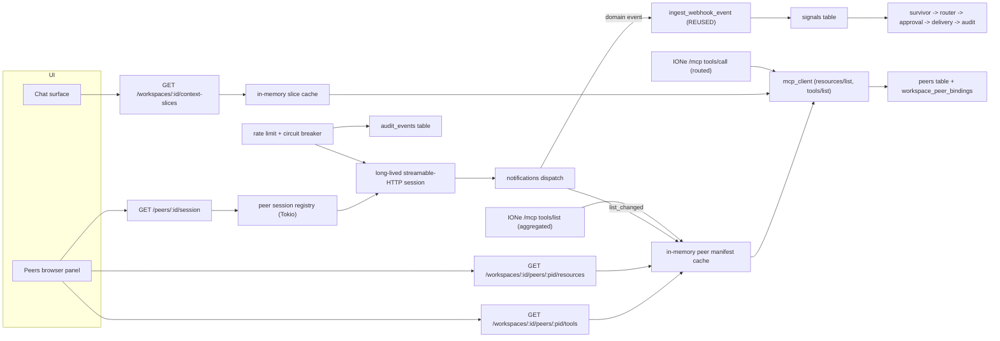
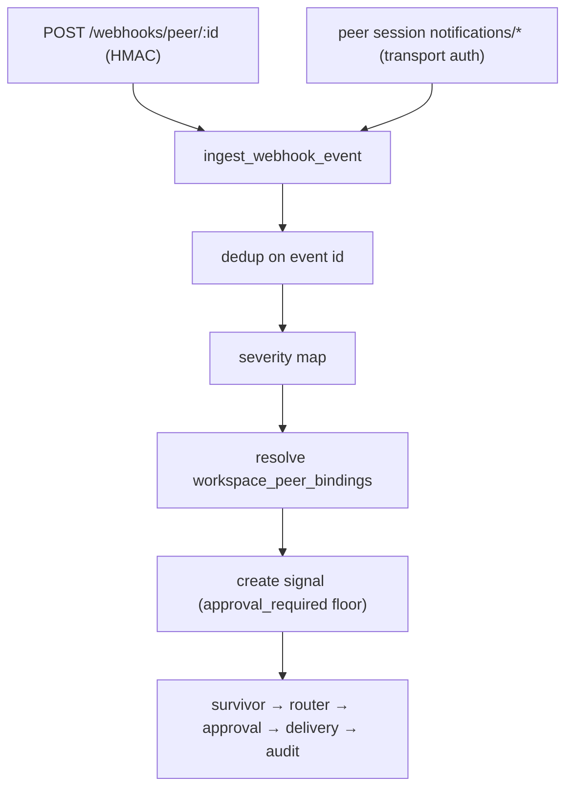
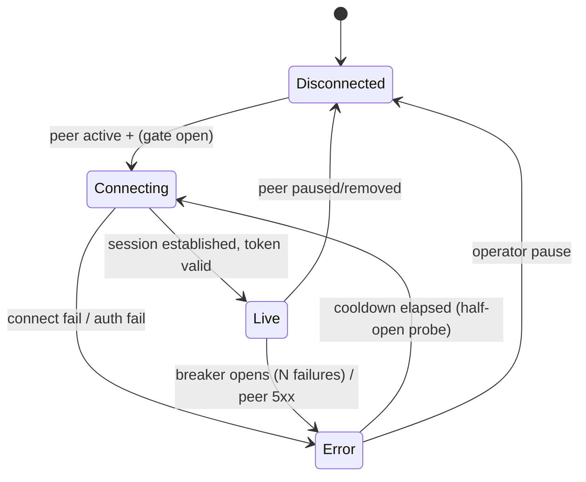

# MCP Federation Layer — Design

**Date:** 2026-05-31
**Status:** Draft for review. Covers "the whole thing" — the full MCP federation maturation, not just the notifications slice.
**Layers:** `db` (small), `api` (primary), `ui` (resource browser + peer session status).
**Parent:** [ione-substrate.md](ione-substrate.md) §1 (MCP federation hub). **Supersedes the v0.2 deferral note in** [push-ingress.md](push-ingress.md). **Contract source:** [app-integration-playbook.md](app-integration-playbook.md).

> **Provenance note.** Synthesized from this session's `/design` agent passes — product-manager, rust-api-architect, security-reviewer (all returned, incorporated below) — plus a confirmed transport grep. Code cited: `src/mcp_server.rs` (hand-rolled MCP 2025-03 over HTTP+SSE, `/mcp/sse` handler L887, hardcoded `tool_list` L91-157, no inbound notifications handler), `src/connectors/mcp_client.rs` (poll-only `jsonrpc_call`, `reqwest::Client::new()` per call, no stream, no redirect guard), `src/services/webhook_ingress.rs::ingest_webhook_event`. The security review's two **Critical** and four **High** findings are folded into [Security controls](#security-controls-acceptance-gate) and are acceptance gates, not optional.

---

## Infrastructure change gate

**No new infrastructure.** Long-lived peer sessions are in-process Tokio tasks inside the existing single binary. No new region, service, VPC, database, or queue. The only persistence additions are small columns/tables on the existing Postgres.

```
## Hypothesis Verification
- Premise: The MCP 2025-06 transport (HTTP + SSE / streamable-HTTP) carries server→client `notifications/*`, and IONe can hold N long-lived OUTBOUND sessions to peers. IONe's own MCP *server* already speaks HTTP+SSE (app-integration-playbook surface 1); its *client* is request/response only today.
- Cheapest test: `grep -n "event-stream\|Sse\|streamable" src/mcp_server.rs src/connectors/mcp_client.rs` — confirm the server's SSE path exists and the client has none.
- Result: VERIFIED ✓ — grep confirmed: `src/mcp_server.rs:1` "Hand-rolled MCP 2025-03 subset over HTTP+SSE", `/mcp/sse` GET handler at L887-902 (server already streams). `src/connectors/mcp_client.rs` is request/response only (`jsonrpc_call`, `reqwest::Client::new()` per call) — no client-side stream and **no SSRF/redirect guard** (the long-lived session must add both; see C-2).
```

**Simplest fix that avoids the biggest change:** keep webhooks as the domain-event push path and add only lightweight polling for protocol changes. This is the baseline the long-lived-session work must beat — see [Devil's Advocate](#devils-advocate). The conclusion below **phases** the design so the expensive session manager is gated behind a real demand signal.

---

## Problem statement

IONe's MCP support is half-built, and one part is actively misleading:

1. **IONe-as-server lies about its tools.** `tools/list` returns a **hardcoded static list**; it does not aggregate the tools its connected peers expose. An MCP client (or the chat model) asking IONe "what can you do?" gets a fixed answer unrelated to the federated portfolio. This is the most concrete defect.
2. **No push reception.** IONe-as-client only **polls** peer tools (`tools/call`) on a timer. It cannot receive server-initiated `notifications/*`. Webhooks are the only push ingest path, which forces every event-producing peer to implement a signed-webhook sender even when it already exposes MCP.
3. **No token economy.** The `slice://` context-slice contract is published (apps ship slices) but IONe never consumes them — so federating more than a couple of peers would balloon the chat model's system prompt with full tool definitions (O(peers×tools) tokens).
4. **No operator discovery, no peer-failure containment.** Operators cannot browse what a peer offers, and a slow or flooding peer has no rate limit or circuit breaker.

Why it matters now: MCP-native federation is IONe's stated differentiator (Path-2 rule). The Epicenter demo is the current demand signal. "Complete the MCP layer" is what turns "IONe federates apps" into "IONe federates apps *well, at scale, safely*."

---

## Consumption surfaces — MCP as another way to work with IONe

IONe has **two symmetric ways in**, and this design makes the second one real:

1. **The web shell** (human operator) — the adaptive-nav UI renders charts/tables/maps/documents and the approval queue (see [app-integration-state-machine.md](app-integration-state-machine.md) Machine 3).
2. **IONe's own `/mcp` server** (an AI client or agent) — Claude Desktop, an SDK agent, or another app connects to IONe over MCP and consumes IONe's **federated** surface: a unified `tools/list` across all peers, `tools/call` routed to the owning peer (approval-gated where required), `resources/read`, and the aggregated `slice://` capability view.

These are the same substrate viewed two ways: the shell is IONe-as-app; `/mcp` is IONe-as-tool. **Slice A is what makes surface 2 honest** — today `/mcp` `tools/list` is a hardcoded list that does not reflect the connected portfolio, so an agent asking IONe "what can you do?" gets a false answer. Treating MCP as a first-class entry point also raises the stakes on two security items: `tools/list` is currently unauthenticated (M-4) and would leak federated topology, and the approval floor (H-1) must hold for agent-initiated `tools/call` exactly as it does for the shell.

This reframes the app-builder docs: an app can *consume* IONe over MCP (surface 2) in addition to *plugging into* it as a peer or artifact. The [building-on-ione.md](../playbooks/building-on-ione.md) playbook should add this as a third relationship ("consume IONe's federated surface from your agent") alongside peer and artifact.

## Feature slices

> **Terminology — two senses of "slice":** *Feature slices* (capital "Slice A/B/…") are the vertical work units below. The *context-slice* (lowercase, the `slice://` MCP resource) is the peer-published capability summary consumed in Slice B. They are unrelated; the overlap is unfortunate but `slice://` is the published contract name.

Six vertical feature slices. They split into two groups: **Federation surface** (Slices A–C, F) — high value, no long-lived-session complexity; and **Push ingestion** (Slices D, E) — the expensive half, gated. See the phasing in [Devil's Advocate](#devils-advocate).

### Slice A — Dynamic tool aggregation + namespacing
*Replace the hardcoded `tools/list` with a live, per-peer-namespaced aggregate; route `tools/call` to the owning peer.*

- **DB:** a `peers.tool_prefix` column with a **`UNIQUE (org_id, tool_prefix)`** constraint (H-3 — peer names are operator-supplied and unconstrained, so prefixes are NOT collision-proof by construction; the DB must enforce it). Manifest/tool cache itself is in-memory, rebuilt from peers.
- **API:** IONe's own MCP server `tools/list` now returns aggregated tools, each namespaced `‹tool_prefix›:‹tool›`; `tools/call` parses the prefix and routes to the owning peer over the existing client. `tools/list` **must require the same auth as `tools/call`** once aggregation is live (M-4 — it would otherwise leak federated topology to unauthenticated callers). New operator view: `GET /api/v1/workspaces/:id/peers/:peerId/tools`.
- **UI:** the peer-browser panel (Slice F) lists a peer's tools with the namespaced id and approval flag.
- **Cross-references:** `tools/list` aggregation reads the `peers` table (active peers) + each peer's cached manifest; `tools/call` for `gp:list_alerts` routes through the MCP client to the peer whose slug is `gp`.
- **Collision policy:** prefixes are made unique at **peer-creation time** (derive from name, dedupe with `_2`/`_3`, persist) and enforced by `UNIQUE (org_id, tool_prefix)`. The aggregator **rejects duplicate-prefixed tools at load time with a logged error** rather than silently first-wins (H-3). IONe also rejects any peer-declared tool name containing the reserved `:` separator at manifest fetch. Two peers may both expose `list_alerts` — they become `gp:list_alerts` and `ty:list_alerts`; a peer that tries to name itself `gp` is reprefixed `gp_2`.

### Slice B — Context-slice ingestion + lazy expansion
*Consume peer `slice://` resources so the chat model routes on ~100–500 tokens/peer, expanding full tool schemas only on intent.*

- **DB:** none (slices cached in-memory, TTL + invalidation on `notifications/tools/list_changed`).
- **API:** internal — chat context assembly fetches each active peer's `slice://` via `resources/read` and injects `summary`/`domain_tags`/`sample_queries`/`tool_index` (names + 1-line, **no** full schema). On model tool-selection, IONe fetches the full `inputSchema` lazily (`tools/get` or the slice's `expand_uri`). Operator view: `GET /api/v1/workspaces/:id/context-slices`.
- **UI:** optional — show, in the peer browser, the slice summary and the resolved domain tags.
- **Cross-references:** chat (`POST /api/v1/chat`) reads aggregated slices instead of full `tools/list`; routing picks a peer+intent; expansion calls Slice A's routing.
- **Trust boundary (critical — H-2 prompt injection):** slice text and `tool_index` are **untrusted peer-supplied content** entering the model's system prompt (the router already interpolates peer-sourced signal title/body into Ollama prompts un-escaped — `src/services/router.rs` — so the surface exists today). Controls, all required: (1) inject slices inside **escape-proof delimiters** (sentinel-tagged block the model is instructed never to treat as instructions); (2) **length-bound** each slice (<2 KB) and strip characters that could break the delimiter; (3) **validate the post-LLM routing/tool selection against the operator-configured tool allowlist** — a slice can make a tool *discoverable*, never *callable* outside the allowlist + approval path. A malicious slice must not be able to redirect a `tools/call` to another peer or trigger auto-invocation.

### Slice C — Protocol-change reception (lightweight)
*Keep peer manifests fresh without a full long-lived session.*

- **DB:** none.
- **API:** on each poll cycle (existing scheduler) IONe re-reads `tools/list`/`resources/list` ETag/hash; on change, invalidate the Slice A/B caches. If a peer session exists (Slice D), `notifications/tools/list_changed` / `resources/list_changed` / `resources/updated` drive the same invalidation immediately.
- **UI:** none (cache refresh is invisible).
- **Cross-references:** the same cache invalidated by Slice A/B is refreshed here; this is the **fallback** that makes Slices A/B correct *without* requiring Slice D.

### Slice D — Per-peer notification session (the gated, expensive piece)
*Hold a long-lived streamable-HTTP session per active peer to receive `notifications/*`, converging domain events on the existing signal pipeline.*

- **DB:** `peers.session_status` (`disconnected|connecting|live|error`) + `last_connected_at`; reuse the existing webhook dedup table (or a `peer_event_seen` mirror) for notification `id` replay protection.
- **API:** internal supervisor (one Tokio task per active peer, bounded global concurrency) opens the session via a **redirect-blocking, SSRF-guarded client** (C-2 — the current `mcp_client` uses a bare `reqwest::Client::new()` with no guard; `validate_mcp_url` does not call the SSRF check, and `create_legacy_peer` bypasses the metadata-fetch guard entirely, so a one-time registration of `http://169.254.169.254/...` becomes a permanent session SSRF). Reconnect must **re-validate the target URL** (no following redirects to internal addresses). OAuth refresh on reconnect (migration 0032) must hold a **per-peer refresh mutex** shared with the scheduler poll path — otherwise the session's freshly-refreshed token is overwritten by the next poll's refresh, invalidating the session (the riskiest race in the design). Operator surface: `GET /api/v1/peers/:id/session` (status), `POST /api/v1/peers/:id/session/reconnect`.
- **Dispatch:**
  - **Domain-event notifications** → **reuse `ingest_webhook_event`**: dedup → severity map → resolve `workspace_peer_bindings` → create signals (with the approval floor). **C-1 (Critical): the `foreign_tenant_id` must be read from IONe's stored binding for the authenticated session's peer, NOT from the notification payload** — webhooks authenticate each event with HMAC; a session notification has no per-message proof, so an authenticated peer could otherwise inject events into any tenant binding it knows. Bind `peer_id` from the authenticated session, never from the message body.
  - **Protocol notifications** → Slice C cache invalidation, immediately. High-frequency protocol notifications are shed under the per-peer rate limit (Slice E); domain-event notifications are never dropped.
- **UI:** peer browser shows a live/disconnected/error session badge.
- **Cross-references:** session → notifications handler → `ingest_webhook_event` → `signals` table → existing survivor/router/approval pipeline.

### Slice E — Rate limiting + circuit breakers
*Bound the blast radius of a misbehaving peer; rides Slice D's session path and the client call path.*

- **DB:** none (in-memory token buckets + breaker state; surfaced via `session_status=error`).
- **API:** per-peer token bucket on inbound notifications and outbound calls; a breaker that, after N consecutive failures/timeouts, opens → marks the peer `error`, stops the reconnect storm, and emits one audit + one operator-visible signal. Half-open probe after a cooldown.
- **UI:** breaker-open shows as the peer's `error` session badge with a reason.
- **Cross-references:** breaker state feeds `GET /api/v1/peers/:id/session`; tripping writes an `audit_events` row.

### Slice F — Resource & tool browsing
*Let an operator see what a peer actually offers.*

- **DB:** none.
- **API:** `GET /api/v1/workspaces/:id/peers/:peerId/resources` and `.../tools` — enumerate the peer's `resources/list` (with `ione_view` hints) and namespaced tools (with approval flags), from cache.
- **UI:** a "Peers" browser panel listing, per bound peer: session badge, slice summary, tools (namespaced + approval flag), resources (with view type).
- **Cross-references:** reads the same cached manifests as Slices A/B; no new persistence.

---

## API Contracts

All endpoints are Bearer + org-scoped; workspace-scoped where a `:id`/`workspaceId` appears (membership enforced). "Internal" rows are not HTTP endpoints — they are the IONe MCP-server methods or background behaviors, listed for completeness.

| Endpoint | Method | Request | Response | Error Codes | Auth |
|----------|--------|---------|----------|-------------|------|
| /mcp (tools/list) | internal | JSON-RPC `tools/list` | aggregated `{ tools: [{ name: "‹slug›:‹tool›", description, inputSchema?, metadata.ione_approval? }] }` | -32603 | peer OAuth / session |
| /mcp (tools/call) | internal | JSON-RPC `tools/call { name:"‹slug›:‹tool›", arguments }` | peer result, or approval-pending receipt if `ione_approval.required` | -32602 (bad/unknown namespace), -32603 | peer OAuth / session |
| /api/v1/workspaces/:id/peers/:peerId/tools | GET | — | `{ items: [{ name, namespaced, description, approvalRequired: bool }] }` | 401,403,404 | Bearer+org |
| /api/v1/workspaces/:id/peers/:peerId/resources | GET | — | `{ items: [{ uri, name, mimeType, ioneView: enum?\|null }] }` | 401,403,404 | Bearer+org |
| /api/v1/workspaces/:id/context-slices | GET | — | `{ items: [{ peerId, summary, domainTags: string[], sampleQueries: string[], toolIndex: [{name, summary, approvalRequired}] }] }` | 401,403 | Bearer+org |
| /api/v1/peers/:id/session | GET | — | `{ peerId, sessionStatus: enum(disconnected,connecting,live,error), lastConnectedAt: ISO8601\|null, breaker: enum(closed,open,half_open), reason: string\|null }` | 401,403,404 | Bearer+org |
| /api/v1/peers/:id/session/reconnect | POST | `{}` | `{ peerId, sessionStatus: "connecting" }` | 401,403,404,409 | Bearer+org |
| notifications/* (inbound, over session) | internal | JSON-RPC notification (no `id` at the JSON-RPC layer; the domain event carries its own `id` for dedup) | none (fire-and-forget) | dropped on bad signature/binding | peer session (transport auth) |

**Reused, unchanged:** `POST /webhooks/peer/:peerId` and `ingest_webhook_event` — Slice D routes domain notifications through this exact fan-in.

---

## Wiring Dependency Graph



Every UI node reaches a DB/peer source. The notification path terminates at `signals` (then the existing pipeline). No dangling nodes.

---

## Security controls (acceptance gate)

From the security review. Each is a **blocking** control, not optional hardening; the acceptance criteria below encode them.

| ID | Severity | Control (minimum) | Lands in |
|----|----------|-------------------|----------|
| C-1 | Critical | Notification `foreign_tenant_id` and `peer_id` come from IONe's stored binding for the authenticated session, never from the message body. | Slice D |
| C-2 | Critical | `validate_mcp_url` calls the SSRF guard; the client/session uses a redirect-blocking guarded client; reconnect re-validates the target. Close the `create_legacy_peer` bypass. | Slice D + peer registration |
| H-1 | High | **Prerequisite (ONR-008):** generator- and rule-created `flagged`/`command` signals must set `approval_required=true` (today they hard-code `false` in `generator.rs`/`rules.rs`, so a `flagged` signal can reach auto-exec under the default `severity_cap`). The notification path inherits this; fix it before more signal sources go live. | pre-req, all signal sources |
| H-2 | High | Context slices injected in escape-proof delimiters, length-bounded; post-LLM tool routing validated against the operator allowlist. | Slice B |
| H-3 | High | `UNIQUE (org_id, tool_prefix)`; aggregator rejects duplicate-prefixed tools at load. | Slice A |
| H-4 | High | Peer bearer tokens are **not** stored in `connectors.config`; resolve at call time; secret config fields are `serde(skip)`/redacted in any connector-returning endpoint. | Slice A/D (token resolution) |
| M-1 | Med | Concrete bounds: reconnect exponential backoff ceiling 5 min + jitter; circuit breaker opens after 5 consecutive peer-side failures (4xx does **not** trip — that's IONe's fault), half-open probe after 30 s cooldown; per-peer manifest+slice memory cap (~1 MB). | Slice D/E |
| M-4 | Med | `tools/list` requires auth once aggregation is active; `initialize` may stay unauthenticated but must not advertise tool schemas. | Slice A |

Also tracked (lower severity, fix in pass): M-2 (`PeerRepo::get` lacks org scope), M-3/`IONE_WEBHOOK_SECRET_KEY` dev fallback, M-5 (NULL `token_expires_at` treated fresh), L-1 (in-memory rate limit is per-instance), L-3 (no audit row at notification→signal ingestion — add `source: peer_notification`), L-4 (DCR POST uses unguarded `state.http`).

## Acceptance criteria

**Slice A — aggregation + namespacing**
- Given a workspace bound to two active peers `gp` and `ty` that each expose a tool `list_alerts`, when a client calls IONe's `tools/list`, then the response contains both `gp:list_alerts` and `ty:list_alerts` and no bare `list_alerts`.
- Given a `tools/call` for `gp:list_alerts`, when invoked, then the call is routed to peer `gp` only and the response payload matches `gp`'s tool output.
- Given a peer manifest declaring a tool named `bad:name`, when IONe fetches the manifest, then the tool is rejected (logged) and excluded from `tools/list`.

**Slice B — context slices**
- Given two active peers each publishing a `slice://` resource, when chat context is assembled, then the model prompt includes both slices' `summary` + `tool_index` (names only) and **excludes** full `inputSchema` JSON, and total slice payload is < 2 KB/peer.
- Given the model selects intent matching `gp:generate_report`, when IONe expands it, then exactly one `inputSchema` is fetched (for `gp:generate_report`) and no other peer's schemas are loaded.

**Slice C — protocol-change reception**
- Given a peer whose `tools/list` hash changes between poll cycles, when the next poll runs, then the cached manifest is replaced and a subsequent `GET /peers/:pid/tools` reflects the new tool set.

**Slice D — notification session → signals**
- Given an active peer with a `live` session and an active `workspace_peer_binding` for `tenant-A`, when the peer emits a domain notification `{id, severity:"flagged", foreign_tenant_id:"tenant-A"}`, then within the session a `signal` is created in that workspace with `approval_required=true` and a matching `audit_events` row exists.
- Given the same notification `id` delivered twice, when processed, then exactly one signal exists (idempotent dedup).
- Given a domain notification whose `foreign_tenant_id` has **no** active binding for that peer, when processed, then no signal is created and the event is dropped (not routed to another tenant's workspace).
- Given a peer session drops, when reconnect runs, then `peers.session_status` transitions `error→connecting→live` and the OAuth access token used is refreshed (not the expired one).

**Slice E — rate limit + breaker**
- Given a peer emitting notifications above the configured per-peer rate, when the bucket is exhausted, then excess notifications are shed (counted in a metric) and no unbounded memory growth occurs.
- Given a peer that fails/times out N consecutive times, when the breaker opens, then `session_status=error`, reconnect attempts stop until the cooldown, exactly one operator-visible signal + one audit row are written, and a half-open probe is attempted after the cooldown.

**Slice F — browsing**
- Given a workspace bound to peer `gp`, when `GET /workspaces/:id/peers/gp/resources` is called, then the response lists `gp`'s resources with their `ioneView` (or null) and status is 200.

**Security (gate)**
- (C-1) Given peer `gp` with a binding for `tenant-A`, when `gp` emits a session notification claiming `foreign_tenant_id:"tenant-B"`, then no signal is created for `tenant-B` and the resolved tenant is `tenant-A` (from IONe's binding) or the event is dropped.
- (C-2) Given a peer registered with `mcp_url` resolving to a link-local/private address, when registration is attempted, then it is rejected; and given a peer that 3xx-redirects its session connect to an internal address, when reconnecting, then the redirect is not followed.
- (H-1) Given a rule that emits a `flagged` signal, when it is created, then `approval_required=true` and auto-exec does not run on it.
- (H-2) Given a peer slice whose `summary` contains text resembling system instructions, when chat context is assembled and the model is queried, then tool routing only selects tools in the operator allowlist and no auto-invocation occurs.
- (H-3) Given two peers whose names both derive prefix `gp`, when the second is created, then it persists a distinct prefix (`gp_2`) and `tools/list` shows no duplicate `gp:` names.
- (M-4) Given aggregation is active, when `tools/list` is called without auth, then the response is 401/empty (no peer tool schemas).

---

## Tradeoffs

| Decision | Alternative | Why this wins |
|----------|-------------|---------------|
| Namespacing by `‹prefix›:` prefix (+ one `tool_prefix` column, `UNIQUE(org_id,prefix)`) | A registry table mapping opaque tool ids → peer | Prefix is human-readable in chat/audit and routes statelessly; it needs only one column + a unique constraint, not a join table. (Earlier draft wrongly claimed "no migration" — H-3 requires the unique constraint.) |
| Reuse `ingest_webhook_event` for notifications | A parallel notification→signal path | One fan-in = one place to enforce dedup, severity floor, binding routing, and the ONR-008 approval fix. Two paths drift. |
| Slices injected as fenced untrusted reference | Inject `tool_index` as part of system instructions | Peer-supplied text in the instruction channel is a prompt-injection vector. Fencing keeps it data, not commands. |
| Long-lived session per peer (Slice D) **gated** | Build it now unconditionally | At ≤3 self-hosted peers, webhooks already cover domain push; the session manager is the highest-complexity, highest-risk piece. Gate it behind a peer that needs sub-poll latency. (See Devil's Advocate.) |
| Protocol-change via poll (Slice C) as the floor | Require Slice D for freshness | Makes Slices A/B correct without the session manager — decoupling the cheap, high-value work from the expensive work. |

---

## Devil's Advocate

**1. The single load-bearing assumption.** That a **long-lived per-peer notification session (Slice D) is worth building now.** Everything expensive and risky in this design — reconnect/backoff, token refresh over a live socket, circuit breakers, the slow-loris/flood DoS surface — exists only to serve Slice D. Slices A, B, C, F do not need it.

**2. Has it been verified against live state?** Two sub-claims:
- *Transport supports it:* VERIFIED ✓ (this session, code-cited: IONe's MCP server already speaks HTTP+SSE; the 2025-06 spec carries server→client notifications). Live re-grep blocked by tooling.
- *A peer actually needs it now:* **REFUTED ✗.** No current peer emits domain notifications over MCP. GroundPulse/TerraYield are poll/REST today (no MCP server shipped yet — the playbook reference impls are stubs). The Epicenter demand signal is for **visualization** (charts/tables/maps — P0, shipped), not sub-poll push. Webhooks already cover the one push path anyone has asked for. So the assumption that justifies the expensive half is *not* supported by live demand.

**3. Simplest alternative that avoids the biggest risk.** Ship the **Federation surface only** now — Slice A (kill the hardcoded `tools/list` — this is a real, present defect), Slice B (token economy, needed the moment a 2nd peer connects), Slice C (cheap manifest freshness via the existing poll), Slice F (operator browsing). **Defer Slices D + E** (sessions, rate/breaker) behind an explicit re-entry gate: *the first peer that exposes an MCP server emitting domain `notifications/*`, or a demo requiring sub-poll-latency push.* Until then, webhooks remain the domain-event push path and lose nothing.

**Resolution (sharpened by the PM pass):**
- **Do now (~3–4d):** the **H-1 prerequisite** (set `approval_required` for flagged/command at every signal source — this is a present correctness/security bug and gates everything that produces signals), then **Slice A** (kills the hardcoded `tools/list`, a present defect, and makes MCP-as-entry-point honest — your "another way to work with IONe" note), plus **Slice C** (cheap poll-based `list_changed` freshness so A stays correct).
- **Do next, cheap, when a 2nd peer connects:** **Slice B** phase-1 (slice cache + lazy expansion) and **Slice F** (operator browsing). Both are low-risk but not blocking at peer count 1.
- **Design fully here, build gated:** **Slices D + E** (long-lived sessions, rate/breaker). The gate: *a named peer that emits MCP domain `notifications/*`, or a demo needing sub-poll latency.* Until then webhooks remain the domain-push path and lose nothing.

This honors "design the whole thing" while refusing to build the speculative, highest-risk half ahead of demand. If the reviewer wants D/E now, name the MCP-emitting peer before committing the ~5–6 extra days and the session-management attack surface (C-1, C-2, M-1).

> **Owner override (2026-05-31):** the owner chose to **build D/E now**. The refuted assumption above is *not* thereby validated — it is a risk the owner has accepted. Because D/E ship, C-1 (binding-spoof), C-2 (session SSRF/redirect), and M-1 (reconnect/breaker/memory bounds) move from "designed" to **mandatory acceptance gates in the first implementation pass**. Recommend still naming the first emitting peer before D's implement step, to lock transport (Q3) and the `foreign_tenant_id`/`whoami` resolution (C-1) against a real peer rather than a hypothetical one.

**4. Structural completeness checklist**
- [x] Every UI component's API appears in the contract table (peer browser → tools/resources/session; chat → context-slices).
- [x] Every endpoint implies a source: aggregation/browse → manifest cache → `mcp_client` → `peers`/`bindings`; notifications → `ingest_webhook_event` → `signals`. No new repo method needed for cache reads (in-memory); session status reads `peers`.
- [x] New fields appear in all relevant layers: `session_status`/`breaker` → `peers` column (DB) → `GET /peers/:id/session` (API) → peer browser badge (UI). Namespaced tool name → aggregation (API) → audit/chat + browser (UI).
- [x] Each acceptance criterion names a concrete endpoint/observable (tools/list contents, signal row + audit row, session_status transition, etc.).
- [x] Wiring graph has an unbroken UI→…→DB/peer path for every feature; notification path ends at `signals`.
- [x] Integration scenarios per slice exist (the Given/When/Then set exercises full paths: notification→signal, namespaced tools/call→peer, slice expansion→single schema fetch).

---

## Diagrams

**Notification vs webhook convergence (the one fan-in):**


**Peer session lifecycle (Slice D):**


---

## Open questions

1. **Slice D gate (the decision that blocks D/E):** **RESOLVED (owner, 2026-05-31) — BUILD D/E NOW.** The owner elected to build the long-lived session manager + rate/breaker in this effort, overriding the devil's-advocate recommendation to gate it. **Risk accepted:** the justifying assumption (a near-term peer emitting MCP domain `notifications/*`) is still unverified — no peer named yet. Consequence: all six slices are in scope (~11–12d incl. hardening), and the session-security controls **C-1, C-2, M-1 are now load-bearing, not hypothetical**. *Sub-ask for implement:* name the first MCP-notification-emitting peer so Q3's transport and the C-1 binding/`whoami` details can be locked to it.
2. **Peer prefix rename policy:** **RESOLVED (2026-05-31)** — `tool_prefix` is **immutable once set**; renaming a peer keeps its prefix. Avoids breaking in-flight namespaced `tools/call` references and audit history.
3. **Transport for the outbound Slice D session:** **RESOLVED (default, 2026-05-31)** — **streamable-HTTP (MCP 2025-06)**, since IONe's server already speaks HTTP+SSE and it's the current spec; final lock deferred to D's implement time to match the first emitting peer.
4. **Session concurrency cap:** **RESOLVED (default, 2026-05-31)** — global semaphore `min(active_peers, 20)` on connect/reconnect; steady-state SSE tasks are await-bound. Revisit only above ~20 peers.

---

## Commercial linkage

- **Slice A** removes a credibility bug: an MCP client introspecting IONe currently sees tools unrelated to the federated apps. For an MCP-native pitch, IONe must tell the truth about its federated surface.
- **Slice B** is what lets a demo connect 3+ apps without the chat model's context (and cost/latency) exploding — directly supports the "one workspace over a polyglot portfolio" story.
- **Slice F** is the operator-visible proof of federation ("here's everything GroundPulse exposes, in IONe"). Good demo surface.
- **Slices D/E** are infrastructure the buyer never sees until a peer needs live push — correctly deferred until that buyer exists.

## Requirements impact

- [app-integration-playbook.md](app-integration-playbook.md): (a) surface 1 lists `notifications/*` as a required MCP method for apps. This design makes IONe *consume* them (Slice D, gated) and clarifies that **webhooks remain the supported domain-push path until a peer emits MCP notifications**. Update the surface-3 vs surface-1 wording to state the two are equivalent fan-ins and webhooks are the v0.x default. (b) Add a **third relationship** beyond peer/artifact: *consume IONe's federated MCP surface from your own agent* (the [building-on-ione.md](../playbooks/building-on-ione.md) "Consumption surfaces" addition).
- [ione-substrate.md](ione-substrate.md) §1: marks tool namespacing, context slices, rate limiting, circuit breakers, resource browsing as "required maturation (designed)". This doc moves A/B/C/F to **scheduled** and D/E to **scheduled-gated** — reconcile the §1 status list.
- [push-ingress.md](push-ingress.md): its "notifications deferred to v0.2 — separate channel" note is superseded; notifications now converge on `ingest_webhook_event` rather than a separate channel. Update or cross-link.
- [infrastructure-backlog.md](../plans/infrastructure-backlog.md): "MCP notifications/* reception ← next P1" should be re-tagged — this design argues A/B/F are higher-value-now than D, and D is gated. Reconcile the P1 label.
