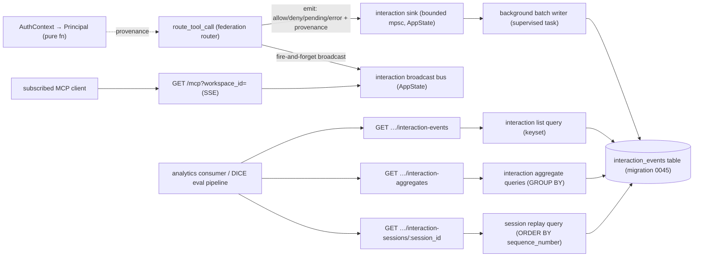

# Observability Data Plane (OBS-1..OBS-4)

**Status:** Reviewed (PM + rust-api-architect + sql-architect + devil's advocate + technical-writer passes complete) — ready for `/implement`
**Layers:** `db` (one new table + indexes), `api` (read endpoints + MCP SSE push); **no `ui`** in v1 (consumers are programmatic)
**Demand signals:** DARPA DICE TA3 abstract §2.4 (monitoring layer) + §2.7 ("async lock-free capture, <5% overhead") · every domain app on the substrate (GroundPulse, TerraYield, bearingLineDash) wants a low-latency, subscribable interaction stream for audit/billing/anomaly analytics
**Backlog:** `md/plans/infrastructure-backlog.md` → "Observability data plane" (OBS-1..OBS-4)

---

## Problem statement

IONe's federation router (`route_tool_call`) is the single point every federated tool call passes through — and it emits **no event at all**. The compliance trail (`audit_events`) only fires on low-frequency events (approval decisions, deliveries, peer notifications) via **synchronous inline inserts** on the request thread. The result:

- **The DICE §2.4 monitoring claims are unbacked.** "Tool-call logs yield interaction counts" has no per-call record at the router. "Per-agent inference-step tracking" has no per-agent, per-step provenance anywhere.
- **The DICE §2.7 "<5% overhead, async lock-free" claim is contradicted by code.** Audit writes block the request thread; a DARPA reviewer reading the repo finds the opposite of the claim.
- **Commercial apps can't build session-level analytics.** A GroundPulse analyst asking "what did the agent do across all peers in that incident?" has no session correlation to join on, and no way to react to interactions in real time (the only consumer pattern is polling a 200-row list).

The audit infrastructure was built as a compliance trail, not a data product. This design retrofits a **separate, async, agent-correlatable, subscribable interaction stream** — the substrate-level capture layer — without weakening the compliance trail.

## What this feature is

A new high-volume **interaction event** stream: every federated tool call at the router is captured (allowed, denied, pending-approval, or errored), tagged with stable caller provenance and a per-session sequence, written off the hot path by an async background batch writer, queryable for analytics, and pushable to subscribed MCP clients in real time.

**The boundary that defines scope (Path 2 substrate rule):** IONe owns **capture** — emit structured, provenance-tagged events onto a queryable + subscribable stream. The DICE-MDO app (and every other app) owns **compute** — role-coherence scoring, MSR, time-to-recover, anomaly models. No scoring logic, no DICE-specific field, no standalone trace-viewer UI enters IONe core. If a proposed addition interprets the events rather than emitting them, it has crossed the line.

## Relationship to the existing compliance trail

`audit_events` (compliance) and `interaction_events` (telemetry) are **two separate tables with opposite guarantees**, and that separation is the core architectural decision (both technical reviewers reached it independently):

| | `audit_events` (unchanged) | `interaction_events` (new) |
|---|---|---|
| Purpose | Compliance: who approved/delivered what | Telemetry: every tool-call interaction |
| Write | **Synchronous**, `RETURNING id`, caller blocks until durable | **Async** fire-and-forget via batch writer |
| Loss tolerance | Zero (used as idempotency proof in `delivery.rs`) | Bounded, measured, documented (see Durability) |
| Cardinality | Low (approvals/deliveries) | High (1M/scenario at DICE scale) |
| Retention | Indefinite (NIST 800-171 AU-11) | 90-day API window v1; partition-drop TTL future |

The hot path (`route_tool_call`) writes **only** to the async interaction stream — it never adds a synchronous `audit_events` write. That is precisely what makes the §2.7 "<5% overhead, async" claim true. Compliance audit rows continue to be written synchronously **only** at the existing low-frequency sites (e.g. `execute_pending_tool_call`), which are not on the per-call hot path.

> Naming note: a `telemetry` route module already exists (`src/routes/telemetry.rs`, product-funnel analytics). This feature is **`interaction_events` / `interaction-*`**, never "telemetry," to avoid collision.

## Honest scoping — what v1 ships vs. what stays future

| Claim / capability | v1 deliverable | Deferred |
|---|---|---|
| §2.4 interaction counts | ✅ Per-call event at the router; count-by-bucket / by-principal / outcome aggregates | — |
| §2.4 per-agent step tracking (role-coherence *capture*) | ✅ `session_id` + monotonic `sequence_number` enable ordered per-session replay | The *scoring* (drift threshold, coherence length) is DICE-MDO app compute, not IONe |
| §2.7 async, <5% overhead | ✅ Bounded channel + background batch writer; hot path does a non-blocking send | The measured benchmark number is the separate "MCP routing throughput benchmark" backlog item |
| Real-time consumption | ✅ MCP SSE push (OBS-4) + REST re-fill | External sinks (S3/SIEM), partitioning, materialized aggregate views |
| OTel interoperability | Domain field names (`session_id`, `sequence_number`) | OTel `trace_id`/`span_id` mapping — documented as future, see Tradeoffs |

## Non-goals

- Making the compliance `audit_events` path async (it must stay synchronously durable).
- Any IONe-internal subscriber that aggregates/interprets events (rolling counters, session-reconstruction service) — apps build these above the stream.
- A standalone observability dashboard or trace-tree UI — prohibited standalone-product positioning until the Y3 gate.
- Any DICE-specific event type or field name — generic provenance only.
- Agent-internal telemetry (token cost, model, temperature) — apps own this ("compute observability of remote apps is not an IONe layer," Path 2 rule). The `detail` JSONB is the escape valve if an app attaches its own at write time.
- Partitioning, retention automation, materialized views — documented scale-hardening, not v1.

---

## Feature slices

### Slice 1 — Async interaction capture (OBS-1)

The capture substrate: a bounded in-process channel in app state and a supervised background task that drains it and bulk-inserts batches.

- **DB:** new `interaction_events` table (see Slice 3 for columns — they ship together; the table is created once with full provenance).
- **API:** none directly; this slice is the write path. The hot path performs a non-blocking send.
- **UI:** none.
- **Runtime contract:** the send is fire-and-forget. On channel-full, the newest event is dropped and a drop-counter increments (telemetry loss is acceptable and measured; this is **not** the compliance trail). The writer flushes on batch-size-reached **or** interval-elapsed, drains remaining events on graceful shutdown, and is supervised (restart-on-panic) so a writer crash never degrades the hot path.
- **Wiring:** `route_tool_call` → interaction sink (bounded channel) → background batch writer → `interaction_events` table.

### Slice 2 — Router interaction emission (OBS-2)

Emit exactly one event per federated tool call, at every meaningful exit of `route_tool_call`.

- **DB:** none beyond Slice 3.
- **API:** none (instrumentation of an existing internal path).
- **UI:** none.
- **Emission points:** **denied** (RBAC block, before the bail), **pending** (approval required), **allowed** (peer returned success), **error** (peer call failed). Wall-clock latency is measured from router entry to each exit and carried on the event; latency is null only for the denied path (no dispatch).
- **Cross-reference:** every event carries the Slice 3 provenance. This slice has no read surface of its own; Slice 4 reads what it captures.
- **Wiring:** `route_tool_call` exits → interaction sink (Slice 1).

### Slice 3 — Event schema + provenance (OBS-3)

The `interaction_events` table and the stable-principal + session-correlation model. Ships in the same migration as Slice 1's table (provenance cannot be retrofitted onto a frozen schema cheaply).

- **DB:** `interaction_events` table with denormalized `org_id`, caller-principal columns, `session_id`, `sequence_number`, `outcome`, `latency_ms`, `detail`, `recorded_at`; five indexes (below).
- **API:** the provenance fields surface in Slice 4 responses.
- **UI:** none.
- **Provenance model:** every event resolves `AuthContext` to a **principal** — one of *user* (carries user id), *service_account* (carries token id), or *peer* (carries peer id). `org_id` and `workspace_id` are always present. `session_id` is the correlation anchor (the MCP transport session when present, else the login session, else null for sessionless headless calls). `sequence_number` is a monotonic per-session counter (null when no session). Principal resolution is a pure function of `AuthContext` — no DB call on the hot path.
- **Wiring:** populated by Slice 2 emission; read by Slice 4 + Slice 5.

### Slice 4 — Read surface for analytics (part of the OBS-1→3 unit)

The query endpoints that let an evaluator/app consume what was captured (and that make the capture testable).

- **DB:** none beyond Slice 3 indexes.
- **API:** three read endpoints — filterable list (keyset paginated), aggregates (count-by-bucket / count-by-principal / outcome-summary), and per-session ordered replay. All admin-gated (coc ≥ 80) until RBAC's `audit:read` lands, matching the `audit-event-export` precedent.
- **UI:** none in v1 (the existing audit panel may gain a tab in a later UI pass; out of scope here).
- **Wiring:** consumer → read endpoint → interaction-event repository query → `interaction_events`.

### Slice 5 — MCP server→client push (OBS-4, independent)

Real-time fanout of interaction events to subscribed MCP clients over the existing SSE surface. Sequenced **after** Slices 1–4 (the events must be complete and provenance-tagged before pushing them is worth anything).

- **DB:** none.
- **API:** the existing MCP `GET /mcp` SSE transport gains an optional `workspace_id` subscription parameter; when present and authorized, the stream fans in interaction events as JSON-RPC `notifications/tools/interaction` messages. A second broadcast channel (distinct from the Slice 1 write channel) drives the fanout — same idiom as the existing `PipelineBus`.
- **UI:** none.
- **Authz:** subscription is workspace-scoped and verified at subscribe time (caller's org must match the workspace's org); a client only ever receives events for workspaces it can see. Slow subscribers lag and re-fill from the Slice 4 list endpoint on reconnect.
- **Wiring:** emission (Slice 2) → interaction broadcast bus → workspace-scoped SSE subscriber → MCP client.

---

## API contracts

| Endpoint | Method | Request schema | Response schema | Error codes | Auth |
|---|---|---|---|---|---|
| `/api/v1/workspaces/:id/interaction-events` | GET | `?peer_id=UUID&caller_user_id=UUID&outcome=enum(allow,deny,pending,error)&session_id=UUID&since=ISO8601&until=ISO8601&cursor=opaque&limit=int(1..200)` — window ≤ 90d; if `until` absent defaults to now, if `since` absent defaults to `until − 90d` | `{ items: InteractionEvent[], next_cursor: string\|null }` | 400, 401, 403, 404 | Session/SA + workspace-in-org + admin (coc ≥ 80) |
| `/api/v1/workspaces/:id/interaction-aggregates` | GET | `?op=enum(count_by_bucket,count_by_principal,outcome_summary)&bucket=enum(minute,hour,day,week)&peer_id=UUID?&since=ISO8601&until=ISO8601` — `bucket` **required when** `op=count_by_bucket`, **400 when** sent for other ops; window ≤ 90d; ≤ 1000 buckets; ≤ 200 principals | Per-op shape, see below | 400, 401, 403, 404 | same as above |
| `/api/v1/workspaces/:id/interaction-sessions/:session_id` | GET | path `session_id=UUID`; `?limit=int(1..1000)` | `{ session_id: UUID, items: InteractionEvent[] }` ordered by `sequence_number` ASC | 400, 401, 403, 404 | same as above |
| `GET /mcp?workspace_id=:id` (SSE) | GET | `workspace_id=UUID` query param on the existing MCP SSE transport | SSE stream of JSON-RPC notifications, method `notifications/tools/interaction`, params = `InteractionEvent` | 401, 403, 404 | MCP auth (`resolve_auth`) + workspace-in-org |

**`InteractionEvent` shape (response):** id (UUID), org id (UUID), workspace id (UUID), peer id (UUID·null), peer name (string·null), tool name (string), caller kind (enum: user/service_account/peer), caller user id (UUID·null), caller token id (UUID·null), caller peer id (UUID·null), session id (UUID·null), sequence number (int·null), outcome (enum: allow/deny/pending/error), latency ms (int·null when outcome=deny; int≥0 otherwise), detail (JSON object, opaque, ≤4KB), recorded at (ISO8601).

**Per-op shapes for `interaction-aggregates`:**
- `count_by_bucket` → `{ op, bucket, groups: [{ peer_id: UUID\|null, bucket_start: ISO8601, count: int }] }`
- `count_by_principal` → `{ op, groups: [{ caller_kind: enum(user,service_account,peer), caller_id: UUID, count: int, deny_count: int }] }` — ≤ 200, count-desc. **The group key is the resolved principal**: `caller_id` is whichever of `caller_user_id` / `caller_token_id` / `caller_peer_id` is non-null for that `caller_kind`, so the aggregate covers headless and peer callers, not just users.
- `outcome_summary` → `{ op, groups: [{ peer_id: UUID\|null, outcome: enum, count: int }] }`

**Contract rules:** `outcome`, `op`, `bucket` are allow-listed enums (injection-guard pattern from the existing aggregates endpoints); all filter values are bound parameters, never interpolated; no wildcard/regex modes. The `peer_id` query param filters the underlying rows for **all** ops regardless of the grouping dimension. Every field the response carries appears in the `InteractionEvent` shape above — no consumer may infer shapes from prose.

## Wiring dependency graph

Every path is unbroken from producer/consumer to the `interaction_events` table. The two channels (write-sink mpsc, fanout broadcast) share only the emit site — no shared state after emission.

## Data shapes — `interaction_events`

Columns (domain terms): **id**; **org id** (denormalized — see Tenancy); **workspace id**; **peer id** (null for internal/local calls) + **peer name** (snapshot at event time, since peers can be renamed); **tool name** (bare, not namespaced); **caller kind** (user / service_account / peer, reusing the existing `actor_kind` enum); **caller user id / caller token id / caller peer id** (exactly one set per the caller kind); **session id** (nullable correlation anchor); **sequence number** (nullable monotonic per-session); **outcome** (allow / deny / pending / error, CHECK-constrained string per the `pipeline_events.stage` pattern, not a new enum type); **latency ms** (null when `outcome='deny'`; non-null for `allow`, `pending`, and `error`); **detail** (JSONB, default `{}`, app-layer 4KB cap); **recorded at** (router wall-clock timestamp — the partition key and primary sort; named distinctly from DB-insert time, which lags under batch buffering).

Append-only: no `updated_at`, rows never mutate. CHECK: at least one caller-principal reference is non-null; `sequence_number >= 1` when present; `peer_name` non-null when `peer_id` set.

**Indexes (v1):** `(workspace_id, recorded_at DESC)`; `(workspace_id, peer_id, recorded_at DESC)`; `(workspace_id, caller_user_id, recorded_at DESC) WHERE caller_user_id IS NOT NULL`; `(session_id, sequence_number)`; `(org_id, recorded_at DESC)` (built now, queried when org-level analytics endpoints land — cheaper than `ADD CONCURRENTLY` on a large table later).

**Deviation from the schema review (recorded):** the sql-architect specified `session_id` and `sequence_number` as NOT NULL. This design makes both **nullable** — headless service-account and direct REST callers legitimately have no MCP session, and forcing a synthetic per-call session would corrupt the per-session replay semantics the role-coherence consumer depends on. Sessioned MCP agent calls (the role-coherence case) always carry both.

## Tenancy & security model

- **Denormalized `org_id`** on every row (unlike `audit_events`, which joins to `workspaces`). Justification: at 1M rows/scenario the per-query join cost multiplies across parallel analytics queries, and time-range partitioning (future) needs org isolation in the WHERE clause to preserve partition pruning. `org_id` is available at the router with no extra lookup; cost is 16 bytes/row.
- **Isolation** is the `org_id` WHERE predicate in every query plus the route-layer workspace-in-org check — the same defense-in-depth posture as `audit_events`. An RLS policy is defined for parity but is inert until the app sets the session variable (pre-existing codebase defect, not fixed or relied on here).
- **Authz tiers (pre-RBAC):** all three read endpoints are admin-gated (coc ≥ 80) — bulk retrieval of every principal's interactions is a materially broader exposure than the existing per-workspace audit list. Names the future `audit:read` permission (`md/design/rbac-scaffolding.md`); when RBAC ships, the rbac-scaffolding "gates applied" table must be updated to include the three interaction-events endpoints and the SSE subscription under `audit:read`. The SSE subscription requires workspace-in-org and the same gate.
- **Limits:** 90-day query windows, ≤1000 buckets, ≤200 principals, list `limit` ≤200, session replay ≤1000 — guards connection/stream DoS by authenticated callers.
- **No secret leakage:** the `detail` JSONB carries only deny reasons, approval ids, and error codes — never raw upstream error strings (those stay on the compliance path, which already has the `audit-event-export` scrub). The 4KB cap is enforced by the batch writer before insert.
- **Compliance framing:** supports NIST 800-171 AU-12 (on-demand review of agent actions) through the API; the admin gate supports AU-9.

## Durability & loss policy

The interaction stream is telemetry, not compliance — bounded loss under extreme burst is acceptable, **stated openly** rather than hidden:

- Channel is **bounded** (capacity a documented tuning constant, ~4096). On full, the **newest** event is dropped and a drop counter increments; the hot path never blocks.
- A process crash loses the in-memory batch (≤ one flush window, ≤ ~500 events or ≤ 500ms). This is acceptable because (a) the DICE §2.4 metrics are statistical aggregates (counts, distributions) tolerant of bounded sampling loss, and (b) §2.7 explicitly endorses async lock-free capture as the design. Compliance events remain on the synchronous zero-loss `audit_events` path.
- Drop count and last-flush age are exposed as operational counters so loss is **measurable**, not silent.
- Graceful shutdown drains the channel and flushes a final batch before exit.

## Tradeoffs

| Decision | Alternative | Why this wins |
|---|---|---|
| New `interaction_events` table | Extend `audit_events` | Async fire-and-forget can't coexist with the compliance table's synchronous-durability + idempotency-proof guarantees; different retention, cardinality, indexes. Two reviewers reached this independently. |
| Hot path emits async only; never sync-audits | Add a synchronous audit row per tool call | A synchronous insert per call is exactly the §2.7 overhead the design exists to remove. |
| Bounded channel, drop-newest, measured loss | Unbounded channel / durable queue (WAL) | Unbounded risks OOM under burst; a durable queue is real infrastructure unjustified for statistical telemetry. Loss is bounded, documented, counted. |
| `session_id`/`sequence_number` nullable | NOT NULL (per schema review) | Headless/REST callers have no session; a synthetic per-call session would break per-session replay semantics. |
| Domain field names now | Adopt OTel `trace_id`/`span_id` now | Full OTel trace-context propagation across federated peers is real work and IONe is not a tracing system. v1 ships domain names; a future OTel mapping layer can project them. Recorded as the top deferred interop item. |
| Separate broadcast bus for SSE | Reuse `PipelineBus` | `PipelineEvent` is a different domain type; existing pipeline subscribers would receive irrelevant traffic. New bus, new type, same idiom. |
| No partitioning in v1 | Partition from day one | Postgres handles ≤20M append-only rows unpartitioned; partitioning is documented future work triggered at >5M rows or >30s retention deletes. |

## Acceptance criteria

All mechanically verifiable against a seeded workspace; each maps to an integration test.

1. **Capture coverage** — Given a workspace and an allowed federated tool call routed through `route_tool_call`, when the call completes, then within one flush window exactly one `interaction_events` row exists with `outcome='allow'`, the correct `peer_id`/`tool_name`, and `latency_ms` ≥ 0.
2. **Denied path** — Given a caller lacking the `tool_invoke` grant, when they route a federated tool call, then the call is rejected **and** exactly one row exists with `outcome='deny'` and `latency_ms` null.
3. **Provenance — service account** — Given a service-account-token caller, when it routes a tool call, then the row has `caller_kind='service_account'`, `caller_token_id` = the token id, and `caller_user_id` null.
4. **Session correlation** — Given a single MCP session that routes 20 tool calls, when the rows are read via `GET …/interaction-sessions/:session_id`, then all 20 share one `session_id` and carry `sequence_number` 1..20 strictly increasing with no gaps, returned in ascending order.
5. **Async / non-blocking** — Given the interaction sink's channel is artificially saturated, when a tool call is routed, then the call still returns successfully (the send is dropped, the drop counter increments, and `route_tool_call` latency is unaffected) — verified by asserting the call succeeds while the drop counter advances.
6. **Aggregates — counts** — Given 50 allowed and 10 denied calls to peer P in a 1-hour window, when `GET …/interaction-aggregates?op=outcome_summary&since=…&until=…` is called by an admin, then the response groups contain `{peer P, allow, 50}` and `{peer P, deny, 10}`.
7. **Aggregates — bucketing** — Given calls spanning 3 hours, when `op=count_by_bucket&bucket=hour` is called, then the per-bucket counts sum to the seeded total; sending `bucket` to `op=outcome_summary` returns 400.
8. **Authz** — Given a non-admin workspace member, when they call any of the three read endpoints, then status is 403; given a member of a different org calling with this workspace id, then status is 404 and zero foreign rows are returned.
9. **Graceful drain** — Given N buffered, un-flushed interaction events, when the writer receives a shutdown signal, then all N are flushed to `interaction_events` before the task exits (no loss on clean shutdown).
10. **SSE push (OBS-4)** — Given an MCP client subscribed to `GET /mcp?workspace_id=W` for a workspace it can access, when a tool call is routed in W, then the client receives a JSON-RPC `notifications/tools/interaction` message whose params match the persisted row within 200ms (p95); a client subscribing to a workspace in a different org receives 403 at subscribe time.
11. **Tenant scoping at push** — Given two workspaces in different orgs, when a tool call is routed in workspace A, then a client subscribed only to workspace B (different org) never receives that event.

## Open questions

1. **MCP session id threading.** `AuthContext.session_id` is the login session, not the MCP transport session. The MCP handler (`mcp_server.rs:1039`) holds the transport session id; the cleanest path is to pass it into `route_tool_call` (or carry it on `AuthContext`). Resolve in `/implement`: prefer threading the MCP session id as the correlation anchor, falling back to the login session. (Does not change the schema — `session_id` is nullable regardless.)
2. **Sequence-number source.** v1 uses an in-process per-session atomic counter; on process restart counters reset (acceptable telemetry gap, documented). If the router ever becomes multi-process, move to a Postgres per-session sequence. Not blocking v1.
3. **Retention.** No automatic TTL in v1 (90-day API window only). A retention policy (partition drop or scheduled delete) is required before the first high-volume client deployment. Tracked, not blocking.

## Commercial linkage

Sold as the **audit/observability layer** of the substrate in domain-app engagements: "every agent/tool interaction across your federated apps is captured off the hot path, queryable, and streamable through one gate — no DB access, no per-app instrumentation." For DICE: §2.4's interaction-count and role-coherence-capture claims become live endpoints (criteria 1–7) and the §2.7 async claim becomes true (criterion 5). Tier framing (Path 2): capture (OBS-1/2) is infrastructure, all tiers; read endpoints + SSE push (OBS-3/4) are team/enterprise.

## Requirements impact

Implementation seeds a new requirements record `md/requirements/active/observability-data-plane.md` carrying the four endpoint contracts, the `InteractionEvent` shape, per-op aggregate shapes, and authz tiers from the "API contracts" section. Once it exists it is the contract source-of-truth and must be updated in the same PR as any contract change; this design remains the rationale record. The `audit-event-export` requirements doc is unaffected (additive — the existing audit endpoints don't change). The infrastructure-backlog "Observability data plane" item references this doc.

---

## Devil's Advocate

**1. What assumption, if wrong, would invalidate this entire design?**
That **bounded, measured telemetry loss is acceptable for the DICE T&E interaction surface.** The whole architecture — async fire-and-forget, drop-newest on overflow, in-memory batch buffer — trades exactness for the §2.7 "<5% overhead, async" property. If DARPA required *lossless* per-interaction capture (exactly-once accounting), the design would be disqualified and would need a durable queue/WAL, a fundamentally heavier system.

**2. Has that assumption been verified against live state?**
Two parts. (a) *Is the design premise (route_tool_call is the sole, currently-uninstrumented chokepoint, with AuthContext in scope) true?* Test run: `grep route_tool_call src/` → exactly one dispatch site (`mcp_server.rs:1039`), which passes `AuthContext`; `grep interaction_event|obs_bus src/` → no existing emission; migration head confirmed 0044; `actor_kind` already has `service_account` (0041). **Result: VERIFIED ✓.** (b) *Is bounded loss acceptable to DICE?* Grounded in the abstract's own text — §2.7 names "async lock-free capture" as the platform goal and the §2.4 metrics are statistical aggregates (counts, distributions, coherence *length*), not exact ledgers. This is a reading of the submitted abstract (`rfp/darpa-dice/body-only.md`), **not** a DARPA confirmation — flagged honestly. The design hedges by making loss bounded, counted, and exposed, and by keeping all compliance events on the zero-loss synchronous path. If a future evaluator demands losslessness, only the channel/writer layer changes (durable queue) — the schema, provenance, and read surface are unaffected.

**3. What's the simplest alternative that avoids the biggest risk?**
Write a synchronous `audit_events` row per tool call (verb `tool_routed`) and reuse the already-shipped `audit-event-export` read surface — zero new tables, zero new channels, zero loss. Rejected because the synchronous per-call insert **is** the §2.7 overhead this feature exists to eliminate, and it pollutes the compliance trail with high-volume telemetry (1M rows/scenario) that the audit-export indexes and retention were never designed for. The async stream's added complexity is bounded and mirrors an already-proven idiom (`PipelineBus`): one table, two channels, one supervised task, four endpoints. The simpler alternative fails the exact claim being backed.

**4. Structural completeness checklist**
- [x] Every consumer call (list, aggregates, session replay, SSE) appears in the API Contract Table. (No UI layer in v1 — consumers are the DICE eval pipeline + apps; stated explicitly.)
- [x] Every endpoint maps to a named repository query (keyset list, aggregate GROUP BYs, session replay); none claim "no DB access."
- [x] Every new data field (provenance, session, sequence, outcome, latency) appears at DB (table), API (`InteractionEvent` shape), and consumer (response) layers. No UI rendering layer by design.
- [x] Each acceptance criterion names its endpoint/observable and expected values (criteria 1–11).
- [x] The wiring graph has unbroken paths from both producers (router→sink→writer→table) and consumers (endpoint→query→table; SSE→interaction broadcast bus).
- [x] Integration scenarios exercise a full path per slice: capture (1–3), session/provenance (4), async (5), read surface (6–8), drain (9), push (10–11).
