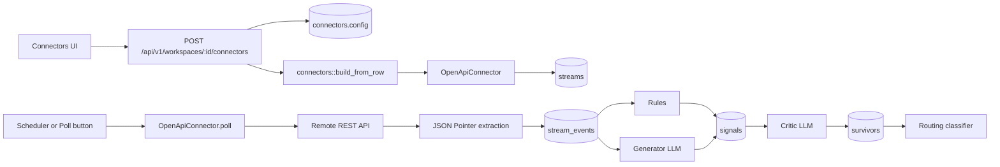
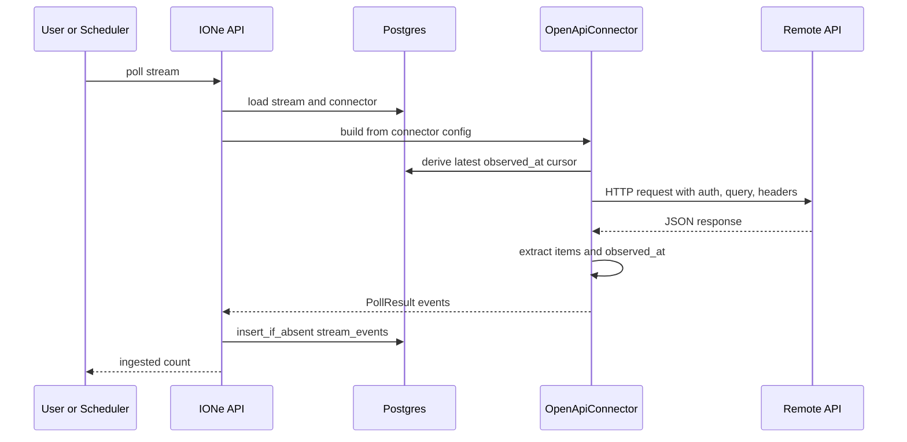
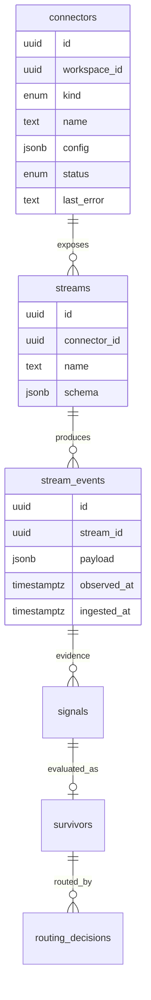

# IONe OpenAPI Connectors — Design

**Date:** 2026-04-23  
**Status:** Proposed design  
**Primary mode:** architecture  
**Supporting modes:** data-engineering, product

## Overview

IONe already treats external systems as connectors that expose streams. A stream poll produces `stream_events`, and the existing rules, generator, critic, routing, delivery, approval, and audit paths operate downstream from those events.

OpenAPI connectors should make API-reachable systems useful inside that same connector contract without requiring a custom Rust adapter for every source. The design is intentionally configuration-led: users register an OpenAPI connector with a small IONe-specific stream mapping that points at operations in an OpenAPI document and describes how response records become stream events.

Current facts:

- `connector_kind` already includes `openapi`.
- The UI already allows `openapi` connector creation.
- `connectors::build_from_row` currently rejects `ConnectorKind::Openapi` with `OpenAPI connectors not yet implemented`.
- Connectors are stored as `connectors.config JSONB`.
- Streams are stored separately in `streams`, and connector creation auto-registers default streams from the connector implementation.
- Polling stores payloads in `stream_events` with a unique `(stream_id, observed_at)` constraint.

Proposed design:

- An `OpenApiConnector` reads a normalized config from `connectors.config`.
- `default_streams()` returns the declared streams from config.
- `poll(stream_name)` resolves the stream mapping, performs one HTTP request, extracts records using JSON Pointer selectors, and emits `StreamEventInput` rows.
- OpenAPI documents are used for validation, operation discovery, and operator confidence, while the IONe stream mapping remains the source of truth for ingestion behavior.

## Goals

- Let users ingest from common REST APIs described by OpenAPI 3.x without writing Rust code.
- Preserve the existing connector and stream-event pipeline.
- Make connector setup explicit enough to be auditable and debuggable.
- Support useful first-class auth modes: none, bearer token, API key header/query, and basic auth.
- Support common response shapes: array response, object-wrapped array, and single object.
- Support incremental polling through cursor values, static query params, and simple templating.
- Keep source payloads mostly raw so downstream rules and LLM passes can inspect original evidence.
- Fail closed on invalid config, unsupported auth, unsafe URLs, or unparseable responses.

## Non-Goals

- Full OpenAPI client generation.
- Support for every OpenAPI feature in the first design: callbacks, links, polymorphic schema resolution, multipart upload, OAuth browser flows, or SOAP-style APIs are out of scope.
- Automatic semantic understanding of an arbitrary API. Users still declare which operations become streams and how records are extracted.
- Complex ETL or normalization into domain-specific tables.
- Replacing native connectors where operational control, domain quirks, or write-back safety justify hand-written code.

## Design

### Connector Config

The OpenAPI connector uses a normalized config object stored in `connectors.config`.

```json
{
  "spec_url": "https://api.example.gov/openapi.json",
  "base_url": "https://api.example.gov",
  "auth": {
    "type": "bearer",
    "token_env": "EXAMPLE_API_TOKEN"
  },
  "defaults": {
    "headers": {
      "Accept": "application/json"
    },
    "query": {
      "limit": 100
    },
    "timeout_ms": 15000
  },
  "streams": [
    {
      "name": "incidents",
      "operation_id": "listIncidents",
      "method": "GET",
      "path": "/incidents",
      "query": {
        "status": "active",
        "modified_since": "{{cursor.observed_at}}"
      },
      "items_json_pointer": "/items",
      "observed_at_json_pointer": "/updated_at",
      "event_id_json_pointer": "/id",
      "cursor": {
        "type": "max_observed_at",
        "initial": null
      },
      "schema": {
        "type": "object",
        "description": "Active incidents from Example API"
      }
    }
  ]
}
```

`spec_url` points to an OpenAPI JSON or YAML document. `spec_inline` can be supported for offline or air-gapped deployments, but only one of `spec_url` or `spec_inline` should be present. `base_url` overrides the server URL in the spec and is required when the spec has multiple servers or environment-specific hosts.

`streams` is the IONe ingestion contract. Each stream maps one OpenAPI operation to one IONe stream. `operation_id` is preferred for validation and operator readability. `method` plus `path` remains required because it makes the executable HTTP request unambiguous and protects against specs with missing or duplicate operation IDs.

### Auth Model

Auth is connector-level by default. Per-stream auth overrides can be allowed later, but the base design keeps auth simple.

Supported forms:

```json
{ "type": "none" }
```

```json
{ "type": "bearer", "token_env": "EXAMPLE_API_TOKEN" }
```

```json
{ "type": "api_key", "in": "header", "name": "X-API-Key", "value_env": "EXAMPLE_API_KEY" }
```

```json
{ "type": "api_key", "in": "query", "name": "api_key", "value_env": "EXAMPLE_API_KEY" }
```

```json
{ "type": "basic", "username_env": "EXAMPLE_USER", "password_env": "EXAMPLE_PASSWORD" }
```

Secrets should be referenced through environment variables rather than stored directly in `connectors.config`. Direct literal values can be allowed only for local/demo mode if the app already has a clear convention for non-production operation. The UI should display secret references, not resolved values.

### Stream Mapping

Each stream describes how to request data and extract records.

Required stream fields:

- `name`: stable stream name shown in the UI and stored in `streams.name`.
- `method`: HTTP method. First design should support `GET` for polling.
- `path`: path template from the API, such as `/incidents`.
- `items_json_pointer`: JSON Pointer to the array of records. Empty string means the whole response.
- `observed_at_json_pointer`: JSON Pointer inside each extracted record used for `stream_events.observed_at`.

Optional stream fields:

- `operation_id`: OpenAPI operation ID for validation and display.
- `path_params`: static or templated values for path parameters.
- `query`: static or templated query values.
- `headers`: static or templated request headers.
- `body`: static or templated JSON body, reserved for later `POST` polling use.
- `event_id_json_pointer`: source record identity, copied into payload metadata.
- `cursor`: cursor behavior.
- `schema`: JSON stored in `streams.schema`.
- `max_items`: upper bound on records accepted from one poll.
- `dedupe`: dedupe policy metadata.

The emitted `payload` should preserve the source record and add connector metadata in a namespaced field:

```json
{
  "source": {
    "id": "INC-123",
    "observed_at": "2026-04-23T14:12:00Z",
    "connector": "openapi",
    "stream": "incidents",
    "operation_id": "listIncidents"
  },
  "record": {
    "id": "INC-123",
    "updated_at": "2026-04-23T14:12:00Z",
    "status": "active"
  }
}
```

Keeping the raw record under `record` reduces irreversible transformation. Downstream rules can match either the raw fields or the normalized `source` metadata.

### Cursor and Freshness Model

The existing `ConnectorImpl::poll` receives a `cursor` argument but callers currently pass `None`. OpenAPI connectors should still define cursor behavior because incremental APIs are the normal case.

The design should support two cursor sources:

- Current code path: derive cursor from the latest existing `stream_events.observed_at` for that stream before polling.
- Future code path: pass persisted cursor explicitly through `poll(stream_name, cursor)`.

Cursor policies:

- `none`: every poll requests the same data; DB dedupe handles repeats.
- `max_observed_at`: use the latest ingested `observed_at` as `{{cursor.observed_at}}`.
- `static_window`: request a sliding time window such as now minus 24 hours.

`observed_at` should be parsed from the configured JSON Pointer. If missing or invalid, the connector should either reject the record or use poll time according to `observed_at_fallback`. The default should be reject because observed time drives dedupe and evidence chronology.

### Spec Use

The OpenAPI spec has three jobs:

1. Validate that configured `method`, `path`, and `operation_id` exist.
2. Resolve the effective base URL when `base_url` is omitted.
3. Provide schemas and descriptions that can be copied into `streams.schema` and UI affordances.

The spec is not the only source of behavior. IONe still requires explicit stream mappings because OpenAPI documents usually do not say which endpoints are operationally meaningful, which response array matters, or which timestamp should drive ingestion.

### Request Safety

OpenAPI connectors run outbound HTTP calls defined by user config, so they need explicit safety boundaries.

Allowed URL schemes:

- `https` by default.
- `http` only for localhost, RFC1918/private networks, or when local/demo mode explicitly allows it.

Blocked targets:

- Link-local metadata IP ranges.
- Unix sockets.
- File URLs.
- Redirects to disallowed hosts.

Request limits:

- Configurable timeout with a bounded maximum.
- Response body size limit.
- Record count limit per poll.
- JSON-only response parsing for the first design.

The connector should mark itself `error` and store `last_error` when validation or polling fails in a way that requires operator attention.

## Diagrams

### Component Flow



### Poll Sequence



### Data Shape



## Behavior and States

### Creation

When a user creates an OpenAPI connector, IONe validates:

- The workspace exists.
- The config has a spec source.
- The config has at least one stream.
- Each stream has a valid name, method, path, item selector, and observed-at selector.
- The HTTP target is allowed by URL safety rules.
- The OpenAPI spec can be fetched or parsed, unless config explicitly allows deferred validation for air-gapped setup.
- Each configured operation can be matched in the spec when validation is enabled.

If validation succeeds, IONe stores the connector row and creates streams from `config.streams`. If validation fails, connector creation should fail before storing a half-usable connector. If the design later supports draft connectors, failed validation can create a `paused` connector, but that is a separate product state.

### Polling

During polling, the connector:

- Finds the stream config by `stream_name`.
- Derives cursor values.
- Renders path, query, and header templates.
- Applies auth.
- Performs the request.
- Requires a successful HTTP response.
- Parses JSON.
- Extracts records.
- Parses `observed_at`.
- Emits one event per record.

The route layer continues to insert with `insert_if_absent`, so repeated records with the same stream and observed time are ignored. For APIs where many records share one timestamp, the long-term design should add stronger dedupe keys; see risks.

### Error States

Important error states:

- `config_invalid`: required config missing or malformed.
- `spec_unavailable`: spec URL cannot be fetched.
- `operation_not_found`: stream mapping does not match the spec.
- `auth_failed`: remote returns 401 or 403.
- `request_failed`: network, timeout, DNS, or non-success HTTP status.
- `response_too_large`: body limit exceeded.
- `response_not_json`: response cannot be parsed as JSON.
- `items_not_found`: `items_json_pointer` does not resolve.
- `observed_at_invalid`: timestamp selector missing or unparseable.

These should be converted to clear `last_error` text on the connector and visible in the UI status chip.

## Data and Interface Notes

### Public API

The existing creation API can remain:

```http
POST /api/v1/workspaces/:workspace_id/connectors
Content-Type: application/json
```

```json
{
  "kind": "openapi",
  "name": "Example Incidents",
  "config": {
    "spec_url": "https://api.example.gov/openapi.json",
    "base_url": "https://api.example.gov",
    "auth": { "type": "bearer", "token_env": "EXAMPLE_API_TOKEN" },
    "streams": [
      {
        "name": "incidents",
        "operation_id": "listIncidents",
        "method": "GET",
        "path": "/incidents",
        "items_json_pointer": "/items",
        "observed_at_json_pointer": "/updated_at"
      }
    ]
  }
}
```

Optional future API endpoints could improve UX without changing the core design:

- `POST /api/v1/openapi/inspect` to fetch a spec and return candidate operations.
- `POST /api/v1/openapi/test` to run a dry poll without storing events.
- `POST /api/v1/connectors/:id/validate` to revalidate a stored connector after spec or credential changes.

### UI

The current JSON textarea can support OpenAPI connectors immediately, but a better UI should add an OpenAPI-specific creation mode:

- Spec URL input.
- Base URL input.
- Auth type selector with environment-variable fields.
- Stream list editor.
- Operation selector populated from the spec.
- JSON Pointer fields for items and observed time.
- Test poll button that previews extracted records.

The UI should not show resolved secrets. It should show `token_env`, `value_env`, or similar references.

### Storage

The first design does not require new tables. It can use:

- `connectors.config` for the OpenAPI config.
- `streams.schema` for stream metadata copied from config/spec.
- `stream_events.payload` for normalized wrapper plus raw source record.

Potential future schema additions:

- A `connector_cursors` table for explicit cursor persistence.
- A `stream_event_keys` column or generated key for source-record dedupe.
- A `connector_specs` cache table for large specs, ETags, and validation metadata.

These are not required for the first coherent version, but they become important as connector volume increases.

## Tradeoffs and Risks

### Explicit Mapping vs Automatic Discovery

Automatic endpoint discovery sounds attractive but is unreliable. Most OpenAPI specs do not identify the correct operational streams or timestamp fields. Explicit stream mappings make setup slightly more work, but they produce auditable behavior.

### JSON Pointer Simplicity

JSON Pointer is easy to validate and reason about. It is less expressive than JSONPath. The tradeoff is acceptable because the first design should prioritize predictable extraction. If APIs need filtering, the connector can support static query parameters and downstream rules before adding JSONPath.

### Dedupe Weakness

The current unique key is `(stream_id, observed_at)`. That is weak for APIs where multiple records share the same update timestamp. The payload can include `source.id`, but the database does not yet enforce uniqueness on it. OpenAPI connectors will work best with APIs whose `observed_at` values are distinct or where polling windows are small. Strong source-key dedupe is the most likely future schema need.

### Spec Drift

Remote OpenAPI specs can change. If the app validates only at creation time, a later poll may fail when paths or schemas move. Revalidation on poll can catch this but adds latency and fragility. The balanced design is to validate at creation, cache enough spec metadata for display, and surface clear poll errors when remote behavior changes.

### Secrets in Config

Storing literal API keys in JSONB is operationally risky. Environment-variable references are safer and match self-hosted deployments, but they require operators to manage process environment. This is acceptable for IONe's current self-hosted posture.

### SSRF and Internal Network Access

Configurable outbound HTTP is a real security boundary. The connector must treat URLs as untrusted user input and restrict schemes, redirects, and sensitive IP ranges. Federal and enterprise deployments may need an allowlist-only mode.

## Open Questions

- Should direct literal secret values be rejected entirely, or allowed in local mode for demos?
- Should `http` to private network hosts be allowed by default for air-gapped deployments, or require an explicit allowlist?
- Is JSON Pointer enough for v0.1, or do known target APIs require JSONPath-like filtering?
- Should the first implementation add a `connector_cursors` table, or derive cursor state from latest `stream_events.observed_at` until replay requirements are clearer?
- Should source-record dedupe become part of this feature immediately, given the current `(stream_id, observed_at)` uniqueness limitation?
- Should OpenAPI connectors support write-back operations in the same config, or remain read-only until a separate command-safety design exists?
