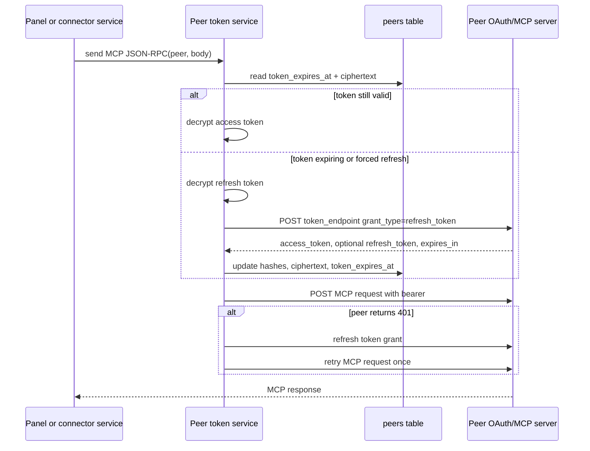

# Peer Delegated-Token Refresh

## Overview

IONe already stores peer access tokens encrypted at rest, but peer refresh tokens are only stored as hashes. That means peer OAuth works until the access token expires, then peer-backed map, chart, table, document, binding refresh, manifest, and MCP connector calls degrade to peer unavailable. The design is to make peer refresh tokens recoverable ciphertext, refresh peer access tokens server-side, and keep raw tokens out of API responses, logs, and connector-facing browser payloads.

## Goals

- Store peer refresh tokens as encrypted ciphertext while retaining the existing hash for lookup/audit diagnostics.
- Refresh peer access tokens automatically before expiry and retry once after an upstream 401.
- Reuse one server-side token resolver for peer fan-out paths instead of duplicating token decryption in each panel service.
- Preserve legacy static-bearer behavior for tests and manually configured peers that do not have OAuth token ciphertext.
- Keep refresh failures scoped to the affected peer so aggregate endpoints keep partial-success behavior.

## Non-goals

- Browser-side token handling.
- A full OAuth provider registry for peers.
- Changing the MCP resource contracts for map, chart, table, or document views.
- Backfilling refresh token ciphertext for historical peers. Existing rows without recoverable refresh tokens must re-authorize if their access token expires.

## Design

Add `peers.refresh_token_ciphertext BYTEA NULL`. On OAuth callback, encrypt both access and refresh tokens with the existing `IONE_TOKEN_KEY` token crypto path. `refresh_token_hash` remains non-secret metadata; only ciphertext is recoverable.

A new peer-token service owns token resolution:

- If the peer has no encrypted access token, return `IONE_OAUTH_STATIC_BEARER` for legacy/manual peer paths.
- If the access token is not near expiry, decrypt and return it.
- If the token is expired or close to expiry, decrypt the refresh token, rediscover the peer token endpoint from the peer metadata URL, call `grant_type=refresh_token`, encrypt returned tokens, and update the peer row.
- If an MCP call returns HTTP 401, force one refresh and retry the same JSON-RPC request once.

The service is used by:

- visualization fan-out: map/chart/table/document panel list endpoints,
- peer resource reads: chart-data and table-data,
- peer manifest fetch during allow-listing,
- workspace binding whoami refresh,
- MCP connector tool/list calls used by poll and delivery.

## Diagrams

## Behavior and States

- OAuth peers with refresh token ciphertext refresh silently.
- OAuth peers without refresh token ciphertext fail with a peer-scoped error on expiry; the operator must re-authorize.
- Legacy/manual peers without OAuth ciphertext continue to use `IONE_OAUTH_STATIC_BEARER`.
- Aggregate panel endpoints keep returning successful peers even when another peer cannot refresh.
- Refreshed tokens never appear in serialized `Peer` responses.

## Data and Interface Notes

- `peers.refresh_token_ciphertext` is nullable to avoid destructive assumptions for existing installations.
- `Peer` gains `refresh_token_ciphertext` with `skip_serializing`.
- Peer SQL projections must include the new column anywhere `Peer` is materialized.
- `PeerRepo::set_tokens` writes refresh ciphertext on the initial OAuth callback.
- `PeerRepo::update_refreshed_tokens` rotates access token fields and updates refresh fields only if the peer returns a new refresh token.

## Tradeoffs and Risks

- Rediscovering the token endpoint on refresh avoids a second schema field, but it assumes the peer metadata endpoint remains available. If discovery fails, the peer call fails without affecting other peers.
- Existing rows cannot be backfilled because refresh token hashes are intentionally one-way.
- Storing recoverable refresh tokens increases database breach impact, so the column must remain non-serialized and encrypted with the existing server-side token key.

## Open Questions

- Should a peer be marked `error` after repeated refresh failures, or should transient refresh errors remain request-scoped until an explicit health model exists?
