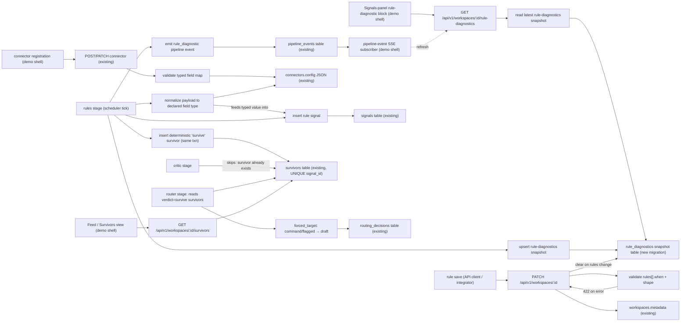

# Design — Rule-Engine Offline Reliability

**Status:** Draft — ready for `/implement`
**Source:** GitHub issue #9 (external integrator "CAGE", offline Epicenter Slice 1-3 walkthrough)
**Layers:** `db`, `api`, `ui`
**Related:** [ione-substrate](ione-substrate.md), [geojson-poll-connector](geojson-poll-connector.md), Path-2 outcome P7 (v0.1 OSS release)

---

## Problem statement

IONe's signal pipeline runs in stages each scheduler tick: `poll → rules → generator → critic → router → delivery`. Two of those stages call Ollama (generator, critic); the `nl` profile that provides Ollama is **explicitly optional** in IONe's architecture. The router and delivery stages already degrade gracefully offline (they insert a severity-based fallback routing decision on Ollama error). The **critic does not**: on an unreachable Ollama it records a `defer` survivor verdict, and a deferred survivor is terminal — the signal now has a survivor row (so the critic never retries it) but its verdict is not `survive` (so the router never advances it). A deterministic, rule-matched signal is therefore permanently parked offline, and the entire Slice 1-3 "epicenter" loop dies with no visible cause.

Three independent defects compound into one symptom (`GET …/signals` returns `{"items":[]}` or a signal that never advances), and none of them is observable:

1. **Silent rule skips.** `evaluate_workspace` returns a bare count. When a rule names a stream that does not exist, when its `when` expression fails to parse, or when a payload value is the wrong type for the comparison, the engine logs a server-side warning and returns 0. The operator has no API-visible signal distinguishing "rule is fine, no events have crossed the threshold yet" (benign) from "rule is broken" (actionable). This is the multi-hour debugging trap.

2. **Type-blind numeric comparisons.** A threshold rule such as `payload.properties.mag >= 6.0` silently never matches if the feed encodes `mag` as the JSON string `"6.4"` rather than the number `6.4`, because the expression engine will not order a string against a float. External feeds rarely guarantee JSON numeric types. Malformed `when` expressions are likewise only discovered at runtime, every tick, forever.

3. **Critic gates deterministic signals.** Rule matches are deterministic and authoritative by construction; requiring an LLM to affirm them before they can advance is both architecturally incoherent and the direct cause of the offline dead-loop.

This makes the stated "Ollama is optional" guarantee false in practice for the rule path — a disqualifier for the air-gapped / on-prem / CI buyer profile that Path-2 targets.

### Out of scope (explicit non-goals)

- Manual "force-survive" override for **LLM-sourced** deferred signals, or critic-retry when Ollama returns. Independent features.
- Any change to how generator- or connector-sourced signals flow through the critic. This design touches **rule-sourced signals only**.
- A general-purpose type-coercion engine. Coercion here is bounded to finite numeric strings (see Slice 2).
- Adding a critic/approval **status filter to `GET …/signals`** — that endpoint already reads the `signals` table without joining survivors, so it is not, and must not become, critic-gated.

---

## Feature slices

### Slice 1 — Rule-evaluation diagnostics (observability)

One-line: every scheduler tick records, per rule, *what happened* during rule evaluation, and exposes it on a read endpoint plus a live pipeline event.

- **DB:** A per-workspace **rule-diagnostics snapshot** holding the most recent evaluation outcome. One row per workspace, overwritten each tick (last-write-wins; no history retained). Each row carries the evaluation timestamp and a list of per-rule diagnostic entries. Each per-rule entry carries: rule index, rule title, referenced stream name, a status enum (`ok` | `stream_not_found` | `no_events` | `parse_error` | `type_mismatch` | `rules_unparseable`), count of events evaluated, count of matches, and up to five distinct skip reasons (each a code + human-readable detail), capped to avoid unbounded growth on noisy streams.
- **API:** `GET /api/v1/workspaces/:id/rule-diagnostics` returns the latest snapshot. A new `rule_diagnostic` pipeline-event stage is emitted once per workspace per tick (not per rule, not per event) onto the existing pipeline-event stream so live subscribers refresh without polling.
- **UI:** The demo shell's Signals panel renders a **rule-diagnostic block** below the signal list. It distinguishes the benign "active, threshold not yet crossed" state (muted, informational, no alarm) from actionable errors (warning icon **plus** text label — never color alone), and links the `no_events` case to the Connectors tab.
- **Cross-references:** The Signals-panel diagnostic block calls `GET …/rule-diagnostics`, which reads the rule-diagnostics snapshot written by the rules stage of the scheduler tick. The live refresh path is: rules stage emits `rule_diagnostic` → existing pipeline-event SSE → shell re-fetches `GET …/rule-diagnostics`.

The rule stage's internal evaluation function returns a **structured report** (counts + per-rule diagnostics) instead of a bare integer; the scheduler persists the snapshot and emits the event. The function keeps its current `(pool, workspace_id)` call shape so existing rule tests continue to compile — the richer return type is additive (callers that ignore the value are unaffected).

### Slice 2 — Schema-declared field types + rule validation

One-line: the connector declares each stream field's type; the rule engine normalizes payload values to the declared type before evaluating — no guessing — and malformed rules are rejected at save time instead of every tick.

- **DB:** none new. Field-type declarations live in the connector's existing JSON config (the `geojson_poll` connector already carries a stream schema and a `view_config.property_fields` map); this design adds an optional **declared type** per field. No migration — connector config is already a JSON column.
- **Connector schema:** each stream's config may declare a **typed field map**: payload field path → declared type, one of `number` | `string` | `boolean`. Declarations are validated when the connector is created/updated (the existing connector-config validation path). The map is partial by design — undeclared fields are allowed and fall back to their native JSON type.
- **API:** `PATCH /api/v1/workspaces/:id` (existing) gains **rule validation**: when the patched metadata contains a `rules` array, each entry's `when` expression is parsed and each entry's shape (`stream`, `when`, `severity`, `title` present and well-typed) is checked. A syntactically invalid rule is rejected with `422` identifying the offending rule index and the parser error. The same `PATCH` also **clears the workspace's rule-diagnostics snapshot** (resolves the stale-label window when rules change — see Open Questions). Field existence/type against the connector schema is *not* hard-validated at save (a rule may be saved before its connector exists), but a referenced field that *is* declared with an incompatible type for its comparison literal yields a `422` warning-class detail.
- **UI:** API-only. Rules are authored by the integrator via the API (the API-first persona), and the `422` is an API contract guarantee — the demo shell has no rule-authoring surface today, and building one is out of scope for this design. (The read-only rule-diagnostic block from Slice 1 *is* in the shell.)
- **Cross-references:** the connector's typed field map is declared at connector registration and validated there; at evaluation time the rules stage reads the declared types for the rule's target stream and **normalizes each referenced payload value to its declared type** when building the expression context; any value that cannot be normalized to its declared type is reported through the Slice-1 `type_mismatch` diagnostic and that event is skipped.

**Normalization contract (deterministic, no heuristics).** For each payload field referenced during evaluation:
- **Declared `number`:** a JSON number is used as-is; a JSON **string** is parsed to a number **only if** it parses as a finite float (`parse`-succeeds and `is_finite()` — `inf`/`nan`/non-numeric are *not* numbers). A non-numeric value on a `number`-declared field produces a `type_mismatch` diagnostic and the event is skipped — it is never silently coerced or matched.
- **Declared `string`:** the value is always treated as a string and **never** numerically coerced. All-digit identifiers (zip, FIPS, sensor IDs) compared by string equality are therefore safe by construction — this is the regression the connector/stream-schema approach was chosen to eliminate.
- **Declared `boolean`:** JSON booleans used as-is; the strings `"true"`/`"false"` normalize to booleans; anything else is a `type_mismatch`.
- **Undeclared field:** native JSON type, no normalization. A numeric comparison against a non-numeric undeclared value fails the comparison and surfaces a Slice-1 `type_mismatch` diagnostic (not a silent skip). This preserves backward compatibility for loose feeds while making the strongly-typed path available the moment a type is declared.

There is no leading-zero heuristic and no value-shape guessing anywhere — type comes from the declaration, not the data.

### Slice 3 — Deterministic survivor for rule-sourced signals

One-line: a rule match writes its own `survive` survivor at signal-creation time, so the loop advances without the critic.

- **DB:** none new. Reuses the existing survivors table and its `UNIQUE(signal_id)` constraint. The deterministic survivor is written with a **sentinel critic model** (`rule-engine`) so provenance is distinguishable from LLM-affirmed survivors in reads, audit export, and UI.
- **Deterministic survivor row shape:** `verdict = survive`, `criticModel = "rule-engine"`, `confidence = 1.0`, `rationale = "rule matched: <when expression>"`, and `chainOfReasoning = []` (empty JSON array — the column is `JSONB NOT NULL DEFAULT '[]'`, and an empty chain is the correct representation of "deterministic match, no reasoning steps"). No survivor field is left null.
- **API:** no new endpoint. `GET …/survivors` now returns rule-sourced survivors with the row shape above.
- **UI:** existing survivor/feed rendering shows the `survive` verdict; a provenance label ("rule" vs the LLM model name) distinguishes the two classes so an auditor never reads a deterministic verdict as an LLM judgment.
- **Cross-references:** the rules stage, on inserting a rule-matched signal, **atomically** (same transaction) inserts the paired `survive` survivor. The downstream critic stage's "signals with no survivor" query therefore skips it; the router's "survivors with verdict = survive and no routing decision" query picks it up and forces it (via existing `forced_target`) to `feed` (routine) or `draft`+pending-approval (`flagged`/`command`). No approval gate is bypassed.

**Why the approval gate stays intact.** The router derives a router-internal `approval_required` predicate from severity (`flagged` and `command` set it true; `routine` does not) and, when it is true, forces the survivor to the `draft` target; the draft path requires approval before any external action. A deterministic-survive on a `command` rule signal therefore terminates at a **pending approval**, not an unauthorized delivery — the correct, auditable offline end state. This `approval_required` derivation lives entirely in the router and delivery stages and is unchanged by this design; it is named here only so implementers do not re-derive the `flagged`/`command` → draft mapping.

---

## API Contracts

| Endpoint | Method | Request Schema | Response Schema | Error Codes | Auth |
|----------|--------|----------------|-----------------|-------------|------|
| `/api/v1/workspaces/:id/rule-diagnostics` | GET | path `id=UUID` | `{ evaluatedAt: ISO8601 \| null, items: RuleDiagnostic[] }` where `RuleDiagnostic = { ruleIndex: int, ruleTitle: string, stream: string, status: enum(ok,stream_not_found,no_events,parse_error,type_mismatch,rules_unparseable), eventsEvaluated: int, matchCount: int, skipReasons: { code: string, detail: string, count: int }[] }` | 401, 403, 404 | Bearer + org-scoped |
| `/api/v1/workspaces/:id` | PATCH | `{ metadata: object }` — when `metadata.rules` present, each `{ stream: string, when: string, severity: enum(routine,flagged,command), title: string }` | `{ …workspace, panels: object }` (unchanged on success) | 400, 401, 403, 404, **422** (invalid rule: body `{ error, ruleIndex, detail }`) | Bearer + org-scoped |
| `/api/v1/workspaces/:id/signals` | GET | path `id=UUID`, `?source=enum(rule,connector_event,generator)&severity=enum(routine,flagged,command)&limit=int` | `{ items: Signal[] }` — **unchanged; not critic-gated** | 401, 403, 404 | Bearer + org-scoped |
| `/api/v1/workspaces/:id/survivors` | GET | path `id=UUID`, `?verdict=enum(survive,reject,defer)&limit=int` | `{ items: Survivor[] }` where rule-sourced rows carry `criticModel="rule-engine"`, `verdict="survive"`, `confidence=1.0` | 401, 403, 404 | Bearer + org-scoped |

`GET …/signals` and `GET …/survivors` are listed because the UI reads them and the design changes what `…/survivors` returns (new provenance class); their request/response contracts are otherwise unchanged.

---

## Wiring Dependency Graph

Every UI node reaches a DB table through a named endpoint or the scheduler. No dangling nodes.

---

## Acceptance criteria

All criteria are offline (no Ollama process running) unless stated.

1. **Deterministic loop advances offline.** Given a workspace with one active `geojson_poll` connector whose stream `usgs-earthquakes` has an event with `properties.mag = 6.4`, and a rule `{stream:"usgs-earthquakes", when:"payload.properties.mag >= 6.0", severity:"command", title:"M6+"}`, when the scheduler runs one tick with Ollama unreachable, then `GET …/signals` returns an item with `source="rule"`, `GET …/survivors` returns a row for that signal with `verdict="survive"` and `criticModel="rule-engine"`, and a `routing_decisions` row exists with `target_kind="draft"`.

2. **Critic does not double-process.** Given criterion 1's state, when the critic stage runs in the same tick, then no second survivor row is created for that signal (survivor count for the signal = 1) and no `error`-stage pipeline event is emitted by the critic for that signal.

3. **Declared-number string matches.** Given the connector declares `properties/mag` as type `number`, the same rule, and an event with `properties.mag = "6.4"` (JSON string), when the tick runs, then a `source="rule"` signal is created (value normalized to the declared number).

4. **Declared-string identifiers are never numerically coerced.** Given the connector declares `properties/code` as type `string`, a rule `{when:"payload.properties.code == \"01234\"", …}`, and an event with `properties.code = "01234"`, when the tick runs, then the rule matches (the field is treated as a string; equality holds). The same holds for `"12345"` (no leading zero) — the declaration, not the value shape, governs.

4b. **Non-numeric value on a number field is a typed mismatch, not a silent skip.** Given the connector declares `properties/mag` as `number` and an event with `properties.mag = "high"`, when the tick runs, then no signal is created and `GET …/rule-diagnostics` returns an item with `status="type_mismatch"` whose `skipReasons` names `properties/mag`.

5. **Unknown stream is observable.** Given a rule referencing stream `does-not-exist`, when the tick runs, then `GET …/rule-diagnostics` returns an item for that rule with `status="stream_not_found"` and a non-empty `skipReasons`, and `matchCount=0`.

6. **Benign vs broken are distinguishable.** Given a valid rule whose threshold no event has crossed, when the tick runs, then `GET …/rule-diagnostics` returns `status="ok"` with `eventsEvaluated > 0` and `matchCount=0` (benign), distinct from any error status.

7. **Malformed rule rejected at save.** Given a `PATCH …/workspaces/:id` whose `metadata.rules[0].when` is `"payload.mag $$$"`, when the request is made, then the response status is `422`, the body identifies `ruleIndex=0`, and the workspace metadata is unchanged.

8. **`/signals` is not critic-gated.** Given a workspace with one `source="generator"` signal and Ollama unreachable (so the generator signal can only have a `defer` survivor or none), when `GET …/signals` is called with no filters, then that signal appears in `items` regardless of survivor state.

9. **Approval gate intact.** Given criterion 1's `command` signal reaching a `draft` routing decision, when the delivery stage processes it, then a pending approval artifact is created and **no** external notification is delivered.

10. **Unparseable rules array is observable.** Given a workspace whose `metadata.rules` is present but not a valid JSON array of rule objects (e.g. an object, or an array of non-objects that fails deserialization), when the tick runs, then `GET …/rule-diagnostics` returns a single item with `status="rules_unparseable"` and a `skipReasons` entry describing the deserialization failure. (This is the whole-array failure mode, distinct from `parse_error`, which is a single rule's `when` expression failing to compile.)

Each criterion maps to an integration test asserting the named endpoint response or row state; none depends on Ollama.

---

## Tradeoffs

- **Persisted snapshot vs. recompute-on-read for diagnostics.** Persisting the last tick's outcome (chosen) gives an API-first integrator a deterministic, curl-able answer without an open SSE and without re-running evaluation on a GET. The cost is one upsert per workspace per tick and a small table. Recompute-on-read was rejected: it would re-list events on every poll of the endpoint and could disagree with what the scheduler actually did.
- **Schema-declared types vs. heuristic coercion vs. validate-only.** Heuristic coercion (guess a numeric string is a number) fixes the common case but silently breaks all-digit string-equality rules — a regression with no clean containment. Validate-only never coerces but leaves the dominant real case (numeric field sent as a JSON string) failing. **Connector-declared field types (chosen)** make the comparison type deterministic at the data source: a `number`-declared field normalizes string-encoded numerics; a `string`-declared field is never numerically coerced, so identifier equality is safe **by construction**. The cost is a typed field map in connector config and normalization at eval; the benefit is the regression class is eliminated, not merely contained, and the declaration is reused by every rule and the event-layer view. Rejected alternatives: rule-expression-literal-driven typing (keeps types in the rule, not the source — rejected per owner direction toward strongly-typed sources) and a general coercion engine (scope creep).
- **Deterministic survivor at rule-match vs. critic short-circuit on rule source.** Writing the survivor in the rules stage (chosen) makes rule signals behave **identically online and offline** and needs no critic change; the critic's existing idempotency guard skips them naturally. Teaching the critic to emit `survive` for rule sources when Ollama is down was rejected: it would leave online behavior dependent on critic reachability and split the logic across two stages.
- **Sentinel critic model vs. a new survivor column for provenance.** A sentinel `rule-engine` model value (chosen) needs no migration and is self-describing in existing reads. A dedicated provenance column is cleaner long-term but unjustified for pre-v1 scope.

---

## Devil's Advocate

**1. Most load-bearing assumption.** That the **critic is the only Ollama-hard offline blocker** in the `signal → survivor → routing → delivery` loop — i.e. that once a rule signal has a `survive` survivor, the router and delivery stages advance it without Ollama. If the router or delivery also hard-failed offline, Slice 3 would move the dead-loop one stage downstream and fix nothing.

**2. Verified against live state.** Code-verified.
- Router: `src/services/router.rs:50-60,232,272` — `forced_target` forces `flagged`/`command` survivors to `draft` **without** calling Ollama, and `classify_survivor`'s documented contract inserts a severity-based fallback decision on Ollama network error. So the router advances offline.
- Delivery: `src/services/delivery.rs:66,125-145,314` — `feed` is a no-op (pull-based), `draft` creates an artifact + pending approval gated on `approval_required`; neither requires Ollama.
- Critic: `src/services/critic.rs:245-259` — the *only* stage that, on Ollama error, writes a terminal `defer` survivor.
- Critic skip query: `src/services/scheduler.rs:429-446` — `LEFT JOIN survivors WHERE sv.id IS NULL`, so a pre-existing survivor is skipped; survivors has `UNIQUE(signal_id)` (`migrations/0005_survivors.sql`) as the backstop.
**Result: VERIFIED ✓** — the critic is the sole offline blocker; router and delivery are already offline-resilient.

**3. Simplest alternative that avoids the biggest risk.** The minimal fix is **Slice 3 alone** — write a deterministic `survive` survivor for rule signals — which unblocks the loop offline with no new endpoint, table, or UI. Slices 1 and 2 are not required to make the loop run; they exist because the *triage* (debug pass on issue #9) found the more probable real-world cause was a **silent** failure (stream-name mismatch or string-typed `mag`) that Slice 3 would not surface — the operator would still see a dead loop with no explanation. Slice 1 (observability) is what converts "burned hours guessing" into a 30-second diagnosis and is justified on that ground; Slice 2 (schema-declared types + save-time validation) removes the two most common silent-failure causes (string-typed numerics, malformed rules) without introducing a coercion regression. If forced to cut for time, ship Slice 3 + Slice 1; Slice 2 is the most deferrable, but because it declares types at the source rather than guessing it carries **no** behavioral-change risk for existing rules. The design is worth more than Slice 3 alone **only because** the issue was reported precisely as an invisible failure — fixing the loop without making failures visible would invite the next identical bug report.

**4. Structural completeness checklist**
- [x] Every UI component that calls an API has that API in the contract table — diagnostic block → `…/rule-diagnostics`; rule save → `PATCH …/workspaces/:id`; feed/survivors view → `…/survivors`; signal list → `…/signals`. All four present.
- [x] Every endpoint implies a repository method (or states no DB) — `…/rule-diagnostics` reads the snapshot table; `PATCH` writes `workspaces.metadata`; `…/survivors` and `…/signals` read existing tables.
- [x] Every new data field appears in all layers — `RuleDiagnostic` fields: DB snapshot row → `…/rule-diagnostics` response → diagnostic block render. `survive`-provenance: `criticModel="rule-engine"` in survivors row → `…/survivors` response → provenance label.
- [x] Every acceptance criterion names an endpoint + expected response — criteria 1-10 (incl. 4b) each assert a specific endpoint payload or row state.
- [x] Wiring graph has an unbroken UI→DB path for every component — verified above; the Slice-2 `normalize` node reads `connectors.config` and feeds the signal insert, no dangling nodes.
- [x] Integration test scenarios exercise a full request path per slice — criterion 1 (Slice 3 full loop), criteria 5-6-10 (Slice 1 read path), criteria 3-4-4b-7 (Slice 2 schema-typed normalization + validation).

---

## Open questions

_All three open questions from the original draft are resolved (`/decide`, 2026-06-04):_

1. **~~Coercion equality regression~~ — RESOLVED by design change.** Replaced heuristic numeric coercion with **connector-declared field types** (Slice 2). A `string`-declared field is never numerically coerced, so the all-digit string-equality regression cannot occur — no live-DB audit and no per-rule opt-out needed.
2. **~~Diagnostic snapshot staleness on rule edit~~ — RESOLVED: clear on `PATCH`.** The `PATCH …/workspaces/:id` that mutates `rules` also clears the workspace's rule-diagnostics snapshot, eliminating the stale-label window entirely (cheaper and stricter than tolerating ≤1 tick of mislabel). Reflected in Slice 2's API bullet and the wiring graph.
3. **~~`rule_diagnostic` SSE consumer tolerance~~ — RESOLVED: no change needed.** Code-verified: the demo shell's `handlePipelineEvent` ([static/app.js:3061-3080](../../static/app.js#L3061-L3080)) handles stages via guarded `if (ev.stage === 'error' / 'stall')` conditionals with no exhaustive switch or default-throw; a new workspace-scoped `rule_diagnostic` stage (no `connectorId`) is silently ignored by existing consumers.

_New consideration introduced by the schema-typed approach:_ a rule may be saved before its target connector (and thus its typed field map) exists. The design handles this by **not** hard-failing rule save on undeclared fields (save-time validation is syntactic + type-compatibility-where-declared only); undeclared fields fall back to native JSON type at eval and surface a `type_mismatch` diagnostic if compared numerically against a non-number. No open decision — documented in Slice 2.

---

## Commercial linkage

Directly serves the Path-2 buyer profile: air-gapped / on-prem / federal (OMB M-25-21/22) deployments where no runtime LLM endpoint is guaranteed. "Ollama is optional" becomes true in practice, and the approval/audit gateway — IONe's stated differentiator vs. Palantir — gains a clean, deterministic, LLM-independent verdict trail for rule-sourced signals. Gating criterion: the issue-#9 integrator (CAGE) walks the full offline loop end-to-end before any v0.1 (P7) public date is announced.

---

## Requirements impact

The project has no populated `md/requirements/active/` directory; contracts live in the design set. Affected design docs:
- **[ione-v1-contract](ione-v1-contract.md)** — add `GET /api/v1/workspaces/:id/rule-diagnostics`; document the `422` rule-validation path on `PATCH …/workspaces/:id`; note that rule-sourced survivors use the `rule-engine` sentinel model and that `…/signals` is explicitly not critic-gated.
- **[geojson-poll-connector](geojson-poll-connector.md)** — document the optional **typed field map** in stream config (payload field path → `number` | `string` | `boolean`), its validation at connector registration, and that the rule engine normalizes payload values to the declared type at evaluation (undeclared fields fall back to native JSON type).
- **[openapi-connectors](openapi-connectors.md)** — if connector config shape is specified there, mirror the typed field map so it is consistent across connector kinds, not `geojson_poll`-specific.
