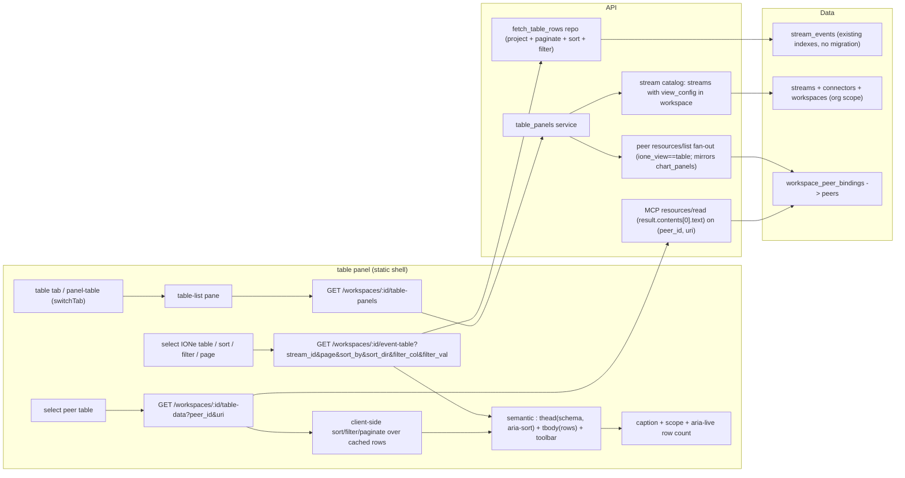

# Design: Table View (`ione_view:"table"`)

**Status:** Ready for `/implement`
**Date:** 2026-05-29
**Layers:** `api`, `ui`, `db` (db = **query-time only**, no migration — existing `stream_events` indexes suffice)
**Backlog item:** P0 [Epicenter] visualization, `md/plans/infrastructure-backlog.md`
**Stream P:** P7-supporting (substrate visualization; completes map ✓ / chart ✓ / table).

---

## Problem statement

IONe renders maps and (now) time-series charts, but has no way to show raw tabular data. Any app whose primary output is rows — bearingLineDash financials, a connector's raw event stream, a TerraYield NDVI table — is stuck at "opaque reference, name + description only." The operator builds a separate UI or pastes API responses into a spreadsheet — exactly what the one-pane-of-glass premise is meant to eliminate.

The table view is the third view type and the narrowest gap to close: unlike the chart panel it needs **no external render engine** — it is a semantic HTML `<table>`. It completes the reference-app coverage set: map+chart serve GroundPulse/TerraYield geometry and time-series; tabular/financial (bearingLineDash) is uncovered until table view ships.

## Audience

The Morton operator-developer validating that the substrate surfaces their app's row output without a custom frontend — first the bearingLineDash financial case (via the peer path) and the Epicenter/USGS raw-event-feed case (via the IONe projection) — plus external OSS developers federating any tabular app.

---

## Scope decisions (resolved before this design)

1. **Dual data source** (mirrors map + chart). A table renders from **either** a peer-published `application/vnd.ione.table+json` MCP resource (federation render — `resources/list` + `resources/read`, exactly the shipped chart-data path) **or** IONe's own `stream_events` projected into columns. Both deliver a **schema** (ordered columns, each `{name, type}`) + **rows** (objects keyed by column name).
2. **IONe projection reuses `view_config.property_fields`** — no new per-stream config contract. A stream's table columns are its `property_fields` (`{pointer, name}`, value via `payload #>> path`) plus `observed_at`. This is the same decision the chart panel made. **Consequence:** streams without a `view_config` (non-geo apps like bearingLineDash, whose stream has no lon/lat) are **not** IONe-projected tables — they surface via the **peer path** (the app publishes its own table resource). Auto-deriving columns from payload keys is a deferred enhancement, not v1.
3. **No render engine, no DB migration.** Plain semantic `<table>`; query-time projection over `stream_events`; existing indexes cover the default `observed_at` sort.

## Posture note (table marked "deferred to v0.2")

`app-integration-playbook.md` §4 lists `table` as "deferred to v0.2 — column schema." This is promoted into v0.1 on the same basis the chart panel was (substrate-thesis test + it's the only path to the bearingLineDash reference integration). The stale annotation is corrected (Requirements impact). No v0.2 is named.

---

## Feature slices

### Slice 1 — IONe stream_events table (the projection path)

Project a stream's events into a paginated, sortable, filterable table.

- **DB:** none new. Query-time projection over `stream_events`, org-scoped via `stream_id → streams.connector_id → connectors.workspace_id → workspaces.org_id`. Columns = the stream's `view_config.property_fields` (`payload #>> path`) + the `_observed_at` timestamp column. Discovery and projection read `property_fields` via a **table-specific parser that ignores `lon_pointer`/`lat_pointer`/`style`** — so a geo-only style error can't hide a valid table (the shared `CompiledConfig::parse` requires lon/lat and is NOT reused here). Existing `(stream_id, observed_at DESC)` index serves the default sort + bounded window; arbitrary-field sort/filter is a seq-scan over the single stream's windowed rows (fine at v1 scale).
- **API:**
  - `GET /workspaces/:id/table-panels` — lists available tables (`ione_tables` section; `peer_tables` in Slice 2). IONe items derive from streams whose `view_config.property_fields` has ≥1 entry (a stream with no property fields would yield only `observed_at` and is not listed).
  - `GET /workspaces/:id/event-table` — returns `{columns, rows, totalCount, page, perPage}` for a stream, with pagination/sort/filter applied server-side.
- **UI:** new `table` tab + `panel-table`, slotting into `switchTab(name)`. Left table-list pane + right render pane, mirroring the chart panel's list + partial-failure + retry + polite live-region + loaded-workspace guard. Selecting an IONe table calls `event-table`; sort/filter/page controls trigger a refetch with params. Renders a semantic `<table>` + an accessible data path.
- **Cross-reference:** the `table-panels` IONe item names a `stream_id`; the panel calls `event-table?stream_id=…&page=…&sort_by=…` which projects `stream_events` and returns `columns` (from `property_fields`) + `rows`.

### Slice 2 — Peer-published table resources (the federation path)

Render a table a peer app publishes over MCP, no IONe computation — parallel to the shipped chart-data path.

- **DB:** none.
- **API:**
  - `GET /workspaces/:id/table-panels` — the `peer_tables` section: fan out to bound peers, `resources/list`, keep `metadata.ione_view == "table"`, surface spec metadata. (Same fan-out as map-layers / chart-panels.)
  - `GET /workspaces/:id/table-data?peer_id=&uri=` — on selection, MCP `resources/read` for that bound peer, body from `result.contents[0].text`, parse `{schema, rows}`, return verbatim. (Both params required — a URI is unique only within a peer.)
- **UI:** same panel; peer tables listed alongside IONe tables (source label). Selecting calls `table-data`; sort/filter/paginate happen **client-side** over the returned rows (peer returns its row set; peer-side server pagination is a v2 concern). Control UI is identical to the IONe path.
- **Cross-reference:** `table-panels` peer items carry `peer_id` + `uri`; selecting calls `table-data?peer_id=&uri=` → `resources/read` → `{schema, rows}` → same `<table>` renderer.

### Slice 3 — Semantic table render core (shared, built in Slice 1, reused by Slice 2)

Not a separate vertical slice — the renderer both slices share. A semantic `<table>` with `<caption>` (accessible name + visible row count), `<th scope="col" aria-sort>` sortable headers (buttons), per-column filter row, striped `<tbody>`, and the page/sort/filter toolbar. No external engine, no adapter, no validation step.

---

## API Contracts

| Endpoint | Method | Request Schema | Response Schema | Error Codes | Auth |
|----------|--------|----------------|-----------------|-------------|------|
| `/api/v1/workspaces/:id/table-panels` | GET | path `:id`=workspace UUID | `{ ione_tables: TablePanelItem[], peer_tables: TablePanelItem[], peer_errors: {peer_id,peer_name,error}[] }` | 401, 404 (workspace not in caller org) | Session/Bearer + org-scoped |
| `/api/v1/workspaces/:id/event-table` | GET | `?stream_id=UUID&page=int≥1&per_page=int(1..200)&sort_by=string(col name)&sort_dir=enum(asc,desc)&filter_col=string(col name)&filter_val=string&since=ISO8601&until=ISO8601` (window: defaults to `until=now`, `since=now−30d`; **max 90 days**, mirroring `event-aggregates`) | `{ stream_id, columns: Column[], rows: Row[], totalCount: int, page: int, perPage: int, truncated: bool }` | 400 (`since>until`, window>90d, per_page>200, offset `(page−1)·per_page > 10000`, unknown sort_by/filter_col, filter_col xor filter_val present, bad sort_dir), 401, 404 (stream not in caller org) | Session/Bearer + org-scoped |
| `/api/v1/workspaces/:id/table-data` | GET | `?peer_id=UUID&uri=string` — **both required** | `{ schema: Column[], rows: Row[] }` | 400 (missing peer_id/uri), 401, 404 (workspace not in org / peer not bound / **resource-not-found**: `resources/read` returns a JSON-RPC error whose message indicates the URI is unknown), 502 (peer unreachable, timeout, or any other `resources/read`/transport failure), 413 (peer body exceeds caps — see below) | Session/Bearer + org-scoped |

**Data shapes (prose):**
- **Column** — `name` (string, the row key), `label` (display header; defaults to `name`), `type` (enum `string|number|boolean|datetime`), `pointer` (the JSON Pointer for IONe property-field columns; null for the timestamp column and for peer columns). Columns are an **ordered** list (render order).
- **Timestamp column (IONe).** The injected timestamp column uses the **reserved key `_observed_at`** (label "Observed At", type `datetime`). `_observed_at` is already reserved in `view_config` property-name validation, so a user property field can never collide with it — this is the single wire key for the timestamp (no `observed_at`/`observedAt` ambiguity). The UI maps the `_observed_at` key to its label.
- **TablePanelItem** — `id`, `name`, `source` (ione\|peer); IONe items carry `stream_id`; peer items carry **both** `peer_id` and `uri`.
- **Row** — an object keyed by each `Column.name` (so IONe rows carry `_observed_at` plus one key per property field); values are strings or null (IONe extracts JSONB as text; missing pointer → null, not an error).
- **`truncated`** — `true` iff `(page * per_page) < totalCount` (more rows exist beyond this page), else `false`.
- **Peer resource body / `resources/read`** — read from `result.contents[0].text` (JSON string per the MCP resource contract), parsed as `{schema, rows}`, returned verbatim. If a peer omits a column's `type`, IONe normalizes it to `string`. **Caps (gateway-enforced before returning to the browser):** response body ≤ 2 MiB, rows ≤ 5000, columns ≤ 64; exceeding any cap → 413 (the static shell sorts/filters this set in memory, so an unbounded peer table would freeze the page).

**Server-side behavior (IONe `event-table`):** the query window is bounded — `since`/`until` default to `[now−30d, now]` and a window > 90 days is rejected (400), mirroring `event-aggregates`; this bounds the scan that the `count(*) OVER()`, sort, and `ILIKE` would otherwise run over full stream history. Sort is numeric-aware (`jsonb_typeof = 'number'` → cast to double, else text, NULLS LAST); filter is **case-insensitive substring (ILIKE)** for property fields in v1 (avoids cast failures), exact match for the `_observed_at` timestamp; **single** `filter_col` only; applying a filter or sort resets to page 1 (caller passes `page=1`); `totalCount` via `count(*) OVER()` reflects the post-filter count. `sort_by`/`filter_col` are resolved to the `_observed_at` key or a known `property_fields` name **in code** (the allow-list) before any SQL is built; the row payload + observed_at are selected raw and **projected into named columns in application code** (no dynamic SQL aliases), and any JSON pointer used in WHERE/ORDER BY is bound as `text[]` — never string-interpolated (injection guard). Unknown sort/filter column → 400.

---

## Wiring Dependency Graph



Every UI action terminates at a DB table or a peer. No node lacks an outgoing edge.

---

## Acceptance criteria

- **AC-1 (IONe projection).** Given a stream whose `view_config.property_fields` declares ≥2 columns and 5 events in the default window, when `GET event-table?stream_id=…&page=1&per_page=25`, then `columns` lists `_observed_at` + each property-field name (ordered), `rows` has 5 objects keyed by those names (incl. `_observed_at`), and `totalCount`=5. *Verify:* integration test asserts column keys == `_observed_at` + property_field names, row count, totalCount.
- **AC-1b (timestamp-key collision-proof).** Given a stream whose `view_config.property_fields` contains a field literally named `observed_at`, when projected, then that field is its own column and the injected timestamp column remains the distinct reserved key `_observed_at` — no collision, both present. *Verify:* fixture with a property field `observed_at`; assert both keys appear and carry different values.
- **AC-2 (missing pointer → null cell).** Given an event whose payload lacks one property-field pointer, when projected, then that row's cell for that column is JSON `null` and no error is raised. *Verify:* assert the cell is null + 200.
- **AC-3 (pagination).** Given 60 events and `per_page=25`, when `page=1` then `page=3` are requested, then page 1 returns 25 rows / `truncated:true`, page 3 returns 10 rows / `truncated:false`, and `totalCount`=60 on both. *Verify:* assert row counts + truncated + totalCount.
- **AC-4 (numeric-aware sort).** Given a numeric property field with values {2, 10, 9}, when `sort_by=<field>&sort_dir=desc`, then the first row's value is 10 (numeric order, not lexical "9">"10"). *Verify:* assert first row value == 10.
- **AC-5 (substring filter).** Given a string column and `filter_col=<field>&filter_val=quake&page=1`, then only rows whose field contains "quake" (case-insensitive) are returned and `totalCount` equals that filtered count. *Verify:* assert all returned rows match + totalCount == filtered count. (Page-reset is a UI responsibility: the UI must pass `page=1` when filter params change; the server does not enforce it.)
- **AC-6 (guardrails).** `per_page=500` → 400; `page=100&per_page=200` (offset 19,800 > 10,000) → 400 "narrow with since/until"; `sort_by=evil; DROP` (not a known column) → 400; `filter_col` without `filter_val` → 400; `filter_val` without `filter_col` → 400; `since > until` → 400; window > 90 days → 400. *Verify:* seven assertions, each 400, no query run. Also: omitting `since`/`until` returns rows within the default `[now−30d, now]` window (assert a row older than 30d is excluded).
- **AC-10b (peer caps).** Given a peer whose `table-data` body exceeds the row cap (5000) or 2 MiB, when `GET table-data`, then the gateway returns 413 and the oversized body is not forwarded to the browser. *Verify:* wiremock peer returns an over-cap body; assert 413.
- **AC-10c (peer error mapping).** Given `table-data` calls where (a) the peer is unbound, (b) `resources/read` returns a JSON-RPC "unknown URI" error, (c) the peer times out / transport fails — then (a) and (b) → 404, (c) → 502. *Verify:* wiremock peer simulates each; assert 404/404/502.
- **AC-7 (org scoping).** Given a stream whose workspace is in org A, when org B calls `event-table` for it, then 404 and no rows. *Verify:* cross-org request returns 404.
- **AC-8 (table-panels lists both sources).** Given a workspace with one `view_config` stream and one peer publishing a `vnd.ione.table+json` resource, when `GET table-panels`, then `ione_tables` ≥1 (carrying `stream_id`) and `peer_tables` ≥1 (carrying `peer_id`+`uri`). *Verify:* assert both arrays + the keys.
- **AC-9 (peer table-data read).** Given peer P publishing a table at URI U whose `resources/read` returns `result.contents[0].text` = `{schema, rows}`, when `GET table-data?peer_id=P&uri=U`, then the response is that `{schema, rows}` verbatim; omitting `peer_id` → 400. *Verify:* wiremock peer; assert parsed schema/rows + the 400.
- **AC-10 (peer partial failure).** Given two bound peers where one errors on `resources/list`, when `GET table-panels`, then the reachable peer's tables still return and `peer_errors` names the failure. *Verify:* assert one table + one peer_error.
- **AC-11 (render + a11y).** Given an IONe table selected in the panel, when it renders, then a semantic `<table>` appears with a `<caption>`, one `<th scope="col">` per column with `aria-sort`, `<tbody>` row count equals the number of rows in the current page's response, clicking a header re-sorts (server refetch), and an axe scan of the panel is clean. *Verify:* Playwright asserts table structure, header count == columns, sort click changes order, axe clean.
- **AC-12 (peer client-side sort/filter).** Given a selected peer table, when a column header is clicked and a filter typed, then the visible rows re-sort/filter **without** a network call (the rows were fetched once). *Verify:* Playwright asserts no `table-data` refetch on sort/filter + correct row order/subset.

---

## Tradeoffs

- **Reuse `property_fields` vs. a new table-config contract.** Chosen: reuse (no new surface), matching the chart panel. Cost: non-geo streams can't be IONe-projected — but those are exactly the apps that publish their own peer table resource, so the peer path covers them. Auto-schema-from-payload-keys deferred.
- **Server-side (IONe) vs. client-side (peer) pagination/sort/filter.** Chosen: split — IONe paginates in SQL (events can be large), peer slices client-side (rows already fetched, peer pagination contract not yet defined). Same control UI; only the data path differs.
- **ILIKE substring filter vs. typed filter operators.** Chosen: ILIKE for all property fields in v1 — avoids JSONB cast failures on mixed-type fields; numeric values still match their text form. Typed numeric/range filters deferred to v2. (Sort stays numeric-aware because order correctness matters more than filter precision.)
- **`count(*) OVER()` vs. separate count query.** Chosen: window function — one query, no count/page skew, cheaper at v1 volumes. Revisit (index-only count) only past ~100k rows/stream.
- **No render engine.** Unlike chart (myIO), a table is plain HTML — simpler, no vendored bundle, no validation. The two panels still share the list/partial-failure/live-region/workspace-guard patterns.

## Diagram — table render lifecycle

```
select source ──▶ IONe?  ── yes ─▶ GET event-table(params) ─▶ {columns,rows,totalCount} ─▶ render <table>
       │                              ▲  (sort/filter/page → refetch with new params)
       │                              └────────────────────────────────────────────────┘
       └──────── peer? ─▶ GET table-data(peer_id,uri) ─▶ cache {schema,rows} ─▶ render <table>
                                          ▲  (sort/filter/page → re-slice cache, no network)
                                          └──────────────────────────────────────────────┘
   any fetch 4xx/502 ─▶ render-pane error banner + Retry
```

---

## Open questions

Carried forward as implement-time defaults (none block the architecture):

1. **Peer column type omission.** If a peer column omits `type`, IONe normalizes to `string` (chosen default); the gateway does the normalization so the client always sees a type.
2. **`datetime` display.** IONe `observed_at` and datetime columns render locale-formatted with `title` = raw ISO. Peer datetime strings render as-is if non-ISO. Cosmetic; default = locale format with raw-ISO tooltip.
3. **Multi-column filter (IONe).** v1 supports a single `filter_col`; the UI shows one active filter for IONe tables and surfaces "one filter at a time" if a second is entered. Peer tables filter multi-column client-side. Expanding the IONe API to `filter[]` is a v2 concern.
4. **Auto-schema for non-`view_config` streams.** Deferred — would let any stream be IONe-projected by inferring columns from payload keys. **v1 IONe projection is deliberately geo-`view_config`-only** (a stream needs `property_fields`, which today live only on geo streams); non-geo apps use the peer path. This is an intentional scope line, not an oversight — implementers must NOT add accidental payload-key inference.

**Residual risk (inherited).** The peer path inherits the known peer delegated-token-refresh limitation (see `md/plans/ux-security-audit-backlog.md`): an expired peer access token surfaces as a peer failure (table disappears / `peer_errors`) rather than auto-refreshing. Acceptable for table parity with map/chart, but a bearingLineDash demo-reliability caveat — out of scope here, tracked in that backlog.

---

## Commercial linkage

OSS-core, no billing tier (Stream P). Buyer-visible outcome: completes the reference-app coverage set — **bearingLineDash** (financial/tabular, the third reference app) can finally surface its primary output in IONe via the peer table path, and the Epicenter/USGS raw event feed is browsable as a sortable table alongside the map and chart. Moves the "operator demo coverage" metric from 2/3 to 3/3 reference apps with a native IONe view.

## Requirements impact

- **`app-integration-playbook.md`** — §4: change `table` from "deferred to v0.2 — column schema" to a v0.1 supported `ione_view`, documenting the column-schema metadata; **add** the `vnd.ione.table+json` **resource body** contract (`{schema, rows}` from `resources/read`), parallel to the chart body contract.
- **`ione-substrate.md`** — remove `table` from the "v0.1 explicitly does NOT include" list (chart already removed); note map/chart/table are the shipped v0.1 view types, document/others still deferred.
- **`md/plans/infrastructure-backlog.md`** — on ship, move the P0 table-view item to done.

---

## Devil's Advocate

**1. Load-bearing assumption.** That the streams IONe needs to tabulate **have a `view_config.property_fields`** (the column source) — and that the tabular apps which *don't* (bearingLineDash and other non-geo apps) are served by the **peer** path instead. If neither holds for a target app — no `view_config` AND no peer table resource — that app has no table in v1.

**2. Verified against live state? Result: VERIFIED ✓ (for what v1 ships).** Confirmed in source: `event_layers.rs::CompiledConfig::parse` parses `view_config.property_fields` as an ordered `{pointer, name}` list, and the shipped `geojson_poll` USGS path writes a `view_config` with `property_fields` (e.g. magnitude) — so the Epicenter/USGS stream **already has** the columns the IONe projection needs (60-second check: that's the same `property_fields` the chart panel rides on, which is shipped and tested). The peer path is the shipped `chart-data` mechanism (`resources/read` → `result.contents[0].text`), proven by the chart panel's `phase_chart_peer` tests — table-data is a near-clone. The one thing **not** verified live is a real bearingLineDash `vnd.ione.table+json` peer (bearingLineDash isn't in this repo) — so Slice 2 is tested against a wiremock peer, exactly as the chart panel's peer path was. The architecture does not depend on bearingLineDash existing yet; it depends on the peer contract, which IONe controls.

**3. Simplest alternative that avoids the biggest risk.** Ship **peer-tables only** (Slice 2) and skip the IONe projection (Slice 1) — apps publish their own `vnd.ione.table+json`, IONe just renders. This avoids all the JSONB sort/filter/injection surface. Why the proposed design wins anyway: public feeds (USGS via `geojson_poll`) have **no peer** to publish a table resource — the same reason the chart panel computes its own aggregates — so the Epicenter demo's raw-event table requires the IONe projection. And the projection is cheap: it reuses `property_fields` + the exact bound-`text[]` pointer pattern already shipped in `numeric_agg_by_bucket`, with the injection surface contained by resolving sort/filter columns to a known allow-list in code. The projection is contained — if it proves troublesome, peer-only still delivers bearingLineDash. So both paths ship, but Slice 1's risk is bounded by reusing a proven query pattern.

**4. Structural completeness checklist**
- [x] Every UI component that calls an API → table panel calls `table-panels`, `event-table`, `table-data`; all three in the API Contract Table.
- [x] Every endpoint implies a repo method (or no-DB) → `event-table` → `fetch_table_rows`; `table-panels` → stream-catalog query + peer `resources/list` fan-out; `table-data` → MCP `resources/read` (no DB).
- [x] Every new data field appears in all relevant layers → a Column (name/type/pointer) flows DB projection → `event-table`/`table-data` schema → `<table>` header; rows flow DB → API → `<tbody>`. No new DB column.
- [x] Every AC maps to an endpoint/observable → each AC names a SQL/HTTP assertion or a Playwright DOM/axe assertion.
- [x] Wiring graph has an unbroken UI→DB(or peer) path → table panel → 3 endpoints → repo/stream-catalog/peer read → `stream_events`/`streams`/peers.
- [x] Integration scenarios per slice → Slice 1: AC-1, AC-1b, AC-2..7 (panel→event-table→stream_events); Slice 2: AC-8, AC-9, AC-10, AC-10b, AC-10c, AC-12 (panel→table-panels/table-data→peer); Slice 3: AC-11 (render + a11y).
